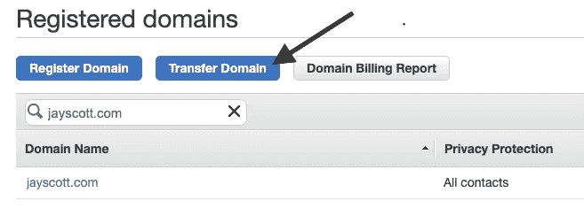
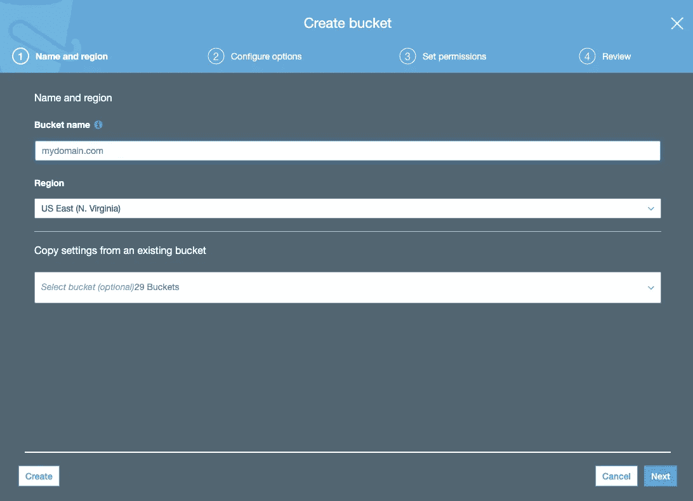
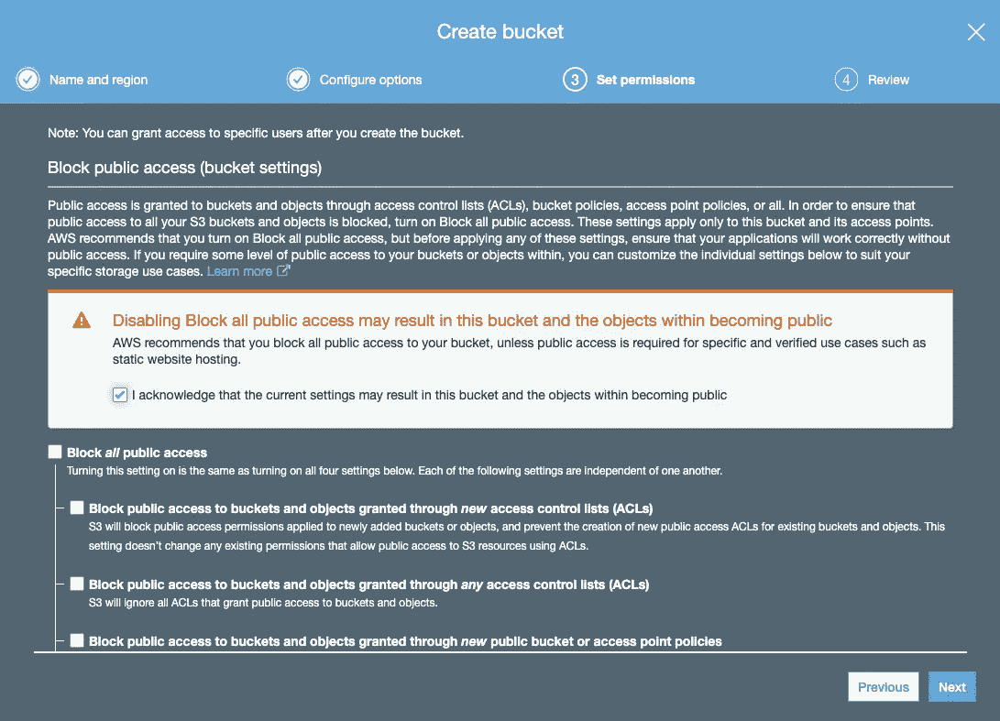
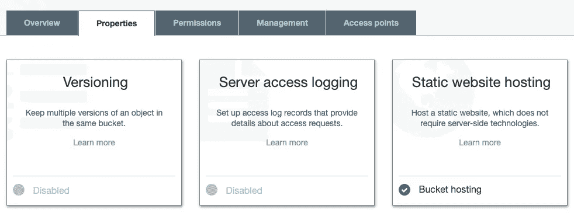
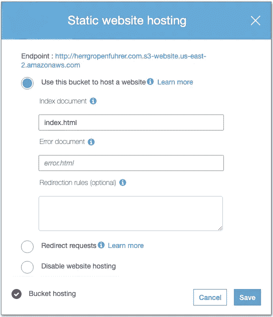
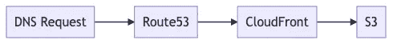

# S3 上使用 SSL 的静态托管

> 原文：<https://towardsdatascience.com/static-hosting-with-ssl-on-s3-a4b66fb7cd00?source=collection_archive---------2----------------------->

Photo by [傅甬 华](https://unsplash.com/@hhh13?utm_source=medium&utm_medium=referral) on [Unsplash](https://unsplash.com?utm_source=medium&utm_medium=referral)

上个月，我花了大量时间搜索 AWS 文档，试图找出如何:

*   主机静态内容…
*   …在 S3 桶里…
*   …使用自定义域名…
*   和 SSL (HTTPS)连接。

鉴于像[雨果](https://gohugo.io/)或[杰基尔](https://jekyllrb.com/)这样的静态站点生成器越来越受欢迎，这个*看起来*应该是一个简单的过程。

如果你在这里，你可能会发现这是**而不是**直截了当。你可能也从半打不同的 StackOverflow 问题和支离破碎的博客帖子中拼凑出了一个解决方案。所以:下面是我目前的剧本，关于如何在 AWS 上用 SSL 托管静态站点。

# 步骤 1:将域转移到 AWS / Route53

如果您打算从 S3 桶中提供静态内容，并且想要 SSL 支持，那么您将需要一个 CloudFront 发行版。(CloudFront 是亚马逊的 CDN 服务。)从技术上来说，你的域名注册并不一定要在亚马逊进行，这简化了几个步骤。因此，本行动手册的其余部分假设您能够并且愿意将您的域名转移到 AWS。

在 Route53 中转移域名→注册域名屏幕

从您的 AWS 控制台，前往 Route53 → Registered Domains，确认您的域名已经存在，或者点击 *Transfer Domain* 启动注册转移。**【备选路径:**在 Route53 中设置一个与您当前注册商的区域设置完全匹配的托管区域，并将域名服务器设置指向您的 Amazon 托管区域中`NS`记录中列出的服务器。]

# 步骤 2:创建自定义域 SSL 证书

太好了！您的自定义域已准备好“安全”接下来，您需要从 AWS 证书管理器请求一个证书(在控制台服务列表中找到它)。这相当快，而且免费:

*   点击*申请证书*
*   选择*请求公共证书*(您想要一个可以被外界使用的证书)
*   在*域名*编辑框中输入两条记录:`yourdomain.com`和`[www.yourdomain.com](http://www.yourdomain.com.)`T25。我们将在两个独立的 CloudFront 发行版上使用这个证书。**【替代路径:**如果您有其他用于访问静态内容的子域，您当然会希望在这里输入这些子域。]
*   选择 *DNS 验证*(这让证书管理器通过在 Route53 中自动生成记录来验证您对域的使用)
*   如果您愿意，可以随意在证书中添加自定义标签。
*   点击*审核*，然后*确认并请求*。

发起证书请求后，您可以为每个证书路径向域的托管区域添加一个`CNAME`记录。或者，更简单的是，只需点击按钮，让 AWS 为您插入记录。

# 步骤 3:设置您的 S3 时段内容

当我们等待 SSL 证书生成时(这可能需要几分钟)，我们可以前往 S3 并设置我们的存储桶。你需要两个水桶:

*   `mydomain.com`将包含您想要托管的所有静态内容；和
*   `www.mydomain.com`将流量重定向到`mydomain.com`

**【备选路径:**如果您希望从`www.mydomain.com`获得流量服务，只需翻转下面的说明。]

输入您的域名作为存储桶的名称

首先，创建您的内容 S3 存储桶(上例中的`mydomain.com`)。如果您愿意，可以使用您的域名作为 bucket 的名称，但是因为我们将在它前面放置一个 CloudFront 发行版，所以这不是一个技术要求。您不需要在 bucket 创建流程的下一个屏幕上配置任何特殊选项。

取消选中“阻止所有*公共访问”以允许全世界访问您的内容*

确保取消选中“阻止所有公共访问”，这样公共用户就可以看到您的内容。在几次由于开放的 S3 桶的安全设置不严而导致的公开(尴尬)数据泄露之后，亚马逊在这一步上提出了额外的警告和预防措施。然而，在这种情况下，你确实希望这些文件在互联网上到处泄露。

现在，为您的备用域名存储桶重复上述过程。此存储桶将用于将流量重定向到您的主域。

在将您的内容上传到您的主要静态托管桶之后，转到该桶的属性选项卡并编辑*静态网站托管*设置。您希望*使用这个桶来托管一个网站*，将索引文档设置为您的默认页面的文件名(例如`index.html`)。此时，您可以使用静态托管设置中的端点进行测试。

在 S3 存储桶属性选项卡中找到静态网站托管设置

配置 S3 桶来托管一个静态网站

您的 S3 存储桶的最终配置任务是进入托管您的*备用*域存储桶(例如`www.mydomain.com`)的属性的*静态网站。您希望*将请求*重定向到您的主域，并将协议设置为`https`(假设您希望所有重定向流量都被路由到 SSL 连接)。*

配置辅助 S3 桶，通过 HTTPS 将流量重定向到主桶

# 步骤 4:创建 CloudFront 发行版

现在，您的公共证书应该可以使用了。对于这个用例，云前端是 DNS 记录、SSL 证书和 S3 桶之间的连接组织:

所有这些看似不必要的复杂性的原因是，CloudFront 可以处理与自定义域的 SSL 连接，但 S3 不能。(也许，有一天，AWS 会着手构建一个更简单的解决方案，而这篇文章会让人觉得古怪。)

我们将使用两个独立的 CloudFront 发行版:一个专门处理`mydomain.com`，另一个处理`www.mydomain.com`。您*可以*只使用一个响应两个名称的发行版来完成解决方案，但是客户端流量将根据原始请求显示为来自`mydomain.com`或`www.mydomain.com`。在双 CF 配置中，对二级域名的请求将一直流向二级 S3 存储桶(`www.*`)，然后被重定向到`www`-自由路径。

因此:在 CloudFront 中，创建一个 *Web 发行版*。配置面板中有*组*设置:

*   *来源域名*表示内容的来源(*来源*)应该是什么。通过选择控件，您将看到可用作原点的可用 S3 桶的列表。选择`mydomain.com`。
*   *限制 Bucket 访问*:如果启用，该选项要求所有公共流量通过 CloudFront 路由。这并不是 CloudFront 的全部内容，但是如果您想“锁定”您的 bucket 并保证页面总是显示在自定义域名下，那么您会想要使用它。
*   *查看器协议策略*:设置为*将 HTTP 重定向到 HTTPS* 以强制所有连接使用 SSL。没有什么好的理由不这样做。
*   *允许的 HTTP 方法*:指定您的站点需要哪些 HTTP 方法。对于我的大多数被动内容网站，默认的 *GET，HEAD* 设置是检索内容所需要的，但是如果你有 *POST* 表单，那么你需要调整这个设置。
*   自动压缩对象:你想减少带宽吗？你当然知道！启用 gzip 压缩。
*   *备用域名* : **非常重要:**您*必须*在这里输入`mydomain.com`或`www.mydomain.com`，这取决于您正在设置的发行版。当客户端请求到达 Route53 并被路由到 CloudFront 进行分发时，CF 将验证请求的域是否在其域名列表*和*中，以及证书是否与该域匹配。
*   *SSL 证书:*以上所有工作都归结于这一个设置。选择*自定义 SSL 证书*并选择您最近创建的 SSL 证书将其绑定到发行版。
*   *默认根对象*:存储请求的默认页面，如果请求 URL 中没有包含页面。使用相同的`index.html`风格的设置，在你的 S3 桶设置中使用。

现在，您可以单击*创建分发版*，并在 CloudFront 将您的内容复制到边缘节点时，对您的第二个分发版(对于`[www.mydomain.com](http://www.mydomain.com))` [)](http://www.mydomain.com)) 重复这个练习。

# 步骤 5:更新域区域设置

在您的 CloudFront 发行版建立起来之后，剩下唯一要做的事情就是为`mydomain.com`更新 Route53 中的 DNS 设置:

*   为`mydomain.com.`更新或创建一个`A`记录，它是`mydomain.com.`的 CloudFront 发行版的别名
*   为`www.mydomain.com`更新或创建一个`A`记录，该记录与`www.mydomain.com`的分布有相似的别名。

# 派对时间

瞧啊。现在，您应该能够使用 HTTP 或 HTTPS 请求访问`mydomain.com`和`www.mydomain.com`，并在`https://mydomain.com`被路由到由 S3 存储桶提供的同一个页面。(作为奖励，你有一个 CDN 做后盾。)

根据您决定如何将新内容复制到您的 S3 存储桶，您将需要调整您的发布过程，包括在新的或修改的文件上传后使`mydomain.com`的 CloudFront 发行版无效。