# 股票价格的统计分析

> 原文：<https://towardsdatascience.com/statistical-analysis-of-a-stock-price-e6d6f84ac2cd?source=collection_archive---------6----------------------->

## 谷歌股价的简单统计分析

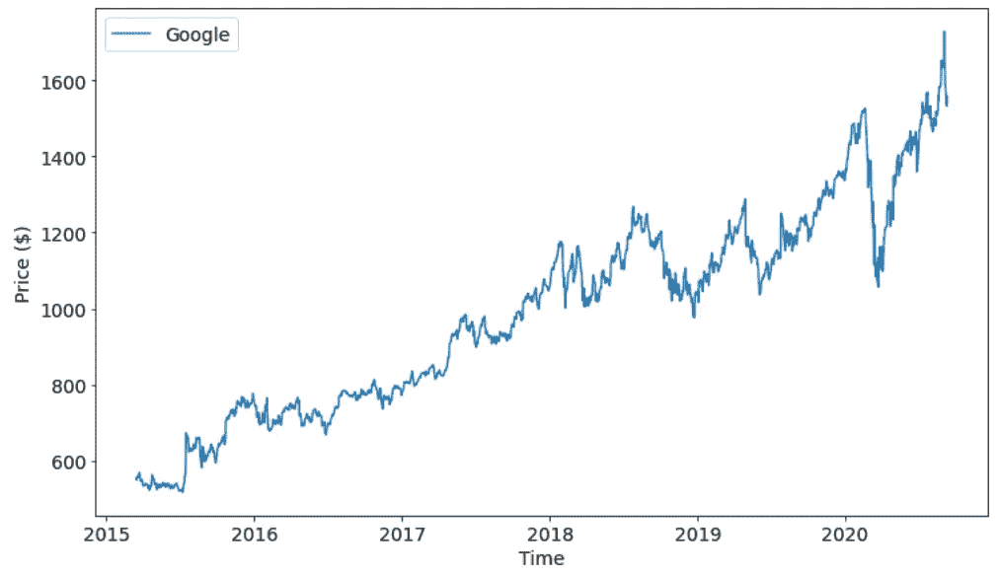

作者图片

股票市场总是被认为是对统计学的挑战。有人认为了解市场的统计数据可以让我们战胜市场并赚钱。现实可能大不相同。

在这篇文章中，我将向你展示谷歌股票价格的统计分析。

2008 年，为了获得理论物理学士学位，我必须分析股票价格，以检验股票市场模型的有效性。在本文的下一部分，我将向您展示一些使用 Python 对 Google 股票价格进行的分析。

代码可以在我的 GitHub 存储库中找到，这里:[https://GitHub . com/gianlucamalato/machine learning/blob/master/Stock _ market _ analysis . ipynb](https://github.com/gianlucamalato/machinelearning/blob/master/Stock_market_analysis.ipynb)

# 下载数据

首先，我们需要获得股票数据。我将使用 *yfinance* 库下载价格时间序列。

首先，我们必须安装这个库。

```
!pip install yfinance
```

然后我们可以导入一些有用的库。

```
import pandas as pd
import numpy as np
import yfinance
import matplotlib.pyplot as plt
from scipy.stats import skew,kurtosis,norm,skewtest,kurtosistest
from statsmodels.graphics.tsaplots import plot_pacf,plot_acf
```

我们现在可以得到 2015 年到 2020 年的谷歌价格数据。

```
name = 'GOOG'
ticker = yfinance.Ticker(name)
df = ticker.history(interval="1d",start="2015-03-15",end="2020-09-10")x = df['Close']
```

我们现在将使用 *x* 对象，它包含股票的每日收盘价。

# 每日收盘价

让我们画出每日收盘价。


作者图片

正如你所看到的，有一个相当不错的看涨趋势。有一些下降，但漂移似乎相当积极。

# 每日回报

当你对一只股票进行统计分析时，研究它的回报而不是价格本身是非常有用的。

从一天到另一天的回报是两天之间收盘价的百分比变化。

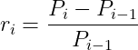

在 Python 中，series 对象有一个 *pct_change* 方法，允许我们计算这个量。该参数是要使用的滞后。在本文中，我将使用 1 天的滞后时间。

```
returns = x.pct_change(1).dropna()
```

结果是这样的:

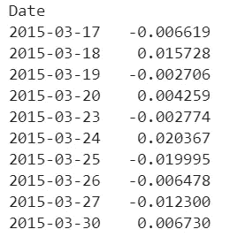

第一个数字是 *(x[1]-x[0])/x[0]* ，第二个是 *(x[2]-x[1])/x[1]* 以此类推。

这是我们要分析的数据。

# 收益的概率分布

我们现在要计算一些关于收益概率分布的见解。

## 直方图和箱线图

让我们先做一个原始的回报直方图。

```
plt.hist(returns,bins="rice",label="Daily close price")
plt.legend()
plt.show()
```

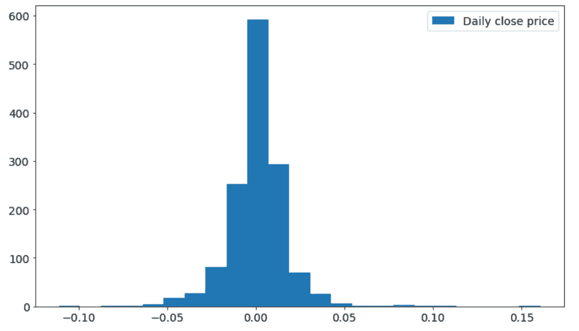

作者图片

如你所见，它完全以零为中心，看起来是对称的。然而，我们可以看到这个直方图有似乎不可忽略的尾部。

让我们制作一个箱线图来更好地理解这个数据集的分布。

```
plt.boxplot(returns,labels=["Daily close price"])
plt.show()
```

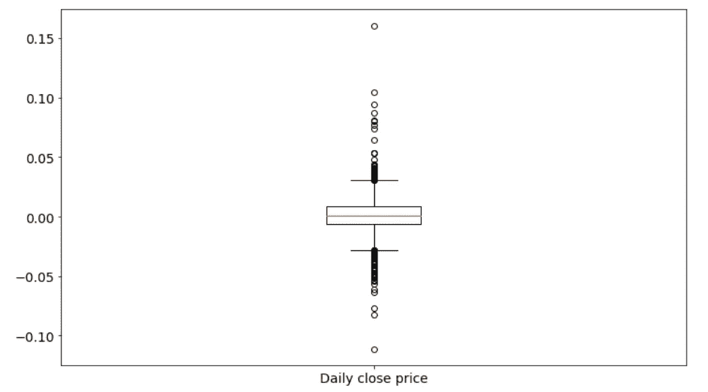

如你所见，它充满了离群值。如果与分布总范围相比，四分位数范围(即盒子的高度)相当窄。这种现象被称为*厚尾*，在股票分析中非常常见。

## 主要观察点

让我们计算数据集的一些可观测量。

平均值为:

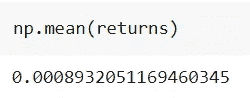

它非常类似于零，但它是正的这一事实解释了价格时间序列的正漂移。

现在让我们来看看标准差:

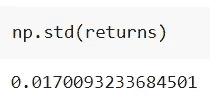

比平均值高了不止一个数量级。这显然是离群值的影响。在股票价格分析中，标准差是风险的度量，如此高的标准差是股票被视为风险资产的原因。

让我们来看看中位数:

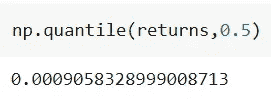

与平均值相差不大，所以我们可能认为分布是对称的。

让我们检查分布的偏斜度，以便更好地评估对称性:

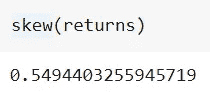

它是正的，所以我们可以假设分布是不对称的(即零偏度)，并且右尾是一个不可忽略的权重。

如果我们对偏斜度进行测试，我们会发现:

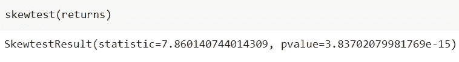

非常低的 p 值表明分布的偏斜度不可忽略，因此我们不能假设它是对称的。

最后，我们可以测量峰度(scipy 对峰度进行归一化，因此对于正态分布，峰度为 0)

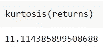

它和零有很大不同，所以分布和正态分布有很大不同。

峰度测试给出了这些结果:

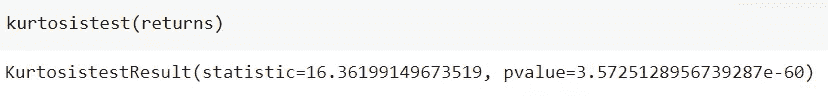

同样，非常小的 p 值让我们拒绝峰度与正态分布相同(为 0)的零假设。

## 回报是正态分布的吗？

尽管统计上显著的高峰值和偏态值已经告诉我们收益不是正态分布的，但是 Q-Q 图会给我们图形上清晰的信息。

```
t = np.linspace(0.01,0.99,1000)
q1 = np.quantile(returns,t)
q2 = norm.ppf(t,loc=np.mean(returns),scale=np.std(returns))plt.plot(q1,q2)
plt.plot([min(q1),max(q1)],[min(q2),max(q2)])
plt.xlim((min(q1),max(q1)))
plt.ylim((min(q2),max(q2)))
plt.xlabel("Daily returns")
plt.ylabel("Normal distribution")
plt.show()
```


作者图片

直线是我们对正态分布的预期，而蓝线是我们从数据中得到的。很明显，我们的数据集的分位数不能与具有相同均值和标准差的正态分布的分位数相比。

因此，回报不是正态分布的，这使得像几何布朗运动(假设正态回报)这样的模型只是现实的近似。

# 波动聚类

一旦我们确定了收益概率分布的非正态性，让我们来看看原始的时间序列。

```
plt.plot(returns)
plt.xlabel("Time")
plt.ylabel("Daily returns")plt.show()
```

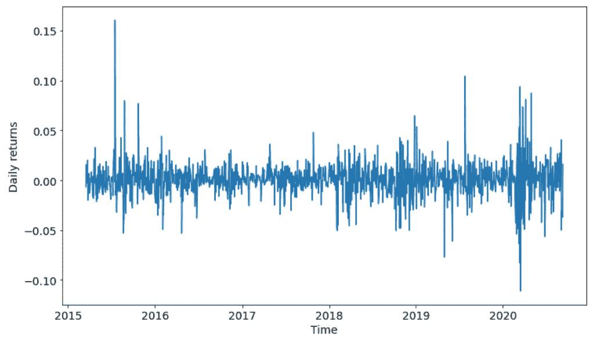

作者图片

很明显，有波动性高的时段，也有波动性低的时段。这种现象被称为*波动聚集*，在股票市场中非常普遍。实际上，标准偏差会随着时间的推移而变化，这使得时间序列变得不稳定。

仔细看看 20 天滚动标准差，就什么都清楚了。

```
plt.plot(returns.rolling(20).std())
plt.xlabel("Time")
plt.ylabel("20-days rolling standard deviation")
plt.show()
```

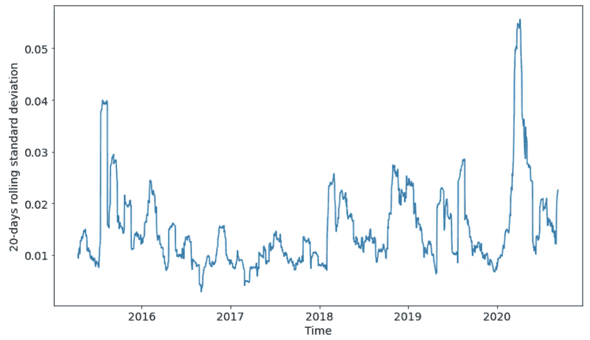

作者图片

很明显它不是一个常数值，但它有尖峰和振荡。分布的厚尾可能是由这些波动峰值引起的，这产生了不可忽略的异常值。

# 自相关函数

最后，我们可以绘制部分自相关函数，这使我们对时间序列的自相关性以及这种自相关性在某些 ARIMA 模型中用于预测目的的可能性有所了解。

```
plot_pacf(returns,lags=20)
```

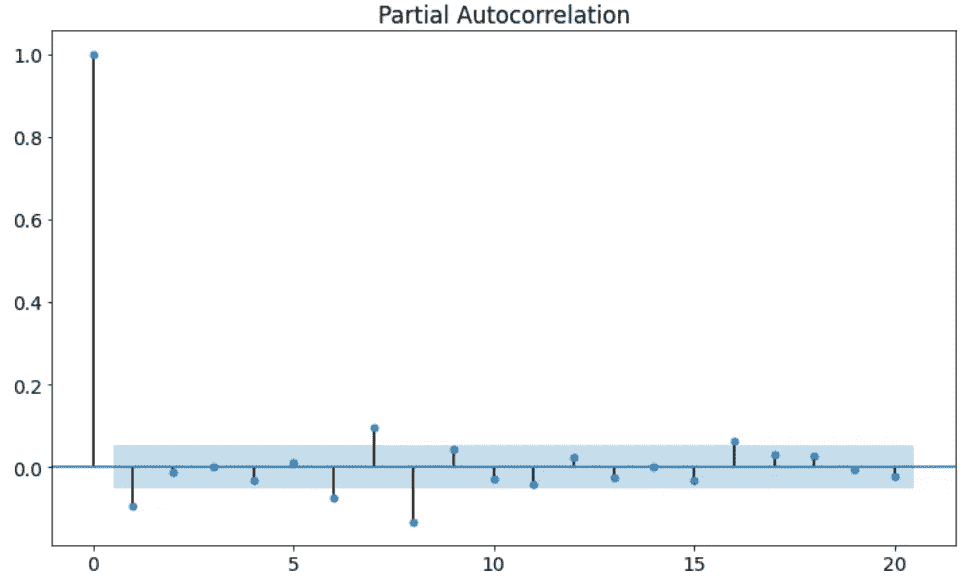

作者图片

从这个图中可以清楚地看出，所有滞后之间没有很高的相关性。在 5 和 10 之间有一些滞后，显示了一些相关性，但与 1 相比，这是非常小的。

因此，我们很容易理解，使用一些 ARIMA 模型将是非常无用的。

# 结论

在本文中，我展示了一个简单的谷歌股票价格统计分析。回报不是正态分布的，因为它们是偏斜的，有厚尾。时间序列不是静态的，因为标准偏差随时间而变化。收益时间序列的自相关性在几乎任何滞后时间都很低，这使得 ARIMA 模型无用。

因此，使用统计学和机器学习来预测股票价格是一个巨大的挑战。使用 LSTM 模型已经取得了一些成果，但是我们还远远没有清楚地用一种赚钱的方式来模拟股票市场。