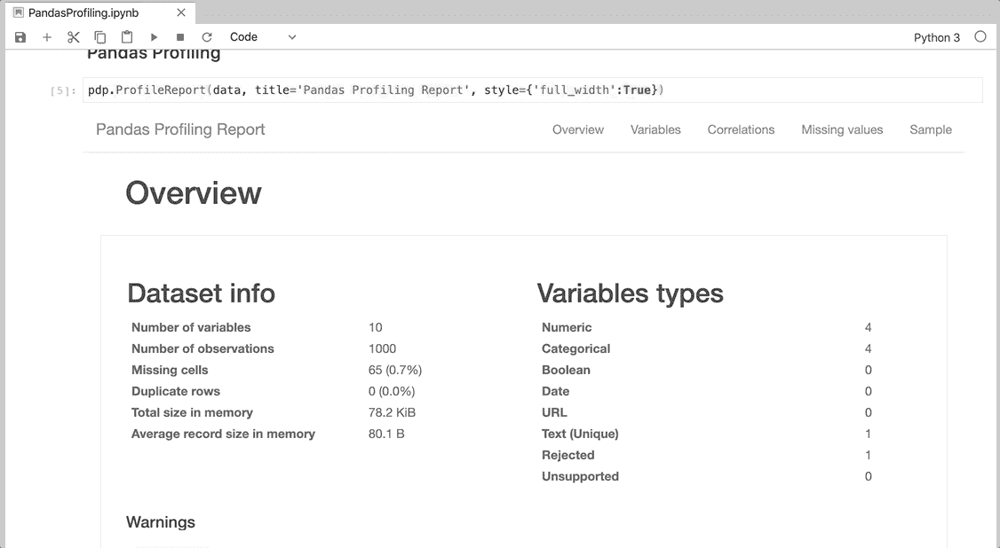

# 用一行代码进行统计和可视化探索性数据分析

> 原文：<https://towardsdatascience.com/statistical-and-visual-exploratory-data-analysis-with-one-line-of-code-9953638ea9d0?source=collection_archive---------18----------------------->

## NASA 数据集的例子

在我看来，探索性数据分析(EDA)是新数据集中机器学习建模最重要的部分。如果 EDA 没有正确执行，它会导致我们开始用“不干净的”数据建模，这就像一个雪球下山，越滚越大，越滚越坏。

## 良好的探索性数据分析的基本要素

探索性数据分析的深度*可以是您希望或需要的深度*，但基本分析需要包含以下要素:

*   第一个和最后一个值
*   数据集形状(行数和列数)
*   数据/变量类型
*   缺少值和空值
*   重复值
*   描述性统计(平均值、最小值、最大值)
*   变量分布
*   相关

我喜欢执行手动 EDA 来更好地了解我的数据，但几个月前，[阿迪·布朗什坦](https://medium.com/u/c82c464daf80?source=post_page-----9953638ea9d0--------------------------------)向我介绍了熊猫概况。由于它需要相当长的处理时间，所以当我想快速浏览小数据集时，我会使用它，我希望它也能加速你的 EDA。

## 熊猫简介入门

在这次演示中，我将在 [NASA 的陨石着陆数据集](https://data.nasa.gov/Space-Science/Meteorite-Landings/gh4g-9sfh)中进行 EDA。

你已经查过了吗？

***好样的，易如反掌！***

现在好戏开始了。

点击这里了解更多关于熊猫档案的信息:[https://pandas-profiling.github.io/pandas-profiling/docs/](https://pandas-profiling.github.io/pandas-profiling/docs/)

你喜欢这篇课文吗？你可能想查看一下 [***最好的免费数据科学电子书***](/the-best-free-data-science-ebooks-b671691e5231) ***。***