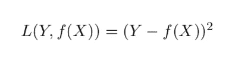

# 统计决策理论

> 原文：<https://towardsdatascience.com/statistical-decision-theory-382b04f517f2?source=collection_archive---------31----------------------->

## 机器学习的框架

[来源](https://www.pexels.com/photo/black-and-white-blackboard-business-chalkboard-356043/)

在这篇文章中，我们将讨论一些为开发机器学习模型提供框架的理论。

我们开始吧！

如果我们考虑一个实值随机输入向量， *X* 和一个实值随机输出向量， *Y* ，目标是找到一个函数 *f* ( *X* )来预测 Y 的值。这需要一个损失函数， *L* ( *Y* ， *f* ( *X* )。这个函数允许我们惩罚预测中的错误。常用损失函数的一个例子是平方误差损失:

损失函数是真实结果值和我们的预测之间的平方差。如果*f*(*X*)=*Y*，这意味着我们的预测等于真实结果值，我们的损失函数等于零。所以我们想找到一种方法来选择一个函数 *f* ( *X* )，它给出的值尽可能接近 *Y* 。

给定我们的损失函数，我们有一个选择 *f* ( *X* )的标准。我们可以通过对 x *和 y* 上的损失函数进行积分来计算预期平方预测误差:

其中 P( *X* ， *Y* )是输入和输出的联合概率分布。然后，我们可以以 X 为条件，计算预期平方预测误差，如下所示:

然后，我们可以逐点最小化该期望平方预测误差，方法是找到值 *c* ，其最小化给定的误差 *X* :

对此的解决方案是:

这是 *Y* 的条件期望，给定 *X* = *x.* 换句话说，回归函数给出了 *Y、*的条件均值，给定了 *X.* 的知识，有趣的是，*k*-最近邻方法是从训练数据实现该方法的直接尝试。对于最近邻，对于每个 *x* ，我们可以求 *y* 的平均值，其中输入 *x* 等于特定值。我们对 *Y* 的估计可以写成:

其中我们对样本数据取平均值，并使用结果来估计期望值。我们也在调整一个区域，它的 k 个邻居离目标点最近。随着样本量变大，邻域内的点很可能接近 *x* 。此外，随着邻居数量 *k* 变大，平均值变得更加稳定。

如果你有兴趣了解更多，Trevor Hastie 的《统计学习元素》是一个很好的资源。感谢您的阅读！