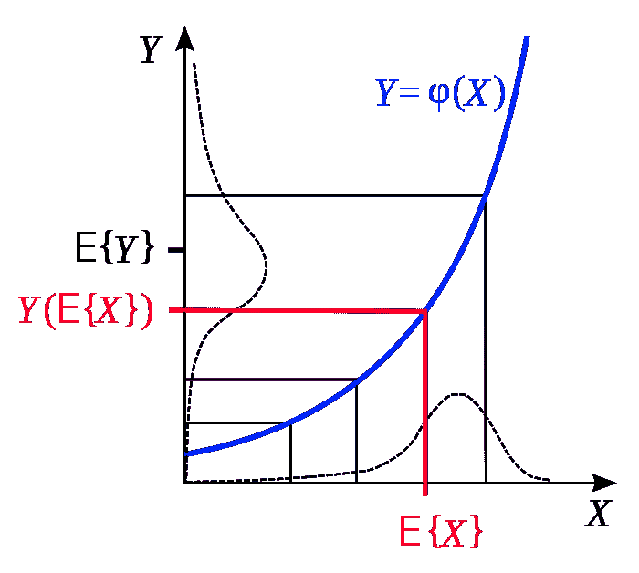
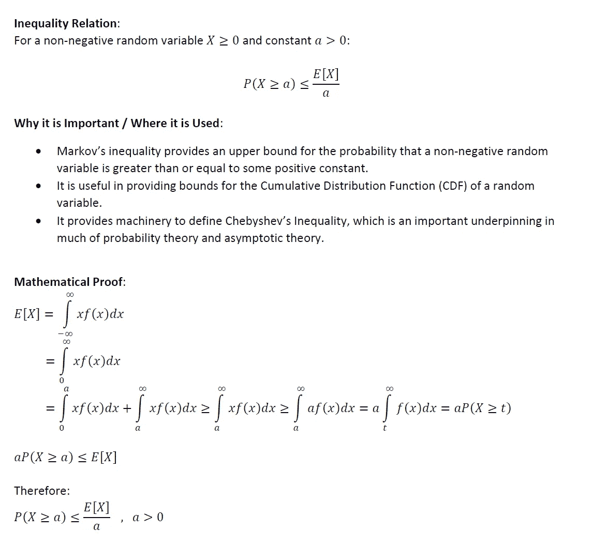
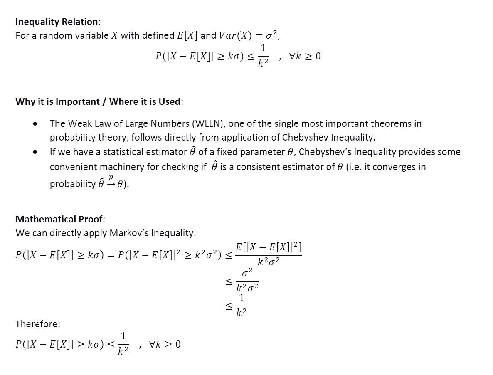
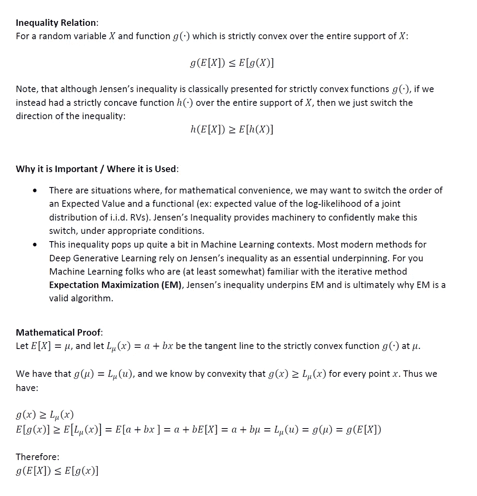
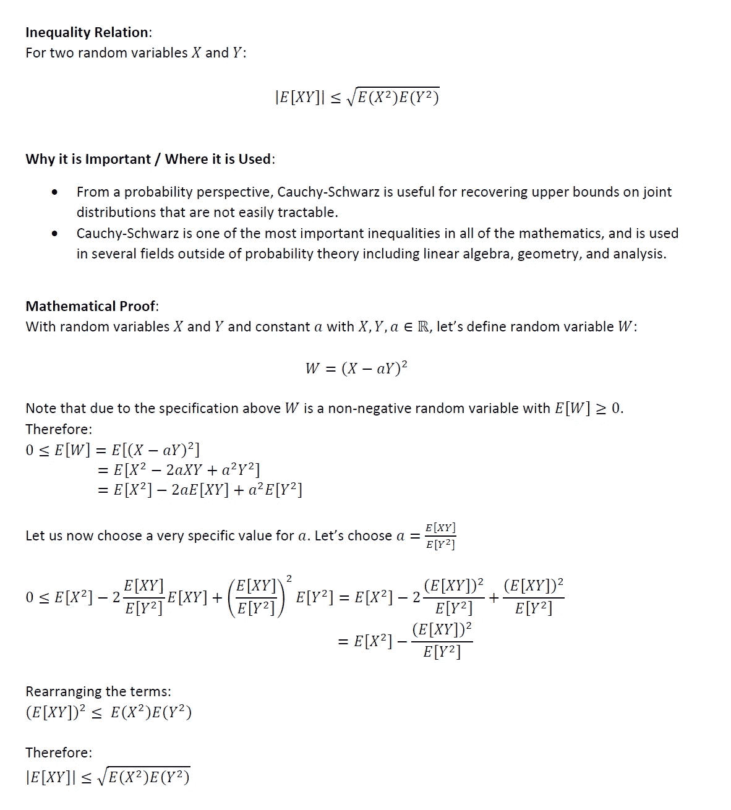

# 概率论和数理统计中的统计不等式

> 原文：<https://towardsdatascience.com/statistical-inequalities-in-probability-theory-and-mathematical-statistics-c2c62f51b852?source=collection_archive---------26----------------------->

## 一个最棒的列表，它们的证明，以及它们在哪里有用

[维基百科上的照片](https://en.wikipedia.org/wiki/Jensen%27s_inequality)

# 背景和动机

统计不等式提供了一种界定度量和数量的方法，在对难以计算的数量进行界定时特别有用。它们也是概率论、统计学和机器学习中大量理论的基础。如果你有一个最喜欢的统计定理，迭代数值方法，或机器学习算法，很有可能一些统计不等式在支撑所述方法或方法中起作用。*(关于这些不等式的一个应用例子，* [*请看我那篇关于弱大数定律的证明*](https://medium.com/@anr248/proof-of-the-law-of-large-numbers-part-1-the-weak-law-daf412178d3a) *)。*

在 Medium 上的快速搜索显示，这个主题(据我所知)还没有在平台上覆盖。在我不断努力让更多的人对理解他们正在实现的方法的内部工作方式感兴趣的过程中，我认为这个主题值得一提。

在下面的文章中，我分享了一个包含 4 种统计不平等的“最热门列表”:

1.  马尔可夫不等式
2.  切比雪夫不等式
3.  詹森不等式
4.  柯西-施瓦茨不等式

这远不是一个完整的列表，而是一个简短的“最热门”的引子。对于下面的每一个不等式，我都给出了它们的证明，并提供了它们在哪里有用以及为什么我们应该关心它们的注释。还要注意，这些不等式中的一些有超出概率论和随机变量的解释。然而，这里只讨论与随机变量相关的上下文。

话虽如此，我们还是开始吧。

# 1)马尔可夫不等式

# 2)切比雪夫不等式

# 3)詹森不等式

# 4)柯西-施瓦兹不等式

## 最终想法:

希望以上有见地。正如我在以前的一些文章中提到的，我认为没有足够的人花时间去做这些类型的练习。对我来说，这种基于理论的洞察力让我在实践中更容易使用方法。我个人的目标是鼓励该领域的其他人采取类似的方法。我打算在未来写一些基础作品，所以请随时在 [**LinkedIn**](http://www.linkedin.com/in/andrew-rothman-49739630) 上与我联系，并在 Medium 上 [**关注我的更新！**](https://anr248.medium.com/)