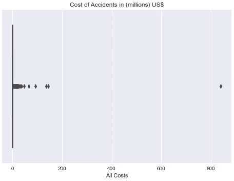
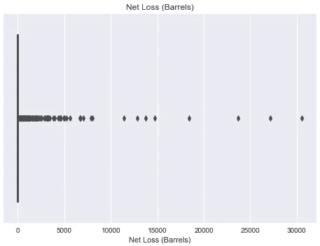
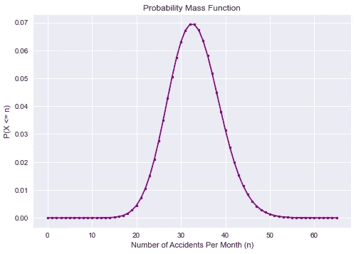
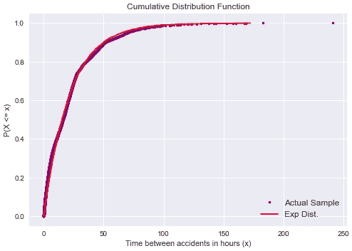
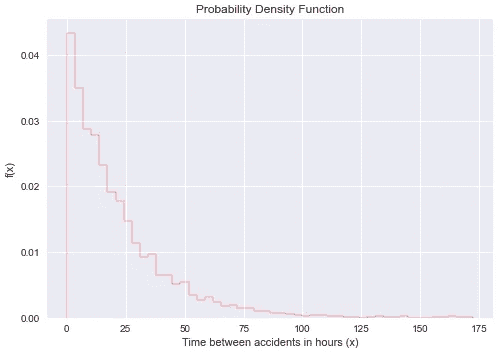
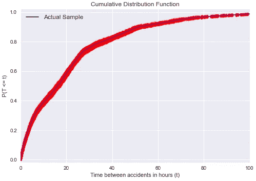
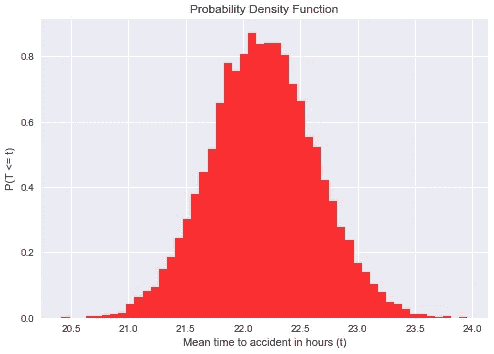

# 使用 Pandas，NumPy 在 Python 中进行统计推断

> 原文：<https://towardsdatascience.com/statistical-inference-in-pyhton-using-pandas-numpy-part-i-c2ac0320dffe?source=collection_archive---------27----------------------->

在本文中，对 Kaggle 数据集进行了探索性数据分析和统计推断，该数据集包含 2010 年至 2017 年期间向管道和危险材料安全管理局报告的石油管道事故。数据集在[这里](https://www.kaggle.com/usdot/pipeline-accidents)可用。本文的目的是展示 python 中使用 Pandas、NumPy 和 Matplotlib 的几行代码如何帮助用明显最少的信息对数据集执行统计分析。它还可以作为统计分析初学者的教程，让他们了解统计推断在真实数据集上的应用，重点是:

> 泊松过程
> 
> 指数分布
> 
> 自助抽样
> 
> 置信区间

这个教程的完整代码可以在[这里](https://github.com/khuzemasunel/Oil-Pipeline-Accidents-in-USA---Statistical-Inference)找到。因此，让我们通过展示一个数据样本来开始分析。

样本数据的前 5 行

感兴趣的变量的汇总统计信息

请注意，Kaggle 数据集中与此分析无关的许多列已被删除。分析的第一步是决定分析的目标是什么。通过查看数据集样本，我的目的是对美国石油管道事故造成的成本和桶油当量损失进行估计。然而，请注意，我们只有 2010 年至 2017 年的可用数据，这告诉我们，该数据集不包含美国所有的管道事故，这就引出了我们的第一个定义。**统计推断**是利用概率法则来分析来自较大人群的数据样本以了解人群的方法。在这种情况下，美国 2010 年至 2017 年间的石油管道事故是美国所有石油管道事故中的一个样本。现在，让我们计算样本中我们感兴趣的变量的汇总统计数据，即由于输油管道事故导致的成本和石油损失。

查看我们两个变量的汇总统计数据，可以很容易地推断出极值的存在，因为与它们的平均值相比，最大值非常大，而且显著较大的标准差也表明变量的平均值有较大的方差。箱线图是一种更好的可视化总结的方式。

两个变量的方框图中没有方框，这清楚地表明两个变量的较大值明显大于样本的其余部分，因此两个变量的数据都有极值。即使可以使用中位数来估计每次事故的成本或每次事故的桶数损失，数据的分布也是非常不可靠的。在这种分布下，除非可以消除极值，否则很难用模型来拟合变量。在我们的案例中，我们没有足够的信息来得出极端值确实是数据错误而不是过程的一部分的结论。然而，我们在数据样本中有另一个关键变量，它看起来并不那么重要，因为无法对其进行直接汇总统计，这就是事故发生的时间。有了统计建模的知识，我们知道一个熟悉的概率分布，它可以模拟某个区间内的事故频率，这就引出了我们的第二个定义，**泊松分布**。

泊松分布模拟一个过程，在该过程中，平均数量的事件在固定的时间或空间间隔内发生。事件在该区间内发生的概率由参数为 *λ* 的泊松分布表示，该过程称为泊松过程。对于遵循泊松分布的过程，观察到的事件不能同时发生，并且在不相交的时间或空间间隔中，每个事件的发生独立于前一个事件的发生。

在我们的场景中，如果我们关于美国输油管道事故的假设是正确的，即它们不会同时发生，并且一个事故的发生不会影响另一个事故的发生，那么事故数量， *X* 是一个服从泊松分布*X～泊松(λ)的随机变量。为了估计分布的参数，我们只需计算样本中的事故数量，然后除以总时间跨度。*

使用 python 中的 NumPy，可以生成一个来自泊松分布的随机样本来模拟我们的数据，估计 *λ* 为每月33 起事故。让我们看看分布是什么样的，从中可以推断出什么。

通过概率质量函数，我们现在对数据有了更好的结论，即使每月平均事故数量为 33 起，**每月发生 33 起事故的概率仅为 7%**。**此外，在累积分布函数中很容易看出，每月发生 33 起或更少事故的概率为 50%,或者每月发生 33 起或更多事故的概率为 50%,仅知道平均值是不直观的**。统计推断允许你对你的数据做出更有意义的结论。

现在让我们说，我们希望以不同的方式来看事故的频率。我们感兴趣的是估计两次事故之间经过的时间，而不是估计某个时间间隔内的事故数量。我们现在感兴趣的汇总统计数据是平均事故间隔时间。这就引出了我们的第三个定义。

**指数分布**有时用于模拟事件发生前经过的时间。此外，如果事件遵循泊松过程，其速率参数为每间隔事件数，则从任何起始点到下一个事件的等待时间遵循指数分布，其参数为每间隔事件数。

使用熊猫，我们可以计算样本中每个事故的间隔时间。然后，我们使用 NumPy 来估计事故之间的平均时间(小时),作为指数分布的参数。然后，我们绘制样本数据的累积分布函数，随机样本大小为 3000，由指数分布生成，以比较我们的实际数据与指数分布模型的拟合程度。

上图显示，事故样本数据的累积分布与来自指数分布的随机样本的累积分布非常相似，平均事故发生时间相同。因此，用指数分布来模拟输油管道事故之间的时间是合适的。这也巩固了我们之前的假设，即事故的发生是一个泊松过程，在不相交的时间间隔内的事故数量是独立的，不会同时发生。让我们看看输油管道事故样本数据的概率密度函数。输油管道事故样本的概率密度函数是指数分布随机变量的指数衰减。

到目前为止，我们已经能够计算出我们样本的输油管道事故平均间隔时间，并将其用于概率模型。但是我们仍然没有对美国石油管道事故的发生做出任何有意义的结论。仅仅知道一个样本的平均值并假设它适用于在美国发生的所有事故是不够的。那么，我们对样本的平均值有多大把握。如果事故报告和管道运行的所有条件在过去 50 年或过去 100 年中保持不变，如果我们对 2002 年至 2009 年或任何其他时间段的数据进行采样，我们会得到相同的平均事故时间吗？直观的假设是，我们不会在每次对这些数据进行采样时都获得完全相同的平均值。

样本的**置信区间**有两个相关部分。第一部分是它给出了一个值的范围，即一个下限和一个上限，在这两个值之间可以是总体的真实平均值。第二部分是值域的显著性水平。总的来说，如果数据以同样的方式一次又一次地被采样，真实总体平均值被捕获 x%次的数值范围代表平均值范围的 x%置信区间。因此，为了计算美国数据集中输油管道事故平均时间的置信区间，需要多次重复该过程，以获得真实总体平均值所在的平均值范围。但是重复这个过程，即石油管道事故几次，实际上是不可能的。然而，从理论上讲，使用自举可以根据需要多次重复这些实验。

Bootstrap 抽样是利用重采样数据进行统计推断，即在相同条件下重复实验，可以从样本数据中重复抽样出大小为 *n* 的随机样本。使用 NumPy，可以很容易地在 python 中为我们的事故数据计算 bootstrap 样本。

100 个 bootstrap 样本的分布绘制在实际数据的顶部，正如预期的那样，样本与实际样本略有不同，但仍接近保持指数分布。上图已被放大，以关注样本的变化。我们现在只需要每个样本的平均值来计算样本平均值的置信区间。从自举样本计算出的统计数据被称为**自举复制**。

上图中的直方图显示了该过程重复 10，000 次时，bootstrap 重复的概率密度或平均事故时间。对于 95%的置信区间，我们需要找到 95%的重复平均值下降的范围。这只是从引导重复的概率密度函数推导出的引导重复的第 2.5 和第 97.5 百分位之间的所有值。

**根据这一分析，我们有 95%的把握认为美国发生输油管道事故需要 21.15 至 22.93 小时，或者我们有 95%的把握认为美国每年发生大约 382 至 414 起输油管道事故**。利用这一知识，现在我们可以使用每个变量的每个事件的中值来推断美国石油管道事故的成本和损失的桶数。**因此，我们有 95%的把握认为，美国每年因输油管道事故造成的损失在 890 万至 960 万美元之间**。这是我们通过统计推断了解到的关于美国石油管道事故的有意义的信息。

在本文中，我们围绕美国输油管道事故的基本过程建立了一个统计模型，并得出了关于事故频率和成本的具有统计意义的结论。本文的下一部分将尝试进一步深入数据集，并使用假设检验得出更有意义的结论。