# 通过置信区间估计的统计推断

> 原文：<https://towardsdatascience.com/statistical-inference-through-confidence-interval-estimation-f6a752ae0d48?source=collection_archive---------38----------------------->

## 无知和自信之间的平衡

塞巴斯蒂安·科曼摄影在 [Unsplash](https://unsplash.com?utm_source=medium&utm_medium=referral) 上拍摄的照片

> 这辈子你需要的只是无知和自信，然后成功就有把握了。~ ***马克·吐温***

***简介***

当《厨艺大师》中的一个野心家展示一道评委们并不全吃的菜时，这是一件耐人寻味的事情。相反，他们优雅地咬一小口，他们雄辩的咀嚼创造了一个最佳的兴奋环境，最后，他们精心策划的判断呈现出对食物质量的洞察力。这一金字招牌拥有来自观众和追求者的强烈信念，它给人一种独特、精确的感觉，并且是那些关心在烹饪这种特定类型的菜肴中实现类似结果的人的良好代表。

*粗糙* [*近似*](https://www.weareteachers.com/estimation-activities/) *做法的特定想法同样耐人寻味，这种做法已被视为吸引跨年龄群体的考虑，以提高思维能力。以这样或那样的方式，我觉得当我们在不知道一个假设的宽度的情况下，准确地揭示我们与特定事物的接近程度时，会给人一种巨大的喜悦感。*

在这篇文章中(*作为我过去* 的 [*的延续)，我们将采取谨慎的步骤来面对我们在上面章节中所考察的某些现实中的一些刺激的真实因素。*](/the-leap-from-a-discrete-to-a-continuous-probability-distribution-b105fde3cc1f)

**总体、样本和非抽样误差**

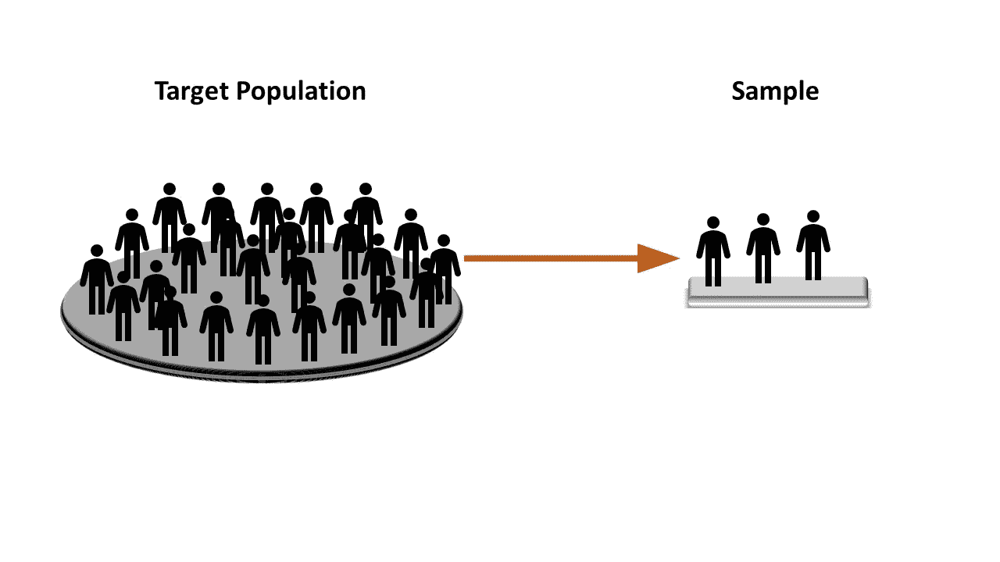

目标人群与样本(辛普森图像[来源](https://www.vhv.rs/viewpic/hbJoRob_bart-simpson-lisa-simpson-homer-simpson-maggie-simpson/))

一个**群体**是一项研究试图对其做出推论的所有成员的集合(*et al Albright&Winston*)。

群体的每个单元被称为一个**帧**。*分散*和*空间分布*特征是我们在这个讨论中能够发扬光大的种群的唯一重要属性。

一个**样本**可能指的是人口中的一小部分，这部分人口比较容易控制，但同时也应该能够被*分离出来*，并且必须拥有人口的真实素质。

如果我们练习用“**目标**”和“**人口**”一起写作或发音，而不是简单的“*人口*”，那么我强烈认为我们可以缩小我们关于**目的**的意图，而不是与英语字典的盲目约会。这个不可否认的由两个术语组成的篮子说了一千个单词，消除了大量阅读或解释的需要。

挑选一个样本或一组这样的样本的过程被称为**抽样**，数据科学已经被赋予各种各样的抽样技术。现在转移和讨论它们中的每一个都是徒劳的，然而，值得一提的是，每一种技术都有其独特的设计和认知方法。这完全取决于相关的人选择什么技术来达到预期的猜测，没有这样的规则刻在石头上。也就是说，我想与我的读者分享我对不同的常用技术的看法。他们中的每一个人都被要求具备四个特征(即实施、代表性、成本和随机性)。种群的分散性和空间分布特征在一定程度上造成了上述四个性状的变异。

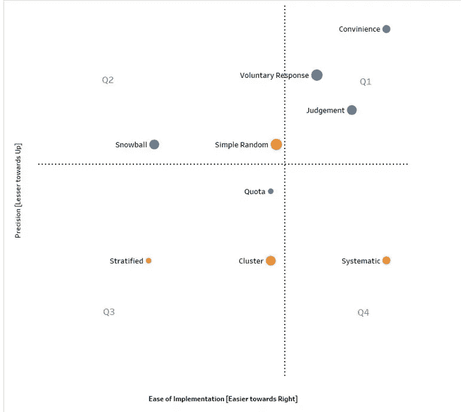

表格图——抽样技术象限(来源:Self)

我们从左向右移动得越多，就**实现**而言，我们获得的技术就越简单。我们越往上走，这项技术就越不能精确地代表一个群体的所有特征。圆圈的大小代表执行的成本。尺寸越大，执行该技术的成本越大。最后，红色涵盖了在选择样本时涉及一定程度的概率或**随机性**的技术。而蓝色圆圈只关注非概率性的或判断性的技术，其中没有分配随机性。虽然我们将只讨论第二象限中的一种技术，即简单随机抽样，但我重申以上观点纯粹是基于我的公正理解，而非偏见。我不敢说这种观点拥有国家或国际统计机构的签名，因此在盲目接受我的观点之前请记住这一点。它可能与你的故事版本相符，也可能不相符。

由 [Unsplash](https://unsplash.com?utm_source=medium&utm_medium=referral) 上的 [bantersnaps](https://unsplash.com/@bantersnaps?utm_source=medium&utm_medium=referral) 拍摄的照片

现在请允许我澄清为什么我让你在*副标题*处想象一个**无知**和**平衡**的*形象*。**首先**，尽管评委在品尝菜肴时吸收了艺术性来评估有抱负的厨师，但还是会有一些误差，因为完成整个菜肴总是被遗漏，并且不可能在规定的时间内完成。**其次**，抛开前一个错误不谈，尽管评委有设计或认知方面的专业知识，但参赛选手可能会遗漏一些不符合比赛主题或目标的成分或技术。裁判在解释参赛者的陈述时也可能会有一些错误。我会更好地揭示第二种误差可能被称为**非抽样**误差，而**第一种**误差更多的是抽样误差。不管这两种类型的错误，*平衡*是惯例，使表演继续下去，并允许越来越多的参与者包含这个过程。提交一个没有一点误差的猜测问题的答案是不可避免的。我可能会获奖，也可能不会，但这个过程必须能够忽略错误的影响。

**非抽样误差的例子**

为了防止你打瞌睡，不要看不同种类的*非抽样误差*的定义，让我们看几个可能导致这种可能性的**例子**。

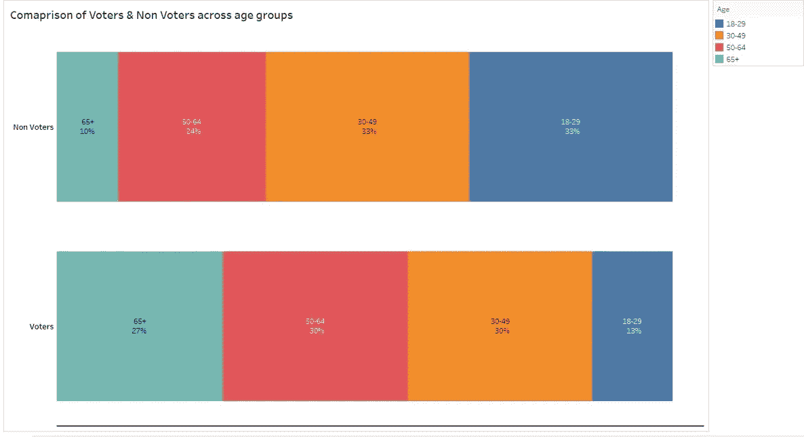

表格图——无反应偏差(来源:Self)

以上是**无响应**误差的一个典型案例，它是一种常见的非抽样误差。与 18-29 岁年龄组的投票者相比，非投票者的比例相对较高，他们可能会对高中早期的投票权意识提出质疑，这反过来可能会影响纳税人的投票模式。

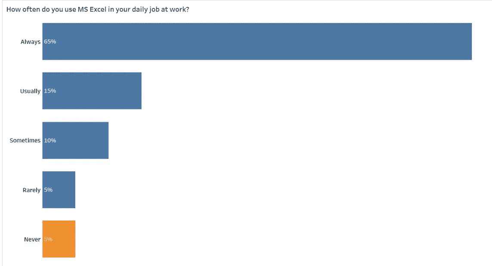

表格图——不真实的偏见(来源:Self)

上图显示了一个名为“数据科学生命”的组织所雇用的所有数据分析师的回答。这些回答是首席技术官为猜测 VBA 培训计划的规模而进行的调查的一部分。尽管一切看起来都很好，除了 5%的数据分析师在工作中根本不使用 excel。这听起来可能**不可信**，因为组织非常清楚每个数据分析师都更新了他/她的年度 Excel 许可证。

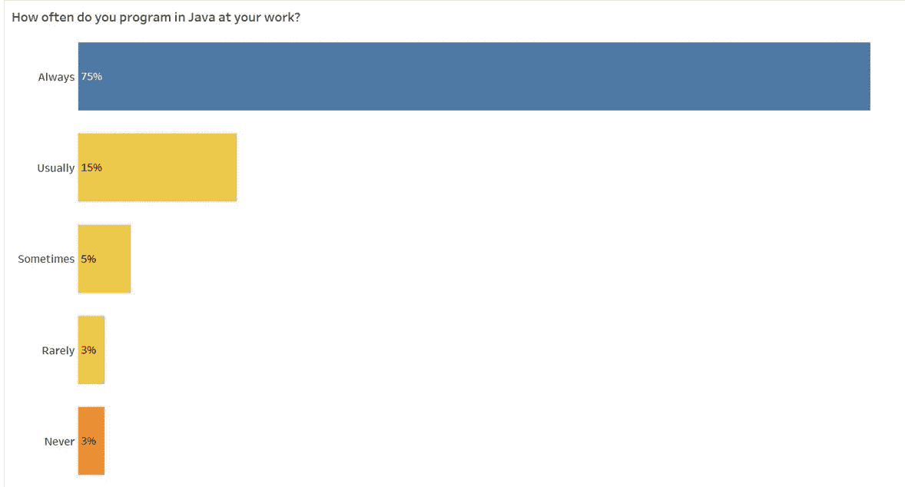

表格图——测量偏差(来源:Self)

上图显示了申请人对一家明确需要程序员的公司的职位的反应。像“通常”、“有时”或“很少”这样的选项并不能给招聘人员一个清晰的资格描述，他们应该更关注那些有编程经验或没有编程经验的候选人。因此，问题的设置可能没有真正抓住招聘人员的意图，导致**测量**偏差。

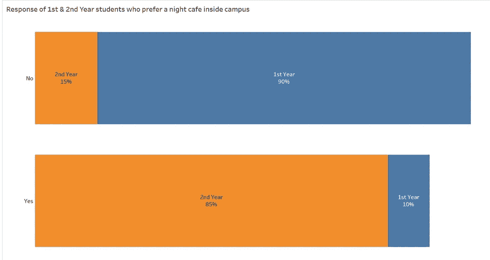

表格图——自愿反应偏差(来源:Self)

去年毕业的学生一直渴望在校园内有一个休闲区，在那里学生(*相对来说是新来的学生*)可以与高年级学生一起度过一段美好的时光，交流课程和其他课外活动。经过大量的陈述和说服之后，他们得到了管理层的许可，进行了一项调查，调查的基础是建立成本的决定。二年级学生竭尽全力维护公平手段，但却忽略了向一年级学生宣传这一目标的关键需求。结果显示，90%参与投票的一年级学生不想要夜间咖啡馆，而他们最初是去年的目标观众。因此，当前第一年的心态在某些方面与潜在受访者不同，导致潜在的**自愿回答**偏差。

**总体参数，样本统计**

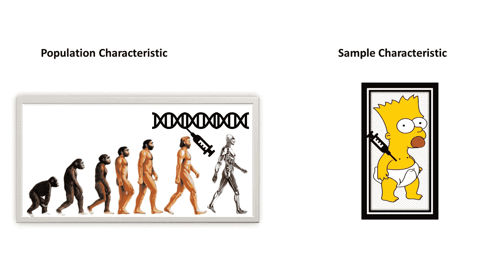

人口与样本特征(辛普森图像[来源](https://www.vhv.rs/viewpic/hbJoRob_bart-simpson-lisa-simpson-homer-simpson-maggie-simpson/)

我们对儿童辛普森身上的品质起源于人类发展的哪个阶段没有一点概念，无论如何，这些品质允许我们推断人类的具体特性。

群体特征由称为**群体参数**的度量来描述。大多数情况下，这个值总是存在的，但是除了一些实验情况之外，在现实生活中仍然是未知的。一个样本的特征由一个被称为**样本统计量** *的度量来描述，这个度量有资格作为* **点估计** *之后的*。我们可以利用样本统计数据得出关于总体的某些结论。**均值**和**标准差**是总体参数和样本统计常用的两种度量。让我们考虑另一个例子来更详细地讨论上述内容。

**采样分布**

> 一家社区免下车餐馆的负责人热衷于改善向经过咖啡馆免下车窗口的顾客提供的服务。作为这一程序的初始阶段，主任要求他的助手在办公室免下车服务框架的最后一个窗口记录为无数客户服务所需的时间。结果包括大约 1184 次帮助。对于这个问题，我们可以假设总体是已知的。(艾尔·奥尔布赖特&温斯顿)

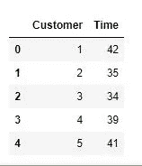

示例数据的前几行(来源:[数据](https://github.com/arimitramaiti/datasets/tree/master/articles)

要求是从信息中产生一个直接的大小为 30 的任意样本，然后从选择的样本中计算出一个总体边界(平均值)的标准。这里，样本统计量也可以称为样本均值。

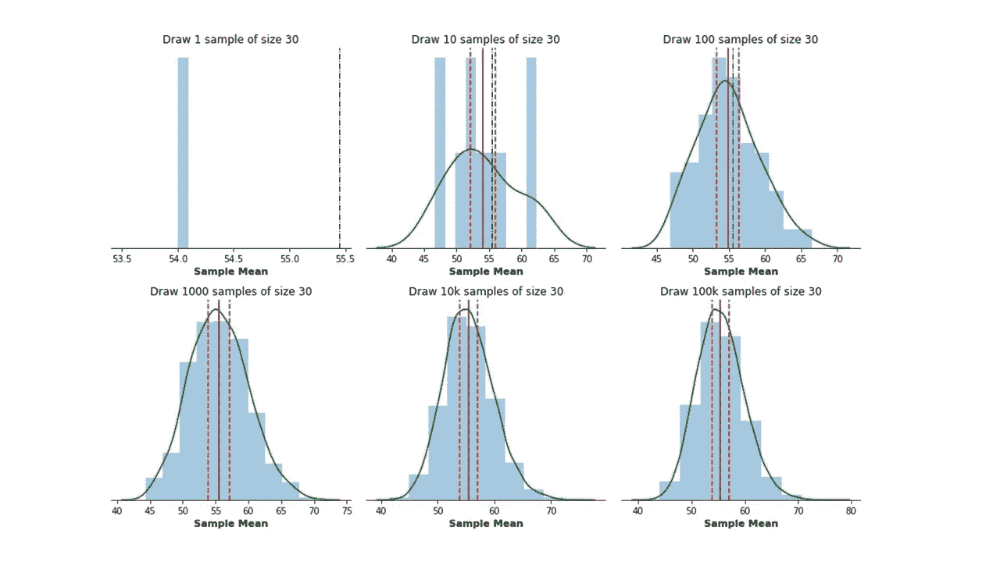

Python Graph-1(来源:[数据](https://github.com/arimitramaiti/datasets/tree/master/articles))

正如我们所说的，总体参数最常见的度量是它的均值，为了估计这个总体参数，最常见的样本特征是样本均值。虽然中位数或其他措施也是限定词，我们会坚持样本均值。上图中的黑色点划线是所有 1184 个记录的服务时间的总体平均值。另一方面，**棕色实线**是样品的意思。请注意第一张图表，我们只有一个样本，我们只有一个样本平均值，但是*当我们不断抽取多个大小为 30 的样本时，我们可以得到平均值的分布*，因此我们可以评估分布的平均值，用棕色线表示。另外，请注意，当我们在图表中移动并将它们与第二行进行比较时，我们观察到黑线和棕色线几乎重叠。**因此，当给定大小的*重复随机样本取自总体值时，所有样本均值趋向于满足总体均值，从而成为总体均值的无偏估计量。***这是样本均值的抽样分布的一个关键性质。*因此，在人口平均值未知的实际情况下，我们可以依靠这种无偏估计来得出一些关于人口平均值的想法*。

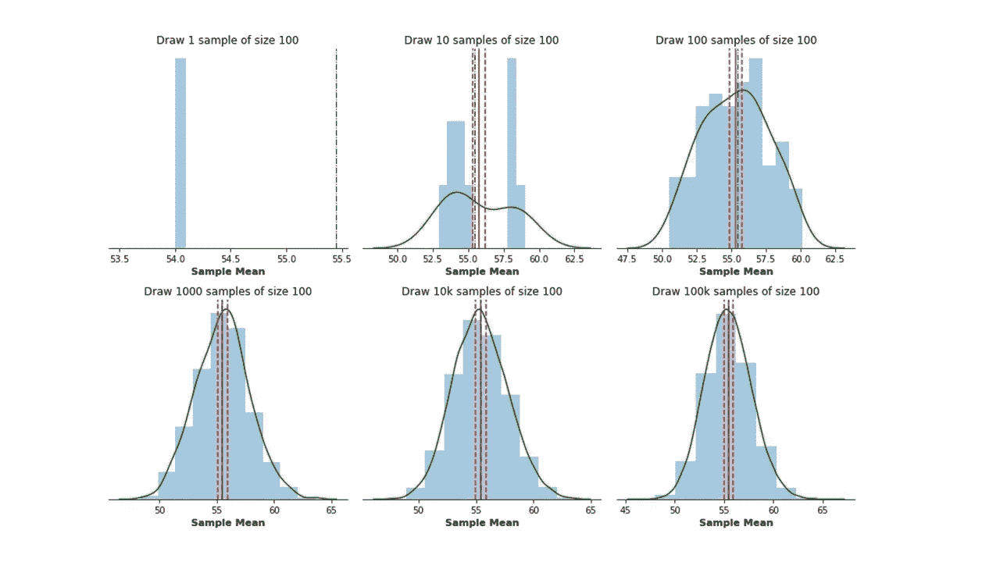

Python Graph-2(来源:[数据](https://github.com/arimitramaiti/datasets/tree/master/articles))

目前在上图中，我请求您只看到一个变化。我们是否注意到 X 轴的范围突然看起来比它的对应物窄了，在对应物中我们每个样本只取了 30 个单位？因此，在较大的样本中，我们看到的分布较少。所有样本均值的标准差与样本大小(本例中为 100)直接相关。一个抽样分布中所有样本均值的标准差称为**标准差**。因此，如果我们能够承担*增加样本量*(例如 100 个> 30 个)的成本，那么我们可能*实现样本均值*的更小偏差，或者换句话说，更小的标准误差。这也被称为无偏估计量的可变性。

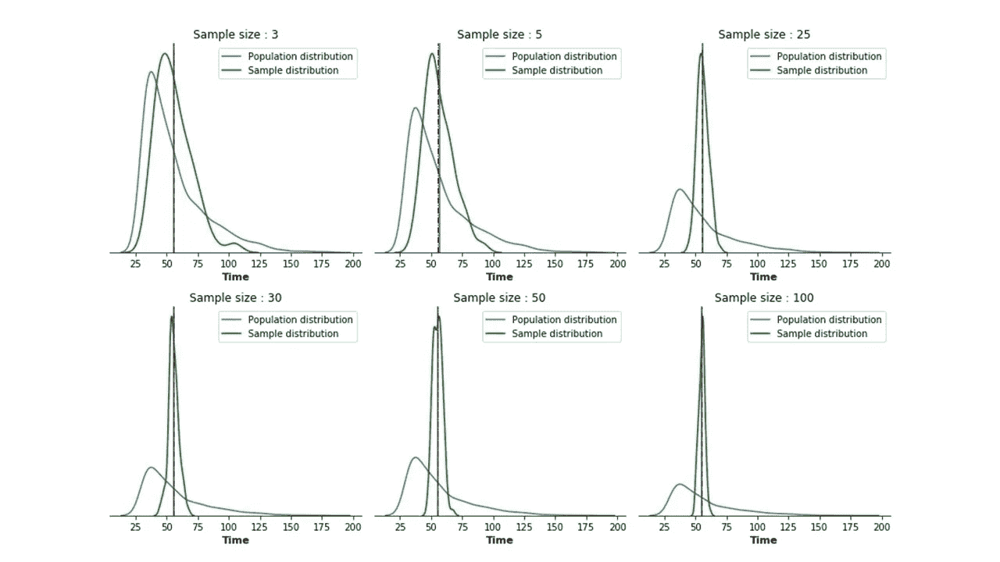

Python Graph-3(来源:[数据](https://github.com/arimitramaiti/datasets/tree/master/articles))

虽然在现实生活中，实际的人口分布可能还不可用，但为了本文的目的，让我们假设我们有来自 1184 个客户记录的人口分布，当我们绘制它时，我们得到一个右偏分布，如上图中蓝色曲线所示。绿色曲线表示样本平均值的抽样分布。这个练习我们已经做了 6 次，每次我们都抽取了 3、5、25、30、50 和 100 个样本。我们限制自己重复 100 次，并故意不改变它。

我们看到，随着样本量的增加，绿色曲线的形状(*大约在 30 号*之后)逐渐类似于正常的钟形。**只要样本量足够大，样本均值的分布将趋于正态分布，而不考虑总体分布可能严重偏斜或正态分布的事实**。这给了我们一个被称为**中心极限定理**(又名 CLT)的神奇定理的微妙概述。

**置信区间**

到目前为止，在检查上述*服务时间*示例时，我们已经讨论了如何通过随机抽样获得点估计值或**无偏**样本统计量。我们知道当我们改变样本大小或重复取样时，这个点估计值会有多大的偏差。我们还检查了对于足够大的样本量，点估计的抽样分布如何非常类似于正态分布。我们现在来看最后一个问题。

> 餐厅里为接单的顾客服务的平均时间的 95%置信区间是多少？

如果我们重新考虑标准正态分布，我们可能会问，

> 为了达到 95%的置信区间，我们需要移动抽样分布中所有样本均值的多少个标准差？

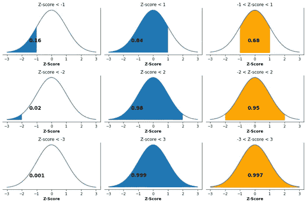

Z 分数区域概述(来源:Self)

如果我们还记得上面的图表，它来自我们读过的我的[上一篇](/the-leap-from-a-discrete-to-a-continuous-probability-distribution-b105fde3cc1f)文章，在 python 中，从 *stats.norm.cdf(2)* 中减去 *stats.norm.cdf(-2)* 大约得到 0.9545，而不是精确的 0.9500。这是通过以下方式实现的:

因此，让我们假设点估计值(样本分布中所有样本平均值的平均值)为 **55.45** 分钟。抽样分布的标准差为 **4.46** 分钟。我们被要求考虑原始示例中 **30** 的样本量。因此，标准误差(即抽样分布中所有样本平均值的标准偏差)是 4.46 除以样本大小的平方根。数值为 **0.814。由于我们知道原始人口记录，我们还考虑了一个价值为 0.99 的修正系数。最终的标准误差现在是 0.99 * 0.814，接近于 **0.81** 。*假设点估计值和标准误差值已经给了我们*。**

上区间是{55.45 加(1.96 * 0.81)}，下区间是{55.45 减(1.96 * 0.81)}

> 我们有 95%的把握认为，餐厅中为接受订单的顾客服务的平均时间介于 53.87 分钟和 57.03 分钟之间。

**学生的 t 困境**

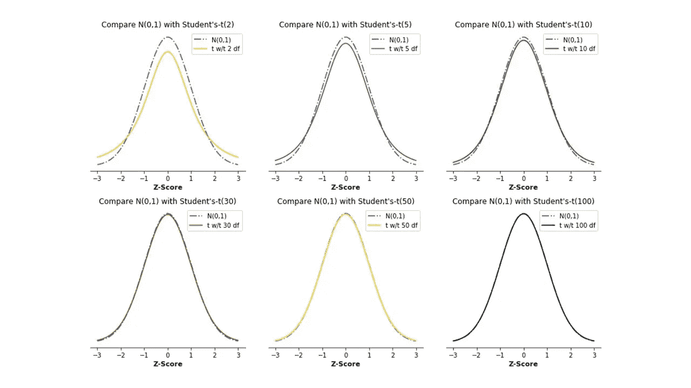

Python Graph-4(来源:Self)

为了简单起见，我们只知道，当样本量很小**并且**总体标准差未知时，学生的 t 分布是一个很好的选择。*请记住这两个条件都需要满足*。换句话说，看着图表，我们可能会觉得依赖小样本来估计偏差会导致更大的不确定性，从而导致更分散的分布，正如具有较重尾部的 t 分布所示。虽然在这一点上谈论自由度将会打开潘多拉的盒子，但是知道从样本量中减去 1 就可以得到 **t** 的自由度值(又名 df)就足够了。要了解更多信息，您可以访问[这里](https://stattrek.com/probability-distributions/t-distribution.aspx#:~:text=The%20particular%20form%20of%20the,in%20a%20set%20of%20data.&text=Hence%2C%20the%20distribution%20of%20the,or%207%20degrees%20of%20freedom.)。现在，如果我们认识到随着样本量的增加，自由度增加，因此 t 分布逐渐接近正态分布，这是没问题的。如果你能理解这幅图的意图，我会很高兴，因为在我早期，同时想象这两者对我来说是一场噩梦。当样本量小于 30 时，上图是证明使用 t 分布而不是正态分布(或 Z 分布)的许多方法之一。我的来自质量控制领域的读者朋友们可能会认同我的观点。

等于 1.96 的 stats.norm.ppf(0.975)是 **stats.t.ppf** (0.975，< *自由度* >)

**人口比例(*续* )**

评估总体参数置信区间的基本要素是点估计、点估计的标准误差和取决于置信水平或样本大小的乘数。我们已经看到了前两个，但只是重温第三个(乘数)可能取决于我们选择的特定分布(正常或学生的 t)，基于此，我们可以相应地插入 stats.norm.ppf 或 stats.t.ppf 函数。问题可能是，除了这两个分布之外，我们能不能不使用任何其他分布？当然，我们可以发布必要的尽职调查和调查。

牢记上述基本原则，我们将讨论一种更有趣的人口参数形式，称为**人口比例**。在这种形式中，我们处理的不是作为一个特征的平均值，而是关于整体的一个份额或部分。例子可以是支持特定候选人的投票者的真实比例的 95%置信区间，在特定城市使用 wifi 网络的家庭的真实比例的 95%置信区间，在给定月份上涨和下跌的股票的真实比例的 95%置信区间，对快餐连锁店提供的服务满意的顾客的真实比例的 95%置信区间，等等。

识别比例估计值的一个简单方法是首先检查是否有任何潜在的提及均值作为特征。其次，在我们抽取了一个给定大小的随机样本后，应该有一个形成比例的成功或失败的概率。例子可以是对候选人投票“是”或“否”，Wifi“是”或“不是”使用，股票“是”或“不是”上涨，客户“是”或“不是”满意，等等。准确地说，样本比例的属性应该是一个*二项随机变量*。

> 同一家餐馆的经理想要估计平均服务时间，现在他想要执行另一个估计。他在冬季推出了一种新的三明治。他收集了 40 名顾客的样本，要求他们按照 1 到 10 的标准(1 是最差，10 是最好)给这种新三明治打分。他想估计给三明治打 6 分及以上的顾客比例。他认为，这个间隔很可能会在下一次访问时购买一个三明治。据我们所知，40 个客户样本中有 25 个客户的评分为 6 分及以上。(艾尔·奥尔布赖特&温斯顿)

下面的 python 代码可以帮助我们理解，

***结论***

> 大多数人使用统计数据就像一个醉汉使用灯柱一样；支持多于照明~ **安德鲁·朗**

一个**样本**更像是从一个总体中提取并推断出该总体的子集。两种主要的抽样类型是**概率**抽样和**非概率**抽样。群体框架中的每一个元素都有平等的机会在样本中被选中，这个特殊的过程就是**简单随机抽样**。如果我们取一个给定大小的样本，评估样本特征(最常见的是均值或比例)，并多次重复这两个步骤，我们将得到样本特征的分布，称为**抽样分布**。当我们测量样本特征的分散程度时，我们会得到一个标准误差**。每个随机样本的结果都是不同的，因为选择样本的机会取决于某种**概率**。实际上，人口的分布可能是未知的，但是如果样本量足够大，抽样分布将类似于正态分布，也称为 CLT。随着样本量的增加，标准误差减小。在估计总体参数时，我们置信度的**大小**与我们在抽样分布中移动的标准偏差数成比例。这个数量级充当具有标准误差的**乘数**，乘数的选择取决于总体方差是否已知以及样本量是否足够大。**

*下面*给出了本主题涉及的一些常规&常用代码；

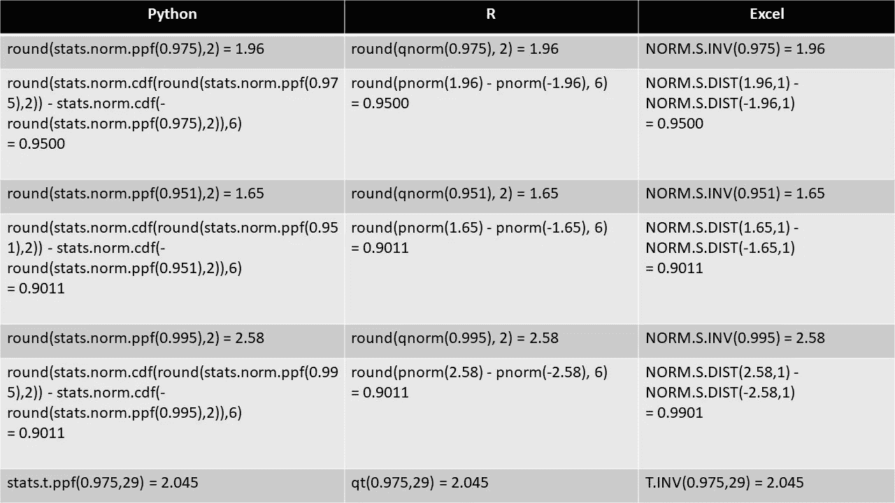

Excel 对等数据(资料来源:Self)

访问本文中使用的“*客户服务时间*”示例数据集的链接是此处的。

本文的目的不是关注任何特定的工具箱，而是提高认识，熟悉这种性质的问题，然后根据需要使用各种工具箱。我并不羞于欢迎我在各种工具中天真和低效的编程风格，然而，如果我的任何读者希望重现我们在上面读到的形式(而不是数字)，这里的[是笔记本的链接。](https://github.com/arimitramaiti/notebooks/tree/master/articles)

使用置信区间是一种特殊的估计。我们将在下一篇文章中讨论另一种称为假设检验的方法。

> guesstimate =比猜测好，但不像估计那样有保证