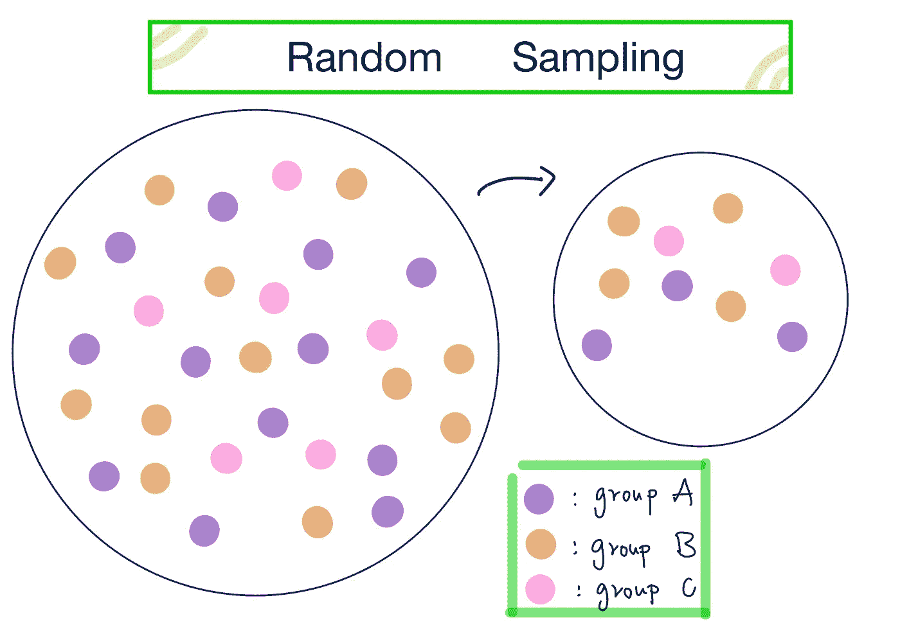
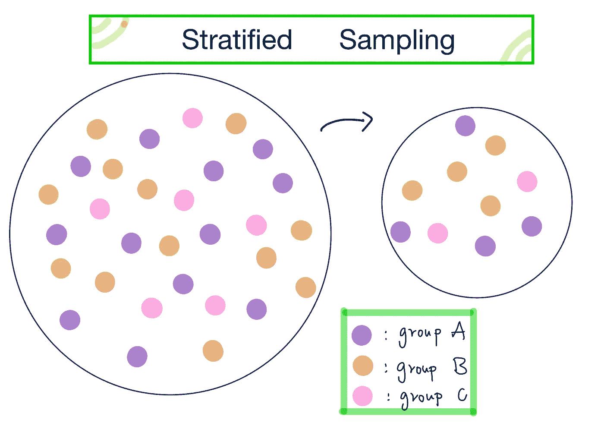
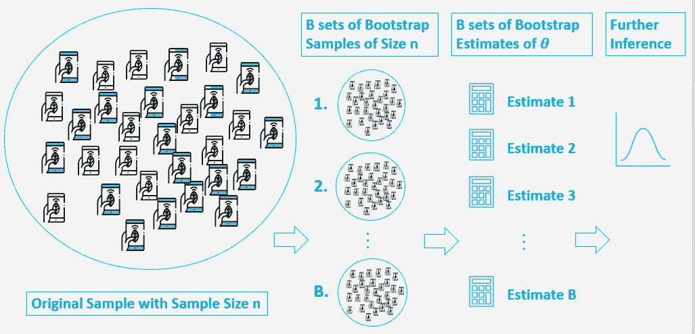
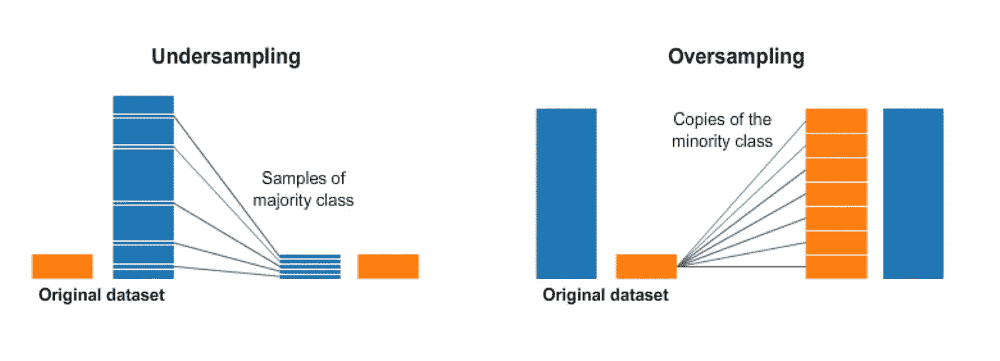
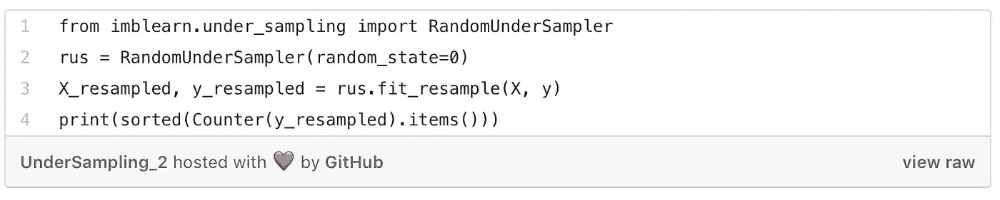
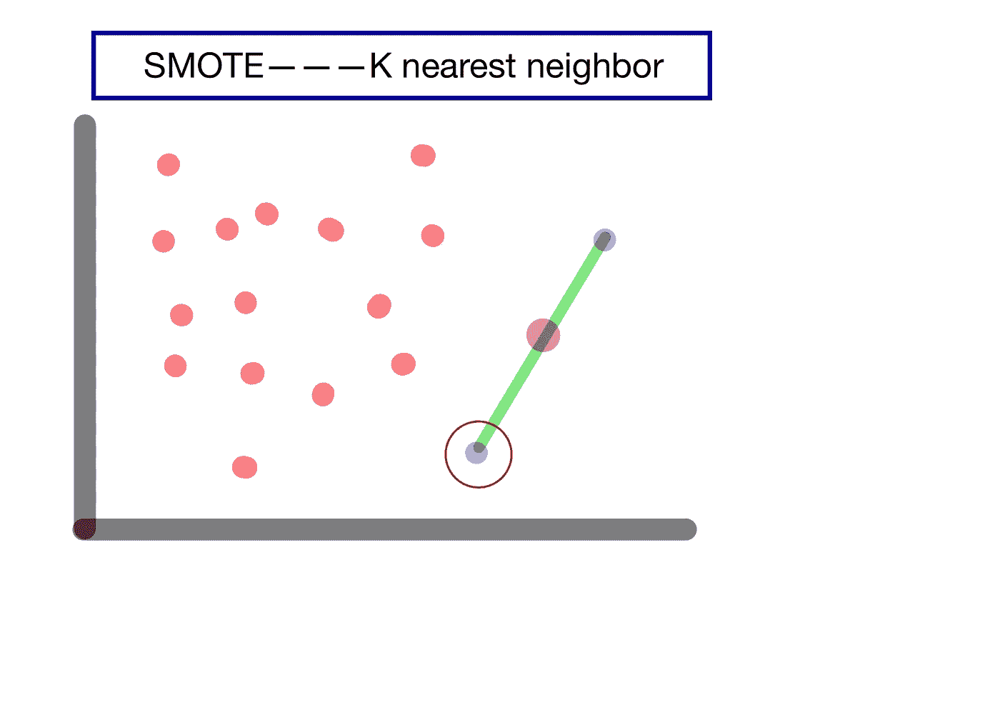
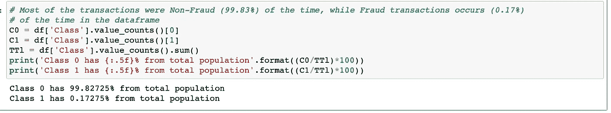
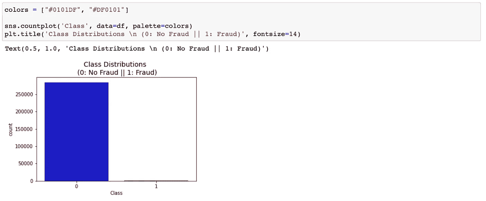
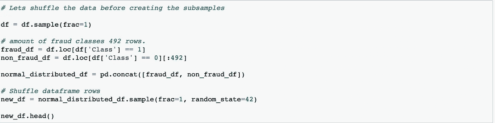
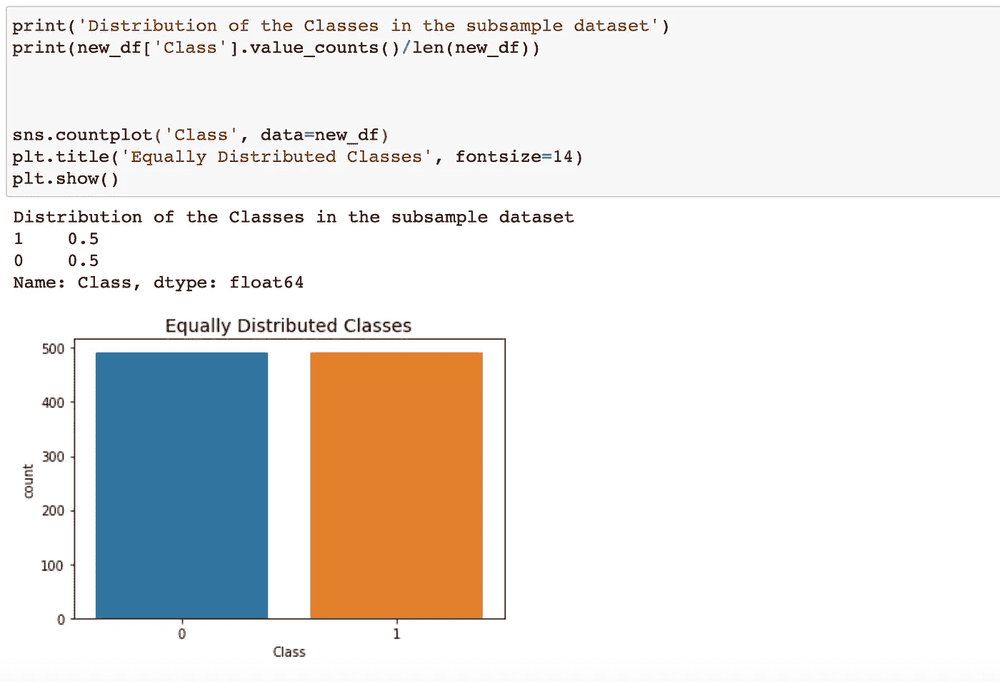

# 统计学习(二):数据采样和重采样

> 原文：<https://towardsdatascience.com/statistical-learning-ii-data-sampling-resampling-93a0208d6bb8?source=collection_archive---------14----------------------->

来源:Iconic Bestiary，via [shutterstock](https://www.shutterstock.com/image-vector/business-team-gathered-around-leader-creative-585334610)

统计抽样是从所有人群中抽取样本的一个子集。如今，机器学习模型变得更加复杂，并且将数百万个参数输入到最新的模型中，例如包含数百万个参数的 BERT 或 ResNet 模型。对于数据集的子样本，训练这样一个复杂的模型是相对高效的，虽然它通常需要几天到一周的时间。对数据进行二次抽样有助于确定参数网格搜索的更好性能。另一方面，在数据重采样方面，该方法为数据群体中的少数群体创建合成数据，或者使用来自原始数据集的复制数据。这有助于模型不过度适应包含大量数据样本的主类。

在本文中，您将了解到:

(1)流行的数据采样方法有哪些

(2)流行的数据重采样方法有哪些

(Python 中数据采样和重采样的应用

# 数据采样

有两种主要的数据采样方法:

*   **随机抽样:**给数据子集等概率被选中。

参见下图 1，我们可以看到有 3 组不同大小的样本，以 1/n 的相等概率选择子样本

图 1:随机抽样

*   **分层抽样:**给定每个类中数据集的不同大小，基于占总体的百分比从每个组中选择子集。

从下面的图 2 可以看出，有 3 组不同大小的样本，根据给定的每组相对概率选择子样本。因为有 12、12 和 6 个数据点分散在 A 组、B 组和 c 组中。选择子样本的概率为 2:2:1，由组的大小决定。

图 2:分层抽样

# 统计重采样:

创建数据集副本的有效方法是估计模型参数。而且，这个过程要重复几次。

## 两种流行的重采样方法:

*   **K-Fold 交叉验证:**一个数据集被分成 K 组，一定数量的数据集将被分配给训练数据集，而保留的数据集将被分配给测试数据集。当训练数据集相当小时，应用这种方法以避免过拟合问题。
*   **BootStrap:** 虽然数据集不遵循任何特定的分布，如正态分布、X 平方分布和 T-student 分布，但 BootStrap 可用于评估数据集下的统计数据和潜在分布。从下面的图中，首先，从原始数据集中抽取一组子样本。然后，我们以固定长度(n)从初始子样本重新取样 B 次，而不考虑从提取中抽取的重复样本。对于每个 bootstrap 样本，使用参数(θ)进行估计。因此，bootstrap 是当一种常见的方法是估计量(θ)采用[经验分布函数](https://en.wikipedia.org/wiki/Empirical_distribution_function)时，用于**逼近概率分布**的一种方法。

来源:[自举方法介绍](/an-introduction-to-the-bootstrap-method-58bcb51b4d60)

# 重新采样:

来源: [**不平衡数据集的重采样策略**](https://www.kaggle.com/rafjaa/resampling-strategies-for-imbalanced-datasets#t1)

给定不平衡的数据集，我们经常面临的问题是大多数数据属于主要类，而少数数据属于少数类。为了克服这种不平衡数据的模型训练的不良性能，主要建议使用过采样和欠采样技术来产生落入每一类的均匀分布的数据。

现在，我将浏览示例数据集

## (A)使用 Python 包的欠采样

在 **python imblearn 中有几种欠采样算法可以应用。(1) ClusterCentroids:** 使用 K-means 方法的**质心，合成每个类的大小，以减少数据。注意**数据应分组为簇，以应用簇形心方法**。**

**(2) RandomUnderSampler:** 为目标类选择数据子集，以平衡数据集。它通过将替换参数设置为真来启用**引导**方法，同时从每个类别中独立抽取子样本。

更多关于使用 Python 的欠采样方法的参考可以在 [**这里**](https://imbalanced-learn.readthedocs.io/en/stable/under_sampling.html) 找到

## 过采样(合成少数过采样技术 SMOTE)

该技术用于在特征空间中选择最近邻，通过添加一条线来分隔样本，并沿着该线产生新的样本。该方法不仅仅是从寡不敌众的类中生成副本，而是应用 **K 近邻**来生成合成数据。从下面的图 3 中，蓝色圆圈是原始数据，红色圆圈中的另一个蓝点是最近的邻居，粉红色的点是合成的。链接到 [**文章**](https://kite.com/blog/python/smote-python-imbalanced-learn-for-oversampling/) 了解更多关于 SMOTE 算法的细节。

情节 SMOTE 是如何工作的

## 动手对[信用欺诈数据](https://www.kaggle.com/mlg-ulb/creditcardfraud)应用重采样方法:

这些数据用于检测 Kaggle Challenge 的交易是正常交易还是欺诈交易。为了保护信用卡信息中的个人隐私，通过**主成分分析(PCA)** 方法对特征进行了缩放，并将特征的名称以及总额和类别重新命名为 V1 至第 28 版，其中 0 和 1 表示欺诈交易，0 表示其他交易。

交易数据中不平衡类的百分比

从下面的柱状图可以看出**非欺诈数据**占 **99.82%** ，而**欺诈数据**占 **0.17%** 。

阶级分布条形图

## 如何处理这样不平衡的数据集？

**子样本。**将班级平均分配为 50 人和 50 人，这样模型可以为每个班级学习相同的样本量。

对主要类进行欠采样，并使数据大小与少数类相匹配

平均分布类的条形图

## 注意:拆分数据用于模型训练和评估

在进行随机欠采样或过采样之前，我们需要分离原始数据帧。目的是**测试非来自手动合成数据集**的原始数据。

# 结论:

通过这篇文章，我们了解了一些流行的数据采样和重采样方法。遇到不平衡的数据集问题或拥有庞大的数据集是很常见的。为了克服过拟合问题，进行数据采样方法以从中抽取子样本确实是一种有效的方法，而数据重采样(如过采样和下采样方法)是平衡每类数据的好方法。最后，python 中的代码展示了如何在每个算法上生成数据重采样方法并应用于数据集。享受周末:)

来源:[memeshappen.com](https://memeshappen.com)

感谢您对本文的关注。请在下面留下你的评论，并欢迎任何反馈。作为一个写这篇博客的初学者，我会发表更多与数据科学相关的文章。如果你是数据爱好者，请关注我的 [**中**](https://medium.com/@rahul_agarwal?source=post_page---------------------------) **。**敬请期待:)