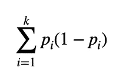
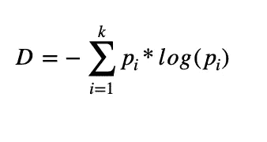
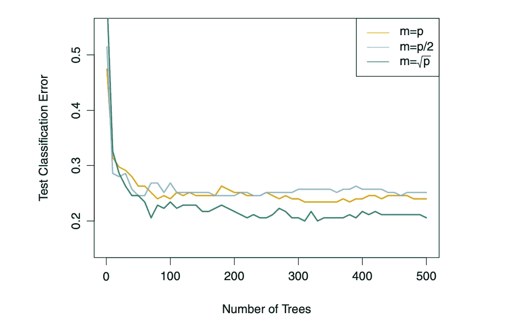
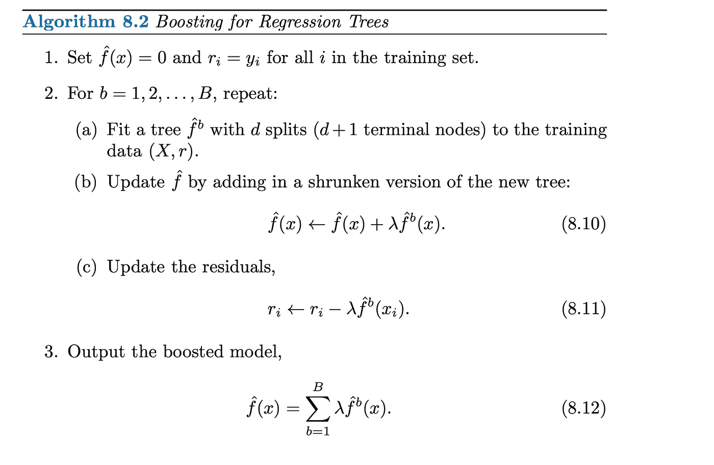
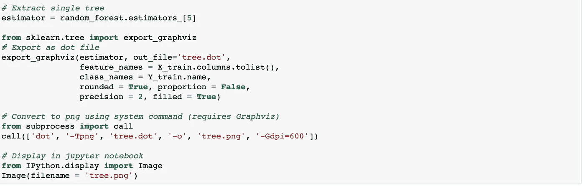
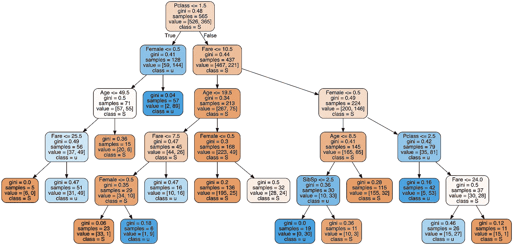
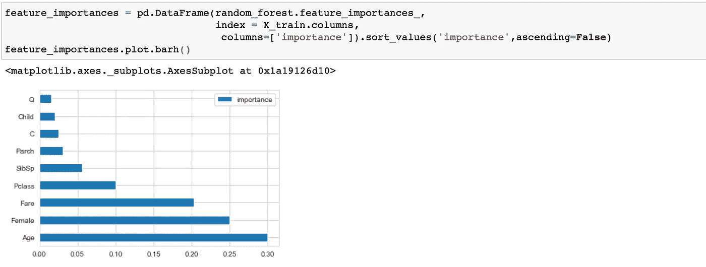
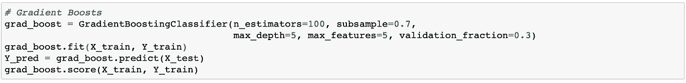
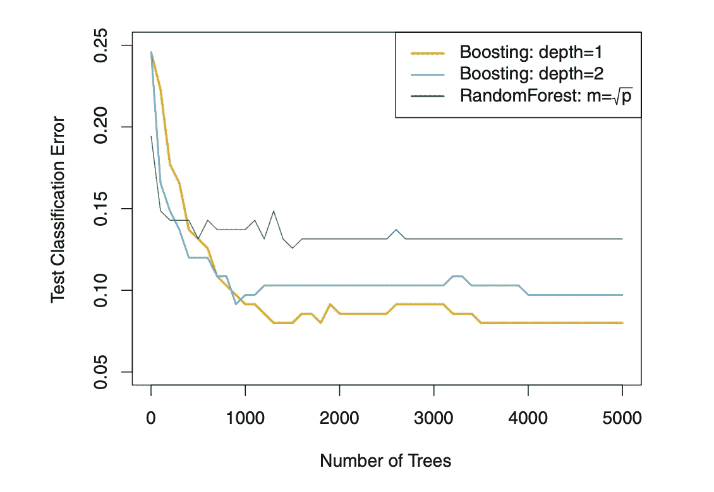

# 统计学习(三)基于树的方法

> 原文：<https://towardsdatascience.com/statistical-learning-iii-tree-based-method-fdade017bee7?source=collection_archive---------58----------------------->

## 浏览装袋、随机森林和助推的概念。使用 python 进行随机森林和梯度增强的实际体验。

尼基塔·万托林在 [Unsplash](https://unsplash.com/collections/1680217/workspace?utm_source=unsplash&utm_medium=referral&utm_content=creditCopyText) 上的照片

如今，越来越多的人喜欢应用基于树的模型来处理回归和分类方面的机器学习问题。使用基于树的模型有几个好处，比如输出更好的结果、易于使用以及知道特征的重要性。另一方面，它需要更多的计算能力，并经常导致过拟合问题。基于树的方法可以关注线性回归和分类问题。这篇博客文章将进一步阐明分类问题。

在本文中，您将了解到:

(1)基于树的模型的测量值

(2)介绍装袋、出袋误差、随机森林、助推。

(3)随机森林和梯度增强在 Python 中的应用

**基尼指数:**I 级总方差的量度，p(i)代表分类到第 I 级的概率。值的范围从 0 到 1，其中 0 表示大多数元素属于某个类，1 表示所有元素随机分布在各个类中。

基尼指数

**交叉熵:**交叉熵对概率值取对数，优点是照顾低概率值。这种函数将防止概率值减小，并用于分类模型的损失函数。在其他讲座中，熵被称为树分裂指数。熵和交叉熵都可以用于基于树的模型中的分割方法。

交叉熵

基尼指数和交叉熵都被用来确定分类树上分支的分裂。当父节点的基尼指数或交叉熵高于左右子节点的平均值时，就会发生分裂。你可以链接到“[关于基尼指数和交叉熵](/gini-index-vs-information-entropy-7a7e4fed3fcb)的更多细节”的文章。

# 制袋材料

装袋的目的是克服决策树的高方差问题。Bagging 是决策树的常用方法，它依赖 bootstrap 来减少统计学习方法的方差，而 bootstrap 是一种常用的统计重采样技术来近似采样分布。假设有 A1，A2，…..一个 n 独立的例子，每个例子都有方差 **σ，**例子的平均方差给出为 **σ /n** 。因此**平均**法有助于**减少方差**。换句话说，bagging 从训练数据集中获取几个**自举样本**，并计算所有预测的平均值。的确，装袋可以改善方差的减少，尤其是对于决策树环境下的回归问题。就分类而言，bagging 将对测试集中的预测类进行多数表决。

# 袋外误差估计

打包总是分别采用增强的示例子集来拟合模型。平均而言，每棵袋装树占总自举观测值的三分之二，剩余的三分之一称为袋外(OOB)观测值。每次模型在第 1 次 OOB 观测时进行预测，根据分类误差对预测类取 **RMSE** ( **回归**)或**多数票**(**分类**)。对于 bagging 来说，从大数据集估计 OOB 测试误差相对方便，而对于大的计算资源，则需要交叉验证方法。

# 随机森林

随机森林是一种在自举训练示例上结合几个决策树的方法。查看树上的每个分割，从所有 p 个预测因子(m∞√p)中以 1/m 的随机样本进行分割，而每个决策树中总共有 m 个预测因子。

## 变量(特征)重要性

为了解释基于树的方法的结果，树结构图通常是一种很好的方法，可以看出考虑到分裂方法的每个方差中的基尼指数有多高。总体来看，**套袋分类树**考虑了**基尼指数**，而 **RSS(残差平方和)**则是**套袋回归树**。只要模型变得更复杂，就很难分析袋装树增加时每个方差的重要性。对于回归和分类，当每棵树形成时，RSS 和 Gini 指数的值将在每次分裂中降低。然后，在每棵树中累加减少的值。然后，随机森林模型取所有树中值的平均值，而值越大，预测值对模型性能的影响就越重要。

## 随机森林装袋法

一般来说，随机森林方法优于 bagging 方法，因为随机森林模型更有效地**减少方差**，并使其在模型性能上更可靠。在袋装树的集合中，大多数树被顶部的强预测器分割，因此每棵树产生相似的性能并具有高度相关的结果。因此，取高度相关树的平均值比取不相关树的平均值要差得多。另一方面，随机森林能够通过为每次分裂考虑预测因子的子集来避免该问题。由于 p 是每棵树中的预测值，m 是预测值的总数，所以 **(p-m)/p** 分裂的平均值不仅会选择强预测值，还会选择其他预测值。因此，每棵装袋的树最终都被**去相关**并更好地减少差异。

从下图可以看出，函数 m ≈ √p 优于其余两个函数，因为 **m ≈ √p** 用于**随机森林**分类器中的预测函数，而 **m=p** 代表**打包**函数。当参数 p 等于 500 时，我们可以看到，当树在 450 左右生长时，测试误差线变得稳定。

摘自《统计学习导论》第 322 页

# 助推

与 bagging 不同，boosting 不为每个决策树获取引导样本，而是使用来自前一个树的信息按顺序生长每个树。每一次，树都基于残差来拟合模型。当随后的树被输入到拟合函数中时，残差保持更新。因此，改进的拟合函数允许树以不同的形状生长，这有助于减少残差。同时，这种统计方法学习缓慢，因为收缩参数λ减慢了该过程。

## 关于三个主要参数的更多细节描述如下:

*   **树的数量(B)** :交叉验证用于选择 B。与套袋和随机森林相比，当 B 较大时，套袋会导致过度拟合。
*   **收缩参数(λ)** :已知 boosting 的学习率，在 0.01-0.001 之间。为了获得良好的性能，**小λ** 伴随着 B 的**大值。**
*   **每棵树中 d 分裂的数量**:它指的是增强系综的复杂度。d 变量决定了模型的**交互深度**，d 输出树中的 d+1 个节点。

摘自《统计学习导论》一书，第 323 页

# 实践经验:

我们将使用 Python 包遍历应用于示例数据集的基于树的模型。该数据集是《ka ggle:Titanic——灾难中的机器学习》中最受欢迎的用例。这个用例是用机器学习算法预测泰坦尼克号上的生存。kaggle 网站链接:[泰坦尼克号数据集](https://www.kaggle.com/c/titanic/data)。在通过基于树的模型深入研究预测方法之前，让我们先了解一些基本方法，以便为预测准备好训练和测试数据。数据集已经过预处理，以**排除空值**、**低相关列**，并为文本特征创建**虚拟变量**。

## 随机森林:

为了生成下面的简单树形图，模型设置有参数 max_depth=5，max_leaf_nodes=15，其中通过相对减少杂质来选择 **max_leaf_nodes** 。叶节点是下面没有任何子节点的末端节点。

生成树形图的代码片段

随机森林模型中的树图

**注:**

*   [Link1](/how-to-visualize-a-decision-tree-from-a-random-forest-in-python-using-scikit-learn-38ad2d75f21c) ， [Link2](/random-forest-in-python-24d0893d51c0) :关于如何从随机森林模型生成树图的更多细节
*   需要 GraphViz 开源工具。建议通过 brew 命令行安装，而不是通过 pip

根据模型结果，利用不同的特征对随机森林的分类问题进行预测。使用基尼系数的平均下降值**计算特征重要性值**。

功能重要性代码片段

# 在 Python 中提升模型

## XGBoost V.S. AdaBoost V.S .梯度升压

**XGBoost:** 应用牛顿推进，提供了到达局部最小值的路径，但不是通过梯度下降。

**AdaBoost:** 更新误分类数据点的权重

**梯度推进:**通过残差计算的损失函数更新预测器

几篇很棒的文章给出了每种提升方法的详细信息。
[链接 1](/basic-ensemble-learning-random-forest-adaboost-gradient-boosting-step-by-step-explained-95d49d1e2725) 、[链接 2](https://hackernoon.com/boosting-algorithms-adaboost-gradient-boosting-and-xgboost-f74991cad38c) 、[链接 3](https://medium.com/hackernoon/gradient-boosting-and-xgboost-90862daa6c77)

## 梯度推进分类器:

梯度增强代码段

随着估计数的增加，模型过度拟合的可能性越大。建议进行参数调整或指定其他参数来克服过拟合问题，而不是最大化决策树的总数。

从下面的图中，我们可以看到整体提升模型的性能比随机森林模型好得多。很明显，深度 1 模型比深度 2 模型显示出更低的测试误差。

摘自《统计学习导论》一书，第 324 页

# 总之:

*   Bagging 使用 bootstrapped 方法，该方法获取训练数据的多个副本，拟合每个决策树中的每个重复样本，并组合所有树以获得预测模型。
*   随机森林模型为每个决策树使用 boostrapped 示例。特征重要性值由基尼指数(分类问题)和残差平方和(回归问题)决定。
*   当新树基于先前的树生长时，提升优于随机森林模型。此外，每棵树的深度越小，模型的性能就越好。在 Boosting 中，每棵树都从以前生长的树中学习，因此需要更多的时间进行训练。
*   基于树的模型需要超参数调整，因为这通常会导致过度拟合。

来自[HAPPY-WISHES.NET](https://www.memesmonkey.com/topic/easter#&gid=1&pid=1)

**享受漫长的周末！！**

## 感谢令人敬畏的教科书:统计学习导论。我从中学习概念，并推荐读者阅读以了解更多细节。