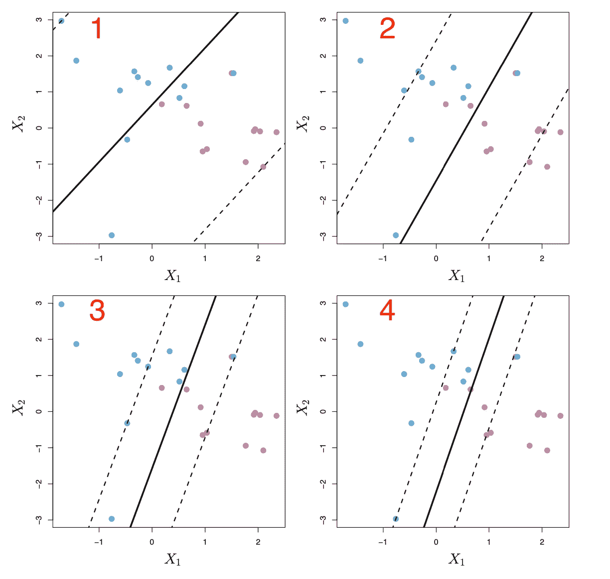
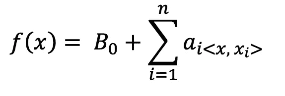
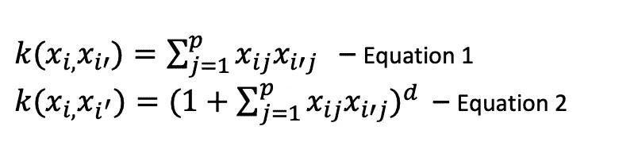
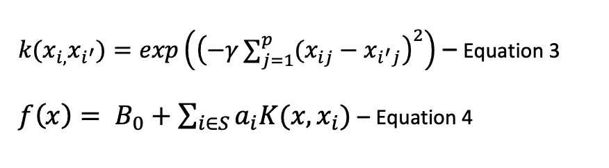

# 统计学习(四):支持向量机

> 原文：<https://towardsdatascience.com/statistical-learning-iiii-support-vector-machine-632df8da0b41?source=collection_archive---------51----------------------->

## 遍历最大间隔分类器、支持向量分类器和支持向量机。


由[Kit8.net](https://www.shutterstock.com/g/portfolio)从快门股票

S 支持向量机是一种常用于文本分类的模型。然而，SVM 也是一种适用于线性问题的机器学习算法。了解了 SVM 的概念，如超平面和核，您将更好地了解如何将该模型应用于回归和分类问题！

在本文中，您将了解到:

(1)用最大间隔分类器处理 SVM 上的线性问题

(2)非线性问题 SVM 核的引入

(3)SVM 在 Python 文本分类中的应用

# 最大间隔分类器

当数据点分布在多于 2 维的空间中时，应用超平面将它们分成两半。从下面的图中，它显示了两类观察结果，蓝点表示一类，紫色点表示另一类。对于左边的一个，它显示有 3 个超平面将数据点分成 2 类。对于右边的一个，数据点被分成两半，yi=1 属于蓝色类，yi=-1 属于紫色类。因此，数据点被分为两类，遵循以下等式:

```
B0+B1Xi1+B2Xi2+B3Xi3+.....+BpXip > 0 if yi = 1
B0+B1Xi1+B2Xi2+B3Xi3+.....+BpXip < 0 if yi = -1
```


摘自《统计学习导论》第 340 页

## 如何决定使用哪个超平面？

最大间隔分类器基于数据点和超平面内的间隔总和的值来决定最佳超平面。分类器通过从训练观察中选取最远的来选择超平面。最大间隔分类器的等式定义如下:

```
**yi(β0 + β1xi1 + β2xi2 +...+ βpxip)≥ M ∀i=1,...,n**
```

m 是应该最大化的超平面的边缘。
yi，…，yn∈{-1，1}属于标签
x1，…，xn ∈ Rp 属于训练观测值

分类器将通过选择 B0，B1，B2，…来最大化 M。，Bp 来优化问题。

然而，就非分离问题而言，不存在用于计算值 M >0 的超平面。为了概括这种困境，使用支持向量分类器来计算不可分离情况的软裕度。

# 支持向量分类器

支持向量分类器，也称为软边缘分类器，允许一些观察值出现在超平面或边缘的对面。


摘自《统计学习导论》一书的方程式，第 346 页

**M** 是页边距的宽度； **C** 为非负调谐参数；
**ε1，。。。，εn** 允许观测在不正确的一侧。如果 **εi > 0** ，第 I 次观察出现在错误的一侧。c 是εi 值的总和，它决定了裕度能够承受的严重程度范围。当 C 变得更高时，裕度变得更宽，它容忍更多的数据违规，这导致高偏差和低方差。另一方面，当 C 减小时，裕度缩小，错误侧出现的观测值更少，从而导致低偏倚和高方差。因此，C 决定了支持向量分类器的偏差-方差权衡。从下面的图可以看出，C 从图 1 收缩到图 4，允许在超平面的窄边上出现更少的支持向量。



摘自《统计学习导论》一书，第 348 页

注意:如果边界是线性的以分离观察值，支持向量分类器仅支持 2 类分类。

> 注意，支持向量分类器仅用于分离 2 类问题，而支持向量机(SVM)能够处理具有多于 2 类分类的更复杂的非线性问题。

# 支持向量机

支持向量机使用在两个以上类别之间具有非线性边界的核来扩大特征空间。在使用核方法的基础上，我们将通过支持向量分类器的数学概念来处理线性和非线性问题。

根据下面的等式，它表示线性支持向量分类器，因为 SVM 需要观察值的内积。有 a_i⋯ a_n 训练观察。为了优化 F(x)函数，我们需要进行新点 x 和第 I 个观察点的内积。



线性支持向量分类器方程

## 基于内核的 SVM

*   **基于线性和多项式的内核**

内核用于<x x_i="">内积的推广。根据等式 1，k(x_i，x _ I’)被称为核函数，用于量化两个观察值的相似性。为了解决多项式问题，来自等式 2 的核函数适合于适应多项式次数 d >1 的高维空间。多项式核函数能够为分布在非线性模式上的数据点绘制灵活的决策边界。</x>



核函数方程

*   **径向内核**

**径向核**是另一个流行的**非线性**函数。根据下面的等式 3， **γ** 是一个正的常数**。给定一个新的测试观察 x_ij，径向核函数用训练观察 x_i'j 计算**欧几里德距离**。当测试数据点远离训练数据点时，对两个更远的数据点的平方距离的负常数取指数会导致小的值。γ越大，支持向量分类器的输出性能越好。因此，k(x_i，x _ I’)的输出对支持向量分类器 f(x)函数几乎没有影响，如下面的等式 4 所定义的。换句话说，只有训练观测值 x_i'j 附近的测试观测值 x_ij 会对测试数据的预测类别产生本质上的影响。**



核函数方程和基于核的 SVM

## 应用内核的优势

当应用核时，它减少了计算，同时它只关注位于 K(x_i，x _ I’)上的核函数的边缘的支持向量。另一方面，扩大的特征空间方法需要大的计算能力，因为会有无穷多个数据点落入更高维度的空间中。

# Python 中的支持向量机

我们将使用 python Sklearn 包遍历示例数据集上的支持向量分类器。该数据集包括来自 IMDB 的 5 万部电影评论，用于自然语言处理或文本分析。这是用来预测消息是正面的还是负面的。Kaggle 网站链接: [IMDB 数据集](https://www.kaggle.com/lakshmi25npathi/imdb-dataset-of-50k-movie-reviews/data)。SVM 很适合文本分类，所以这将是我们的主要预测文本分类模型。在通过支持向量分类器深入研究预测方法之前，让我们先了解一些基本方法，以便为预测准备好训练和测试数据。

## 文本数据集的预处理:

*   剥离 html 标签
*   删除标点符号
*   删除停用词
*   词干:把单词变成词根形式
*   标记化

文本预处理的代码段

## 单词袋模型:

输入文本特征需要转换成机器学习模型的数字特征。以下示例通过 **CountVectorizer** 函数展示了词袋模型方法。它计算单词在整个文档中出现的次数(计数),并输出编码向量。输出向量通常是稀疏的。

CountVectorizer 的代码片段

## SVM 模型

以下示例显示了将嵌入文本要素输入到 SVM 模型中。用径向核参数设定模型。

支持向量机的代码片段

## sklearn 中 SVM 的参数调整

*   内核:rbf(默认)、线性、多边形、sigmoid
    RBF:径向基函数内核
*   C:正则化参数
    C 控制误分类观测值的容差。较低的 C 值允许以较低精度为代价的较大裕量，并且对性能具有较低的方差。相反，**较高的 C 值**绘制较小的边界，对大多数数据点的分类性能较好，在决策函数上表现出较高的方差。
*   伽马:它影响观察对模型性能的影响程度。较大的 gamma 值会扩大半径，从而考虑更多的观察结果，而较低的 gamma 值会绘制较小的半径。注意到较大的伽玛会导致过度拟合问题

SVM 网格搜索的代码片段

# 结论

*   支持向量分类器使用超平面通过最大化边缘值来区分来自两类的数据点。
*   核被应用于观测值的非线性分离，这减少了出现在标签类中的不正确观测值的出现。与线性核和多项式核相比，径向核对单个观测值的变化不敏感。
*   为了使文本分类模型具有更好的性能，需要一种彻底的文本处理方法来获得干净的数据集。模型的参数调整可以提高模型性能。

## 参考:

[1]:加雷斯·詹姆斯、丹妮拉·威滕、特雷弗·哈斯蒂和罗伯特·蒂布拉尼。统计学习导论。第七版。斯普林格。

## 请继续关注更多关于机器学习概念的初学者友好文章！☺️