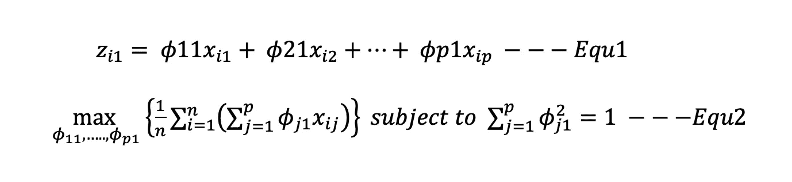
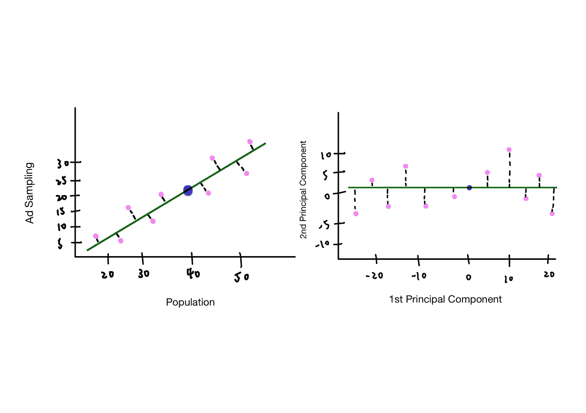
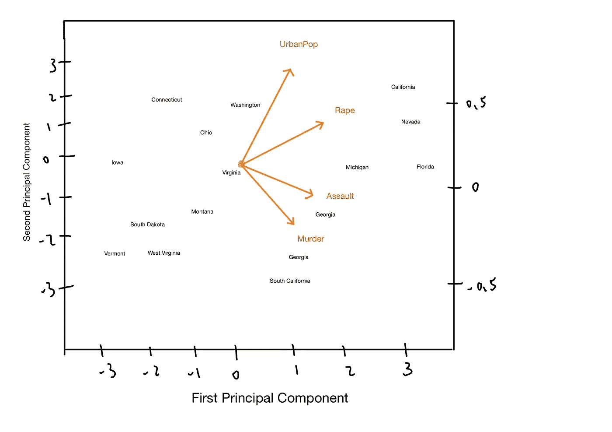
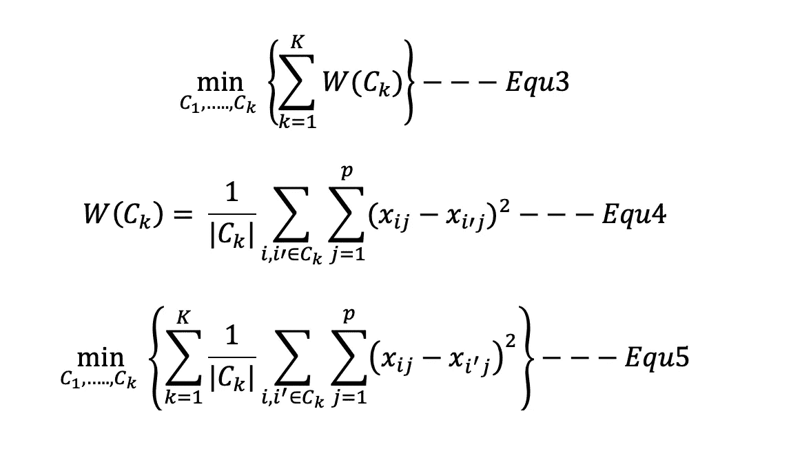
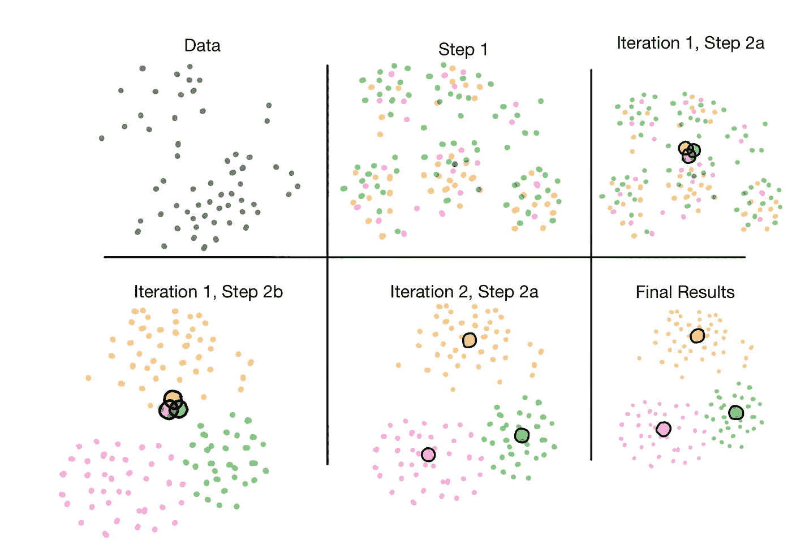
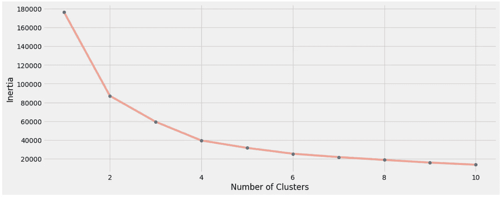
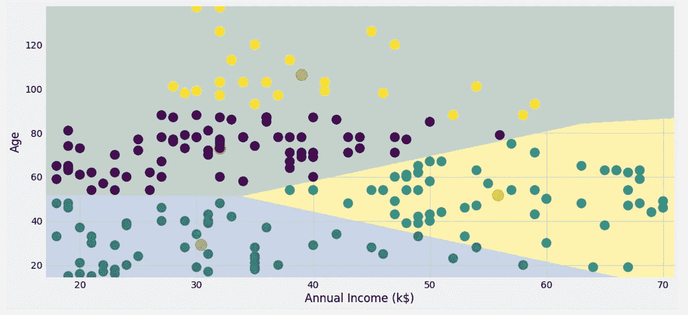

# 统计学习(五):无监督学习

> 原文：<https://towardsdatascience.com/statistical-learning-v-unsupervised-learning-f7adaf147b30?source=collection_archive---------67----------------------->

Web 开发矢量图形在[GetDrawings.com](http://getdrawings.com/get-vector#web-development-vector-24.jpg)

无监督学习是一项具有挑战性的任务，因为模型需要学习没有标签的数据模式，并且如果不将预测与来自观察的标签进行匹配，很难评估结果。例如，用户对商品推荐的购物体验是通过无监督学习来执行的。系统会根据搜索商品的历史和购物车中的商品列表向用户推荐感兴趣的商品。了解聚类分析方法后，您会更好地理解如何为数据集创建聚类标签。

在本文中，您将了解到:

(1)主成分介绍

(2)聚类算法中的 K-Means 聚类和层次聚类

(Python 中 K-Means 聚类在购物数据集上的应用

## 主成分分析

主成分分析是一种无监督学习方法，产生一组特征 X1，X2，…，Xp，在 n 个观察值上测量，其被认为是来自数据集的代表性变量。PCA 提供了一种工具来生成数据的表示，该表示捕获低维空间中的大部分信息。

## 主成分

它是 p 个特征 X_1，X_2，…的一组归一化线性组合。，X _ p .
φ_ 11，φ_21，…，φ_p1 的载荷向量构成一条线，使每个观测值 X_1，X_2，…之间的距离平方和最小..，X_p 到数据。为了约束加载向量，我们对φ值的平方和进行归一化，φ值等于 1。根据等式 1，Z_i1 被称为主成分得分。

主成分的数学公式

从下面的图中，左边的图(图 A)显示了第一个主成分。绿线由第一主成分负载向量构成，蓝点是两个特征的平均值。右图显示了旋转后的绿线，第一主成分作为 x 轴，第二主成分作为 y 轴。左下角的紫色圆点具有最大的负值，表明主成分得分 z_i 低于两个特征的平均值，右上角的 z_j 具有最大的正值，表明高于平均值的特征的 z_i 得分为正值。

图 1:带 PCA 的示例数据集

PCA 在缩放数据集上执行得更好。当对未缩放的数据执行 PCA 时，主成分加载向量将对具有较高方差的变量产生较大的值。

## PCA 的例子

下面的剧情展示了美国的 15 个州以及**城市警察**、**袭击**、**谋杀**、**强奸**的特点。就第一个组成部分而言，它在犯罪特征的负荷向量上显示出相似的权重，而在城市人口上显示出较小的权重。另一方面，相对于其他特征，城市人口特征更为重要。一般来说，犯罪特征被放置在彼此附近，这驱动了高相关性。因此，较高的强奸率导致较高的攻击或谋杀率。相比之下，城市人口变量与犯罪特征的相关性较小。进一步分析，加州、内华达州和佛罗里达州的犯罪率较高，但北达科他州等州的犯罪率较低。往第二主成分的垂直线看，加州也有很高的 UrbanPop 值。对于像弗吉尼亚州这样的中间点，它显示了犯罪和城市化的大致平均水平。

图 2:使用 PCA 的犯罪数据集示例

# 使聚集

## k 均值聚类

K-Means 聚类算法是通过最小化类内变异来确定的。组内方差用 W(C_k)来计算，W(C _ k)是一个组内观测值之间差异的总和。

根据等式 3，它计算一个聚类中观测值的聚类内变化的总和，并对 K 个聚类中的值求和。根据等式 4，W(C_k)由第 k 个聚类中的观测值之间的平方欧几里德距离除以第 k 个聚类中的观测值总数来定义。等式 5 是等式 3 和等式 5 的组合。

K-均值聚类的数学公式

每个观察值被分配给 K 个聚类中的一个，因此聚类之间不应有重叠的数据点。然而，为了减少 W(C_k)的 K^n 计算时间，通过在每个聚类内提供局部最小值来优化算法。

从下图可以看出，该算法是通过以下过程实现的。

*   将每个观察值随机分配给每个集群。
*   步骤 2a:计算聚类质心
*   步骤 2b:将数据点分组到附近的聚类质心
*   在步骤 2a 中的第二次迭代之后:重新计算聚类质心
*   当每个聚类内的观察距离最小化时，迭代不会停止，直到聚类质心分配完成。

图 3: K 均值聚类算法迭代

## 分层聚类

执行层次聚类就是绘制树状图的过程。它可以在水平方向上观察，因为在同一层中的分支的接近底部的观察结果更相似，而在融合了更多分支的树的较高层的观察结果则非常不同。创建了(n-1)个聚类，其中对于 1 个分支可以融合最少的 2 个点，并对系统树图进行 2^(n-1 重排，同时可以交换 2 个融合分支的位置。

该算法由相异度度量进行，相异度度量可以通过连接概念——平均、完全、单一和质心来实现。

*   **完全连锁:**从每个聚类的所有成对观察值中取出最大相异值
*   **单个连锁:**从每个聚类的所有两两观察值中取最小相异值
*   **平均连锁:**取每个聚类中所有两两观察值的平均相异值。
*   **质心链接:**计算聚类质心内的相异值。

## 算法

*   从 n 个观察值中取 2 个成对观察值，并计算差异。每一对被视为一个集群。
*   迭代从规模为 n，n-1，…，2 的群体开始
*   融合最相似的两个聚类，这是由聚类间的不相似性决定的。树状图的高度代表聚类的相异程度。一个聚类的融合度越低，这个聚类就越相似。
*   然后，取 i-1 个剩余聚类并计算聚类间的相异度。当人口数量减少到 2 时，迭代将停止。

## 如何确定层次聚类使用什么类型的相异度？

以网上购物为例，零售商根据顾客过去的购物经历对他们进行聚类，以识别相似顾客的子群。数据被转换成一个矩阵，其中一行是客户 id，多列是给定购物者购买给定商品的次数。有两种适用的相异度度量。

> **欧几里德距离:**购物者将根据购物体验的频率被分组。也就是说，不频繁的客户更有可能被放入一个集群中。
> **基于相关性的距离:**对所购商品有相似偏好的购物者(购买电子产品等商品的顾客被聚集在一起)，即使购买者购买的商品量更大。基于相关性的度量被确定为按项目的类别对客户进行聚类。

您可以通过提供的[链接](/introduction-hierarchical-clustering-d3066c6b560e)找到更详细的层次聚类信息。

## 计算相异度时是否缩放特征？

> 当商品 A 比商品 B 更频繁地被购买时，通过欧几里德距离计算的相异度对商品 A 产生更大的影响，而商品 B 几乎没有影响。然而，物品 B 更可能是具有高价值的物品，并且零售商渴望鼓励顾客购买。此外，频繁购买的商品 A 的购买数量差异较大，与商品 b 相比，这提供了较少的关于购物者整体购物体验的信息

# Python 中的 K-Means 聚类

我们将使用 python Sklearn 包对示例数据集进行 K-Means 聚类。该数据集包括超市购物中心的顾客购物历史的 200 个购买条目。这用于客户细分。Kaggle 网站链接:[市场篮子分析](https://www.kaggle.com/vjchoudhary7/customer-segmentation-tutorial-in-python)。K-Means 可以很好地将观察结果聚类到特定的组中，因此这将是我们主要的无监督聚类工具。

对示例数据集应用聚类的目标是:

*   如何用 Python 中的机器学习算法(KMeans 聚类)以最简单的方式实现客户细分？
*   谁是你的目标客户，你可以从谁开始营销策略
*   营销策略在现实世界中是如何运作的

## 数据集描述:

*   CustomerID，性别:分类特征
*   年龄、年收入(千美元)、支出分数(1-100):数字特征

## 特征工程:

我创建了一个手动功能，将包含“**”、“**【k $】**年收入”变量的组进行聚类。**

**K 均值聚类迭代的代码段**

**通过上面的代码，创建了集群数量的图表。使用肘方法，我们可以看到 4 是更好的集群数选择。**

****

**聚类数图**

**确定了聚类数后，我将 KMeans 模型拟合到具有 4 个聚类的数据集中。**

**k-均值属性:**

> ****聚类中心 _:** 聚类中心的坐标。聚类中相异度最小的最优点。 **标签 _:** 每个点的聚类标签**

**K 均值聚类的代码段**

**下图将每个数据点显示为散点图，红点显示为聚类质心。**

****

**K-均值聚类图**

**从为数据集生成的分类中，我将分类标签指定为一个特征，并将数字特征转换为模型的分类特征。该模型用于根据年龄、年收入和分类的特征来预测每个客户的支出成本水平。**

**随机森林分类器的代码片段**

## **最后**

*   **PCA 显示了观察值的低维表示，其解释了方差的良好分数。每个主成分关注不同的特征组。建议对缩放后的数据执行 PCA。**
*   **聚类显示了观察值中的同类子群。对于 K-Means 聚类，它根据每个聚类中每个观察值的最小欧氏距离来生成每个聚类中的聚类质心。层次聚类基于相异度将两个观察值融合成一个聚类，并且显示了每个聚类的相似性水平的树状图。**

# **参考:**

**[1]:加雷斯·詹姆斯、丹妮拉·威滕、特雷弗·哈斯蒂和罗伯特·蒂布拉尼。统计学习导论。第七版。斯普林格。**

# **请继续关注更多关于机器学习概念的初学者友好文章！统计学习系列到此结束。☺️**