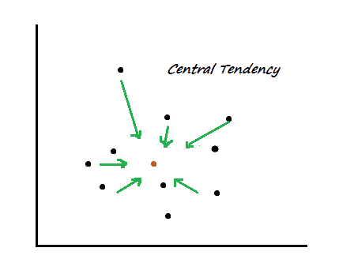
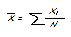
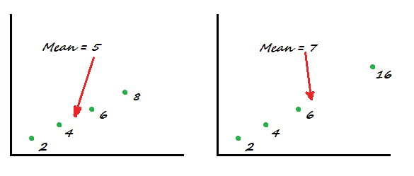
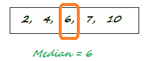
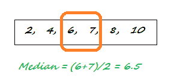
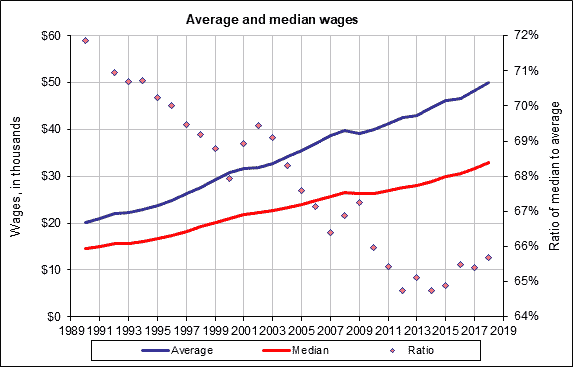

# 集中趋势的统计测量

> 原文：<https://towardsdatascience.com/statistical-measures-of-central-tendency-d8d4fbb70111?source=collection_archive---------22----------------------->

## 使用均值、中值和众数

照片由 [erika m](https://unsplash.com/@epsika?utm_source=medium&utm_medium=referral) 在 [Unsplash](https://unsplash.com?utm_source=medium&utm_medium=referral) 上拍摄

# 介绍

在统计学中，集中趋势的度量是代表数据点的一组“中间”值。集中趋势描述了集中在中心位置的数据分布，所有其他数据都围绕该中心位置聚集。与**分散**相反，它测量观察值相对于中心值分散到什么程度。

正如我们将在下面看到的，集中趋势是一个基本的统计概念，但却是一个广泛使用的概念。在集中趋势均值、中值和众数的度量中，最常被引用和使用。下面我们将了解为什么它们在数据科学和分析领域如此重要。

图:集中趋势的概念化测量

# **1。算术平均值**

Mean 是一些数据点的平均值。这是最简单的集中趋势测量方法，取观察值之和，然后除以观察值的数量。

在数学符号中，算术平均值表示为:

其中 *xi* 是单个观测值，而 *N* 是观测值的数量

在一个更实际的例子中，如果 3 个餐馆雇员的工资是每小时 12 美元、14 美元和 15 美元，那么平均工资是每小时 13.6 美元。就这么简单。

## 平均值的应用

*   我们在日常生活中做各种各样的平均。我们向朋友询问他们社区的平均房租；在搬到一个新的城市之前，我们计算每月的开支。我们每天都在各种情况下使用算术平均值。
*   企业使用方法来比较一月和二月之间产品的平均日销售额。
*   在数据科学中，平均值是探索性数据分析(EDA)中的一个基本指标，是各种高级建模的输入。Mean 在计算分类或回归算法中的 RMSE(均方根误差)、MAE(平均绝对误差)准确性度量时在幕后工作。

## 类型学

平均值有几个变体。这些不经常使用，但是在特殊的用例中是有用的工具。以下是一些例子:

**加权平均值**在普通平均值中，所有数据点都被平等对待，所有数据点都被分配了相等的权重(隐式)。在加权平均法中，根据目标，一些数据被赋予较高(或较低)的权重。

**几何平均**与普通平均不同，几何平均将 *N 个*值相乘，取乘积的 *N 次*根。因此，对于两个值 2 & 8，几何平均值将是 4。

**调和平均值**这是另一种平均值，通过取数据点的倒数，然后取它们的平均值，最后取结果的倒数来计算。

## 均值的局限性

尽管算术平均值是最广为人知的[集中趋势](https://en.wikipedia.org/wiki/Central_tendency)的度量，但它不是一个稳健的度量；它对异常值非常敏感。

让我们考虑以下两种情况。在左边，四个值的平均值正好在数据集的中间。然而，在右边，仅仅一个异常值数据(16)改变了“重心”,并使平均值进一步向右移动。为了克服算术平均值的这种局限性，我们有另一种集中趋势的度量方法——中位数。

图:异常值对数据集算术平均值的影响(插图:作者)

# **2。中位数**

列表[2，3，4]的中心是什么数字？答案当然是 3。这是中间值。如果同样的数字排序不同，比如说[2，4，3]呢？现在中位数是 4 吗？不，还是 3 点。所以中值是一个序列*中间的数字，在*之后，它们被排序(升序或降序)。

假设我们有一个由五个数字组成的列表[4，6，2，10，7]，我们想找出中间值。过程很简单:

1.  数据:[4，6，2，10，7]
2.  排序列表:[2，4，6，7，10]
3.  找出中间的数字:6(中位数)

但是如果列表中有偶数[4，7，6，2，10，8]呢？现在中间有两个值，所以在这种情况下，解决方案是取它们的平均值:

1.  数据:[4，7，6，2，10，8]
2.  排序列表:[2，4，6，7，8，10]
3.  在中心找到两个数字:[6，7]
4.  取平均值:6.5(中位数)

## 中间值的优点和缺点

为什么是中位数，用它来衡量集中趋势有什么好处？一个重要原因是，与均值不同，它对极端值不敏感。例如，在列表[2，3，4]中，最后一个值可能是 400，而不是 4，但是中值仍然是 3。

中位数的另一个好例子是数据的解释。中位数完美地将数据分成两半，因此，如果霍华德县的中位数收入是每年 100，000 美元，您可以简单地说，该县一半人口的收入高于 100，000 美元，而另一半人口的收入低于 100，000 美元。

但是，有一个明显的缺点。中位数使用数据点的位置，而不是它们的值。这样，一些有价值的信息就丢失了，我们不得不依靠其他类型的测量，如离差测量(下一节)来获得更多关于数据的信息。

## *用例*

中位数的一些应用是众所周知的。你是否注意到美国人口普查局将家庭收入报告为“家庭收入中位数”？还是劳工统计局把美国人的工资报告为“工资中位数”？这是因为通过调查或普查收集的大量数据高度分散，既有极小的值，也有极大的值。在这种情况下，中位数是比平均值更好的分布中心的度量。

图:美国的平均工资和中值工资。( [*来源:社保管理局*](https://www.ssa.gov/oact/cola/central.html)*；*访问时间:2020 年 7 月 19 日 *)*

# **3。模式**

在一系列数字中，比如说[2，3，4，4]，最常见的是 4；那就是**模式**。它也可以应用于文本数据，例如，集合{"John "、" Kelly "、" Nadia "、" John "、" Michael"}的模式是" John "，因为它在这个名称集合中出现了两次。

一个发行版可以有多个模式，如列表[2，2，3，4，4]所示；这叫做离散变量的双峰分布。按照这个逻辑，有两个以上模式的分销叫做**多模式**分销。

## *用例*

*   理解分布的模式很重要，因为频繁出现的值更有可能在随机样本中被选取。
*   在一个城市中最常出现的名字是什么？风尚有答案。理解模式有助于解决自然语言处理(NLP)领域的更多此类问题。
*   Mode 可以帮助连锁杂货店计算出在一周、一月或一年的不同日子里哪种产品卖得最多。

# 摘要

总之，**中心趋势**是统计学和数据科学中的一组重要概念，它衡量一些观察值如何围绕一个中心值定位。算术平均值**是数据点的简单平均值，**中值**是数据集中心的值，**模式**返回最频繁出现的值(数字或文本)。这些措施在数据科学中有大量的使用案例，从探索性数据分析到分类算法中的准确性度量，再到自然语言处理。**