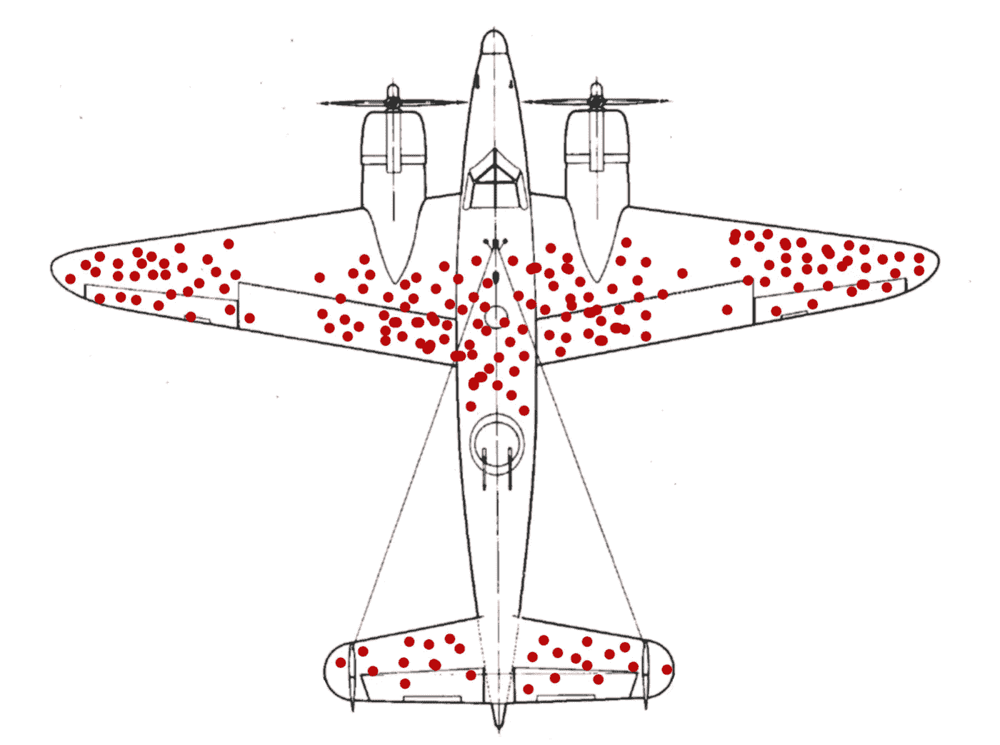

# 统计陷阱:选择偏差

> 原文：<https://towardsdatascience.com/statistical-pitfalls-selection-bias-18a05e3cf5a1?source=collection_archive---------34----------------------->

## [数据帧字节](https://towardsdatascience.com/tagged/DataFramed-bytes)

## 与[迈克·贝当古](https://betanalpha.github.io/)的对话，我们讨论了选择偏差的常见统计和数据陷阱。

*在每一集的* [*DataFramed、DataCamp 播客*](https://www.datacamp.com/community/podcast) *中，我都会邀请行业和学术界的嘉宾来观看与数据科学实践相关的短片。我收到了很多对这些片段的脚本的请求，所以已经开始在媒体上发布它们。*

*下面是来自“统计陷阱”部分的关于选择偏差的对话，我有幸与统计学家、物理学家、统计建模和高性能统计计算平台 Stan 的开发者*[*Mike betan court*](https://betanalpha.github.io/)*共同制作了这个对话。此对话出现在* [*本，DatFramed*](https://www.datacamp.com/community/podcast/data-science-past-present-and-future) *第一集，19:25:*

**HBA** :现在到了称为*统计陷阱*的环节。我现在和迈克尔·贝坦科特在一起，他是开源统计建模平台 Stan 的核心开发人员，他也在聚会上自称是曾经和未来的物理学家，伪装成统计学家。怎么了，迈克？

雨果，谢谢你邀请我。我在聚会上很有趣。

**HBA** :今天你在这里讲述一个常见的统计陷阱:*选择偏差*。

**MB** :确实。在我们收集数据的任何时候，选择偏差都可能存在。然而，在谈论普遍性之前，我想首先通过考虑一个最著名的选择偏差的例子来证明它是多么微妙，这个例子来自统计学家亚伯拉罕·瓦尔德对二战的一项分析。

盟军军方感兴趣的是如何最有效地利用他们有限的资源来补充从战斗任务中返回的受损飞机的装甲。返回的飞机会在特定的位置受到损坏
，普遍的想法是在他们观察到损坏的地方增加更多的保护。

然而，这种想法隐含地假设返回的飞机代表了全部受损飞机。然而，Wald 和他的团队认识到，返回的飞机实际上是一个有偏见的样本，因为他们没有包括那些从未从任务中返回的飞机。

一旦他们理解了数据中的这种选择偏差，他们推荐了看似违反直觉的策略，即在返回的轰炸机未受损坏的地方加强装甲。他们意识到，如果潜在的损伤均匀分布在每架飞机上，那么返回飞机上的损伤实际上证明了什么损伤是*可存活的*。另一方面，对未受损区域的损害可能是至关重要的，会阻止飞机返航。

返回飞机的受损部分显示了它们可能遭受损坏但仍能返回家园的位置；在其他地方被击中的人无法幸存。(图为假设数据。)图片来自[维基百科](https://en.wikipedia.org/wiki/Survivorship_bias)。

HBA :这是选择偏差的一个例子，对吗？

**MB** :对，正是。统计学中最常见的陷阱之一是误解手头的数据完全代表了正在研究的系统。如果这是真的，随着我们收集越来越多的数据，我们将能够推断出关于该系统的任意精确的见解。

不幸的是，在实践中，我们的测量永远不会像假设的那样完美，事实是，每当我们收集数据时，我们都会忽略一些数据。如果我们想在实践中确保准确的推断，那么我们必须考虑这些选择偏差是如何破坏我们的数据的。特别是，我们必须考虑我们的测量过程如何优先忽略具有某些属性的数据，同时保留其他属性。

如果我们不这样做，那么我们从非常大的数据集中得出的推论将总是受限于它们能告诉我们多少关于我们正在分析的系统的信息。

**HBA** :选择偏差会是一个多大的问题？你如何对抗它？

选择偏差的确切后果既取决于选择机制本身，也取决于我们在给定的应用中需要多精确的推理。例如，如果我们是一家公司，我们试图了解利基人口如何与我们的产品互动，那么即使很小的选择偏差也会严重扭曲我们的洞察力。

最终，量化这些影响的大小，并确定是否需要考虑选择偏差的唯一方法是建立一个完整测量过程的数学模型。幸运的是，有越来越多的工具来促进这种复杂的建模，特别是像 Stan 这样的概率编程语言。

HBA :迈克，感谢你对*选择偏差*常见统计陷阱的精彩描述。

雨果，谢谢你邀请我。

**链接:**

*   [约翰·d·库克论选择偏见、轰炸机和亚伯拉罕·瓦尔德](https://www.johndcook.com/blog/2008/01/21/selection-bias-and-bombers/)