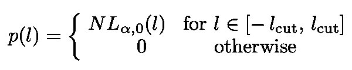

# 股票价格的统计特性

> 原文：<https://towardsdatascience.com/statistical-properties-of-stock-prices-15145be752a2?source=collection_archive---------13----------------------->

## 模拟股票市场的动态

图片由[皮克斯拜](https://pixabay.com/fr/?utm_source=link-attribution&utm_medium=referral&utm_campaign=image&utm_content=1443244)的 Gerd Altmann 提供

在本文中，我将分析股票价格的[统计特性。首先，我将证明，与大多数人的想法相反，收益的分布不是高斯分布。然后我将考虑 Lévy 分布，它有宽尾，因此在预测可能的崩溃和其他罕见事件时更有效。最后，将考虑相关性。同样，与从一开始相关性就为零的常识相反，真实的金融数据只有在某个时间间隔δt *(在此时间间隔之前，它是一个衰减的指数函数)之后才变得不相关。](https://books.google.com.br/books?id=SzgXWCS7Nr8C&printsec=frontcover&dq=econophysics+stanley+mantegna&hl=en&sa=X&ved=0ahUKEwjIj7e46KboAhVDA9QKHVDDALYQ6AEIKDAA#v=onepage&q=econophysics%20stanley%20mantegna&f=false)

# 股票价格的统计分析

股票价格的动态行为通常基于以下假设:

1.  交易的连续性意味着报价之间有一个非零的间隔
2.  价格演变为一个随机过程和基本面[随机变量](https://en.wikipedia.org/wiki/Random_variable)

等式 1:描述股票价格动态的随机过程中的随机变量。

它们都是独立同分布的(或 *i.i.d.* )，并且具有有限的均值 *μ* 和方差 *σ。*

3.ln *S* (t)的价格动态是一个[扩散过程](https://en.wikipedia.org/wiki/Diffusion_process)。扩散是某个物体从一个其浓度高于其他大多数地方的位置向外扩散的“T21”。

图 1:扩散过程的例子。当屏障被移除时，溶质扩散填充整个容器。

随机变量的增量被假定为高斯型。这个模型被称为[几何布朗运动](https://en.wikipedia.org/wiki/Geometric_Brownian_motion) (GBM)。一个 GBM 是以下[随机微分方程](https://en.wikipedia.org/wiki/Stochastic_differential_equation) (SDE)的解:

方程 2:描述 GBM 的 SDE。

其中 W(t)是[维纳过程或布朗运动](https://en.wikipedia.org/wiki/Wiener_process)其中 *μ* 称为漂移 *σ* 是波动率。解决方案是:

方程 3:方程的解。2.

图 2:图中显示了漂移μ变化时的几个 GBM 示例。

标准差 *σ* ( *t* )的指数接近 0.5，这意味着价格变化是独立的。

现在作为等式的结果。1，有限区间内的总报价数发散。因此，由[中心极限定理](https://en.wikipedia.org/wiki/Central_limit_theorem)，

具有高斯分布。

图 3:CLT 的图示。通过对新的随机变量求和的“平滑化”，原来的密度分布收敛到一个高斯分布([来源](https://en.wikipedia.org/wiki/Central_limit_theorem))。

假设 1 显然是理想化的。我们应该建立一个 *S* ( *t* )和一个离散时间随机过程的模型，在这个过程中，报价有时会出现

其中δt 是一个有限区间。物理学家已经非常详细地研究了这些离散过程的性质。

## 股票收益

物理研究通常关注价格增量，而不是价格本身。如果δS(*n*)<<S(*n*)，δt 很短，价格变化很慢(例如，在没有崩盘的情况下)，可以做如下近似:

等式 4:随机变量的选择。

比较几何布朗运动的蒙特卡罗模拟；

图 4:布朗运动的蒙特卡罗模拟例子。

通过模拟布朗运动:

使用年度漂移 *μ* =10%，年度波动 *σ* =20%和相同的一组正态分布随机数 *X* ( *n* )我们获得了图 X(来自 W. Paul 和 J Baschnagel ),显示了非常可靠的一致性。

图 5:对于每日现货价格 S(t ),几何布朗运动(实线)和布朗运动(虚线)的蒙特卡罗模拟之间的比较。两者的漂移、波动性和选择的高斯随机数集是相同的([源](https://books.google.com.br/books?id=SzgXWCS7Nr8C&printsec=frontcover&dq=econophysics+stanley+mantegna&hl=en&sa=X&ved=0ahUKEwjIj7e46KboAhVDA9QKHVDDALYQ6AEIKDAA#v=onepage&q=econophysics%20stanley%20mantegna&f=false))。

因此，可以对股票价格使用加法(而不是乘法)模型:

等式 5:回报的加性模型。

在加法模型中，价格增量相加，与乘法模型相反，在乘法模型中，连续的价格比率相乘。

## 数学插曲

莱维分布

等式 6:李维分布。

是由法国数学家[p . le vy](https://en.wikipedia.org/wiki/Paul_L%C3%A9vy_(mathematician))和苏联数学家 [A.Khintchine](https://en.wikipedia.org/wiki/Aleksandr_Khinchin) 引入的非负随机变量的概率分布。Lévy 分布考虑了[尖峰值](https://en.wikipedia.org/wiki/Kurtosis#Leptokurtic)(正的过度 cu 尖峰值)。

图 6:高斯分布和李维分布的比较。

Lévy 分布是一种[稳定分布](https://en.wikipedia.org/wiki/Stable_distribution)，其[意味着](https://en.wikipedia.org/wiki/Stable_distribution)拥有这种分布的独立随机变量的线性组合将具有相同的分布(取决于位置和比例参数)。因此，它们具有缩放属性:

等式 7:稳定分布具有标度特性。

图 7:自相似过程的例子。

然而，李维分布具有发散的标准偏差。此外，他们的最大值更大和更窄，我们知道这不会发生在真实的金融序列。

图 8:雪佛龙股票每日价格差异的对数和高斯分布之间的比较。尾巴更肥，最大值更大更窄([来源](https://books.google.com.br/books?id=SzgXWCS7Nr8C&printsec=frontcover&dq=econophysics+stanley+mantegna&hl=en&sa=X&ved=0ahUKEwjIj7e46KboAhVDA9QKHVDDALYQ6AEIKDAA#v=onepage&q=econophysics%20stanley%20mantegna&f=false))。

这可以通过[使用截断参数截断尾部](https://projecteuclid.org/download/pdf_1/euclid.lnms/1215091135)来解决。截断征税飞行的一个例子是:

等式 8:截断的李维分布。

其中 *N* 是 *a* 归一化常数。

图 9:法国数学家 p . le vy([来源](https://en.wikipedia.org/wiki/Paul_L%C3%A9vy_(mathematician)))和苏联数学家 A.Khintchine ( [来源](https://www.geni.com/people/%D0%90%D0%BB%D0%B5%D0%BA%D1%81%D0%B0%D0%BD%D0%B4%D1%80-%D0%AF-%D0%A5%D0%B8%D0%BD%D1%87%D0%B8%D0%BD/6000000000321027282))

伯努瓦·曼德尔布罗是第一个注意到资产价格比高斯分布预测的更频繁地遭受巨大波动的人之一(它们更像是尖峰厚尾)。

在一篇著名的论文中，H. E. Stanley 和 R.N. Mantegna 使用了一组 1984-1989 年期间的 P500 数据来确定

等式 9:股票变动的定义 l。

图 10:美国物理学家 H. E. Stanley ( [来源](https://www.bu.edu/eng/profile/h-eugene-stanley/))和意大利物理学家 R.N. Mantegna ( [来源](https://www.ceu.edu/article/2013-11-12/exploring-criminal-patterns))。

使用间隔δt = 1，…，10 分钟。他们的结果如下图所示。

图 11:S&P500 的价格变化 *l* 相对于δt = 1 分钟的 l/ *σ* 的概率分布。高斯曲线(窄曲线)与勒维分布的最佳拟合进行比较。后者在 l/σ ≤ 6 时要好得多，但在 l/σ ≥ 6 时呈指数下降([来源](https://books.google.com.br/books?id=SzgXWCS7Nr8C&printsec=frontcover&dq=econophysics+stanley+mantegna&hl=en&sa=X&ved=0ahUKEwjIj7e46KboAhVDA9QKHVDDALYQ6AEIKDAA#v=onepage&q=econophysics%20stanley%20mantegna&f=false))。

下列 Lévy 分布非常符合 l/σ ≤ 6 的数据:

等式 10:l/σ≤6 时，Lévy 分布与数据非常吻合。之后，衰减是指数级的。

这个李维分布有两个主要的重要性质:

*   它们的稳定性(自相似性)
*   它们是概率空间中的吸引子

图 12:收敛到独立同分布稳定吸引子的过程示意图([来源](https://books.google.com.br/books?id=SzgXWCS7Nr8C&printsec=frontcover&dq=econophysics+stanley+mantegna&hl=en&sa=X&ved=0ahUKEwjIj7e46KboAhVDA9QKHVDDALYQ6AEIKDAA#v=onepage&q=econophysics%20stanley%20mantegna&f=false))。

在截断生效之前，截断的 Lévy 分布在很长一段时间内保持自相似。

# 相关

几何布朗运动假设δS 的相关性为零。为了测试这个假设，我们使用下面的[相关函数](https://en.wikipedia.org/wiki/Correlation_and_dependence#Correlation_matrices):

等式 11:价格-价格相关性。

相关函数可以具有区间[-1，1]内的值，但是有三种情况特别相关，即:

如果服从 1 和 2，我们会:

等式 12:高斯过程的价格-价格相关性。

取而代之的是。10 成为从 1 到 0 的指数衰减(在大约δt *≈15 分钟处),在小时间具有强相关性:

等式 13:价格-价格相关函数衰减的指数逼近。

然后，我们得出δt * > 15 分钟的价格分布的候选值。在δt *之后，once 可以认为价格变化是*I . I . d .*。分布由下式给出:

等式 14:当δS 已经是独立同分布时，δt * > 15 分钟后价格变化的概率分布..

N*因子卷积的累积分布为:

等式 15:等式 15 卷积的累积概率分布。14

图 13:S&P500 与真实数据的累积概率分布。

我们注意到一些事情:

*   分布方程。14 可以很好地用截断的 Lévy 分布来描述，其中 *α* = 3/2(拟合了 c 和λ)
*   卷积很好地逼近了 T > >δT *处的概率，但是随着 *T* 的增加，卷积的形状收敛为高斯型
*   随着 T 的增加，真实的财务数据穿过累积分布(在开始处下方，在尾部处上方)
*   根据所分析的市场，向高斯分布的收敛需要几天到几周的时间

在 Stanley 和 Mantegna 之后，我将快速分析 DJIA(道琼斯工业平均指数)的动态。他们找到了 DJIA 30 只股票的最大和最小相关系数。最大值是 0.73，位于可口可乐和宝洁之间，如下图所示。

图 14:可口可乐和宝洁公司 ln S(t)的时间演变。

他们还测量了强相关性保持强的特征时间尺度。他们发现，从 1990 年到 1994 年，相关性从 0.73 到 0.51 不等，这表明股票是强同步的。

我的 [Github](https://github.com/marcotav) 和个人网站 [www.marcotavora.me](https://marcotavora.me/) 有一些关于金融和其他主题的有趣材料，如物理、机器学习、深度学习和数学。看看吧！