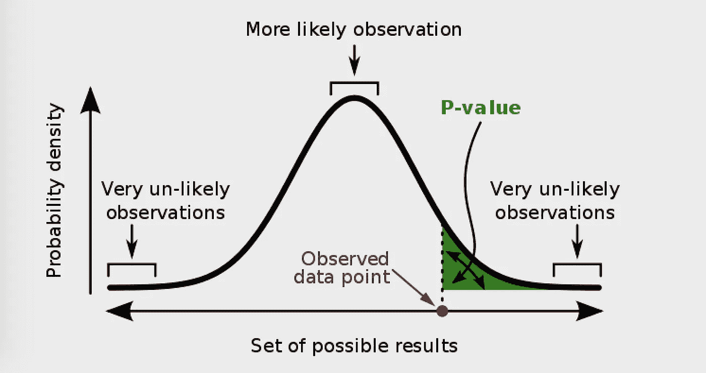
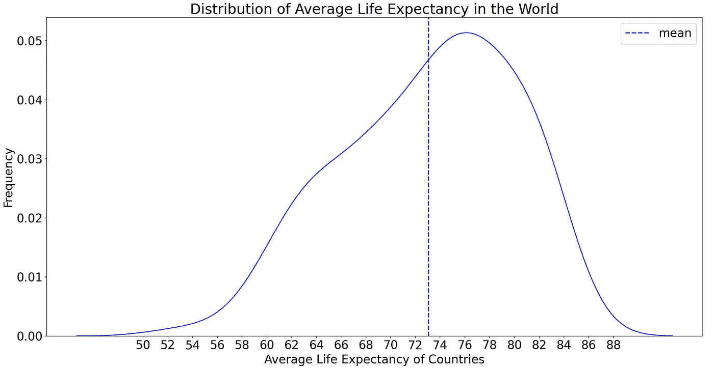
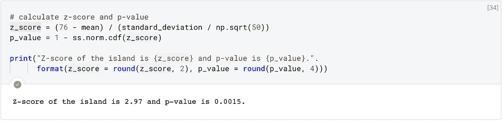
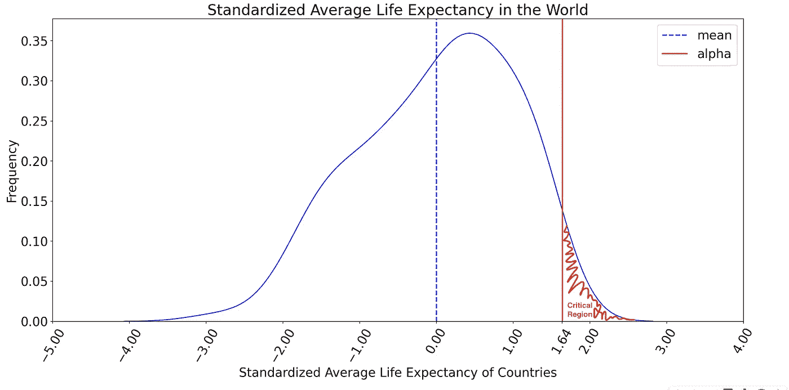
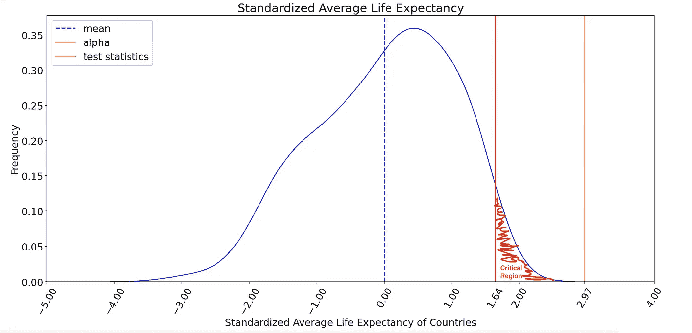
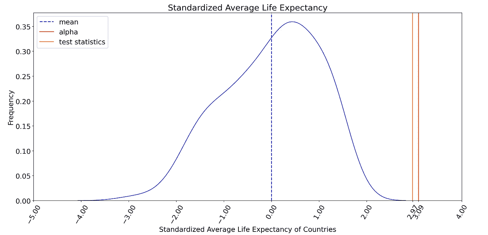

# 行动中的统计意义

> 原文：<https://towardsdatascience.com/statistical-significance-in-action-84a4f47b51ba?source=collection_archive---------20----------------------->

## [数据科学](https://towardsdatascience.com/data-science/home)

## 以及实际应用中的例子

图片来源:[维基百科](https://en.wikipedia.org/wiki/P-value)

《行动博客》前情提要:我们研究了中心极限定理，以便更好地理解正态分布背后的基本定理。如果你还没有阅读，我鼓励你去阅读！

 [## 中心极限定理的应用

### 以及实际应用中的例子

towardsdatascience.com](/central-limit-theorem-in-action-1d4832599b7f) 

今天，我们将观察另一个重要的统计学概念并进行假设检验。我将不仅用一个具体的、吸引人的例子，而且用简单的术语来解释**的统计显著性**。我将使用我用来解释中心极限定理的同一数据集——截至 2018 年 186 个国家的预期寿命。

## **让我们再来看看中央极限定理中最重要的情节和计算:**

世界平均预期寿命的平均值( )为 73，标准差(σ)为 7，几乎呈正态分布。使用中心极限定理，**通过将总体标准偏差除以样本大小的平方根，计算出标准误差**为 0.57。

想象一下，一个流浪者统计学家发现了一个只有 50 人居住的岛屿。所有居民都非常健康，年龄超过 73 岁。她做了一个小调查，了解到岛上的平均寿命是 76 岁。此外，她发现岛上的每个人都在进行间歇性禁食。考虑到平均寿命为 73 岁，这是一个耐人寻味的案例！

现在，我们好奇的统计学家想知道*间歇性禁食是否是抛开所有其他可能的决定因素，活得更长寿、更健康的途径。因此，她决定进行一项[实验研究](https://en.wikipedia.org/wiki/Experiment)，在这里她寻找这个问题的答案:*

> 间歇性禁食会增加人类寿命吗？

为了理解流浪者统计学家的研究及其结果的意义，我们需要理解以下术语:

1.  无效假设和替代假设
2.  标准正态分布和 Z 得分
3.  p 值
4.  显著性水平

不要被他们吓倒，我会遵守我的简单承诺。😉

## 1.无效假设和替代假设

**假设**是关于变量之间关系的陈述。**假设检验**是一种检验假设、观察、主张或实验结果的方法，用来检验你的结果是否具有统计学意义。假设检验是围绕两个对立的主张构建的:零假设和替代假设。

**零假设**要么描述*总体/样本的当前状态*，要么声明样本和总体参数之间*没有差异*。**替代假设**，与零假设相反，要么描述*人口/样本的未来或期望状态*，要么声明在样本和人口参数之间存在*差异*。

我们的统计学家为她的研究设定了如下无效假设和替代假设:

*   零假设:间歇性禁食不会增加平均寿命。( ≤ 73)
*   另一种假设:间歇性禁食会增加平均寿命。(> 73)

她的目标是观察间歇性禁食是否会导致增加(从 73 到 76。)的人类平均寿命，这使得假设检验**成为单尾定向检验**。

## 2.标准正态分布和 Z 得分

许多定理假设总体或样本服从正态分布。正态分布的广泛使用源于根据标准偏差评估数据点的简易性。让我们记住正态分布的重要性质:

*   这是一个连续的对称分布。
*   68%的数据位于 1 以内，95%的数据位于 2 以内，99.7%的数据位于平均值的 3 个标准偏差以内。

**标准正态分布**是均值为 0，标准差为 1 的特殊正态分布。任何正态分布都可以通过从每个数据点减去平均值并除以标准偏差来转换为标准正态分布。这个过程叫做**标准化**。

具有累积概率和 z 分数的标准正态分布。图片来源:[维基百科](https://en.wikipedia.org/wiki/Standard_score)

**Z 值**是标准化过程中应用于数据点的计算结果。在上面的标准正态分布中，z 得分位于 x 轴上(z 得分为正值表示该值高于平均值，z 得分为负值表示该值低于平均值)，而累积概率值位于累积百分比栏上且位于分布下方。

z 分数计算。图像来源: [Z 工作台](http://www.z-table.com/)

**Z 值**根据数据点到平均值的距离来定义数据点的位置，平均值由标准差来衡量。例如，通过查看上面的 z 得分和累积百分比:

*   随机变量小于等于 1 的概率为 84.1% (P(x ≤ 1) = 0.841)。
*   随机变量大于或等于 2 的概率为 2.3% (P(x ≥ 2) = 0.023)

我们可以从 z 得分计算概率值，缩写为 **p 值**，反之亦然。

## 3.p 值

**P 值**是在假设零假设正确的情况下，获得至少与测试期间实际观察到的结果一样极端的测试结果的概率。【来源:[维基百科](https://en.wikipedia.org/wiki/P-value)】。我用更简单的话来说:

> 在零假设为真的情况下，p 值表示获得至少与实际结果一样极端的测试结果所涉及的随机机会或噪声的百分比。

让我们在我们的上下文中进一步分析 p 值:

*   法国是一个均值为(x̄) 83 的样本，来自一个均值为( *)* 73、标准差为(σ *)* 7 的正态分布。
*   当我们计算 z 分数(83–73)÷7 时，它是 1.42。这使得法国比平均水平高出 1.42 分。
*   我们的世界，因此零假设是:“*法国的平均预期寿命比全球平均水平高 1.42 点*”

比方说，我们从法国抽取了一个样本，发现平均预期寿命实际上比全球平均水平低 1 个百分点，p 值为 0.16。这意味着，在一个零假设为真的世界里，我们有 16%的随机机会测量出法国的平均预期寿命至少比全球平均水平低 1 点。

换句话说，如果法国的平均预期寿命实际上比全球平均水平高 1.42 点，我们仍然会测量出它至少低 1 点，大约 1/6 的时间是因为噪音。因此，p 值越低，结果越显著，因为它不太可能是由随机机会或噪声引起的。

p 值可以用 z 表或 R 或 Python 中的库来计算。我们好奇的统计学家将从[Python 的 scipy stats 包和来自同一个库](https://docs.scipy.org/doc/scipy/reference/generated/scipy.stats.norm.html)的 norm 对象中获得一些帮助来表示标准的正态分布。此外，为了计算 p 值，她将使用 norm 对象的累积密度函数(cdf)方法。对于给定的 z 得分，该方法将产生与上述标准正态分布中的累积百分比相同的概率值。

为了完成她的实验研究，剩下的唯一缺失部分是**显著性水平——用α表示。**

## 4.显著性水平

**显著性水平(α)** 是阈值 p 值，用于决定测试结果是否**具有统计显著性**。它也代表了在我们的测试/研究中我们可以容忍多少随机性。显著性水平通常设置为 0.05、0.01 或 0.001。

如果测试结果的 p 值小于显著性水平(α)，那么我们可以断定*所获得的测试结果在统计上是显著的，并且它们不是由于随机机会或噪声*。

在开始实验之前设置显著性水平是很重要的。否则就不是客观测试了。我们好奇的统计学家也知道这一点，并将显著性水平设为 0.05。最后，她要完成研究，观察行动中的统计意义！

## 我们的漫游者统计员迄今为止执行的步骤:

1.  她决定进行一项实验研究来回答这个问题:

*   间歇性禁食会增加人类寿命吗？

2.她确定了无效的替代假设:

*   零假设:间歇性禁食不会增加平均寿命。( ≤ 73)
*   替代假设:间歇性禁食增加平均寿命。(> 73)

3.她设置了测试统计并计算了 p 值:

*   50 名健康老年人的发现只是世界平均寿命分布的又一个样本。因此，她将**测试统计数据**确定为岛上每个人都进行间歇性禁食的平均预期寿命，并将 p 值计算为:

4.她确定显著性水平为 0.05:

*   α右侧的区域称为**临界区域。**表示 p 值小于显著性水平的区域。如果测试统计值落在这个区域内，她将得出结论，测试结果具有统计学意义。(对于单尾定向测试，p 值为 0.05 的 Z 得分为 1.64)

**当她把所有的碎片放在一起，揭示一个更健康更长寿的生活之路:**

测试统计落入临界区域，这意味着**测试结果具有统计学意义，她拒绝零假设！**

> 有统计学意义的证据表明，间歇性禁食增加了平均预期寿命，显著性水平为 0.05。获得的测试结果不是随机的。

在平均预期寿命为 73 岁的世界中，由于随机噪声，获得 50 个样本均值为 76 的概率(p 值)为 0.0015，小于 0.05。

测试结果在统计学上是否被称为**显著取决于显著性水平。当 p 值设置为 0.001 时，测试统计数据将不再落入临界区域。(对于单尾定向测试，p 值为 0.001 的 Z 得分为 3.09)**

在这种情况下，我们会得出结论，测试结果没有统计学意义，并接受零假设。(*间歇性禁食不会增加平均寿命*)

## 统计显著性的实际应用

我们好奇的统计学家的测试被称为 **z 测试。**如果我们的样本量少于 30，或者有两个样本进行比较，那么这将是一个 **t 检验**。如果我们比较了两个或更多样本，这将是一个 **ANOVA(方差分析)测试**。

从社会科学到物理学，几乎每个学科都使用假设检验和统计显著性。我们可以使用它们来比较机器学习环境中不同模型的性能。我们可以自信地进行假设检验，并使用统计显著性确定哪一个表现更好。**这里有一篇我喜欢的关于统计学意义在机器学习中的使用的文章:**

 [## 比较哪种机器学习模型性能更好

### 自信地比较机器学习模型

towardsdatascience.com](/compare-which-machine-learning-model-performs-better-4912b2ed597d) 

感谢阅读！如果你想更深入地了解统计意义的“作用”，你可以看看这个 [Deepnote 笔记本](https://beta.deepnote.com/project/0e38bb73-5710-402a-814b-69ca659d301d)。我这个吸引人的例子来源于 [Gapminder 的公开数据](https://open-numbers.github.io/)，可以在[这里](https://github.com/open-numbers/ddf--gapminder--systema_globalis)找到。

对于评论或建设性的反馈，您可以通过回复、 [Twitter](https://twitter.com/cereniyim) 或 [Linkedin](https://www.linkedin.com/in/ceren-iyim) 联系我！保持安全和健康👋