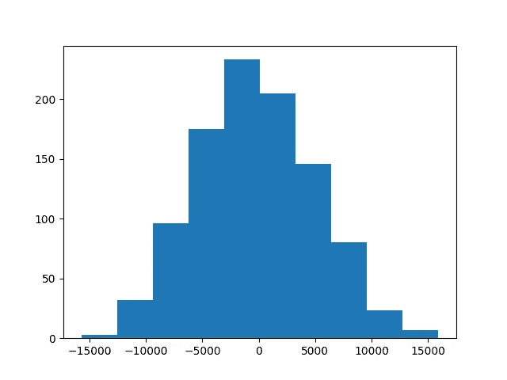

# 借助 Python 的统计意义

> 原文：<https://towardsdatascience.com/statistical-significance-with-the-help-of-python-1fbb318ce216?source=collection_archive---------9----------------------->

奥占·阿克多安在 [Unsplash](https://unsplash.com/collections/1671222/coding?utm_source=unsplash&utm_medium=referral&utm_content=creditCopyText) 上的照片

## 使用 Python 检查一个结果是否纯粹是由于偶然。

“使用广告为我们的产品创造更多收入”。"减肥药比服用安慰剂的人减轻了更多的体重.""电池' A '的寿命是其竞争对手的十倍."这些类型的语句经常出现。当查看数据时，很容易做出一个快速的假设，即某个变量导致了某个结果。对这些结论过于草率会导致很多问题。在数据科学中，能够确定一个结果是否是由于偶然可以帮助选择一个模型以及检查[采样误差](https://en.wikipedia.org/wiki/Sampling_error)的方法。

确定统计显著性是建立一个结果不完全是由于偶然的信心的方法之一。我们来看看什么统计显著性是如何用 *p 值*来确定的。

这个例子将使用 Python 来展示如何在你的 code/ jupyter 笔记本中表示统计意义。建议您了解一些 Python 基础知识。我们还将使用以下 Python 库 [NumPy](https://numpy.org/) 、 [Matplotlib](https://matplotlib.org/) 和 [Pandas](https://pandas.pydata.org/) 。如果你对它们都不熟悉，我建议你使用提供的链接。

# 数据

我们将查看来自 kaggle.com 的"[电子商务愿望中的夏装销售](https://www.kaggle.com/jmmvutu/summer-products-and-sales-in-ecommerce-wish)"数据集。如果你不熟悉[Wish.com](http://wish.com/)，它是一个在线电子商务平台。这些数据是在 2020 年 8 月通过抓取网站上所有列在“夏季”类别下的项目收集的。您可以通过单击上面的链接，了解有关数据获取方式以及每一列/变量的更多信息。数据集显示，公司有个人资料图片的项目比公司没有个人资料图片的项目具有更大的总销售额(以欧元计)。我们将尝试确定这一结果是否有统计学意义。

# 关键概念

1.  通过确定零假设和替代假设进行假设检验
2.  p 值和 p 值阈值
3.  检验统计量
4.  排列测试
5.  使用 p 值来确认或拒绝零假设

# 假设检验

为了建立统计显著性，我们必须提出一个*零假设*和一个*替代假设*。零假设是指变量对我们的最终结果没有影响。另一个假设是变量对最终结果有影响。

对于这个例子，我们的无效和替代假设将是:

*   **零假设**:平均而言，当一家公司有简介照片时，一件商品的总销售额(以欧元计)与一家公司没有简介照片时的总销售额(以欧元计)相同**。**
*   **另一种假设**:平均来说，如果一家公司有个人资料图片，一件商品的总销售额(欧元)会比没有个人资料图片的商品的总销售额(欧元)高**。**

# **P 值阈值**

**p 值将在后面进行深入解释，但我们现在将简要介绍一下。在开始测试之前，确定我们的 p 值阈值总是很重要的。在确定零假设是否为真时，p 值是我们量化结果稀有程度的一种方法。***p 值越低，结果就越不像是纯粹由于偶然。*****

***p 值阈值*是我们将选择的一个数字，如果超过这个数字，我们就可以断定我们的零假设为真。我们选择多高或多低，我们希望这是基于我们的测试。如果我们要测试某个需要非常精确的东西的统计显著性，我们可能会选择一个非常低的阈值，比如 0.001。对于不需要太多精确度的测试，比如销售额或网站参与度，我们会更高。标准阈值是 0.05，即 5 %。由于我们着眼于销售，我们将采用标准门槛。如果我们的 p 值低于 0.05，我们将拒绝零假设。**

# **准备我们的数据**

**一旦我们从 Kaggle 下载了数据集，我们就可以使用 pandas 将它读入数据帧。**

**我们感兴趣的有 3 列“价格”、“单位 _ 售出”和“商家 _ 个人资料 _ 图片”。在继续之前，我们将采取以下步骤。**

1.  **除了上面提到的三列之外，我们将删除所有其他列。**
2.  **检查是否有任何丢失的值。**
3.  **使用 df.describe()来确定是否有任何值看起来不准确并且可能给出意外的结果。**
4.  **删除或更正我们认为可能包含不正确信息的任何行**
5.  **通过将“price”列乘以“units_sold”列，计算每件商品产生的欧元总额。**

**下面是用于获取上述集合的 python 代码。**

*** ***使用多行注释语法来表示输出******

**准备好数据集后，让我们将数据集分成两组。一个将包含公司有个人资料图片的项目(**a 组**)，另一个将包含公司没有个人资料图片的项目(**b 组**)。**

**一旦分成两组，我们将找到每组总销售额的平均值。我们还将查看每个组中有多少行，因为这将有助于我们稍后确定如何构建我们的随机组。**

# **检验统计量**

**现在我们有了两组总销售额的平均值，我们可以用它来确定我们的*测试统计*。检验统计量是一个数值，我们将使用它来确定两组之间的差异是否是随机的。在这种情况下，测试统计将是使用个人资料图片和不使用个人资料图片的总销售额的平均差异。我们的测试统计大约是 33，184 欧元。**

# ****排列测试****

**我们现在的目标是多次重新创建我们的两组，以查看我们的测试统计偶然发生的可能性。一个*排列测试*是我们将如何完成这个目标。**

**我们将在 Python 中采取以下步骤:**

1.  **创建一个空列表来保存 1000 个平均差异。这将是我们生成的采样分布。**
2.  **初始化“总销售额”的一个[系列](https://pandas.pydata.org/pandas-docs/stable/reference/api/pandas.Series.html)。**
3.  **做一个将迭代 1000 次的 for 循环。**
4.  **对于 For 循环的每次迭代，我们将把每次总销售额随机放入“a”组或“b”组。为了重新创建这两个组中的大小差异，我们将给出 14.4%的机会将值归入“a”组，85.6%的机会将值归入“b”组。这个百分比是基于我们之前确定的行数。**
5.  **一旦我们的随机组“a”和随机组“b”形成，我们将找到每组的平均值。**
6.  **然后，我们将从随机组“a”中减去随机组“b”的平均值，并将其添加到步骤 1 中初始化的列表中。**
7.  **最后，我们将创建一个直方图来可视化这个采样分布的频率。**

****

**随机化平均差异的直方图**

**从直方图中，我们可以看到均值中最常见的差异大约为 0。这与我们的测试统计非常不同。事实上，甚至没有显示测试统计值。p 值将为我们提供一种方法来量化均值差异的随机样本分布中检验统计值的次数。**

# **p 值**

**在我们生成的抽样分布中，大部分值都以平均差 0 为中心。如果纯粹是偶然的话，这两个组更有可能产生相同的总销售额(零假设)。但是，由于观察到的测试统计量不接近 0，因此有可能是拥有一张剖面图导致了数据集中的平均差异。**

**让我们看看抽样分布，以确定 33，184 或更高的值出现的次数。然后我们可以将频率除以 1000。这将给我们 33，184 或更高的平均差异纯粹是由于随机机会的概率。**

**这个概率被称为 *p 值*。如果该值很高，这意味着测试统计很可能是随机发生的，并且配置文件图片可能不起作用。另一方面，低 p 值意味着我们观察到的平均差异是由随机机会引起的概率很小。**

**让我们创建一个 for 循环，它将检查我们的测试统计在我们随机生成的均值差异组中出现了多少次。然后我们将得到这个计数，并除以我们的总迭代次数(1000)。我们的输出将是 p 值。**

# **结果**

**之前我们决定 p 值阈值为 0.05。0 小于 0.05，这意味着我们可以排除我们的测试统计是随机的结果。我们现在可以拒绝我们的零假设，并确认我们的替代假设。**

# **最后的想法**

**统计显著性是检查数据和确定变量是否对最终结果有影响的一种很好的方法。在这个例子中，我们在 Python 的帮助下采取了一些步骤来确定拥有一张个人资料图片对一个商品的总销售额结果的统计意义。**

**虽然我们能够在 p 值的帮助下量化这种显著性，但我们仍然应该回过头来看看数据集。在做出任何重要结论之前，有几个问题需要解决。**

1.  **我们来自 Wish.com 的样本数据集非常有限。它只包含夏季服装项目。最好能获得更多的数据，涵盖更长的时间段和更多种类的项目**
2.  **售出物品数量不准确。在网站上，出售的项目计数列在范围，即 1000+，2500+等。收集数据时，加号肯定已经被删除了。最好能得到实际的数字。**
3.  **虽然我们很快找到了异常值，但我们没有彻底检查这些项目，以确定是否有任何其他原因导致了简介图片组中的总销售额较高。可能还有一些我们没有考虑到的其他关联。**

**虽然可能需要更多的信息来决定是否有一个个人资料图片会导致更多的销售，但我们已经通过确定 p 值在正确的方向上迈出了一步。我们可以说，根据这个测试，拥有一张个人资料照片对 Wish.com 上一件商品的总销售额有着统计上的显著影响。**

**统计显著性是数据科学中的一个有用工具，当您需要知道一个结果是显著的还是偶然发生的时，应该理解并使用它来帮助做出决策。**