# 带代码的 R 中的统计模拟—第一部分

> 原文：<https://towardsdatascience.com/statistical-simulation-in-r-part-1-d9cb4dc393c9?source=collection_archive---------13----------------------->

## 破解数据科学面试

## Ace 数据科学访谈


[https://www.flickr.com/photos/86689809@N00/157763181/](https://www.flickr.com/photos/86689809@N00/157763181/)

*这是关于统计模拟的两篇文章的第一部分。如果您还没有看过第 2 部分，请点击这里:*

[](/statistical-simulation-in-python-part-2-91f71f474f77) [## Python 中的统计模拟，第 2 部分

### 任何数据科学面试最重要的部分！

towardsdatascience.com](/statistical-simulation-in-python-part-2-91f71f474f77) 

# 介绍

在过去的几个月里，我收到了一些顶级科技公司的数据科学面试。几乎所有的面试官都要求我对一个真实的商业场景进行统计模拟，但我没能给他们留下深刻印象。

你知道，这些都是合理的问题，如果我以前接触过这个话题，并不难回答。

直到今天，我已经花了数百个小时学习模拟，准备接下来的技术面试。

统计模拟是一个相当广泛的领域，不可能在一篇文章中涵盖所有细节。作为一个初学者，我计划通过一系列的帖子来展示模拟的细微差别和应用。

# 定义

现实世界中，事情是随机发生的，有无限多种可能。我们可能只能观察到一部分，而不是全部的可能性。

**模拟**派上了用场，并提供了与现实世界结果相匹配的可能性分布的快速概览。通过研究模拟结果，我们可以洞察真实世界。


照片由[照片爱好](https://unsplash.com/@photoshobby?utm_source=unsplash&utm_medium=referral&utm_content=creditCopyText)在 [Unsplash](https://unsplash.com/s/photos/cyber-punk?utm_source=unsplash&utm_medium=referral&utm_content=creditCopyText) 上拍摄

# **生成随机数**

让我们从最简单的代码开始，然后进入更复杂的场景。

命令 ***runif(x，min=a，max=b)*** 在 a 和 b 之间的范围内生成 x 个值。

```
library(dplyr)set.seed(2)
runif(25,min=0,max=10)
```

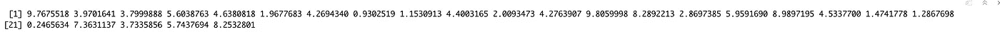

随机值

***set.seed()*** 函数为 R 的随机数生成器设置一个种子，这样我们每次运行代码时都会得到一致的相同值。否则，我们会得到不同的结果。自己试试。

为了得到整数，我们使用 ***圆整*** 函数，如下:

```
runif(25,min=0,max=10) %>% 
  round(.,digits = 0)
```

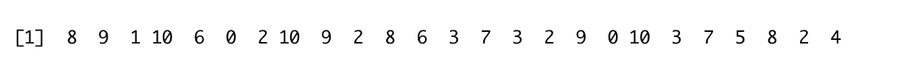

围捕它

这里的管道， ***% > %*** ，来自***magritter***包，可以让你写出更干净易懂的代码。它可以用简单的英语翻译成‘那么’

在英语中，上面两行代码的意思是:

1.  生成 25 个介于 0 和 10 之间的数字
2.  ***然后*** ( ***% > %*** )，将数字向上舍入到最接近的整数。

试试如果你把数字调整为 1 会发生什么。

生成随机数的另一种方式是通过的 ***样本*** 函数生成*:*

```
> sample(x, size, replace=TRUE, prob=NULL)
```

*   x:一个向量或正整数
*   size:一个非负整数，给出可供选择的项目数
*   替换:有替换的样本，还是没有？
*   prob:概率权重向量，用于获取被采样向量的元素

(更多信息请参考 R 文档，[链接](https://www.rdocumentation.org/packages/base/versions/3.6.2/topics/sample))

一个简单的例子。

```
set.seed(24)
sample(seq(1,10),8)
```

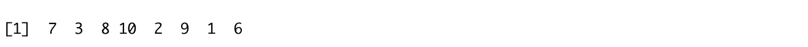

***set.seed()*** 函数使结果可重现。

上面的代码从序列[1，10]中生成 8 个数字的随机样本。正如你所看到的，我们没有为替换和选择的概率设定规则。

默认情况下，R 将替换设置为 FALSE，并采用相等的选择概率。

```
x = 1:10
sample(x,replace=TRUE)
```

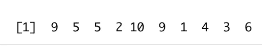

替换重采样的过程被称为 ***引导*** ，这是一个更高级的主题，将在下一章讨论。

除了数字，我们还可以对单词进行采样，如下所示:

```
set.seed(1)
sample(letters,18)
```

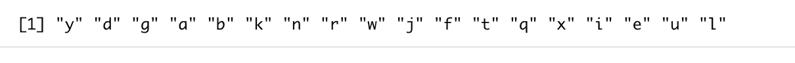

# 相等和不相等的选择概率

## **#场景 1 等概率**

我们以相等的概率从序列[1，5]中生成大小为 10 的随机样本。

```
equal_prob_dist = sample(5,10000,***prob=rep(0.1,5)***,replace=T)
hist(equal_prob_dist)
```

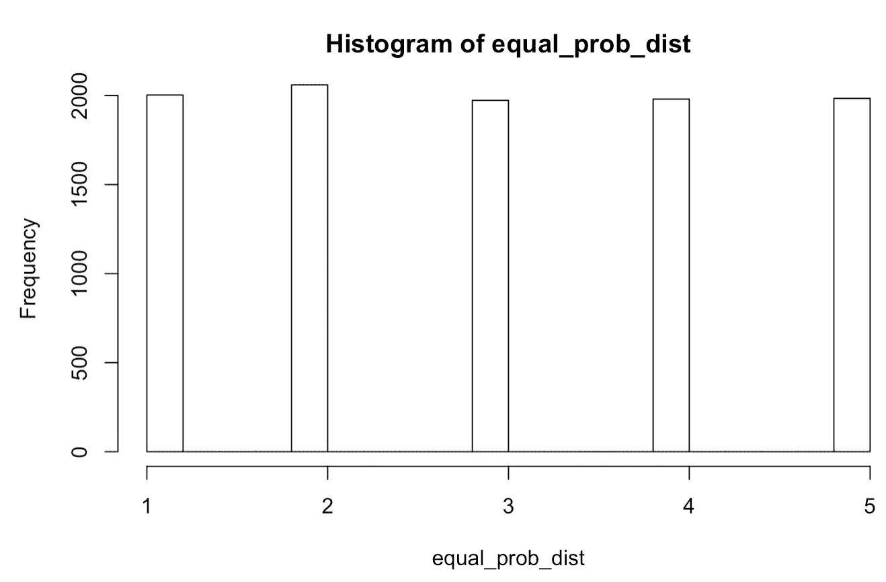

同等概率

如果我们设置 ***prob=rep(0.1，5)* ，**，那么数字 1 到 5 将被平均采样，如上面的直方图所示。

## **#场景二不等概率**

如果选择的概率不相等(例如，一个装载的骰子)，分布看起来像什么？

我们从概率不等的序列[1，5]中生成大小为 10 的随机样本

```
unequal_prob_dist = sample(5,10000,***prob =c(0.1,0.25,0.4,0.25,0.1)***, replace=T)
hist(unequal_prob_dist)
```

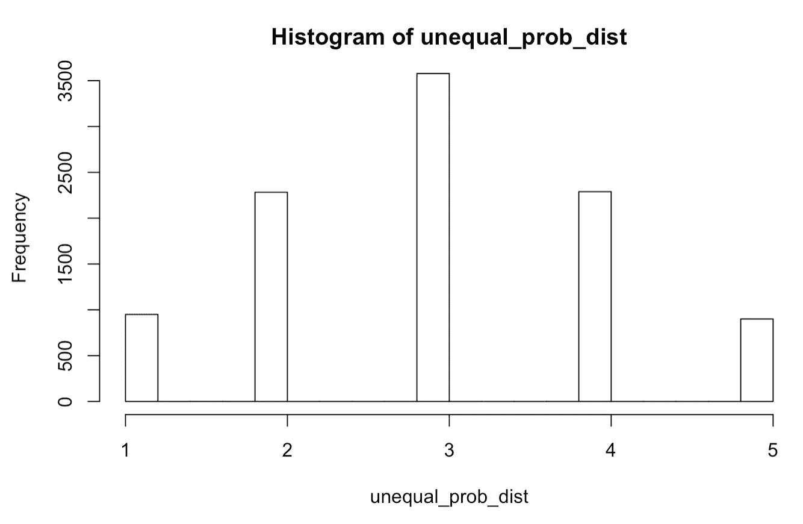

不平等的概率

我们为序列设置以下选择概率规则:

```
1 & 5: 0.12 & 4: 0.25 3: 0.4
```

事实证明，数字 3 是选择最多的，1 & 5 是选择最少的。

如果感兴趣的问题需要对选择概率进行不同的处理，这些相等/不相等的场景会非常有帮助。

# 数据框中的样本观测值

为了对数据框或列表中的观察值(行)进行采样，我们不直接对行进行采样，而是对对象中的索引进行采样。

```
head(mtcars)
```

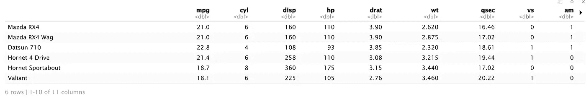

```
# step 1: create an index vector for the elements/rows 
index <- seq_len(nrow(mtcars))

# step 2: sample the index vector
set.seed(12)#to obtain a random sample of 10
sample_index <- sample(index,10)# step 3: to show the sampled elements/rows 
mtcars[sample_index,]
```

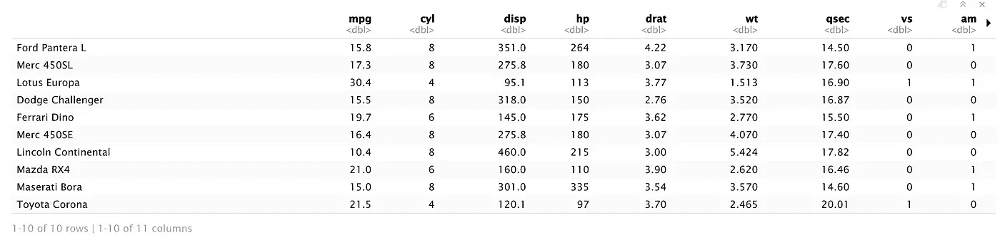

# **应用**

在这一节中，让我们进行一些实践，并解决现实生活中的业务场景。

# 问题 1:有两个六面骰子。如果把它们一起掷出，掷出 7 的概率是多少？

```
set.seed(1)
die = 1:6# sample 10000 times with replacements for dice 1
die1 = sample(die,10000,replace = TRUE,prob=NULL)# sample 10000 times with replacements for dice 2
die2= sample(die,10000,replace=TRUE,prob = NULL)# the combined value of die_1 and die_2 
outcomes = die1+die2# the probability of getting a 7
mean(outcomes == 7)
```

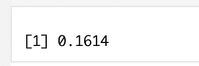

同样，我们可以用一个 ***来代替*** 循环来达到同样的目的。

```
set.seed(1)
for (i in 10000){
 die_1 = sample(die,prob=NULL,replace=TRUE)
 die_2 = sample(die,prob=NULL,replace=TRUE)
 die_sum = die_1+die_2
 print(mean(die_sum==7))
}
```

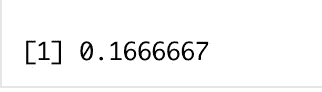

这两种结局几乎一样。

# 问题 2:你有两个骰子。掷出 2，3，4，5，6，7，8，9，10，11，12，13 的概率是多少？

除了模拟每一种结果，还有一种更简单的方法来获得我们需要的东西，那就是使用*sappy*。

```
sapply(2:13,function(x) mean(outcomes==x))
```

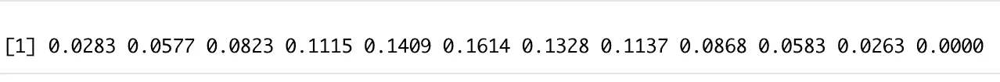

根据 R 文档，`sapply`()函数是一个“用户友好的版本和默认情况下的`lapply`包装器，通过应用`simplify2array()`返回一个向量、矩阵或者如果`simplify = "array"`的话，一个数组。`sapply(x, f, simplify = FALSE, USE.NAMES = FALSE)`与`lapply(x, f)`相同

简言之，该函数将函数 *mean(outcomes)* 应用于序列【2，13】。

> 问你一个问题:如果你有 3 个骰子，掷出 7 的概率是多少？

# 问题 3:生成 10000 个值的随机样本，其中包含多少个独特的观察值？不包括多少？

```
set.seed(1)
n=10000included_obs = length(unique(sample(1:n, replace = TRUE)))
included_obsmissing_obs = n-included_obs
missing_obs
```

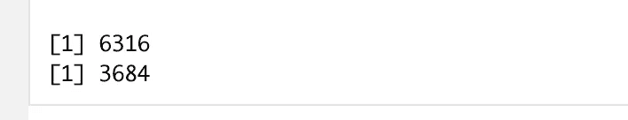

采样后，我们用***【unique()】***来寻找有区别的观测值，用***【length()***来计数。在 10k 样本中，对 6316 个不同的案例进行采样，而对 3684 个(10k-6316)案例不进行采样。

进一步注意，我们在 10k 中只得到 6316 的原因是我们用替换进行采样，因此一些数字被重复采样。换句话说，一些数字被多次采样。

# **问题 4:用随机分配的 0 和 1 生成一个 m*n 矩阵。**

**(鸣谢 R-bloggers 上的讨论，** [**此处**](https://www.r-bloggers.com/2012/08/m-x-n-matrix-with-randomly-assigned-01/) **)**

在最初的帖子中，作者介绍了多种方法，我在这里重点介绍第一种方法。

首先，我们可以使用 for 循环。

```
m <- 10
n <- 10# create an empty matrix
m00 <- matrix(0,m,n)for (i in 1:m) {
   for (j in 1:n) {
     m00[i,j] <- sample(c(0,1),1)
 }
}m00
```

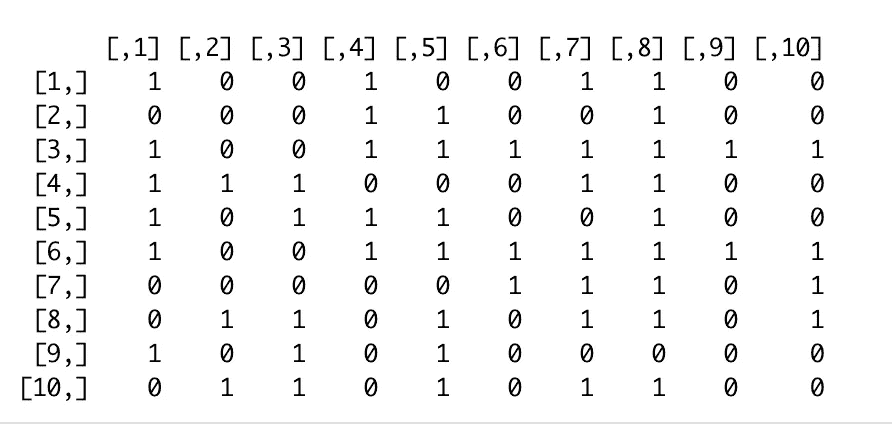

这里， ***matrix(0，m，n)*** 通过 m*n 创建一个空矩阵，两个 for 循环规定了每个单元格的值。

大多数时候，R 中的 循环的 ***可能不是最有效的解决方案，如果样本量足够大，我们将使用其他选项。***

考虑到这一点，作者贡献了使用 ***apply()*** 函数的第二种方法。

```
m <-10
n<-10m0 <- matrix(0,m,n)apply(m0,c(1,2),function(x) sample(c(0,1),1))
```

到目前为止，除了 ***apply()*** 函数之外，其他的应该都很熟悉了。它返回“通过将函数应用于数组或矩阵的边距而获得的向量/数组/值列表”(原始定义，[链接](https://www.rdocumentation.org/packages/base/versions/3.6.2/topics/apply))。

它具有以下形式:

```
> apply(x, margin, fun,…) 
```

*   *x:一个数组或矩阵*
*   margin:一个向量，给出函数将要应用的下标。对于矩阵，1 表示行，2 表示列。 ***c(1，2)*** *表示行和列，其中 x 已命名 dimnames，可以是选择维名的字符向量*
*   *乐趣:要应用的功能*

# 问题 5:抛硬币 10 次，模拟过程 10000 次。显示抬头数量的分布。

```
# create an empty list 
total_heads = c()# use a for loop to simulate coin-flipping 10 times 
# repeat it for 10,000 timesfor (i in 1:10000){
 sum_heads = sum(round(runif(10,0,1)))
 total_heads = c(total_heads, sum_heads)
 }hist(total_heads)
```

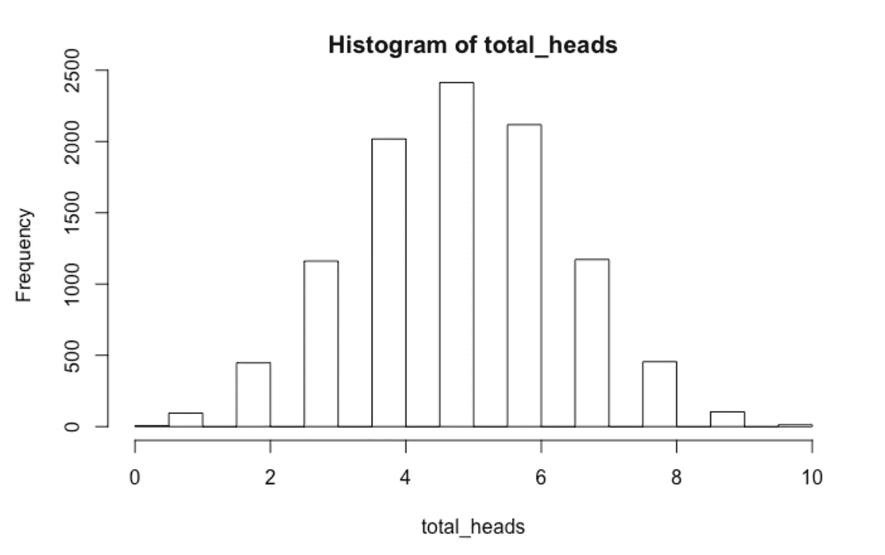

在这里，我将解释三行代码，其余的就不言自明了。

1.  ***为(1:1000 中的 1)。*** 不像其他编程语言，你要把范围指定为 1:10000。
2.  ***sum(round(runif(10，0，1)))*** 。这是一种结构化的编码方式，有三个独立的功能:runif() → round() → sum()。它首先运行 runif()函数，最后运行 sum()。基本上，代码行生成 10 个介于 0 和 1 之间的随机数，将其四舍五入为最接近的整数(0 或 1)，最后求和。
3.  ***total _ heads = c(total _ heads，sum_heads)。*** 由于 total_heads 开头是一个空列表，我们用这行代码把 sum_heads 的值赋给 total_heads。

感谢您的阅读！

这是一篇关于统计模拟的介绍文章，我们将在接下来的文章中探讨更高级的话题。

敬请期待！

*Medium 最近进化出了它的* [*作家伙伴计划*](https://blog.medium.com/evolving-the-partner-program-2613708f9f3c) *，支持像我这样的普通作家。如果你还不是订户，通过下面的链接注册，我会收到一部分会员费。*

[](https://leihua-ye.medium.com/membership) [## 阅读叶雷华博士研究员(以及其他成千上万的媒体作家)的每一个故事

### 作为一个媒体会员，你的会员费的一部分会给你阅读的作家，你可以完全接触到每一个故事…

leihua-ye.medium.com](https://leihua-ye.medium.com/membership) 

# 喜欢读这本书吗？

> 请在 [LinkedIn](https://www.linkedin.com/in/leihuaye/) 和 [Youtube](https://www.youtube.com/channel/UCBBu2nqs6iZPyNSgMjXUGPg) 上找到我。
> 
> 还有，看看我其他关于人工智能和机器学习的帖子。