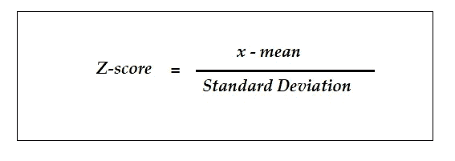
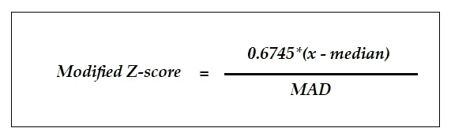
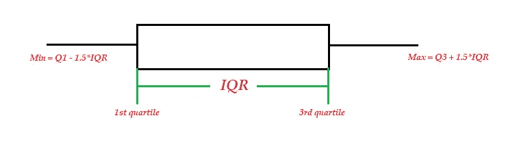
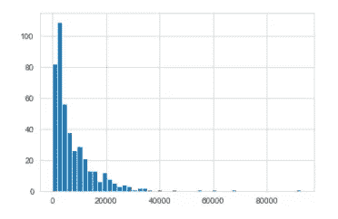
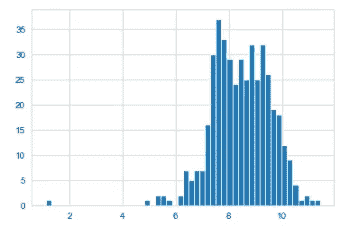

# 异常检测的统计技术

> 原文：<https://towardsdatascience.com/statistical-techniques-for-anomaly-detection-6ac89e32d17a?source=collection_archive---------11----------------------->

克莱门斯·弗兰卡在 [Unsplash](https://unsplash.com?utm_source=medium&utm_medium=referral) 上拍摄的照片

## 快速评估异常和异常值的五种统计工具

异常和欺诈检测是一个价值数十亿美元的行业。根据[尼尔森报告](https://nilsonreport.com/upload/content_promo/The_Nilson_Report_10-17-2016.pdf)，仅 2010 年全球信用卡欺诈金额就高达 76 亿美元。在英国，2018 年欺诈性信用卡交易损失估计超过 10 亿美元。为了应对这些类型的财务损失，我们使用了大量资源来识别每个行业中的欺诈和异常情况。

在数据科学中，“离群值”、“异常”和“欺诈”通常是同义词，但也有细微的区别。“异常值”通常指的是从人群中脱颖而出的数据点。然而，当这种异常值完全出乎意料且无法解释时，它就成了异常值。也就是说，所有异常都是异常值，但不一定所有异常值都是异常值。然而，在本文中，我将这些术语互换使用。

理解和检测异常值之所以重要，原因有很多。作为一名数据科学家，当我们准备数据时，我们会非常小心地了解是否有任何数据点无法解释，这些数据点可能输入错误。有时，我们会过滤完全合法的异常数据点，并删除它们以确保更好的模型性能。

异常检测也有巨大的工业应用。信用卡欺诈检测是引用最多的一种，但在许多其他情况下，异常检测是开展业务的重要组成部分，如检测网络入侵、识别仪器故障、检测肿瘤细胞等。

从简单的统计技术到复杂的机器学习算法，一系列工具和技术被用于检测异常值和异常值，这取决于数据的复杂性和所需的复杂度。本文的目的是总结一些简单而强大的统计技术，可以很容易地用于异常值的初步筛选。虽然复杂的算法是不可避免的，但有时简单的技术就足够了。

下面是五种统计技术的入门。

# 1) Z 分数

Z-score 可能是最简单的一种，但对于异常检测却是一种有用的统计方法。在统计分布中，Z 得分告诉您给定数据点与人群中其他数据点的距离。从技术上来说，Z-score 衡量一个给定的观察值距离平均值有多少标准差。Z 值为 2 意味着数据点距离平均值有 2 个标准偏差。

要计算 Z 得分，您只需要两个参数:均值和标准差，它们在任何编程语言中都很容易获得(例如在 Python 中，您只需将函数`describe()`应用于数据框)。

一旦获得这两个参数，任何给定数据点的 Z 得分都可以使用以下简单公式计算:

# 2)修改的 Z 分数

使用均值和标准差很容易计算 z 得分，但它有自己的局限性。在一些情况下，这不是一种理想的技术，例如:

*   数据不是正态分布的
*   数据/样本量小

除此之外，Z-score 对极值也很敏感(因为它的一个参数-均值-本身对极值也很敏感)，因此它可能无法适当地筛选异常值。

为了克服这些缺点，对标准 Z 分数进行了一些修改:

*   使用中值代替平均值作为参数，因为中值对异常值不太敏感
*   中位数绝对偏差(MAD)用于代替标准偏差
*   这些值乘以一个常数，使其约等于 SD(对于正态分布数据，MAD 约等于 0.6745*SD)

将它们放在一起，等式如下所示:

# 3)四分位距(IQR)

如果你从小到大排列数据，中点称为*中位数*。中位数将数据分成两半。这两半的中点被称为四分位数*T4。*

换句话说，你可以将数据分成三个四分位数——第一、第二和第三(第二个四分位数有一个名字——中位数*)*。所以四分位数间距是第一和第三个四分位数之间的距离。使用 IQR 的异常检测背后的理论是，如果一个数据点离第一和第三四分位数太远，它可能是一个异常值。

IQR 可以单独用于异常值检测，但下面的箱线图使用相同的算法理论，可能比 IQR 更直观。

# 4)箱线图

箱线图更好地展示了 IQR，但也提供了额外的信息。

在下面的盒状图中，盒子的长度是 IQR，最小和最大值由胡须表示。胡须通常延伸到盒子两侧的 1.5*IQR 距离。因此，这些 1.5*IQR 值之外的所有数据点都被标记为异常值。

我在 [boxplot 上写了一篇关于离群点检测的独立文章](/boxplot-for-anomaly-detection-9eac783382fd)，其中有一个例子和一小段 Python 代码，你可能想看看。

# 5)直方图

异常值检测的最后一个统计工具是分布图或直方图。这是另一种以可视化和程序化的方式跟踪异常值的方法。例如，请看下图:

分布数据以检测潜在的异常值

仅从这个分布图就可以很清楚地看出，虽然数据集中的大多数值都被分组在一起，但仍有相当多的值似乎与众不同。因此，您可以过滤这些值，并检查这些值是否异常。

但是，如果数据的分布是倾斜的，有时您可能需要应用数据转换技术(如对数或平方根)。例如，如果我们将对数应用于上述相同的数据，数据就变成近似正态分布，并讲述关于异常值的不同故事。

记录转换后的数据以过滤潜在的异常值

## 摘要

本文的目的是介绍五种简单的统计技术——z 得分、修正的 z 得分、IQR、箱线图和直方图，它们通常在数据科学中用作异常值/异常检测的粗过滤器。有时这些简单的技术对于异常检测来说已经足够好了，但有时我们需要转向更复杂的机器学习算法——kNN、SVM、DBSCAN 等。—我以后文章的一个主题(敬请关注！).

如果你喜欢我的文章，欢迎在[推特](https://twitter.com/DataEnthus)上关注我。