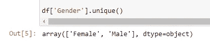
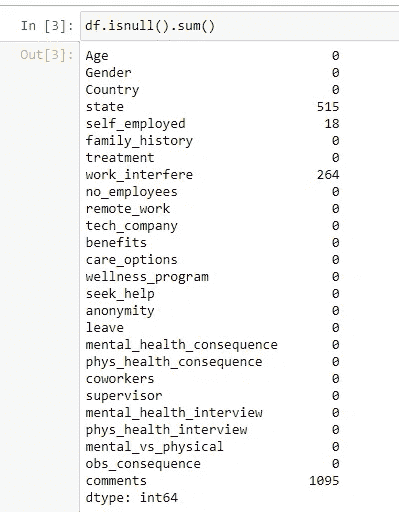
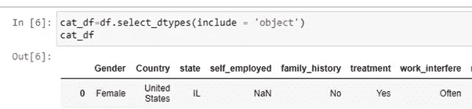
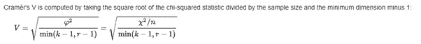
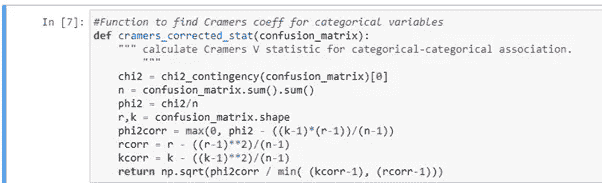
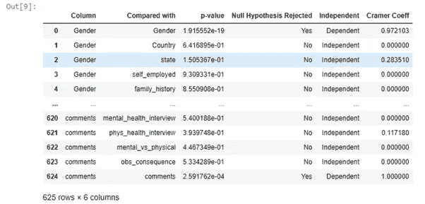
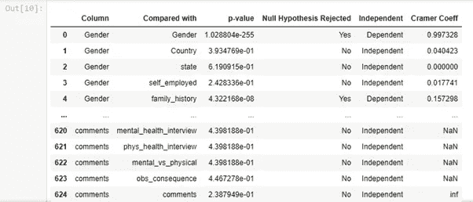
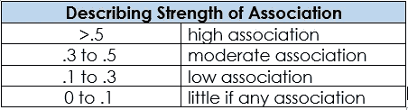
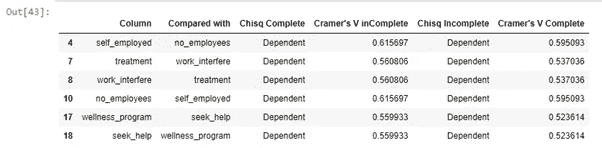
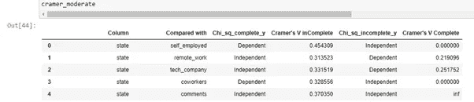

# python 中 MCAR 的统计测试…

> 原文：<https://towardsdatascience.com/statistical-test-for-mcar-in-python-9fb617a76eac?source=collection_archive---------13----------------------->

> 你是否想知道在调查中遗漏的“年龄”是否与被调查者的“薪水”有关？您是否想过分析数据集中各种缺失值之间的关联？你怎么能确定缺少数据是因为没有明确的模式？—这些问题的答案相当简单—本文将向您展示如何在 python 中以统计方式证明数据缺失时变量之间的关系。

图片来源: [unsplash](https://unsplash.com/@rosssneddon)

自从我在 R 中发现 LittleMCAR 的测试，以找出变量缺失之间的关联的重要性，我就一直在用 python 搜索类似的测试。本文将阐明如何在 python 中执行类似的测试。在本文中，我将带您浏览一组代码，这些代码分析分类数据中的缺失值。

在深入测试缺失数据机制之前，让我们先清楚地理解它们。

假设我们有一个数据集，我们需要分析那些缺少值的列以及变量之间的关系。通过分析这些机制，我们可以更好地决定如何处理它们。

任何数据集中有三种不同的数据丢失机制。

1.完全随机失踪:(MCAR)

2.随机失踪:(三月)

3.不是随意失踪:(MNAR)

# **MCAR:**

***是什么意思？*** 当缺失的数据点不遵循任何特定的推理或模式时。例如，您有所在社区居民的人口统计数据。但是变量“中间名”下有 50%的值缺失。这 50%的数据是数据 MCAR 的完美例子。在大多数条目中，中间名是空白的，这背后没有模式或特定的原因。

***怎么处理？*** 在数据 MCAR 的情况下，可以采用以下方法。

*a.* *列表式删除:*如果数据集的任何变量/列中有缺失数据，则删除记录。只有当丢失的数据数量很少时，这种方法才最有效，比如在一个数据集中，只有 2%的数据完全随机丢失。

*b.* *成对删除:*成对删除仅删除统计方法中使用的变量之一缺失的情况。

在内部，它沿着相关矩阵的相同路线工作。在两个变量之间缺少值的情况下，(成对地)寻找相关矩阵考虑了这两个变量的所有完整情况。假设这个场景中的案例数是 n。

当采用另一组变量并计算相关矩阵时，完整病例的数量将不同于 n。

这是*列表式*和*成对*删除的主要区别。

成对删除的优点是数据丢失最少。当一个数据集在几乎所有变量中都存在大量缺失值时，成对缺失值处理将是更明智的选择。

*c.* *均值、中值&众数插补:*缺失值也可以替换为各个变量的均值、中值和众数。

# **三月:**

***什么意思？*** 缺失数据点时遵循一种模式。我们再举一个同样的例子，你所在社区的居民人口统计数据。但这一次，几个年龄超过 45 岁的男人的工资不见了。

这里，数据中的缺失归因于另一个变量的数据。因此，它遵循“随机丢失”机制。MAR 可能是最难理解的，因为它的名字。

***怎么处理？*** 由于这种机制涉及到一种关系，这里的最佳选择是采用一种插补技术——均值、中值、众数或多重插补——这将是本文的范围

# **MNAR:**

***是什么意思？*** 当缺失数据点跟随其数据的模式时，意味着遵循 MNAR 机制。举个例子，在你所在社区居民的同一个人口统计数据中，假设工资超出一定数额时，少了几个男性的工资。(比如一百万)

在这里，它遵循一个“不是随机丢失”的机制。通常，当数据丢失不是 MCAR 或 MAR 时，它倾向于遵循 MNAR。

***怎么处理？*** 既然在 MNAR 的案例中存在自诱导关系，那么避免它们的最好方法就是做一些数据收集或者对缺失数据建模。

我们需要分析缺失值机制的原因是，我们需要了解估算缺失值的最佳方法，以便我们的 ML 模型的准确性不受影响。

# 让我们开始编码吧…

我已经将这个 [Kaggle 数据集](https://www.kaggle.com/osmi/mental-health-in-tech-survey)用于分析。让我们首先将这些数据放入数据框，并检查数据集中缺失值的总数。我现在已经从数据集中删除了 timestamp 变量，因为我在这里的目标是处理缺失值及其关系。我还将性别列的值替换为最小类别——“男性”和“女性”。

正如我们在下面的屏幕截图中看到的，在一些列中有缺失值——State、Self-employee、work_interfere 和 comments 有很多缺失数据。

现在，在所选的数据集中只有一个数值变量，但其中没有缺失值。所以，让我们在一个单独的数据框架中分离分类变量。

既然我们已经分离了具有完全和不完全情况的分类变量，我们需要使用传统的卡方检验来分析每个变量的完全和不完全情况之间的关联。独立性和克莱姆系数测试。

独立性的卡方检验用于确定两个分类变量之间是否存在关联。卡方检验使用列联表或交叉表。测试以检查这些类别中的频率。

**克莱姆系数**是两个名义变量之间关联的量度，给出 0 到+1 之间的值。

来源:维基百科

来源:维基百科

以下函数计算数据集中所有变量组合的克莱姆系数值。

来源:堆栈溢出

在将卡方检验和克莱姆逻辑应用到我们的数据框架后，我们得到以下输出。

正如我们在上面看到的，对于完全的情况，当一个列与它自己比较时，克莱姆系数是最高的。“独立”栏显示卡方检验显著性的结果。如果卡方的 p 值是<0.05, the association is going to be dependent.

We perform the same analysis for incomplete cases too.

Here, Cramer’s Coefficient is Nan for few rows because the number of incomplete cases for a few of the variables could have been 1.

Generally, the accepted category for any Cramer’s coefficient association is taken from a standard set of intervals.

Depending on the above criteria, let’s segregate our output into four different data frames –

1\. cramer_high
2。克莱姆 _ 温和
3。cramer_low
4。如果有的话

以下是变量之间具有**高关联性**。

1.自营职业者和非雇员

2.治疗和工作干扰

3.寻求帮助和健康计划

其中，“自雇&工作干扰”在我们的数据集中有缺失数据。

不完全情况下的克莱姆 V 告诉我们，在缺失数据中，在“自雇者”和“雇员人数”(大于 0.5)变量之间有很强的关系。

我们的另一个有缺失数据的变量“work_interfere”也是如此。一个人是否正在接受精神疾病的治疗，会极大地影响疾病干扰他白天工作的方式。

然而，当您查看这两个变量的 chisq 测试结果时，完全和不完全情况下的结论没有区别。这意味着这种关联不可能仅仅是由于这两个变量的数据缺失。

至于缺失值的第三个变量——“状态”，它在“远程工作”、“技术公司”、“自雇”、“同事”和“评论”之间具有中等强度的关系。

在这里，如果您看到，chisq 测试输出中有一个差异，即“state”与“remote_work”以及“state”与“tech_company”，它表示这两个变量在完全情况下是独立的，但在不完全情况下却是相关的。

换句话说，在“状态”中有一些关于失踪的东西，这取决于那个人是在家工作还是为科技公司工作(也就是相当强烈的失踪联想)。

# 进一步的步骤..

由于数据集中缺失值的变量之间存在固有的关系，因此数据被视为随机缺失(MAR)。因此，与其删除缺失的记录，不如采用一种插补技术，如“模式”插补，或者采用一种稍微先进的技术，如多重插补。

这样，我们将保留数据集中的大部分信息，并且最终不会影响准确性。