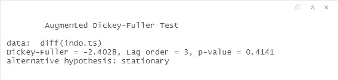
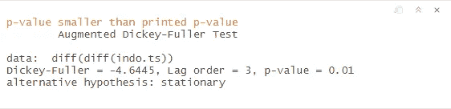
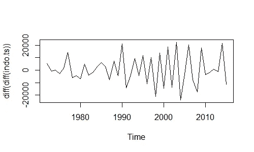
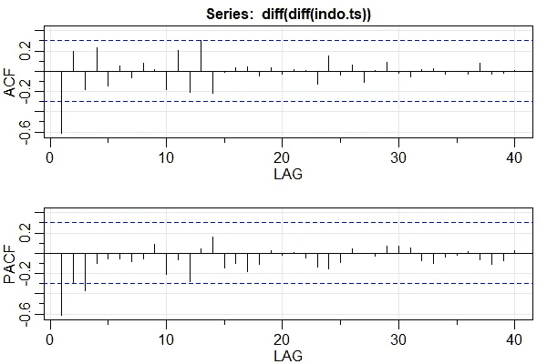
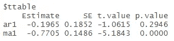
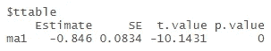
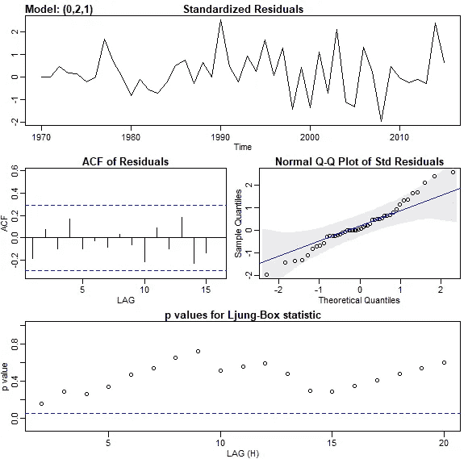
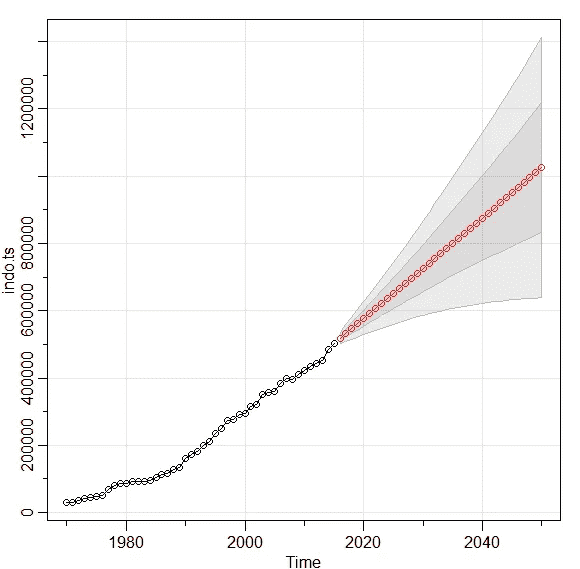

# 时间序列的统计检验

> 原文：<https://towardsdatascience.com/statistical-test-for-time-series-a57d9155d09b?source=collection_archive---------11----------------------->

## 它决定了模型是否可以使用。

[斯科特·格雷厄姆](https://unsplash.com/@sctgrhm?utm_source=unsplash&utm_medium=referral&utm_content=creditCopyText)在 [Unsplash](https://unsplash.com/s/photos/analysis?utm_source=unsplash&utm_medium=referral&utm_content=creditCopyText) 上拍照

最近，我发表了一篇关于使用 ARIMA 模型进行预测的文章，该模型的数据本身就是 1970 年至 2015 年的二氧化碳排放量。这篇文章突然受到许多读者的关注，这是我在媒体上的获奖文章之一，下面是我的出版物，

 [## R 中 ARIMA 模型的时间序列预测

### 从勘探到预测 1970 年至 2015 年的二氧化碳排放数据。

towardsdatascience.com](/time-series-forecasting-with-arima-model-in-r-77f4e2ae7abb) 

文章发表后的几天，有一些建设性的意见来到我这里。我犯了一个错误。我已经测试了 ARIMA 模型，它通过了显著性测试，但是它不是静态的。

正如我在模型中提到的，在我对数据进行差分后，数据看起来是稳定的，它可以用于下一步。这是一个错误，所以我必须写这篇文章来澄清它。

在本文中，我将向您展示为什么在应用模型之前有必要进行统计测试，尤其是显著性测试，以及在我们基于显著性测试使序列平稳后会是什么样子。

# **为什么要进行显著性检验？**

显著性检验是决定你能否继续分析的一个步骤。测试根据有效的假设量化你的证据。

假设你相信一个真实的陈述，你想知道它是否值得进一步分析。

如果你的证据可能与陈述不符，你就不能继续。然而，如果不太可能，你可以继续。

# **静态测试**

在这一节中，我将使用我上一篇文章中的数据，即印度尼西亚从 1970 年到 2015 年的二氧化碳排放量，我将向您展示如何测试数据的平稳性。

## **扩展的迪基-富勒(ADF) T 统计检验**

在我们找到选择哪个自回归(AR)和移动平均(MA)参数之前，我们必须测试数据是否是平稳的。

我们可以使用扩展的 Dickey-Fuller (ADF) t 统计检验来做这件事。ADF 检验是检验数列是否有单位根的检验。如果存在，则该序列具有线性趋势。然而，如果不是，我们可以说模型是静止的。

为了计算 p 值，我们可以在 r 上使用 tseries 库中的 adf.test 函数。

给定数据，之前我们已经计算过一次差异数据，这是 ADF 测试的 p 值，

这个系列仍然不重要。因此，我们必须再次区分这个系列，这是 ADF 测试的 p 值，

现在，我们有一个稳定的数据，我们可以继续我们的模型发现。连续剧长这样，大家怎么看？

# **型号识别**

在我们得到数据的完美平稳形式后，我们可以确定哪个自回归和移动平均参数符合模型。为此，我们可以用自相关函数(ACF)和部分自相关函数(PACF)来标识绘图。你可以看到下图，

基于该图，我们知道 ACF 和 PACF 图随着时间的推移有一个到零的尾部。因为这样，我们假设 ARIMA 模型的参数是 1，2，1。

# **型号诊断**

在我们确定参数之后，我们对模型进行诊断。我们可以使用 r 上 astsa 库中的 sarima 函数对模型进行诊断，对于 ARIMA(1，2，1)，下面是结果，

正如我们在 p 值上看到的，AR(1)并不显著。因此，我们不会将 AR(1)用于我们的模型。当我们用 ARIMA(0，2，1)再次应用后，结果看起来像这样，

因为所有参数都很重要，所以我们有一个很好的数据模型。我们将使用的模型是 ARIMA(0，2，1)。

# 残差分析

在我们得到完美的模型之后，我们必须检查这个模型是否超越了残差分析。这是必要的，因为如果模型的残差不具有正态分布，我们就不能使用该模型。

这里显示了通过使用 sarima 函数从残差得到的图，

正如我们在这里看到的，该模型在其残差上有一个平稳序列，并且每个滞后也没有任何显著的自相关。此外，Ljung-Box 测试没有通过蓝线。因此，该模型满足进行预测的要求。

# **预测**

为了进行预测，我们可以使用 R 上的 astsa 库中的 sarima.for 函数来做这件事。这是天气预报的样子，

我不喜欢说这个，但是结果比上一个更糟。在前一篇文章中，二氧化碳排放量约为 904.186 千吨。现在，二氧化碳排放量将在 1024782 千吨左右。

> 请注意，二氧化碳排放量不包括森林火灾排放量。正因为如此，我们必须认真考虑气候变化。

# 结论

总之，正如你在预测结果上看到的，这是一个界限，随着年份的增长，这个界限变得越来越大。所以我们不能说这是确切的数字，但至少我们知道这个数字是如何增长的。

如果政府知道如何减少二氧化碳的排放量，这张图表就不会出现。然而，如果没有政策来阻止它，图表可能会发生。

我不得不再次引用这句话来结束这篇文章。

> “所有的模型都是错误的，但有些是有用的”——乔治·博克斯

# 参考

[1] Stoffer，D. S. & Shumway，R. H. [*时间序列:一种使用 R*](https://onlinelibrary.wiley.com/doi/abs/10.1111/jtsa.12508) (2019)的数据分析方法，Taylor & Francis Group。
【2】Hyndman，R.J. & Athanasopoulos，G. [*预测:原理与实践*](https://otexts.com/fpp2/) (2018)，第 2 版，OTexts。
【3】[*平稳性测试*](https://rpubs.com/richkt/269797) 。Rpubs.com。

## 感谢您阅读我的文章，您也可以在下面查看我以前的文章:

 [## 用 R 整理数据

### 为什么你应该在它上面投资更多，为什么这使你的分析变得容易得多

towardsdatascience.com](/tidy-data-with-r-f3d078853fc6)  [## 基于 R 的文本挖掘:收集和清理数据

### 印度尼西亚最大媒体上的推文评论案例研究

towardsdatascience.com](/text-mining-with-r-gathering-and-cleaning-data-8f8b0d65e67c)