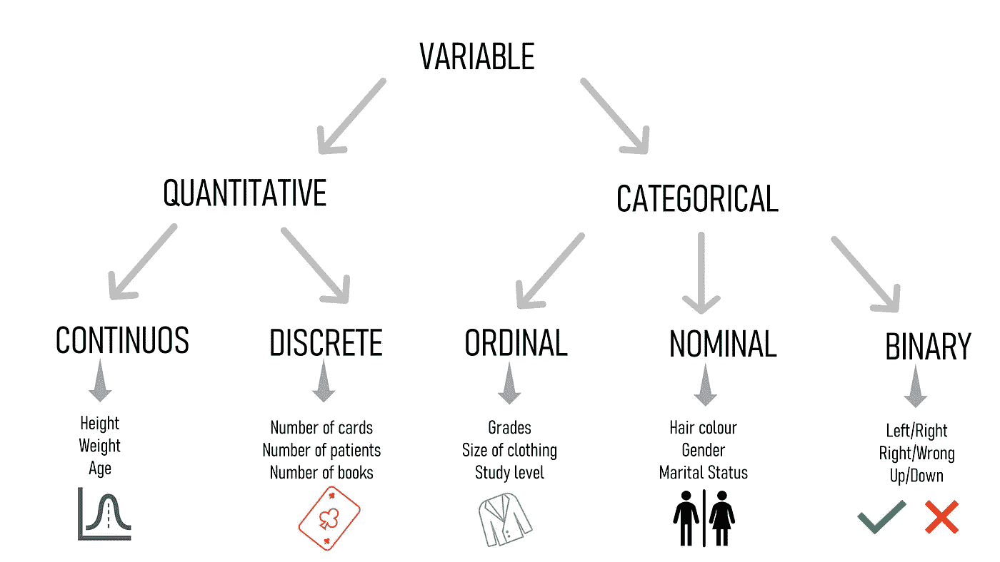
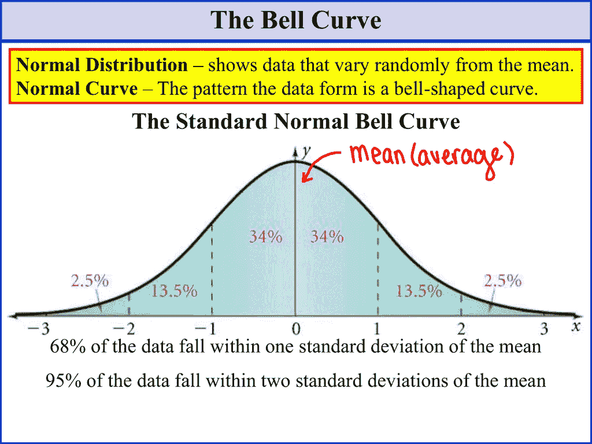
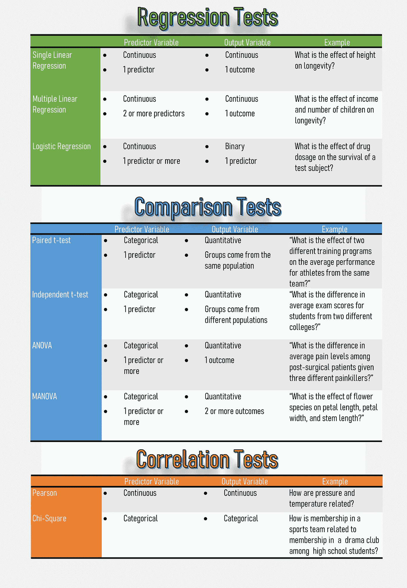
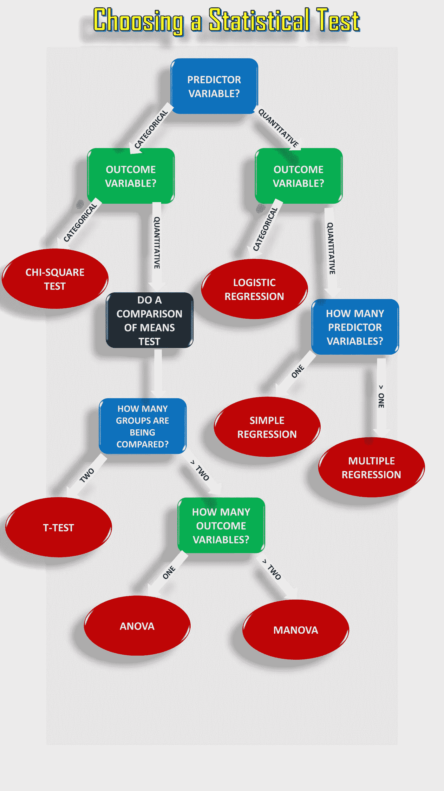
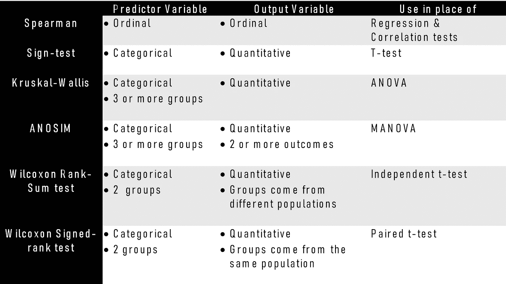

# 统计测试:如何为你的数据选择最好的测试？

> 原文：<https://towardsdatascience.com/statistical-testing-understanding-how-to-select-the-best-test-for-your-data-52141c305168?source=collection_archive---------1----------------------->

## 这篇文章面向有抱负的数据科学家和机器学习(ML)学习者和实践者。

亚历克西斯·莫拉·安古洛在 [Unsplash](https://unsplash.com/s/photos/surprise?utm_source=unsplash&utm_medium=referral&utm_content=creditCopyText) 上的照片

他的职位不适合经验丰富的统计学家。**这是面向数据科学家和机器学习(ML)学习者&从业者**，他们和我一样，没有统计学背景。

对于一个来自非统计背景的人来说，统计学最令人困惑的方面， ***是基本的统计测试*** ，什么时候使用哪种测试？。这篇文章试图**指出最常见的测试和相关关键假设之间的区别。**

# 目录

1.  术语:*(本帖关键术语)*
2.  统计检验(假设检验)
3.  统计假设
4.  参数测试
5.  参数测试流程图
6.  处理非正态分布(非参数检验)

# **1)术语:**

## **因变量和自变量**

自变量通常被称为“预测变量”，是一个被操纵的变量，以观察对因变量的影响，有时被称为结果/输出变量。

*   自变量->预测变量
*   因变量->结果/输出变量

## **变量类型**

区分变量类型之间的差异很重要，因为这在确定采用正确的统计检验类型时起着关键作用。有两个主要类别:

*   **定量** : 表示事物的数量(如一包烟的数量)。两种不同类型的定量变量是:

1.  **连续**(又名**比**):用于描述度量，通常可以分为小于一的单位(如 1.50 公斤)。
2.  **离散**(又名**区间**):用于描述计数，通常不能分割成小于 1 的单位(如 1 支香烟)。

*   **分类** : 表示事物的分组(例如不同种类的水果)。三种不同类型的分类变量是:

1.  **序数:**表示有顺序的数据(如排名)。
2.  **名义:**代表集团名称(如品牌或物种名称)。
3.  **二进制**:表示结果为是/否或 1/0 的数据(如左或右)。

变量类型汇总(图片由作者提供)

# 2)统计测试

统计学就是关于数据的。光有数据是没意思的。我们感兴趣的是对数据的解释。

在统计学中，一个非常重要的事情是统计检验，如果统计“是对数据的解释”，统计检验可以被认为是“调查我们关于世界的想法的正式程序”。

换句话说，每当我们想要对数据的分布或一组结果是否不同于另一组结果做出断言时，数据科学家必须依赖假设检验。

## **假设检验**

使用**假设检验**，我们尝试使用样本数据解释或得出关于总体的结论，评估关于总体的两个互斥陈述，以确定哪个陈述最受样本数据支持。

## **假设检验有五个主要步骤:**

**步骤 1)** 陈述你的假设为一个零假设(Ho)和替代假设(Ha)。

**步骤 2)** 选择一个显著性水平(也称为α或α)。

**步骤 3)** 以一种被设计用来检验假设的方式收集数据。

**步骤 4)** 执行适当的统计测试:计算 p 值，并与显著性水平进行比较。

**步骤 5)** 决定是“拒绝”零假设(Ho)还是“拒绝失败”零假设(Ho)。

> **注意**:虽然具体的细节可能会有所不同，但是你在测试一个假设时所使用的程序总是会遵循这些步骤的一些版本。

如果你想进一步了解假设检验，我强烈推荐这两篇关于假设检验的好文章。

 [## 假设检验|带有简单示例的逐步指南

### 假设检验是一种使用统计学调查我们对世界的想法的正式程序。最常见的是…

www.scribbr.com](https://www.scribbr.com/methodology/hypothesis-testing/)  [## 现实生活中的假设检验

### 用数学解决现实世界的问题

towardsdatascience.com](/hypothesis-testing-in-real-life-47f42420b1f7) 

# 3)统计假设

统计测试对被测数据做出一些常见假设*(如果违反这些假设，则测试可能无效:例如，得出的 p 值可能不正确)*

1.  **观察值的独立性**:您在测试中包含的观察值/变量不应该相关(例如，来自同一个测试对象的几个测试不独立，而来自多个不同测试对象的几个测试是独立的)
2.  **方差的同质性**:被比较的每组内的“方差”应该与组内其余方差相似。如果一个组比其他组有更大的方差，这将限制测试的有效性。
3.  **数据的正态性**:数据服从正态分布，正态性是指检验的分布是正态分布(或钟形)，均值为 0，标准差为 1，对称的钟形曲线。

来源:[https://study lib . net/doc/10831020/the-bell-curve-the-standard-normal-bell-curve](https://studylib.net/doc/10831020/the-bell-curve-the-standard-normal-bell-curve)

# 4)参数测试

参数测试是那些只能用符合上面提到的 ***【三个统计假设】*** 的数据运行的测试。最常见的参数测试类型分为三类。

## 回归测试:

> 这些测试用于**测试因果关系，**如果一个或多个连续变量的变化预测了另一个变量的变化。

*   **简单线性回归:**测试预测变量的变化如何预测结果变量的变化水平。
*   **多元线性回归:**测试两个或更多预测变量组合的变化如何预测结果变量的变化水平
*   **逻辑回归:**用于描述数据，解释一个因变量(二元变量)与一个或多个名义变量、序数变量、区间变量或比率水平自变量之间的关系。

## 比较测试:

> 这些测试寻找变量均值之间的差异:均值比较。

*   **T 检验**用于精确比较两组的平均值(如男性和女性的平均身高)。
*   **独立 t 检验**:检验不同人群*相同变量*之间的差异(例如，比较狗和猫)
*   **ANOVA** 和 **MANOVA** 测试用于比较两组或更多组的平均值(如儿童、青少年和成人的平均体重)。

## 相关性测试:

> 这些测试寻找变量之间的关联，检查两个变量是否相关。

*   **皮尔逊相关:**检验两个连续变量之间的关联强度。
*   **Spearman 相关性:**测试两个顺序变量之间的关联强度(它不依赖于正态分布数据的假设)
*   **卡方检验:**检验两个分类变量之间的关联强度。

参数测试总结(图片由作者提供)

# 5)流程图:选择参数测试

该流程图将帮助您在上述参数测试中进行选择。对于非参数替代，检查以下部分。

参数测试流程图(图片由作者提供)

# 6)处理非正态分布

虽然正态分布在统计学中占有中心位置，但许多过程遵循非正态分布。许多数据集自然符合非正态模型:

> -事故数量往往符合“泊松分布”
> 
> -产品的寿命通常符合“威布尔分布”。

## 非正态分布的例子

1.  贝塔分布。
2.  指数分布。
3.  伽玛分布。
4.  逆伽马分布。
5.  对数正态分布。
6.  物流配送。
7.  麦克斯韦-玻尔兹曼分布。
8.  泊松分布。
9.  偏斜分布。
10.  对称分布。
11.  均匀分布。
12.  单峰分布。
13.  威布尔分布。

## 那么，我们如何处理非正态分布呢？

当您的数据应该符合正态分布，但却不符合时，我们可以做一些事情来处理它们:

*   如果您的样本量足够大(通常超过 20 个项目)，我们仍然可以运行参数测试，并尝试相应地解释结果。
*   我们可以选择用不同的统计技术来转换数据，迫使它符合正态分布。
*   如果样本量很小，有偏差，或者如果它代表另一种分布类型，您可能会运行**非参数测试**。

# **非参数测试**

非参数检验(下图)对数据不做太多假设，当三个统计假设中的一个或多个被违反时，它是有用的。

> 注意:非参数测试做出的推论没有参数测试强。

非参数测试(图片由作者提供)

希望这篇文章对你有帮助。如果您有任何反馈，请告诉我。非常感谢你的阅读！

# 参考

[1]统计方法。2020.*非正态分布—如何统计*。[在线]可在以下网址查阅:https://www . statisticshowto . com/probability-and-statistics/non-normal-distributions

[2]Scribbr。2020.*选择正确的统计测试|类型和示例*。[在线]地址:https://www.scribbr.com/statistics/statistical-tests