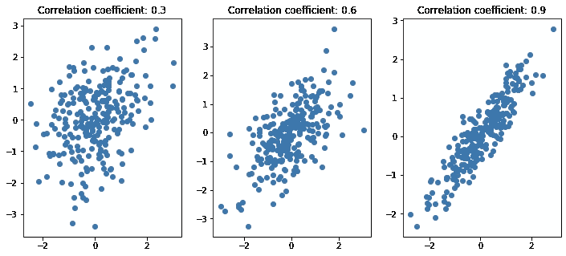
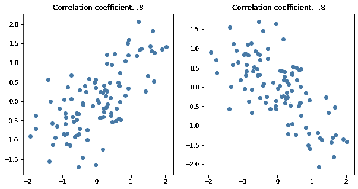
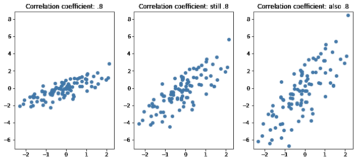
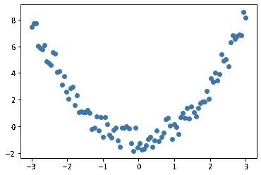
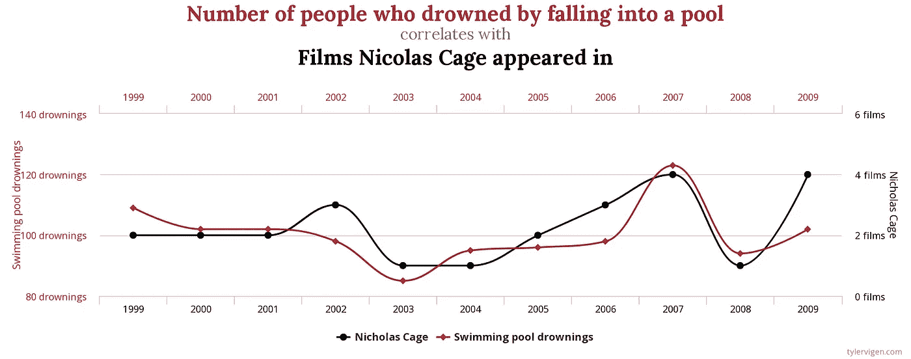
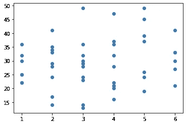

# 统计思维:理解相关性

> 原文：<https://towardsdatascience.com/statistical-thinking-understanding-correlation-5f7c63934699?source=collection_archive---------20----------------------->

## 从头开始的数据科学

## 建立对什么是相关性以及它告诉你什么的直觉

统计学是应用数据科学的核心，理解统计学会让你成为更好的数据科学家。即使——或者尤其是如果——你花了大部分时间去钻研现成的库，而不需要从零开始建立机器学习模型，你也会从理解支撑你的模型的统计力学中受益。当您调用某一类型的模型时，了解计算机正在为您做什么样的统计工作，对于选择在给定情况下使用哪个模型、了解数据将需要什么样的处理以及适当地调整您的模型来说，是非常关键的。

数据科学的学生，尤其是走训练营路线的职业中途改变者，可能会发现学习统计的本质有点令人生畏-像许多复杂的领域一样，统计有其自己的术语和符号，需要学习。不管是好是坏，许多人作为数据科学家工作，只有最低限度的统计学基础，但对统计学原理的某种直觉应该是先决条件。对一些甚至不需要任何数学知识的原则有一个好的内在感觉将会大有帮助。这些原则中首先是相关性。

**相关性/独立性**

对于任何类型的应用数据科学或分析来说，相关性可能是最重要的概念。两个变量相关意味着什么？简单地说，这意味着我们可以知道变量是相关的，因为它们以某种方式一起运动。也许一个上升，另一个下降，或者两者一起上升。这与一个变量的运动导致另一个变量上升或下降不同——可能有第三个看不见的变量在控制另外两个变量——但如果它们相关，知道其中一个变量的值仍会给你关于第二个变量的信息。

许多人在开始统计学课程时接触到了相关性，首先是皮尔逊相关系数的公式和一组显示不同相关性水平的图表，如下所示:

具有不同相关水平的分布

在最左边的图中，我们的 x 和 y 变量之间只有很低的相关性。右边是非常高的相关性；这两个变量似乎是同步移动的，当 X 增加时，Y 也总是跟着增加。皮尔逊相关系数的值很好地反映了重要的趋势，右边的锁步关系由接近 1 的值表示，左边的低相关性由接近 0 的值表示。当然，变量也可以是负相关的，其中 Y 值通常随着 X 的增加而下降:

正相关与负相关

因此，皮尔逊系数似乎能告诉我们很多信息，并且作为一种相关性的衡量标准几乎无处不在(如果你遇到一个“相关系数”的参考，并且没有具体说明，可以肯定它指的是皮尔逊系数)。尽管它很有用，但是，我想从计算这个奇异值转移到关注它对变量更广泛相关的意义。首先，统计学的新学生倾向于将相关值与两个变量之间的关联程度相混淆。相关系数并不是这样工作的。相关系数接近 1 仅表示 X 和 Y 变量协同移动:可以预期 Y 会随着 X 的上升而上升，而不是随着 X 的上升而上升多少。增加线的斜率实际上不会改变相关系数的值:

相关系数相同的三个分布

另一方面，皮尔逊系数实际上只是众多不同的相关性度量之一。为什么会有不同的相关性度量？变量可以有很多不同的关联方式。考虑以下几点:

这些变量看起来应该是相关的，不是吗？

希望您能马上看到 X 和 Y 变量是相关的，但是它们之间的皮尔逊系数接近 0。为什么会这样？皮尔逊系数是线性相关的度量，这两个变量之间的关系不是线性的！当 X 小于 0 时，Y 值随着 X 的增加而下降，但当 X 大于 0 时，Y 值随着 X 的增加而上升，这一事实混淆了这一度量。幸运的是，还有其他方法来衡量相关性。对于这种特殊情况，您可能会考虑[距离相关性](https://en.wikipedia.org/wiki/Distance_correlation)。也存在考虑可变等级而不是数量的其他相关性度量。

**为什么这如此重要？**

在某种程度上，相关性是所有应用数据科学的核心。当两个变量相关时，知道其中一个可以帮助你预测另一个。变量之间的关系可能是复杂的和非线性的，这就是为什么认为相关性不仅仅是一个单一的系数是很重要的。真正重要的不是任何特定相关系数的值，而是两个变量的值是否相关。尽管皮尔逊系数为 0，但形成上述抛物线的两个变量是相关的，知道 X 变量的值可以很好地暗示 Y 变量的值。

在现实世界中，变量的测量往往是有噪声的——你的测量可能会高一点或低一点，这取决于你如何或何时测量。变量之间的关系也可能混淆，这意味着还有第三个不可测量的变量独立地影响着你所关注的一个或两个变量。因此，判断两个变量是否有关联并不总是容易的。有用的关系可能被统计噪声掩盖。许多机器学习只是试图梳理出有用的相关性的聪明工具，即使并不立即清楚这些关系是什么。

**“低相关性”仍然很有意义**

我想把焦点从单一系数转移开的另一个原因是，低系数本身并不意味着没有非常有意义的事情发生。许多统计学导论课程在警告人们“伪相关”的危险方面做得很好，在伪相关中，两个彼此无关的变量由于随机机会而看起来相关(特别是当样本很小时)。你可以找到许多这种虚假相关性的例子，我特别喜欢泰勒·维根[收集的那些例子](https://www.tylervigen.com/spurious-correlations):

Nic 凯奇电影会导致人溺水吗？泰勒·维根收集的惊人的虚假相关性

然而，入门课程往往不会花足够的时间关注相反的问题，其中真实的关系被低相关系数所掩盖。低相关系数可能与非常有意义的效果相关联。如果某种影响有许多不同的、独立的原因，尽管有因果联系，但这种影响和每个变量之间的相关系数可能很低。为了举例说明，请考虑我生成并绘制的以下 50 个点:

点的集合

看起来 X 和 Y 变量之间有很强的相关性吗？大概不会。皮尔逊系数是微不足道的 0.17。这个 X 变量在试图预测 Y 的模型中有用吗？你的第一个想法可能是否定的，但是如果我解释我是如何生成这些数字的，你可能会改变主意。我模拟滚动 6 个骰子，一半是六边形，另一半是二十边形，把数字加起来。上面画出的 X 变量只是这些滚动中的第一个。

因为总数是从如此多的卷中得出的，并且每个卷都是独立的，所以任何单个卷的相关系数都不可能很高。但是，如你所见，单独的低系数并不意味着变量是无用的。我在上面绘制的 x 变量(以及其他 5 个卷)具有真正的解释力。你需要完全准确地预测总数，只需要六次独立掷骰的结果，如果没有这一次，你永远也不会完全准确。

**因果关系**

找到相关性的下一步是考虑因果关系。你可能听说过 intro stats 的咒语“相关性不等于因果关系”。知道两个变量以某种方式联系在一起并不等同于知道*它们是如何*联系在一起的。您可以通过简单地查看数据来判断 X 和 Y 是否相关，但是 X 和 Y 有很多种关联方式。X 可以影响 Y，或者 Y 可以影响 X，或者其他变量可以影响两者。仅仅从数据上你无法判断哪一个是正确的。

例如，许多研究发现，学习一种乐器的孩子在学校表现更好。这类研究经常被用作证据，证明学习一种乐器*能让*孩子在学校表现更好；父母可能会听说他们，并决定他们的孩子应该学习钢琴，或者为学校音乐项目争取更多的资金。虽然我赞成学校的音乐项目，但这里的关系可能不像“教一个学生小提琴，然后看着他们的成绩上升”那么简单。首先，有许多令人困惑的因素，尤其是社会经济地位——有更多可支配收入的家庭更有可能负担得起一个感兴趣的孩子的乐器和音乐课。另一方面，因果关系可能实际上是反过来的——也许在学校表现好的学生更有可能想要学习一种乐器。那种专注并决心在数学课上出类拔萃的孩子也更有可能坚持学习一种乐器，直到他们看到令人满意的结果。

我们无法从观察性研究中判断到底是什么导致了什么，这一事实对政策有着重要的影响。也就是说，重要的是要记住，你不需要知道因果关系是如何流动的，相关性才具有预测能力。考虑一个大学招生官在看申请人。了解到长期学习音乐的学生往往在大学表现更好，在其他条件相同的情况下，官员可能会倾向于选择演奏乐器的学生入学。在某种程度上，对他们来说，为什么存在这种联系并不重要，他们不一定关心音乐学习是否让学生做得更好，或者是否有其他因素在起作用，他们关心的是这种关系的存在让他们能够更好地预测学生未来的表现。

**相关性会使你的样本产生偏差**

你经常听到“随机样本”这样的说法，不随机的样本可能会有偏差，但是样本“随机”是什么意思呢？我们处理的大多数看似随机的过程(也可能是宇宙中的一切，尽管这是另一个哲学话题)实际上都是确定的。抛硬币是“随机”的，因为你不太可能知道它会以哪种方式落地，但它是完全确定的，因为它是正面还是反面落地完全取决于硬币在空中的旋转和运动，而这又完全取决于硬币从你手中弹离的角度和力度。类似地，计算机不能以真正随机的方式行动。如果你让你的计算机生成随机数或随机取样，它将生成“伪随机数”，看起来适当随机，但实际上是从混沌但最终确定的物理过程、算术运算或两者的某种组合中得出的。

为什么需要随机数，我们如何判断伪随机数是否足够“随机”？其中一个关键是，随机数(或通过随机方法选择的样本)是独立的，与我们正在研究的任何东西都不相关。即使这些方法不是真正“随机”的，通过掷硬币或掷骰子来选择样本也很有效，因为掷硬币或掷骰子的结果与样本中的项目无关，反之亦然。

我提出这一点是因为许多数据科学是使用完全不是随机的数据池完成的。例如，公司拥有大量客户数据，他们可能想要挖掘这些数据以获得某种洞察力，但是，根据定义，你只能拥有关于你的客户的客户数据。这通常会限制你从数据中合理做出的推断，特别是因为你想要研究的变量与样本的收集方式相关。

例如，我曾经做过一个项目，研究人们对汽车的满意度。进行了一项调查，人们回答了关于他们汽车的基本信息(品牌、型号、年份等)。)，他们是否遇到了汽车的某些问题以及他们的总体满意度。该团队试图模拟出一个人对自己的汽车的满意度，一些人惊讶地发现，随着车龄的增长，该模型预测的满意度会更高。当然，人们会对老式汽车不太满意？

这是一个样本选择方法和目标变量(满意度)相关的案例。毕竟，如果你真的对你的车不满意，你更有可能在你能负担得起的情况下尽快换掉它。开同一辆车十五年的人大概都喜欢开那辆车。讨厌自己车的人不会把车开那么久。在所有其他条件相同的情况下，你可能会认为人们更喜欢新车而不是旧车，但是通过调查得出的样本不会有旧车和不满意的司机的交集。

这并不意味着调查没有用，也不意味着你不能在你的模型中包括车龄。事实上，年龄最终成为了一个非常有用的满意度预测指标，正是因为这种相关性的*；如果你告诉我你已经开同一辆车很长时间了，那么你这么做的部分原因是因为你喜欢它(或者至少不讨厌它)，这不是一个坏的赌注。然而，这种相关性确实限制了模型的用途。如果你已经做了这样的分析，一家汽车公司问你如何提高客户满意度，回答“嗯，开老爷车的人往往对老爷车很满意，所以你应该给你的客户老爷车”不会有太大帮助。*