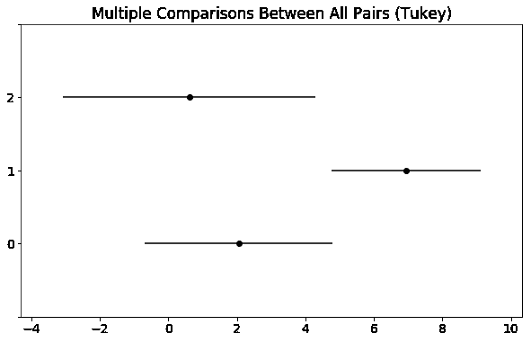

# 具有统计意义的编年史

> 原文：<https://towardsdatascience.com/statistically-significant-chronicle-d1b498c476e9?source=collection_archive---------29----------------------->

## t 检验、单因素方差分析和事后检验——这些是什么，何时使用哪一种，如何使用？

在我之前的文章的一篇[中，我们谈到了统计学意义的基础，我得到了一些非常有希望的反馈，这让我回到这里尝试涵盖更多的概念。](https://medium.com/@anujloomba/statistical-significant-chronicle-part-1-29684171d818)

先从 t-tests 开始吧。当我们不知道总体均值和标准差时，进行 t 检验，以找出两组的均值之间的差异。该检验背后的基本假设是，它假设样本来自具有正态分布的总体。我将用一个例子来更好地解释这一点:

有两家你喜欢的不同的餐馆。其中一个平均评分 3.5，另一个平均评分 3.7。你需要带你的约会对象去这些餐馆之一。你应该选择评分高的那个吗？我想你应该这么做，因为这是一个约会，但是如果第一个的人均花费是 30 美元，而第二个是 60 美元呢？评分的差异是否有统计学意义，足以让你的钱包负担翻倍？找出答案的唯一方法是对餐馆 A v/s B 的评级集进行 t-test。选择两个地方的所有评级数据集，并对它们进行 t-test。这样你就回答了这个问题:评分的差异是否足够显著(或者仅仅是一个巧合)？当然，我不建议与你的约会对象分享你进行了 t 测试来选择地点，但我希望我成功地向你展示了这个测试的用例。


在你的约会中这样说话，你 100%可能(参考我以前文章中的**影响大小**)不会有 p < 0.05 的第二次约会

下一部分是如何进行 t 检验。我将在 python 上发布一个简单的代码片段来说明这一点，并为您解释结果。为了同样的练习，我将挑选[**The Rocks Cafe**](https://www.tripadvisor.com.au/Restaurant_Review-g255060-d757808-Reviews-The_Rocks_Cafe-Sydney_New_South_Wales.html)**&[**Dare Cafe**](https://www.tripadvisor.com.au/Restaurant_Review-g255060-d4058111-Reviews-Dare_cafe-Sydney_New_South_Wales.html)**作为问题中的两家咖啡馆。首先要做的是检验正态假设。这里我指的是样本来自正态分布的总体。疯狂的假设，对！如何检查收视率的总体，以确定收视率是否呈正态分布！常识告诉我，它应该是正态分布的，但有办法检查这一点吗？可能有…但这不是简单的事情。因此，虽然我在这里假设它们是正常的，并继续前进，但我也将展示在你不打算简单地说“常识”的情况下该怎么做，以及假设结果在这种情况下如何不同。****

```
**#Getting the Dataset ready!
import itertools
import numpy as np
ratings = [1,2,3,4,5]
ratings_rocks=[27,35,111,402,526] #number of 1,2,3,4 and 5 rating for The Rocks
ratings_dare=[9,4,6,51,156] #number of 1,2,3,4 and 5 rating for Dare
ratings_rocks_list=list(itertools.chain.from_iterable(itertools.repeat(x, y) for x,y in zip(ratings,ratings_rocks)))
ratings_dare_list=list(itertools.chain.from_iterable(itertools.repeat(x, y) for x,y in zip(ratings,ratings_dare)))
print ("Rating for Rocks is: "+str(np.mean(ratings_rocks_list)))
# Rating for Rocks is: 4.239782016348774
print ("Rating for Dare is: "+str(np.mean(ratings_dare_list)))
# Rating for Dare is: 4.508849557522124**
```

****现在我们已经准备好了数据集，让我们创建两者的平均值和标准差，然后是标准误差和自由度，以获得… Naah…所有这些…您需要做的就是从 scipy.stats 库中运行 ttest_ind 以获得以下内容****

```
**from scipy.stats import ttest_ind
stat, p = ttest_ind(ratings_rocks_list, ratings_dare_list)
print('t=%.3f, p=%.4f' % (stat, p))
#t=-3.943, p=0.0001**
```

****如果你碰巧交换了这两个列表，改变的只是 t 值的符号。不要太在意 t 值，因为它与 p 值相关联，如果你能读出校正后的 p 值，那就没什么意义了。因此，这里的结果表明，即使两家咖啡馆的评分相差 0.25，这也是一个相当大的差异，值得你为约会换个地方。****

****然而，我认为强调学生的 t-test(我们刚刚在上面检查过的那个)是最好的实践是公平的，因为我们的处理能力非常有限。现在我们有了更好的计算能力，使用像 Wilcoxon 测试这样的东西是更好的选择，它不会形成像我们在上面所做的假设一样的假设，比如人口的正态分布。让我们用 Wilcoxon t 检验(2 样本 Wilcoxon 检验也称为曼惠特尼 U 检验)做同样的事情，看看我们得到什么样的结果。****

```
**from scipy.stats import mannwhitneyu
stat, p = mannwhitneyu(ratings_dare_list, ratings_rocks_list)
print('t=%.3f, p=%.4f' % (stat, p))
#t=98019.500, p=0.0000**
```

****由此，我们看到结果表明了同样的事情，尽管由于两个测试背后的基本方法和假设，两个场景中的 p 值是不同的。如果你要比较两个不同的样本，我会推荐使用这种方法，而不是学生的 t 检验，因为学生的 t 检验方法假设了正态性。****

****让我们转到另一个场景。如果我想比较 3 个不同的咖啡馆，而不是 2 个不同的样品/咖啡馆，会怎么样？一种方法是对 A 和 B，A 和 C，B 和 C 做 Wilcoxon t 检验，很简单！但是如果我们有 4 家甚至 10 家咖啡馆呢？这些组合将会不断增加。为了处理这种情况，我们做了一个叫做单向方差分析的测试。单向方差分析(ANOVA)用于确定三个或三个以上独立(不相关)组/样本的平均值之间是否存在任何统计学显著差异。****

> ****这里需要注意的是，单因素方差分析可以用来替代多组的 t 检验，但从数学上来说，它更像是一个回归模型，用于建立因果关系。****

****例如，如果我们去看我的关于[分段](/unsupervised-learning-a-road-to-customer-segmentation-17fa2ff09d3d)的文章，一旦我从层次聚类方法中得到一个聚类，我就对这些聚类进行方差分析，以确定这些聚类是否实际上是不同的，给定所有特征中的这些差异。****

****执行 ANOVA 的最好方法是使用下面的代码集****

```
**from statsmodels.formula.api import ols
formula='y~C(X1)+C(X2)'
results = ols(formula, data=df).fit()
results.summary()**
```

****在上面的公式中需要注意的是，它借用了 R，这就是为什么你看到的格式有点非 pythonic 化。作为对上面代码的总结，您将得到如下表格****

********

****上面代码的总结****

****我们来试着解读一下上表。正如您可能已经猜到的，首先要注意的是总体概率(F 统计量),它表示结果的 p 值。这表明在总体水平上，这些组是否不同。如果是，那么你继续检查每个独立变量的 P>|t|,这表明这些变量中的哪些在模型中实际上是不同的。在上面的例子中，我们可以看到，由于这个值小于 0.05，只有 x2 是显著不同的。当然，这里还有其他重要的参数，我们应该关注，其中最重要的是调整后的 R2，它解释了 y 中有多少可变性是由 x 中的可变性解释的，这表明了模型的稳健性或完整性，但这是另一天的讨论。暂且这么说吧，光看这些参数应该就够我们用的了。****

> ****应该注意的是，多重共线性经常会影响单个 t 检验的结果。这是一个特别常见的情况，通常可以通过正确阅读此表来解释。多重共线性的一个症状是单个系数不显著，但总体 p 值显著。****

****让我们假设方差分析给我们的结果是各组之间有显著差异。那么下一个问题来了——那又怎样？为了回答这个问题，我们使用事后测试。****

****事后分析的字面意思是“在此之后”,只有当你已经确定方差分析在要求的水平上是显著的，它才应该被应用。事后测试确定了两组之间的实际差异。让我们回到我举的电影例子。一旦我确定集群差异在总体水平上是显著的，我就继续应用 Tukey 测试，这是一种事后测试。使用下面的代码:****

```
**import statsmodels.stats.multicomp as multi
for col in city_final.columns:
    mc1=multi.MultiComparison(city_final[col],city_final['Cluster'])
    res1=mc1.tukeyhsd(alpha=0.05)
    print col
    res1.plot_simultaneous()
    plt.show()
    print res1.summary()**
```

****有了上面的 cole 代码片段，我开始为所有分类列创建一个家族式的检查，以找出聚类之间的不同之处。作为上面代码的结果而创建的一个图的例子是****

********

****Tukey 测试示例图****

****上面的图表明，对于这个特定的特征，其中 0 和 2 分类彼此非常相似，分类 1 具有显著更高的值(p<0.05 水平，因为这是我们在上面的代码中使用的)。我们记下了每个集群的所有主要特征，瞧，我们有了这 3 个集群的定义。****

****我希望通过这些例子和代码片段，我已经使事情变得更容易理解了，并且您不再是(了！)被下面的 xkcd 帖子搞糊涂了:)****

********