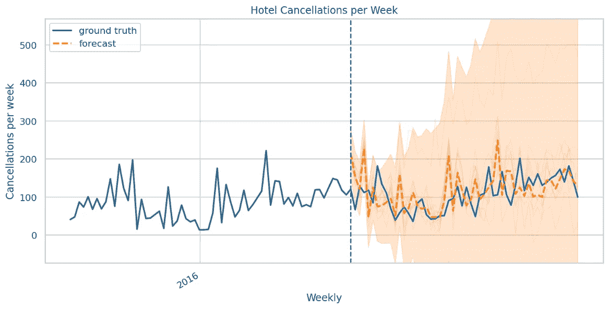
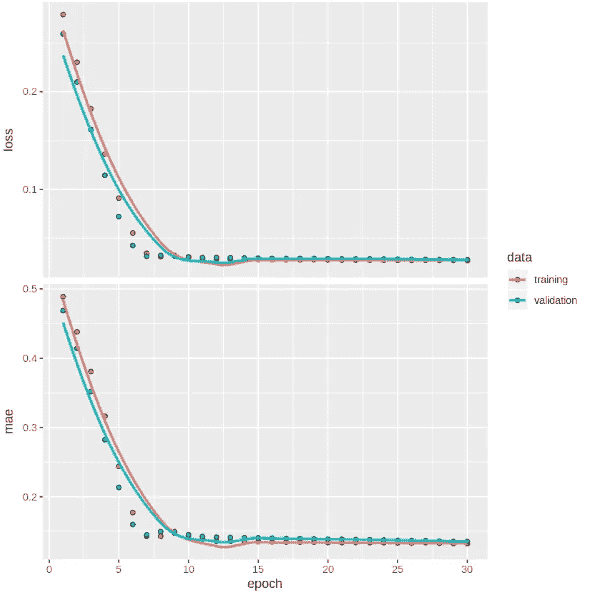
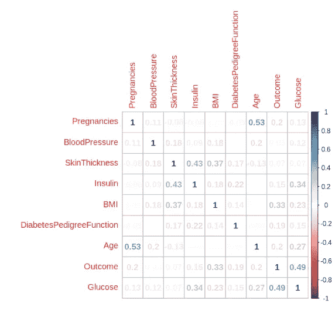
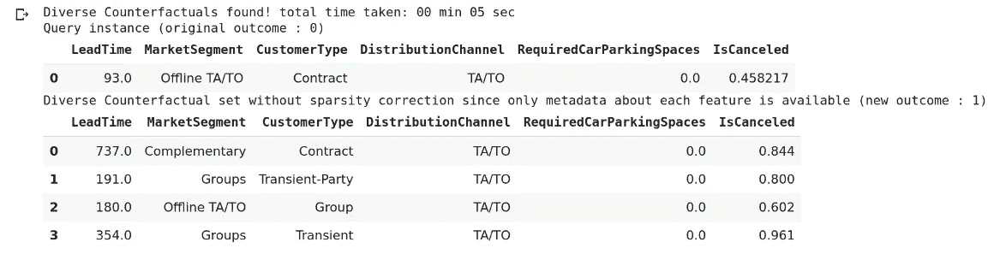

# 统计学家也应该学习张量流

> 原文：<https://towardsdatascience.com/statisticians-should-learn-tensorflow-too-58309441d3c2?source=collection_archive---------38----------------------->

## 统计学和机器学习在某种程度上一直存在分歧。下面是 TensorFlow 如何弥合这一差距。

委婉地说，统计学家总是带着一定程度的怀疑看待机器学习。

虽然统计学依赖于科学方法，并与任何学术领域一样受到同样的辩论和审查，但机器学习已经获得了“黑箱”方法的恶名，即数据只是被插入模型以产生结果，而结果不一定可靠。

来源:图片由 [ArtsyBee](https://pixabay.com/users/artsybee-462611/) 从 [Pixabay](https://pixabay.com/photos/mathematics-maths-computer-laptop-3821034/) 拍摄。

也就是说，如果知道如何正确利用统计学和机器学习，这两者的结合会非常强大。

以下是我个人经验中的一些例子，说明 TensorFlow 是如何变得更加“统计友好”的，以及为什么这个软件库应该得到统计界更多的关注。

## **1。TensorFlow Probability 是一个被低估的概率编程工具**

TensorFlow 最初发布于 2015 年，2018 年 6 月发布了第一版 TensorFlow Probability。

这个库结合了**概率编程**和**深度学习**的能力，以便对大型数据集进行统计分析。具体来说，TensorFlow Probability 强调了**贝叶斯方法**，它补充了 Python 中的 PyMC3 库，pym C3 库也实现了贝叶斯建模和统计分析。

我预计这个图书馆将对未来的统计学家变得越来越重要。随着数据集变得越来越大，人们越来越重视概率在时间序列分析中的作用，张量流概率在处理这两个方面非常有效。

在新冠肺炎事件发生之前，我一直在做一个关于酒店取消预订的兼职项目。该项目的部分目的是运行一些时间序列模型来预测给定酒店每周取消预订的数量。

然而，一个纯时间序列模型有其局限性，因为它不能解释极端情况下的时间，即全球疫情关闭酒店并导致取消预订的大幅增加。从这个角度来看，如果以今天的数据为模型，ARIMA 或 LSTM 等模型仍将被证明是非常不准确的。

也就是说，如果同样的数据用张量流概率建模会怎么样？

来源:Jupyter 笔记本输出

在查看该图时，我们可以看到，虽然也给出了线性预测，但该预测是基于后验分布建模的，以确定结果的范围。例如，我们可以看到，在极端情况下，取消订单可能会超过每周 500 个。

这使得酒店可以询问——在什么情况下酒店每周会有超过 500 次的取消预订——以及如何防止这种情况发生？

在进行预测时，张量流概率考虑到了*不确定性*，我预计这将变得越来越重要。

## **2。Keras 和 R 的兼容性强**

从 TensorFlow 版本开始，Keras 已经成为库的默认 API。

Keras 用于快速直观地生成深度神经网络。这种神经网络可用于设计分类和预测任务，以及用 LSTM 模型进行时间序列分析。

但是，Keras 也能够在 R 环境中运行，这一点不一定广为人知。

这为基础统计分析与机器学习模型的结合提供了一个强大的平台。

一个例子(在下面的参考文献部分引用)是使用序列模型来预测血糖水平。

该库附带了可视化训练和验证损失的工具，就像在 Python 中一样:

资料来源:RStudio

然而，R 用户也可以利用 R 中的许多统计函数来促进分析。虽然像 Python 中的 **pyplot** 或 **seaborn** 这样的库也可以生成相关图，但是使用 r

资料来源:RStudio

此外，R 还附带了一个名为 **MLMetrics** 的便利库，可以轻松计算损耗和精度指标。

从这个角度来看，希望利用机器学习的统计学家可以很容易地使用 Keras 在 R 中完成工作，而不是为了利用机器学习解决方案而必须学习 Python。

## **3。与微软的 InterpretML 等可解释库结合使用时非常直观**

最近，人们越来越重视让机器学习模型变得可解释。也就是说——让模型输出容易被人类理解。

例如，来自微软的 InterpretML 库的 DiCE 擅长于通过生成**不同的反事实解释**。例如，假设我们正在构建一个分类模型，以预测客户是否会根据不同的属性取消酒店预订，例如他们的原籍国、交付时间、客户类型等因素。

在本例中，DiCE 能够获取客户未取消预订的实例，并生成反例，即特征参数的变化会使客户更有可能取消预订。

来源:Jupyter 笔记本输出—解释

当使用 Keras 构建顺序模型时，DiCE 通过保留模型训练参数对此进行补充，即使数据本身必须在一段时间后删除，例如，由于数据隐私法规等。

从这个角度来看，机器学习正在发展到一个重点，即让结果更加直观和易于理解——从这个例子中我们已经看到，TensorFlow 可以在这方面很好地补充其他 ML 库。

## **4。必要时能够跨其他领域同时构建模型**

你可能是一名统计学家，但你能肯定地说你永远不需要跨另一个学科构建算法吗——例如自然语言处理或图像分类？

学习张量流和神经网络的美妙之处在于，不同领域的模型配置实际上可能非常相似。

例如，我第一次接触 LSTM(长短期记忆)网络是通过一门自然语言处理课程。然而，由于这种模型的序列性质(或理解观察值之间的依赖性的能力)，我了解到 LSTM 模型在建模不稳定的时间序列数据时实际上是非常有效的。这个模型不一定适合所有情况——如果一个时间序列有一个很强的趋势，那么更传统的模型，如 ARIMA 模型，往往会更好地工作。

然而，我发现自己使用 LSTM 来完成某些时间序列任务，因此在这种情况下，机器学习仍然与时间序列学科相关。

作为另一个例子，学习如何将 CNN(卷积神经网络)用于分类任务，可以更容易地理解如何使用相同的网络进行图像分类。通过这种方式，理解张量流神经网络如何运行也有可能打开其他学科的知识。

## **结论**

作为一个经常使用时间序列和统计方法的人，我发现 TensorFlow 在这些领域使用机器学习时非常有用。

我预计，随着数据量越来越大——越来越需要机器学习来及时有效地处理这些信息——同时仍然允许对结果进行直观的解释。

出于这些目的，我对 TensorFlow 印象深刻，它将继续成为我的数据科学工具包中的重要参考。

*免责声明:本文是在“原样”的基础上编写的，没有担保。本文旨在提供数据科学概念的概述，不应以任何方式解释为专业建议。*

## **参考文献**

*   [Antonio、Almeida 和 Nunes:使用数据科学预测酒店预订取消](https://www.researchgate.net/publication/309379684_Using_Data_Science_to_Predict_Hotel_Booking_Cancellations)
*   [GitHub:解释性文字](https://github.com/interpretml)
*   [GitHub:张量流概率](https://github.com/tensorflow/probability/releases?after=v0.3.0)
*   [文档:MLmetrics](https://www.rdocumentation.org/packages/MLmetrics/versions/1.1.1)
*   [TensorFlow 博客:概率编程介绍，现已在 TensorFlow Probability](https://blog.tensorflow.org/2018/12/an-introduction-to-probabilistic.html) 中发布
*   [走向数据科学——Keras 和 R:用序列模型预测血糖水平](/keras-and-r-predicting-blood-glucose-levels-with-the-sequential-model-596efe89a6b8)
*   [走向数据科学——利用结构化时间序列模型预测每周酒店取消预订量](/tensorflow-probability-predicting-weekly-hotel-cancellations-with-structural-time-series-modelling-eee0545f5f07)