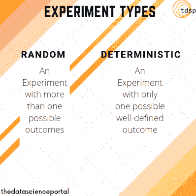
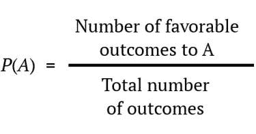
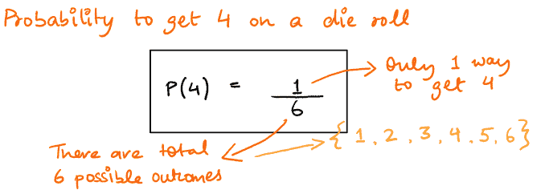
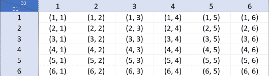
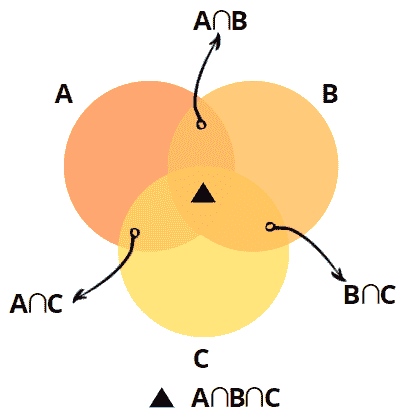
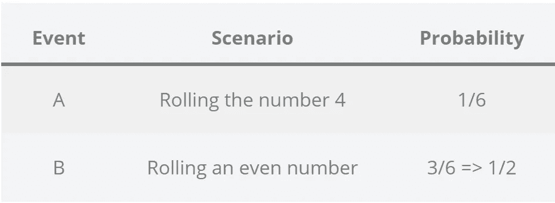
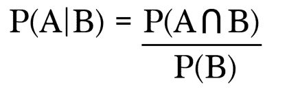
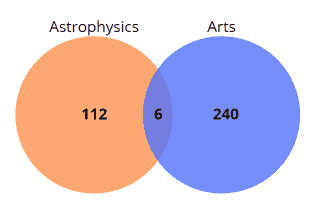

# 统计与概率:概率导论

> 原文：<https://towardsdatascience.com/statistics-and-probability-introduction-to-probability-3922a8596ab8?source=collection_archive---------16----------------------->

乔希·阿佩尔在 [Unsplash](https://unsplash.com?utm_source=medium&utm_medium=referral) 上的照片

## 想象你在一场比赛中。主人给你呈现了三扇门。其中一扇门后是一辆全新的奥迪，其余两扇门后是山羊。主人让你从这三扇门中选择一扇门，然后打开剩下的两扇门中的一扇门，展示一只山羊。现在告诉我，你是坚持你最初的门还是切换到另一个未打开的门去拿你的奥迪？

这就是著名的[天魔堂问题](https://en.wikipedia.org/wiki/Monty_Hall_problem)。如果我告诉你，通过学习概率的基础知识，你有更大的机会赢得这场比赛，并带着一辆全新的奥迪回家，会怎么样？当谈到机器学习时，统计和概率是被广泛忽视的主题。很多人倾向于忽略它们，因为它们看起来很难，可能没有机器学习那么酷。但是，为了理解和掌握一些最常用的机器学习算法背后的核心概念，至少熟悉统计和概率的基础知识是很重要的。这篇文章的目的是给你一个关于概率及其各种类型的有价值的介绍。除此之外，我们还需要解决天魔厅的问题，所以让我们来看几件重要的事情。

# 可能性

顾名思义，概率只不过是对一个*事件*发生的可能性的估计。也被称为*边际概率*，它只是一个反映事件发生可能性的数字。它可以是 0 到 1 之间的一个数字，也可以表示为一个百分比值。让我们一步一步来。

## 实验

我们将在概率论的背景下定义一个实验，概率论是数学的一个分支，专门研究概率。一个实验被定义为一个程序，虽然可以重复无数次，但仍然有一组明确定义的可能结果。

*随机 v/s 确定性实验。图片作者。*

一个实验可以有两种类型，我们根据结果来区分它们。两者都有一个例子:

*   随机实验:掷骰子可以得到 6 个值中的一个-{ 1，2，3，4，5，6 }
*   确定性实验:将一些特定的数字相加总会得到相同的结果

## 事件

一个事件是一个结果，或者更确切地说是一组我们可以计算概率的实验结果。实验的所有可能结果的集合形成了*样本空间*。所以我们可以说事件基本上是样本空间的子集。
比方说，我从钱包里拿出一枚硬币，然后抛硬币。这里的实验是抛硬币——可能的结果是什么？
可能是正面也可能是反面——你知道其中一个会是结果，但你不能说是哪一个。这意味着有两种可能性——正面着地或反面着地。

## 随机变量

在这样的情况下，正如前面提到的，我们说这个实验是*随机*的。任何代表这种随机实验结果的变量被称为**随机变量**。但是，你能说正面事件发生的可能性有多大吗？还是反面？

## 概率论直觉

因为翻转正面是这两个可能场景中的一个事件——{正面或反面}——我们说这个事件有 50%的概率是正面。同时也可以说有 50%的几率翻跟头。

*正面还是反面？照片由*[*rupixen.com*](https://unsplash.com/@rupixen)*上* [*下*](https://unsplash.com/?utm_source=the-data-science-portal&utm_medium=referral)

如果我们扩展这一逻辑，我们可以提出一个类似的方法，可以应用于其他领域和问题。让我们再研究一个这样的问题。

作者图片

假设我们有一个包。我们在袋子里放了三个不同颜色的球——{蓝色 O，绿色 O，红色 O}。
能知道拉出红球 O 的可能性有多大吗？
按照和我们掷硬币实验相同的逻辑，我们看到这里有三种可能的结果。当我们从袋子里拿出一个球时，我们可以得到这三种颜色中的一种。因此，我们得到红色的概率应该是 1/3。

## 同样可能发生的事件

为了让这一切以这种方式发生，也就是为了让这种直觉发挥作用，请注意，这些事件都有同等的可能性。这意味着每个事件都有完全相同的可能性或完全相等的机会发生。我们得到正面的可能性和得到反面的可能性一样大。同样，我们从袋子里拿出红色球的可能性和我们拿出绿色球的可能性一样大。不存在偏见或其他任何有利于某一事件的因素，它们都有相同的发生机会，因此这些事件被称为同等可能性事件。

## 形式定义

对于同样可能发生的事件，例如上述事件，概率公式表明，对于每个事件，概率将是特定事件可能发生的方式的数量与可能结果的总数的比率。换句话说，一个事件发生的概率是该特定事件发生的方式数与可能结果总数的比率。

如果你再看一遍，你可能会注意到这是怎么回事:

举个例子，看看这个:

在掷骰子上掷出 4 的概率是 1/6。图片作者。

## 概率的性质

*   所有概率都在 0 到 1 之间，包括 0 和 1
*   概率为 0 意味着事件是不可能的，它不可能发生
*   概率为 1 意味着事件肯定会发生

## 独立事件

从概率上讲，如果一个事件的结果不影响另一个事件的结果，那么这两个事件就被称为是独立的。一个例子是滚动一对骰子——其中一个骰子的结果不会影响第二个骰子的结果，我们可以得到总共 36 种不同的结果组合。

*一对骰子的组合。图片作者。*

但是谈论从一副洗牌的纸牌中抽出一张牌，每一次移动都会改变概率。假设我们想找出从一副洗得很好的牌中抽出方块 a 的概率。在第一次尝试中抽出这张卡的概率是 1/52。但假设第一步出黑桃 7，那么第二次出方块 a 的概率是 1/51，这意味着这不是独立的事件。

*照片由* [*杰克·汉密尔顿*](https://unsplash.com/@jacc) *上* [*下*](https://unsplash.com/?utm_source=the-data-science-portal&utm_medium=referral)

# 联合概率

为了解释什么是联合概率，我们将快速浏览另一个有趣的主题，集合论——处理集合的数学分支，简单地说，就是对象或元素的集合。看这张*维恩*图:

*集合论举例。图片作者。*

正如我们所看到的，有三个圆圈 A、B 和 C 相互交叉，每一个都代表某种东西。交叉区域的标签中也有奇怪的小符号— **∩** 。在集合论中，这些符号表示交集。如果我们认为 A、B 和 C 是集合，∩将表示这些集合中的那些元素，它们是这个符号两边的集合所共有的。例如，我们为了举例而假设——
A = { 4，22，10，19，97 }
B = { 30，3，9，19，97 }
这将暗示 A ∩ B = { 19，97 }

让我们再举一个例子——
事件 A =关注足球的人(我指的是英式足球，为了我亲爱的美国读者)
事件 B =关注板球的人
事件 C =关注 F1 的人

A ∩ B =同时关注足球和板球的人

A ∩ B ∩ C =关注所有这些运动的人

现在回到联合概率，我们可以把它定义为两个或两个以上事件同时发生的概率。在我们上面的例子中，(A ∩ B)是同时喜欢足球和板球的人。随机选择的一个人同时喜欢足球和板球的概率将是 P(A ∩ B)。如果你看上面的文氏图，这个人会出现在事件 A 和 B 相交形成的区域。

联合概率是一个重要的统计量，你可以找到各种各样的小问题来练习。这个概念要求两件事同时发生，而纸牌给了我们很多这样的情况，比如:

*   抽到一张既红又 2 的牌的概率有多大？
*   抽出一张既红又奇数的牌的概率有多大？

对于独立事件，联合概率仅仅是它们的边际概率的乘积。因此，如果事件 A 和 B 是独立的:

## -> P(A ∩ B) = P(A) * P(B)

# 条件概率

条件概率是在已知其他事件已经发生的情况下，某一事件发生的概率。所以如果 A 和 B 是两个事件，条件概率可以告诉我们，如果事件 B 已经发生，事件 A 发生的可能性。等等，这听起来很像联合概率。别担心，我们之前读过掷骰子的例子，现在让我们再看一遍。让我们来看两个事件:

*   事件 A —掷出数字 4
*   事件 B —掷出一个偶数

从我们所知道的，我们可以很容易地弄清楚这一点:

条件概率例子。作者图片

将这些作为两个独立的事件很好，但是如果我们确定事件 B 已经发生了，会发生什么呢？如果我们确定骰子已经掷出一个偶数，你认为得到 4 的概率是 1/6 吗？简短的回答是否定的。现在我们知道我们的结果肯定是一个偶数，我们的可能结果集从{1，2，3，4，5，6}减少到{2，4，6}。这意味着现在从这一组中掷出 4 的概率应该是 1/3——所以我们得到 4 的机会是以前的两倍。显然，仅使用忽略事件 b 的新信息的边际概率是不明智的。如果我们将这种方法形式化，我们将得出:

*条件概率——给定 B 已经发生的概率。*

联合概率和边际概率就是这样走到一起，形成条件概率的。左手边的术语 P(A/ B)代表这样的陈述——假设事件 B 已经发生，事件 A 发生的概率。例如，让我们谈谈云和雨(以及它们让你感觉如何？).假设你想知道今天多云，有多大可能下雨。我们所需要的是雨和云出现的联合概率以及雨的边际概率，我们就能找出这一点。

让我们做另一个示例问题来解决这个问题。这里我们有一个学习天体物理学和艺术的学生的维恩图(一群有趣的学生)。如果他们正在研究天体物理学，我们能找出他们研究艺术的可能性吗？

*条件概率例子。图片作者。*

从图像中我们可以计算出这些东西:

*   p(天体物理学)= 112/358
*   p(艺术)= 240/358
*   p(天体物理学∩艺术)= 6/358

现在，我们想知道一个已经在学习天体物理学的学生学习文科的概率:

P(艺术/天体物理学)= P(天体物理学∩艺术)/ P(天体物理学)
= > 6/112

这给了我们学习这两个科目的学生与只学习天体物理学的学生的比例，这就是我们如何找到条件概率的。

现在，让我们回到我们的蒙蒂霍尔问题。这个问题有很多解决方案，打开维基百科页面就会看到所有的解决方案。

 [## 蒙蒂·霍尔问题

### 蒙蒂霍尔问题是一个脑筋急转弯，以概率谜题的形式，大致基于美国电视…

en.wikipedia.org](https://en.wikipedia.org/wiki/Monty_Hall_problem) 

我们将讨论“简单解决方案”。看这张表，假设我们总是选择门 1:

作者图片

正如你所看到的，一个简单的结果表格显示，如果你换成 2/3，你有更高的概率赢得比赛。让我们快速浏览一下这个例子。在第一个场景中，我们的奥迪在 3 号门后面。我们已经选择了 1 号门，所以主人将打开 2 号门来展示一只山羊。如果我们选择 1 号门，我们就输了。如果奥迪在 2 号门后面，主人会打开 3 号门露出一只山羊，再次切换到这里将为我们赢得比赛。这意味着 2/3 次的交换会导致胜利。只有在情景 3 中，如果他们选择留下，我们就赢了——这有 1/3 的概率。

在这篇文章中，我想给你们简单介绍一下概率的所有概念，我希望你们喜欢这篇文章，请在评论中告诉我你们对内容的看法！
快乐阅读！

*原载于 2020 年 10 月 3 日*[*【https://thedatascienceportal.com】*](https://thedatascienceportal.com/statistics-and-probability-introduction-to-probability/)*。*

 [## 数据科学门户

### 大家好，欢迎来到数据科学门户网站。这个空间致力于学习和理解所有令人兴奋的…

thedatascienceportal.com](https://thedatascienceportal.com)