# 统计:集中趋势

> 原文：<https://towardsdatascience.com/statistics-central-tendency-5e514a2f98fd?source=collection_archive---------34----------------------->

## 数学和 Python 编码示例，解释汇总数据的有用方法

照片由 [Unsplash](https://unsplash.com?utm_source=medium&utm_medium=referral) 上的[agency followeb](https://unsplash.com/@olloweb?utm_source=medium&utm_medium=referral)拍摄

在我们寻求汇总数据的过程中，无论是通过[数据表](https://medium.com/@pribanerjee01/basic-statistics-data-and-its-representation-f15a9110ffc0?sk=c24d75fe67bedf28be9748b85062e41d)还是[视觉效果](https://medium.com/@pribanerjee01/statistics-telling-stories-with-data-visualization-904ceddf2afb?sk=bdfc2bb6c6b9b20a1f899fa821b81192)，我们都希望呈现数据的整体。然而，我们常常希望有一个点能够代表手头的数据。在数据序列中使用任何极值只能解释序列的一端。因此，使用一个中心值，其中一些观测值比它大或小，这可能是有用的。这样的一种度量叫做*。然而，一个中心点能说明整个故事吗？您知道有些值比中心趋势值大或小，但是它并不涉及数据的分布或异质性。这就是 ***色散*** 的措施。这两个概念构成了许多高级统计概念的基础。*

*本文的目的是描述**集中趋势**的不同度量，并介绍一些简单的 python 代码来解释如何在实践中看到它们。我将在后续文章中尝试分享一些关于 [**色散**的知识。](https://medium.com/@pribanerjee01/statistics-gauge-the-spread-of-your-data-7aa9368a5bf3)*

*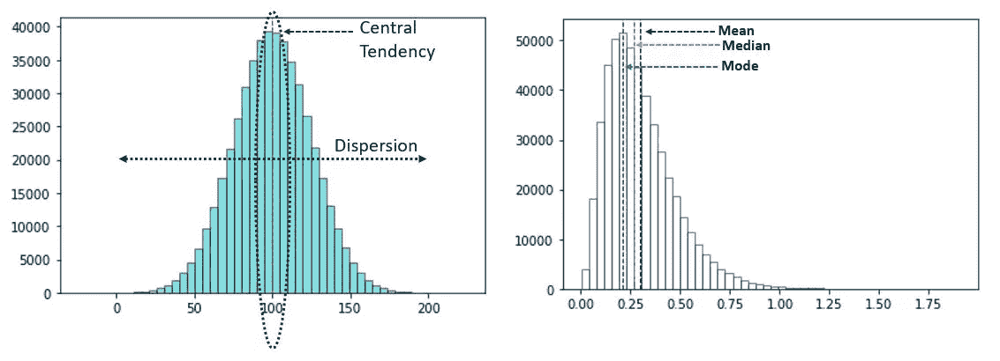*

*图 1:图像中绘制数据的集中趋势和分散*

# *集中趋势*

*下图可以很容易地展示不同的集中趋势指标:*

**

*图 2:集中趋势的不同度量*

*从图中可以明显看出，集中趋势可以分为 3 类——均值、中值和众数。在我们进入每一个细节之前，有必要看一下由 Udny Yule 教授定义的理想的集中趋势测量的必要性质*

*   *该度量需要基于数据中的所有观察值，*
*   *基于所有的观察，*
*   *受采样波动的影响尽可能小*
*   *严格定义、易于计算、易于理解和*
*   *有可能做进一步的数学工作*

*考虑到这一点，让我们看看下面不同的集中趋势的措施。此外，这里值得注意的两个概念是**人口**和**样本。** **总体**是数据集中所有可能观察值的集合，而**样本**是使用不同技术从总体中抽取的子集。*

## *平均*

*平均值是通过对一个数据系列中的所有观察值进行各种数学运算来计算的:*

*   ***算术平均值:**最容易计算的度量之一，算术平均值定义为一个数据序列中所有观测值的总和除以该序列中所有观测值的计数。数学上，*

*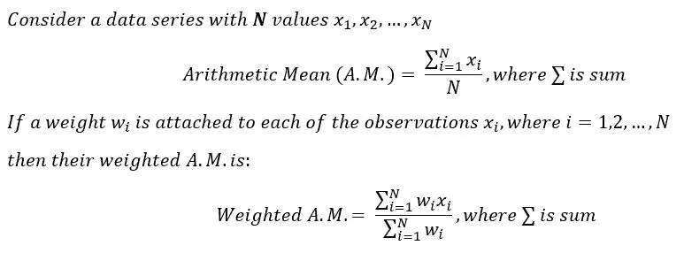*

*这里要注意的一个有趣的 A.M .特性是，如果一个系列中的每个观测值以相同的常数增加或减少，新系列的 A.M .也会以相同的常数增加或减少。*

*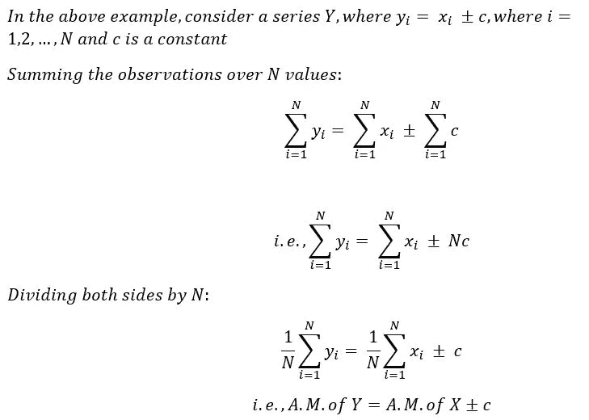*

*   ***几何平均值:**几何平均值定义为一个数据序列中 n 个观测值乘积的第 n 个*根。数学上，**

*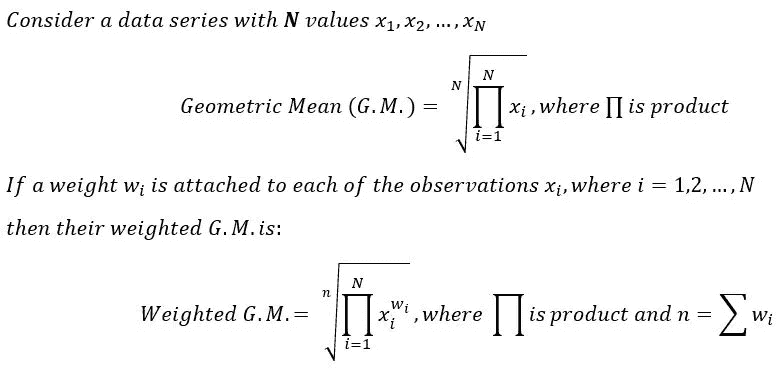*

*如果计算可以更进一步，很容易看出对数的使用可以使计算更容易。*

*   ***调和平均值:**调和平均值是一个数据序列中所有观测值倒数的算术平均值的倒数。通过使用倒数，调和平均值对较小的观测值给予较高的权重，对较大的观测值给予较低的权重，因此在数据中有一些非常大或非常小的观测值时很有用。数学上，*

*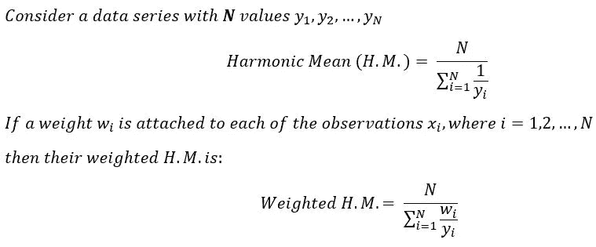*

*三种类型的平均值之间的有用关系是(查看下面的 Python 代码进行演示):*

*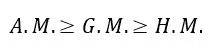*

*这个关系有一个详细的数学证明，我将在正文中跳过，在后续版本中单独提供。*

## *中位数*

*在一系列的观察中，中位数被定义为最中间的值。在一个离散序列中，如果观测值的计数是奇数，那么中位数就是*有序序列*的第(N+1)/2- *个观测值。然而，如果离散序列有偶数个观察值，则中位数近似为有序序列*的第(N/2)*个*和第(N/2)+1- *个*个观察值的算术平均值。*

*例如，如果有一系列观察值:8，12，151，7，5，10，8，9，11。有序数列(升序)为:5，7，8，8，9，10，11，12，151。该系列有 9 个观察值，因此(9 + 1)/ 2 =第 5 个观察值是中间值，即 9。现在，假设我们添加另一个观察值，比如 6。新的有序序列是:5，6，7，8，8，9，10，11，12，151。该系列现在有 10 个观察值，这是偶数。因此，中位数是(10/2)=第 5 次和(10/2+1)=第 6 次观察的算术平均值，即(8 + 9)/2 = 8.5。*

*如果有离散或连续数据的频率分布，而不是上述的单个序列，会怎么样？*

*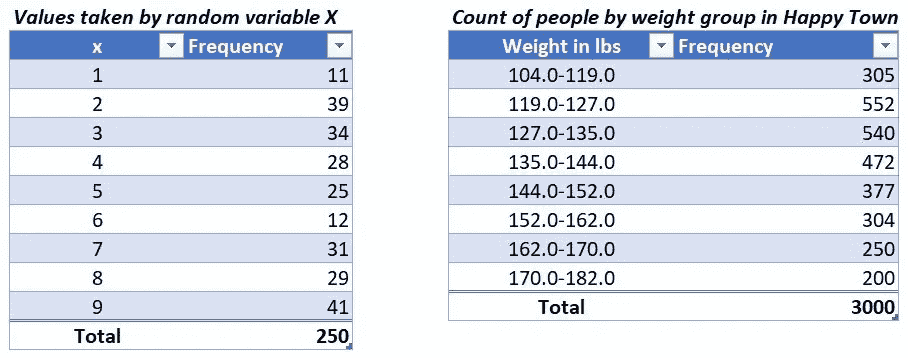*

*图 3a(左)和图 3b(右):不同类型数据的频率表*

*我们参考类似图 3a 和 3b 的频率表。3a 中的表格稍微简单一些，所以让我们先来解决这个问题。这里的观察总数是 250，这是偶数。因此，中位数将是第 N/2 = 125 次观察。通过查看累积频率(图 4)，可以确定第 125 次观察。在列出离散观察值的表 3a 中，我们预计第 125 次观察值为 5。为什么？有 112 个观察值≤ 4。接下来的 25 个观察值为 5。因此，给定 112 + 13 = 125，这意味着在最后 4 次观察之后的第 13 次观察应该是 5，因此是中值。*

*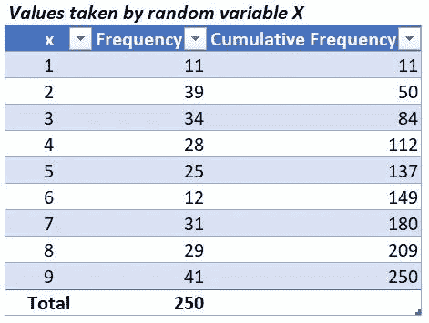*

*图 4:查看累积频率(即，直到特定点的观察总数)有助于确定中值*

*接下来，我们来看 3b。按照上面的方法，我们可以发现中位数位于 46-55 级，但我们不知道一个确切的点。能找到吗？答案是肯定的。更多的时候，可以通过绘图从数据中得到答案。本例中的累积频率可针对重量等级的每个限值进行计算(如图 4 ),并绘制成图表:*

*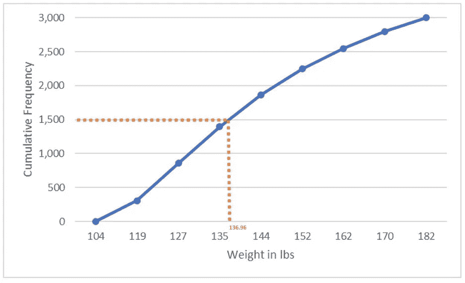*

*图 5:一个**卵形图**,显示了小于特定重量值(磅)的累计观察计数。)*

*假设数据中有 3000 个观察值(N)，中值将是第 N/2 = 1500 个观察值，位于 135-144 磅范围内(这是**中值类别**)。根据上面的图表(图 5)，如果你在横轴上画出对应于纵轴上累积频率= 1，500 的点，你会发现重量约为 137 磅。因此，平均体重约为 137 磅。这种曲线被称为**卵形。**这可以概括为一个数学公式:*

*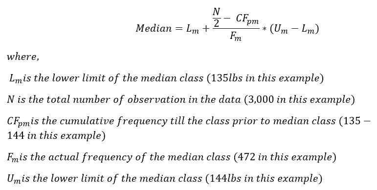*

*当这些值被替换时，本例的中值为 136.96。*

## *方式*

*众数被定义为在一系列观察中最频繁出现的值。考虑像 9、1、10、9、3、7、4、9、5、6 这样的简单序列，模式是 9，因为它出现得最频繁，即 3 次。一个系列中可以有多个模式，也可以没有模式。例如，10，11，13，11，10，15，17，12 有两种模式，即 10 和 11，而像 2，6，3，2，6，3 这样的序列没有模式，因为所有元素都具有完全相同的频率。模式可以通过观察数据序列来计算。在如图 6 所示的连续分布的情况下，有一个数学公式可以使用。*

*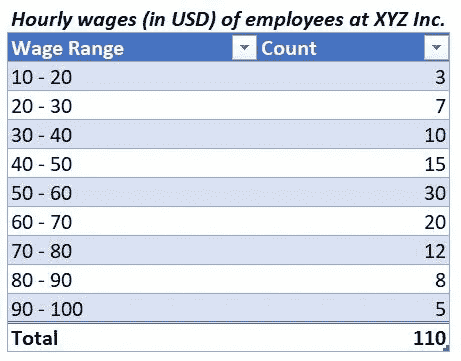*

*图 6:员工时薪数据*

*50-60 美元级别的频率最高，因此是**模态级别**。在具有范围的连续分布的情况下，计算模式值的数学公式如下:*

*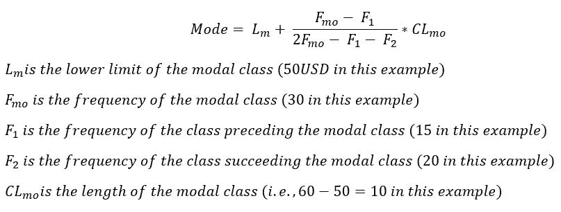*

*代入上述示例中的值，此数据的模式为 56。*

## *集中趋势的不同度量的比较*

*我们已经在文章的前面看到了集中趋势的理想性质。让我们比较基于属性的集中趋势的不同度量，并看看它们的一些最常见的用法:*

*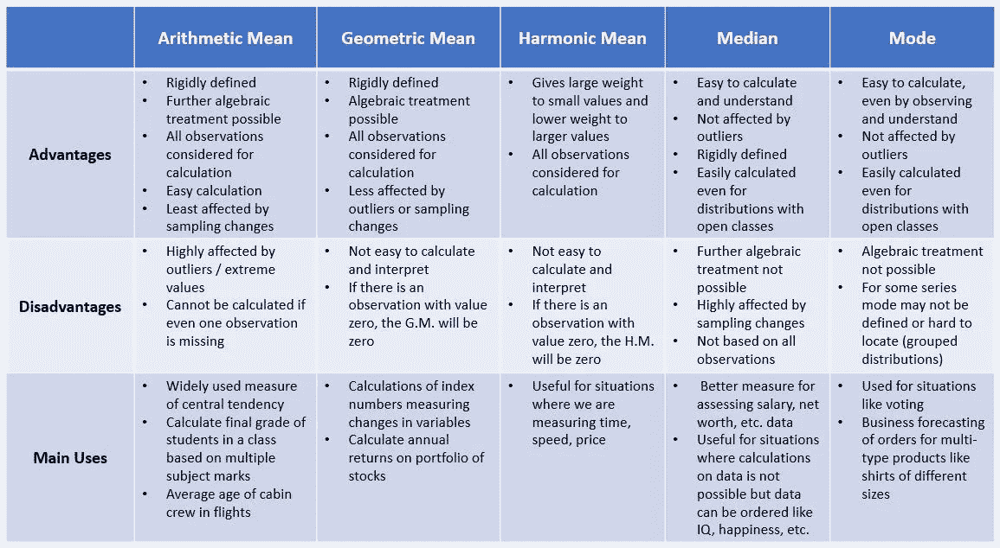*

*图 7:集中趋势的不同度量的比较*

## *一些 Python 代码来观察中央趋势*

*本节并不打算介绍或教授 Python 编程语言，但下面嵌入的代码将帮助对 Python 有基本熟悉的用户从各种数据序列中计算集中趋势。*

*本文介绍了计算集中趋势的基本原则，还介绍了新时代的计算资源，如 Python，它可以使计算海量数据的任务变得更加容易！集中趋势是所有进一步高级统计工作的基础概念，在处理高级数据分布之前需要很好地理解。*

*下一个需要理解的最重要的概念是离差的度量，我将在我的下一篇文章中解释这个概念。*

****阅读我下一篇用数学公式和 Python 编码描述离散度的文章*** [***这里***](https://medium.com/@pribanerjee01/statistics-gauge-the-spread-of-your-data-7aa9368a5bf3) ***。****