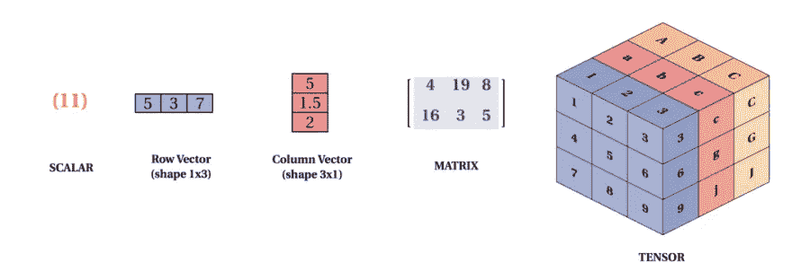
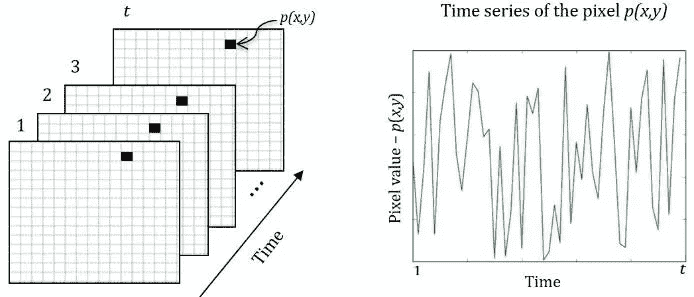
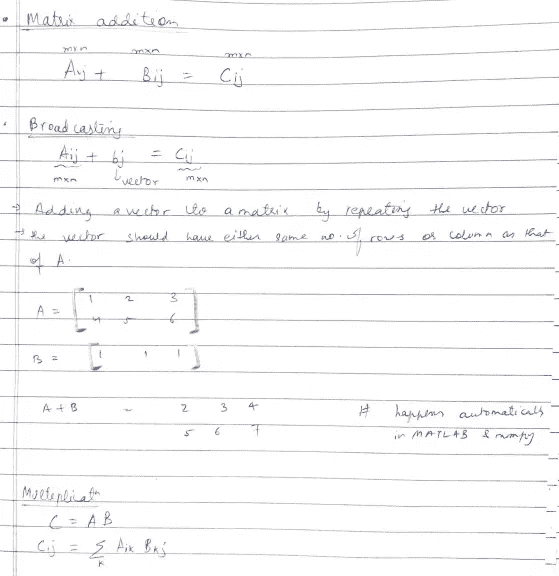
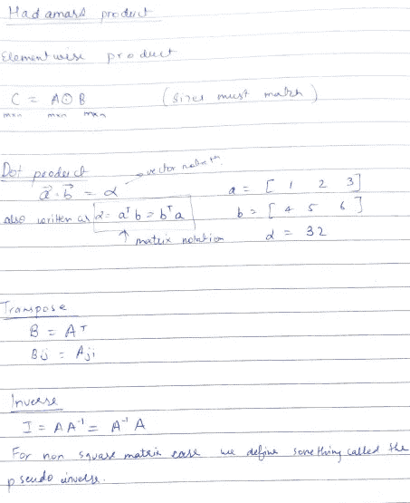
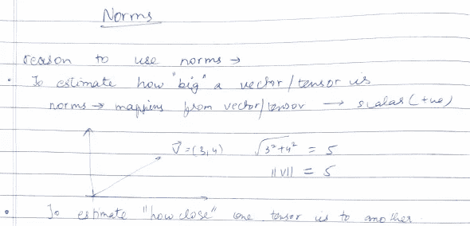
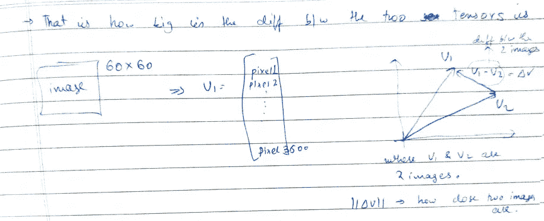
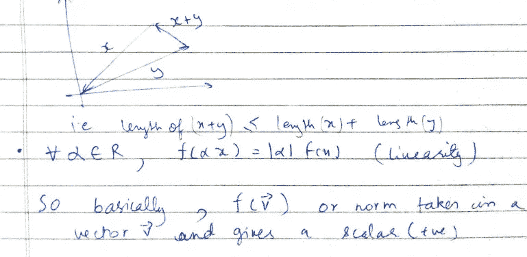
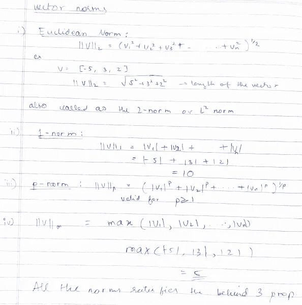
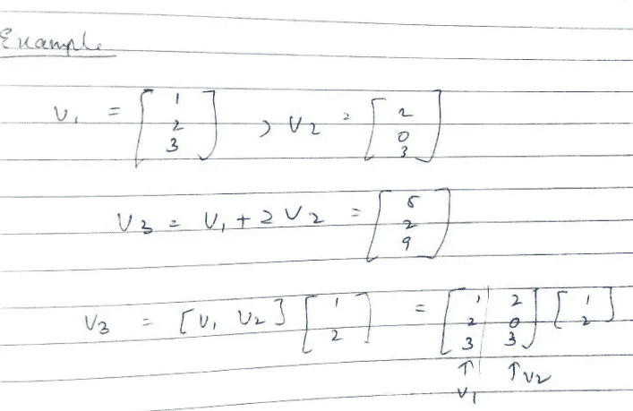
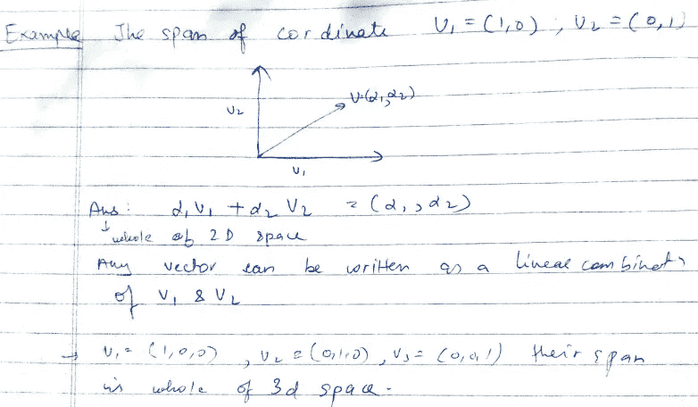

# 人工智能统计学(第一部分)

> 原文：<https://towardsdatascience.com/statistics-for-ai-part-1-4f4a0bef04e?source=collection_archive---------35----------------------->

## 构成复杂算法基础的向量和矩阵概念

# 介绍

在许多机器学习算法中，输入和输出都是向量(数字的集合)。我们处理的输入——图像、声音、颜色等，必须转换成数字，以便计算机能够理解和处理。在 ML 中，向量是一个数字数组。向量的一个例子是 X=[x1，x2，x3，…..，xn】。类似地，张量可以定义为维数大于 2 的数字数组。彩色图像是张量的一个例子，因为它具有 3 维，即长度、宽度和通道。标量被认为是 0 阶张量，而矢量被认为是 1 阶张量。这里要注意一点，通常一个 60×60 像素的图像(以 60 为例)，或者一个 60×60 的矩阵被展开成大小为 3600 的单列矩阵。矩阵被认为是二阶张量。视频数据可以被视为 4 阶张量-Nx×Ny×3 是 3 维，时间是第 4 维。

标量、向量和张量的可视化解释。图片由 Mukesh Mithrakumar 提供

视频数据可以被视为 4 阶张量-Nx×Ny×3 是 3 维，时间是第 4 维。在任何给定时刻，如果我们希望知道特定像素的值，必须指定 4 个参数:像素 x 位置、像素 y 位置、它所属的通道以及时刻。在缺少任何一个参数的情况下，不能确定像素的精确值。

一个像素在时间上的变化，由[玛格丽特·西莫埃斯](https://www.researchgate.net/profile/Margareth_Simoes)拍摄

# 一些基本的矩阵运算

一些基本的矩阵运算，作者图片

矩阵相加是通过将一个矩阵 A 的位置(I，j)值与另一个矩阵 B 相加得到结果矩阵 c 来实现的。现在，有时一个矩阵的维数可能与另一个不匹配，就像上图中的示例，其中矩阵 A 的维数是 2X3，而 B 的维数是 1X3。现在，如果我们使用 NumPy 库或 MATLAB，广播就完成了，这意味着创建了矩阵 B 的重复行，然后进行加法。像加法一样，矩阵乘法发生在矩阵的所有元素上，如上图所示:在 kσA(I，k)B(k，j)的值上。

一些基本的矩阵运算，作者图片

Hadamard 乘积是运算中两个矩阵之间的逐元素乘积。为了实现这一点，矩阵应该具有彼此相同的大小。运算中矩阵的点积总是产生一个标量积。为了产生两个向量的点积，一个向量(a.T)的转置应该与另一个向量(b)相乘。转置是一种行和列互换的操作，即 A(i，j)=B(j，I)。只有当 A × A-1 = A-1 × A = I 时，A 的逆才是 A-1

# 向量的范数

向量的规范，作者的图像

我们使用范数的原因是，它告诉我们一个向量或张量有多大。范数基本上将向量或张量映射为标量值。在上图中，坐标为(3，4)的向量 v 的大小为 5。我们可以说向量 v 的范数是 5。

两个图像的接近程度，作者的图像

如前所述，一个 60X60 的图像被展开成一个列向量，比如 V1。向量 V1 保存图像中 3600 个位置的像素值。类似地，矢量 V2 将具有第二图像的像素值。这些向量绘制在图像右侧的图表上。通过计算两个向量之间的差并取其范数，我们可以推断出这两个图像的相关程度。差异越小，图像之间的相似性越大，反之亦然。范数是度量向量、矩阵等的长度的一种方法。

如果长度为 0 的向量在数学上是 0 向量，则范数是满足以下三个性质的函数 f:

1.  f(x)=0 意味着 x=0
2.  f(x+y)≤ f(x)+f(y)
3.  f( **α** x)=l **α** lx

第二个等式也被称为三角形不等式，它表示两条边的长度大于第三条边的长度。

这里，两个向量 x 和 y 有一个合成向量 x+y，它总是满足三角不等式规则。对输入向量的任何标量乘法(α)将导致标量与向量的范数的直接相乘。在下图中，提到了欧几里德范数、1-范数、p-范数和无穷范数的公式。

规范类型，按作者分类的图像

# 线性组合

向量集{V1，V2，V3，…，Vn}的线性组合是通过将每个向量乘以相应的标量系数并将结果相加给出的，即α1 v1**+**α2 v2**+**α3V3**+…..+** αnVn

在下图中，矢量 V3 可以看作是矢量 V1 和 V2 的线性组合。V3 可以表示为两个向量 V1+2V2 的和。此外，矩阵乘法可以用列的线性组合来解释。

一个线性组合的例子，作者图片

# 跨度

一组向量的跨度是通过原始向量的线性组合得到的所有向量的集合。

向量的跨度示例，图片由作者提供

如上图所示，坐标(1，0)和(0，1)的范围是整个 2D 空间。任何向量都可以写成 V1 和 V2 的线性组合。类似地，坐标(0，0，1)、(0，1，0)和(1，0，0)的跨度是整个 3D 空间，因为任何向量都可以由上述三个向量的线性组合来表示。矩阵中所有列的跨度称为列间距。只有当 B 位于 a 的列空间时，方程 AX=B 才有解。

更多的话题将在后续的博客中讨论。敬请期待！！