# 数据科学统计学 Python 描述性统计初学者指南

> 原文：<https://towardsdatascience.com/statistics-for-data-science-a-beginners-guide-to-descriptive-statistics-in-python-9e0daa30809a?source=collection_archive---------16----------------------->

## 使用 Excel、Python 和真实业务问题的集中趋势、分散性、标准差和相关性的工作示例


照片由 [Unsplash](https://unsplash.com?utm_source=medium&utm_medium=referral) 上的[agency followeb](https://unsplash.com/@olloweb?utm_source=medium&utm_medium=referral)拍摄

# 介绍

统计学是数据科学中非常需要的组成部分。为什么是统计学？简单来说，在开发任何模型之前，我们需要 100%确定我们正在处理的数据。总的想法是，**“建议对任何**机器学习算法**使用干净的数据”**，否则模型最终会产生与预期相反的结果。把它想象成一个画家，他开始画肖像，但是使用的调色板不够干净。这会产生一幅将要被拍卖的画还是会留在房子的一个角落里？

但是等等。统计没那么简单。在使用任何假设或方法之前，需要验证多种基本理论。我们都熟悉**钟形曲线**或用于展示数据正态分布的曲线。如果你熟悉统计学的基本原理，你会意识到正态分布是一个概率函数，它描述了一个变量的值是如何分布的**。***X 轴表示数据点，Y 轴表示给定点的概率密度估计值*。迷茫？稍后我会解释清楚。但总的想法是，作为一个初学者，我们不需要为统计学的每一个组成部分而烦恼，而是专注于更有用的部分。

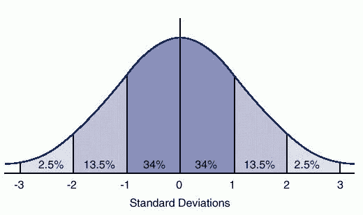

图一。图示了钟形曲线或正态分布图。图片致谢—可在此处找到[。](http://nationalpainreport.com/living-well-bell-curve-8821914.html)

# 统计类型

统计可分为**描述性**和**推断性**。描述统计学讨论数据汇总、表格、图形和图表，而推断统计学是一种讨论样本总体参数的方法。所有足球迷，梅西在一个赛季打进 48 球是描述性统计。关于他赢得冠军联赛决赛的机会，这告诉了我们什么，这是推断性的统计数据。我们如何从对梅西表现的描述转向他赢得冠军联赛的概率反映了统计之旅？它更多的是回答“是什么？”vs .“还可能是什么？”。

# 统计学中的重要术语

*   **群体** —给定场景中所有可能数据的范围。例如，在银行有贷款账户的所有客户
*   **样本** —来自给定人群的一组观察值。例如，上个季度在银行有贷款账户并选择客户关怀服务的所有客户都是一个样本。他们与我们最初谈到的客户是相同的，但是，我们只是过滤掉了那些在上一个季度选择了客户服务的客户，因此这是一个样本
*   **参数** —与总体相关的数字汇总或数值。例如，在银行有贷款账户的所有客户的平均债务
*   **统计** —与样本相关的数字汇总或数值。例如，在一周开始时选择客户服务机构的客户的平均呼叫次数

通常不会观察到群体，原因是在处理数据时，我们无法访问问题空间的每个实体。此外，在整理过程中经常会出现数据泄漏或数据丢失。因此，每个数据都被视为总体的一个子集。

# 数据类型

数据类型是统计学的重要组成部分，因为它决定了可以对数据执行的描述或推理操作的类型。如下图所示，所有变量(通常指属性、数据、列)都可以分为两类:定性的**和定量的**。定性数据允许计数、图形、绘图、模式等操作，而定量数据允许均值、中值、模式、标准差、四分位数等操作。

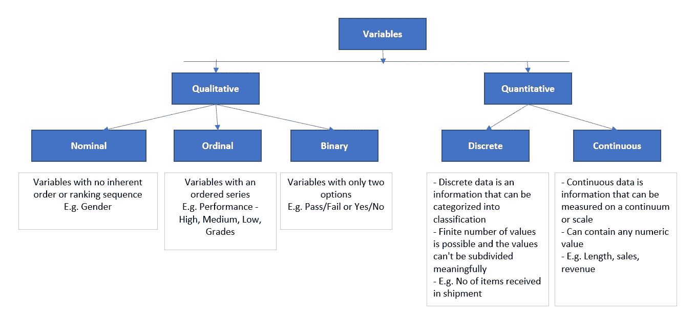

图二。说明了变量类别。图片来源——由作者使用 Excel 开发。

# 数据和直方图

原始数据以收集数据的原始格式表示数字和事实。需要将原始数据转换成可用于决策的形式。**提取的数据→转换成信息→然后用于获取关于场景的知识**。描述性统计更多的是将数据转化为信息。现在开始，让我们先看看频率分布。频率分布用于将原始数据分类成信息。使用频率分布的一个常见示例是使用直方图分析不同时段的数据计数。

数据范围被分成多个仓。然后，这些箱用于计算每个组下的记录数。例如，我们可以访问 K Mart 封锁后两周的销售数据。我们希望分析不同时段的销售价值。在下面的例子中，我们可以观察到，在过去的两周中，有三个实例观察到的数字在 44 到 46 之间。利用这一点，我们可以分析，**销售数字在不同的日子里是不同的，还是在锁定后是相似的？你怎么想呢?**

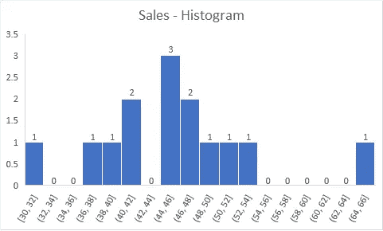

图 3。使用直方图获得的销售数据的分布。图片来源——由作者使用 Excel 开发。

# 理解中心趋势

从这里开始，我们将举例来理解统计的概念。K Mart 超市记录了他们在墨尔本的商店在封锁后的销售额。现在，他们使用一个中心趋势来分析他们在九月最后一周的业务进展情况。以下是店长想要回答的三个问题。
1。平均销售量是多少？
2。上周销售额的中位数是多少？
3。大部分日子的“销量”都差不多吗？

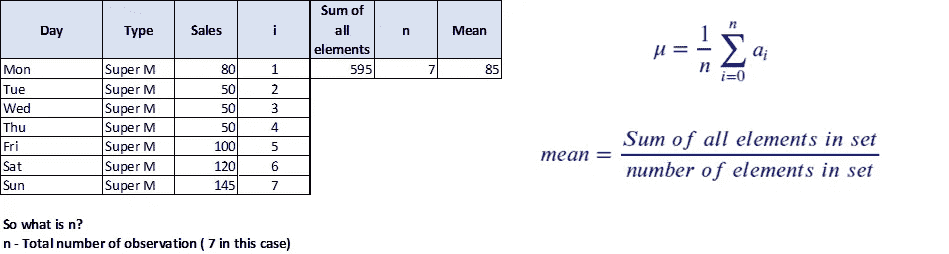

图 4。显示了九月最后一周的销售汇总。图片来源——由作者使用 Excel 开发。注意在求和函数中，I 的范围是从 1 到 n，而不是从 0 到 n。

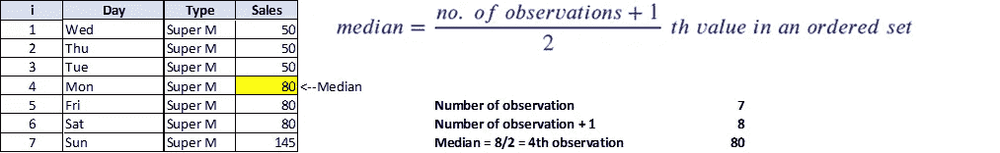

图 5。显示了九月最后一周商店的销售额中值。图片来源——由作者使用 Excel 开发。请注意，数据按升序排列，以计算中值。

使用图 4 和图 5，我们可以回答锁定后观察到的趋势。一般来说，观察到的平均销售量约为 85 台，而中位数和众数分别为 80 和 50。该模式为我们提供了锁定后观察到的趋势的更大画面。**我们能否推断出 K Mart 锁定后的销售量通常为 50 件？**

# 理解分散

简单地说，离差表示分布围绕中心趋势的扩散程度。范围是所有度量中最简单的。它被计算为给定数据中最小值和最大值之间的差。如果最大数据等于最小数据，则意味着所有的观察结果都是相同的。然而，当差异大于 0 时，我们可以推断数据是分散的。例如，在下图中，当我们按天查看销售量时，我们可以推断最小和最大销售额分别为 30 和 65。因此，这里的范围是 65-30，也就是 35。离差的变化提供了锁定后观察到的销售范围的图片。

**注意:**范围不适用于最大值或最小值变得极端的情况，即如果最小值太小或最大值太大，我们应避免使用范围。

下面这个例子中的中值是多少？

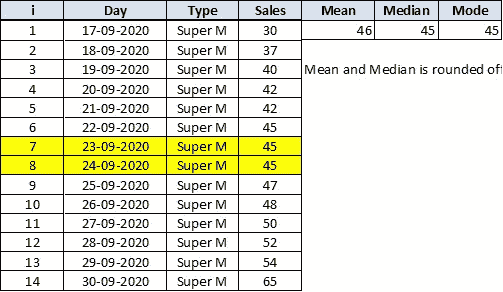

图 6。说明了九月最后一周的销售趋势。图片来源——由作者使用 Excel 开发。请注意，数据按升序排列，以计算中值。

观察数量= 14，因此中值是第 7 和第 8 个值的平均值(n/2 + ((n/2) + 1)) *第*次观察除以 2，因此为 45。第 7 和第 8 个值分别为 45 和 45。

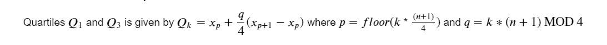

一级方程式赛车。展示了从一组数据点计算 Q1 和 Q3 的过程。该配方是作者使用乳胶开发的。

让我们分别计算一下 **p** 和 **q** 。对于 **Q1** ， **p=floor(1*(14+1)/4)** 为 3， **q=(1*(14+1)) MOD 4** 也为 3。 **MOD** 是除法运算的模或余数，下限取一个值的最小整数(例如，3.7 的下限是 3)。所以**Q1 = X*3*+3/4(X*4*—X*3*)**其中 X3 和 X4 是有序集合中的第三和第四个值。因此，根据下面的例子，X3 和 X4 分别是 40 和 42，因此 Q1 = 40+(3/4)*(42–40)= 41.5，类似地，Q3 = 50+(3/4)*(52–50)= 50.5。四分位数范围由 Q3-Q1 给出，即 50.5–41.5 = 9。

离差提供了关于数据的广泛信息，并被用作检测和处理异常值的关键概念。离差提供关于数据分布的信息，并回答关于变量趋势的关键问题。

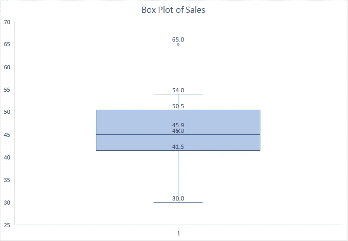

图 7。展示了九月最后一周销售的箱线图。图片来源——由作者使用 Excel 开发。

箱线图展示了销售数字是如何分布的。注意，中位数是 45，Q1 和 Q3 值分别是 41.5 和 50.5。IQR 被表示为 Q3-Q1=9。任何超过 Q1-1.5 倍或 Q3+1.5 倍的值，即 28 和 64，都被视为异常值。由于 65(9 月 30 日观察到的销售数字)超出上限，因此被视为异常值。

# 标准偏差

标准差是对一组值或观察值的变化量或离差的度量。标准差计算为方差的平方根。方差是衡量数据点与平均值相比有多远的指标。低标准偏差表示值更接近平均值，而高标准偏差表示数据的极端值或偏斜度。像离差这样的标准差被用作分析数据分布的度量。

是时候拿起计算器算一算了。方差和偏斜度的公式显示在图像的右侧。标准差可用于回答许多问题，包括:

*   我们是否观察到销售的变化？—是，观察最小和最大数值
*   销售数字相差多少？—平均销售数字介于 38 和 54 之间，这是平均值的+- 1 标准偏差
*   有多少天观察到了上面提到的这种趋势？— 79%的销售数字介于 38 和 54 之间，这意味着尽管我们观察到了销售的变化，但与分布相比，这种变化还不够显著

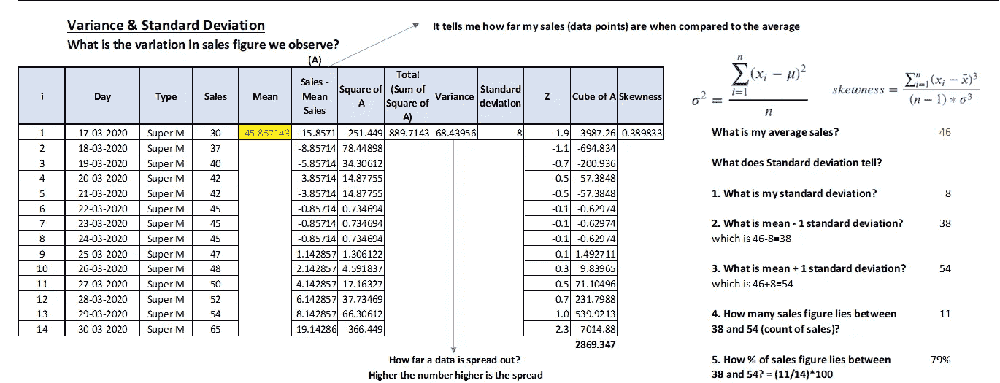

图 8。显示了九月最后两周销售的标准差。图片来源——由作者使用 Excel 开发。

# 相互关系

相关性是对两个变量之间关联程度的度量。它为一个变量相对于另一个变量如何变化提供了一些方向性。相关性可以在-1 到+1 之间，其中-1 表示两个变量负相关，即如果一个变量增加，另一个变量减少，反之亦然。相关性为 0 表示两个变量之间没有关系，即一个变量的增加或减少不会影响另一个变量。+1 的相关性表明，如果一个变量增加，则另一个变量显示类似的趋势。永远记住，相关性并不意味着因果关系。只说关联度。

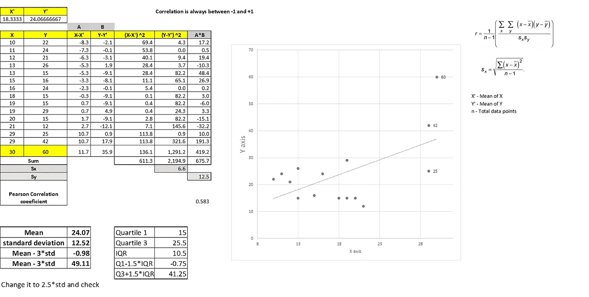

图 9。说明了两个变量 X 和 y 之间的相关系数。图片来源-由作者使用 Excel 开发。

# 为什么要为这些统计数字伤透脑筋呢？

统计数据有助于我们理解以下内容:

*   任何 KPI 的平均值(关键绩效指标，如销售额、客户数量、NPS、收入、购物篮等。)
*   均值、中值和众数是缺失值最常用的插补方法之一
*   这些中心趋势帮助我们验证数据的质量，并将它们与领域知识结合起来。例如，对于杂货店来说，与一年中的其他时间相比，在节日期间平均销售量会增加。当获得一个数据并观察到平均数字时，如果中心趋势与已知的显著不同，我们需要检查数据质量
*   线性回归、逻辑回归、神经网络遵循某些假设，这些假设使用相关性、异常值检查等进行验证

# 使用 Python 实现

这个数据集最初来自国家糖尿病、消化和肾脏疾病研究所。数据集的目的是基于数据集中包含的某些诊断测量结果，诊断性地预测患者是否患有糖尿病。从一个较大的数据库中选择这些实例有几个限制。特别是，这里的所有患者都是至少 21 岁的皮马印第安血统的女性。数据集在[这里](https://www.kaggle.com/uciml/pima-indians-diabetes-database)可用。

## 属性(列)信息:

1.  怀孕次数
2.  口服葡萄糖耐量试验中 2 小时的血浆葡萄糖浓度
3.  舒张压(毫米汞柱)——血压
4.  三头肌皮褶厚度(毫米)
5.  2 小时血清胰岛素(微单位/毫升)
6.  体重指数(体重公斤/(身高米) )
7.  糖尿病谱系功能——根据家族史对糖尿病可能性进行评分的功能
8.  年龄(岁)
9.  类别变量(0 或 1) — 0 表示非糖尿病患者，1 表示糖尿病患者

```
import warnings
warnings.filterwarnings(‘ignore’)import pandas as pd
import numpy as npimport matplotlib.pyplot as plt   
import seaborn as sns#from sklearn import metrics#from sklearn.model_selection import train_test_split# To enable plotting graphs in Jupyter notebook
%matplotlib inline 
sns.set(color_codes=True) #adds a good background to our plots
```

## 将数据加载到熊猫中

```
#Load the file from local directory using pd.read_csv which is a special form of read_tablepima_df = pd.read_csv(“pima-indians-diabetes.csv”)
print(pima_df.shape)
print(pima_df.size)pima_df.head(10)
```

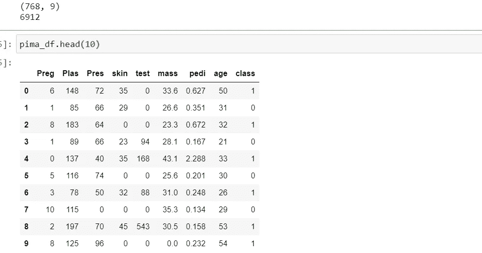

产出 1。数据的形状和大小。图片来源——由作者使用 Jupyter Notebook 开发。

## 计算中心趋势

```
#Central tendency calculations
print(‘MEAN: \n’,pima_df.mean())
print(‘\r \n’)print(‘MEDIAN: \n’,pima_df.median())
print(‘\r \n’)print(‘MODE: \n’,pima_df.mode())
print(‘\r \n’)print(‘Q1-Quartile 1: \n’,pima_df.quantile(q=(0.25,0.50,0.75)))
```

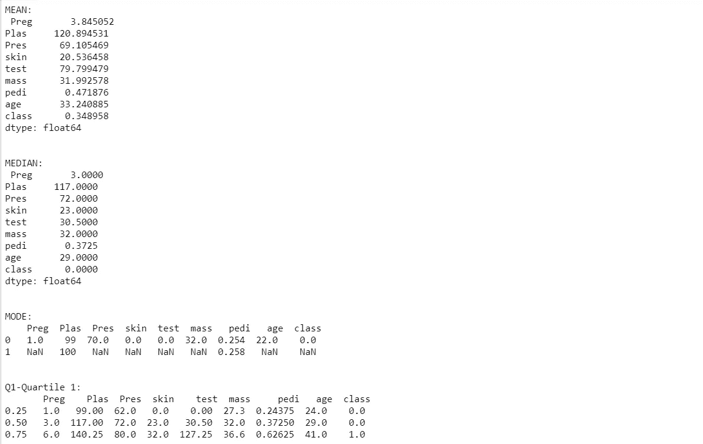

产出 2。数据的描述性统计。图片来源——由作者使用 Jupyter Notebook 开发。

## 检查色谱柱血浆是否呈正态分布

```
mean=pima_df[‘Plas’].mean();
median=pima_df[‘Plas’].median();
mode=pima_df[‘Plas’].mode();fig, ax = plt.subplots(figsize=(10,6)); # — — — — — — — — -Setting size of the canvassns.distplot(pima_df[‘Plas’]);plt.title(‘Distribution plot if Plas variable’);plt.axvline(mean,color=’green’,label=’Mean’); 
plt.axvline(median,color=’blue’,label=’Median’);
# plt.axvline(mode[0],color=’red’,label=’Mode1')
# plt.axvline(mode[1],color=’red’,label=’Mode2')plt.legend();
```

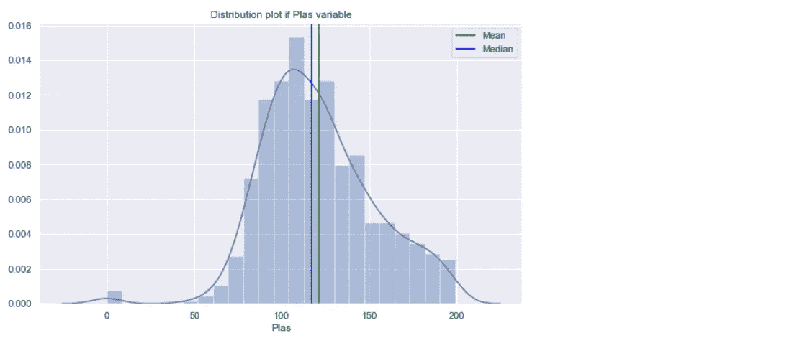

产出 3。Plas 属性分布。图片来源——由作者使用 Jupyter Notebook 开发。

## 相关性检查

```
# # Pairplot using s
corr = pima_df.corr();
print(corr)
# sns.heatmap(corr, annot = True);fig, ax = plt.subplots()
fig.set_size_inches(10, 10)plt.title(‘Heat Map of Correlation \n’)sns.heatmap(corr,annot=True,cmap=’YlGnBu’,vmin=-1,vmax=1, linewidths=.5, center=0);
```

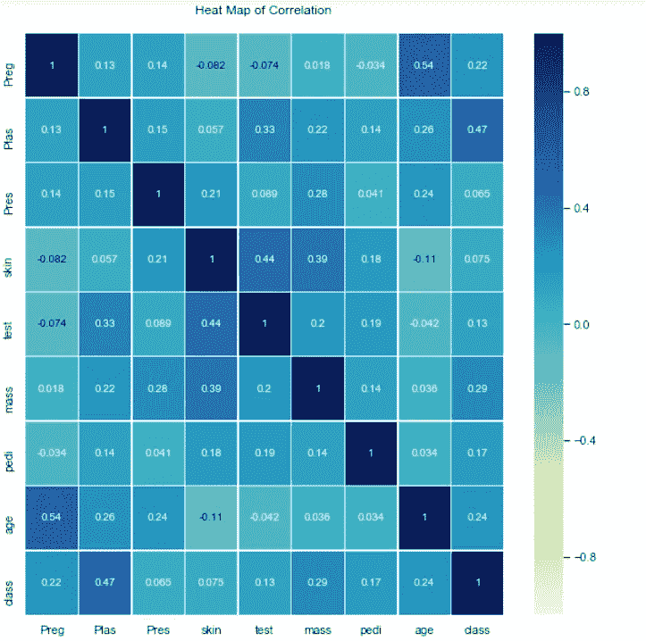

产出 4。糖尿病数据中数值属性的相关图。图片来源——由作者使用 Jupyter Notebook 开发。

## 异常值检查

```
plt.figure(figsize=(15,10))
pos = 1
for i in pima_df.drop(columns = {‘class’}).columns:
 plt.subplot(3, 3, pos)
 sns.boxplot(pima_df[i])
 pos += 1
```

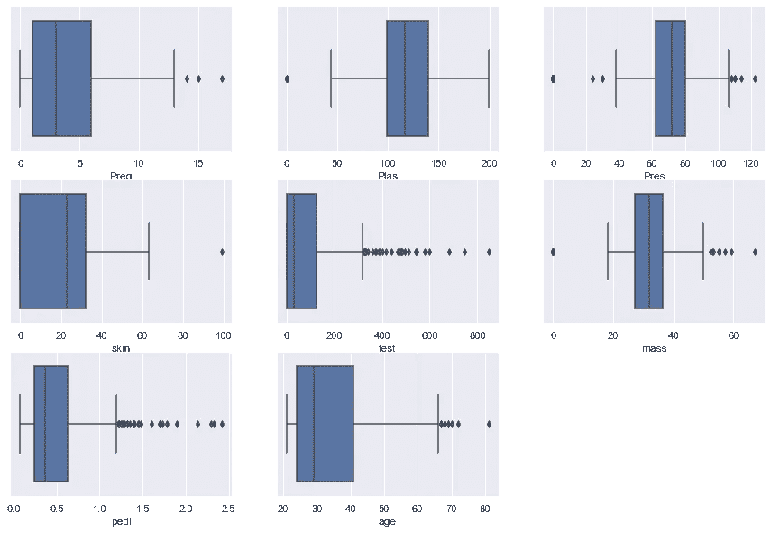

产出 5。糖尿病数据中数值属性的箱线图。图片来源——由作者使用 Jupyter Notebook 开发。

*关于作者:高级分析专家和管理顾问，帮助公司通过对组织数据的商业、技术和数学的组合找到各种问题的解决方案。一个数据科学爱好者，在这里分享、学习、贡献；你可以在* [*LinkedIn*](https://www.linkedin.com/in/angel-das-9532bb12a/) *和*[*Twitter*](https://twitter.com/dasangel07_andy)*上和我联系。*