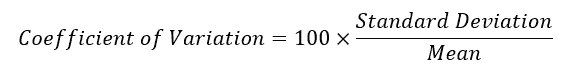

# 统计:测量数据的分布

> 原文：<https://towardsdatascience.com/statistics-gauge-the-spread-of-your-data-7aa9368a5bf3?source=collection_archive---------23----------------------->

## 离差的度量提供了一个数学工具箱来理解数据的分布

米歇尔·波罗在 [Unsplash](https://unsplash.com?utm_source=medium&utm_medium=referral) 上的照片

当你想要对你手头的数据做一个完整的探索时，你不仅想要确定中心点，就像我在我的[上一篇文章](https://medium.com/@pribanerjee01/statistics-central-tendency-5e514a2f98fd?sk=9be812cdd4c9e5631ebeb6be95fc2703)中提到的那样，你还想要知道数据分布的极限和各种其他点。例如，假设有一个本科生班级，有人声称这个班级的平均体重是 70 公斤。这是开始时的一些信息，但他接着补充道:

*   最小重量为 45 千克，最大重量为 92 千克→ *告诉您数据的范围或极限值*
*   25%的学生体重低于 50 公斤→ *如果您将数据按体重分成 4 个子集，则可以看到最低权重的 1/4 体重低于 50 公斤*
*   平均而言，重量偏离平均值 4 千克→ *告诉您数据的集中程度或分散程度，例如，使用 4 千克这样的值，可以说学生之间的重量差异不大；而如果该值为 10，人们会说学生的体重与平均值相差很大*

上面的例子引用了一些常见的不同离差度量的例子，这些例子将在本文中描述。与我上一篇关于集中趋势的文章类似，这篇文章将描述一些常见的离差度量以及我们通常如何计算它们。

## 离差的度量

图 1:不同的常用离差度量

请注意两种重要的度量类型— **绝对度量**和**相对度量**。此外，像集中趋势的措施，也有某些期望的分散措施的性质。G.U. Yule 教授还定义了理想离差测量的一些特性:

1.  应该严格定义
2.  基于所有的观察
3.  容易计算
4.  容易理解
5.  进一步的数学处理是可能的
6.  受抽样波动的影响较小

有了这些性质，现在让我们来看看一些最常见的离差度量。

# 离差的绝对度量

## 范围

范围是所有离差度量中最简单的。本质上，它测量数据序列中最大值和最小值的差异，并提供两个极端观测值之间的分布幅度。数学上，

所以，从数学上来说，这很简单。让我们看看它是否满足理想离差度量的所有性质及其优缺点。

*优点:*

*   这很容易计算
*   这很容易理解

*缺点:*

*   它没有考虑到所有的观察结果
*   它受采样波动的影响很大。例如，如果有一个系列 10、15、17、21、25、28，则范围是 28–10 = 18。但是，如果添加新值 40，范围会立即增加到 40–10 = 30。
*   如果数据分布有一个开放端，则无法计算范围
*   分布的形式不是由范围捕获的。请看这两种分布，它们的形状截然不同，但范围完全相同:

图 2:数据的两个非常不同的频率分布的范围是相等的(50–0 = 50)

## 四分位数间距和四分位数离差

顾名思义，这两种方法是基于四分位数的差异。如果将数据序列分成 4 等份，每 1/4 的最大值点称为四分位数。让我们考虑下面的例子:

图 3:识别分布中的四分位数

上图显示了第一(基于频率的最低 25%)和第三(基于频率的最高 25%)四分位数。什么是第二个四分位数？如果凭直觉思考，数据的 50%点本质上就是中位数。四分位数间距是第三个四分位数和第一个四分位数的差值。在图 2 的表格中，Q3 在 6 和 7 之间，而 Q1 在 1 和 2 之间。通过插值，我们可以找到精确的值，但是如果我们考虑 Q1 = 1，Q3 = 6，那么四分位数范围是 Q3-Q1 = 6–1 = 5。四分位数离差(Q.D .)等于半四分位数范围或四分位数范围的一半。这种情况下，Q.D. = (Q3-Q1)/2 = 2.5。

为了获得精确的值，我们可以从分布中插入 Q1 和 Q3 的值:

现在让我们看看四分位数离差/四分位数间距的优势:

*优点:*

1.  易于计算和理解
2.  甚至可以对开放式分布进行计算
3.  不受原产地变化的影响

*缺点:*

1.  并非基于数据中的所有观察值，因为仅使用第三和第一四分位数进行计算
2.  进一步的数学处理是不可能的

因此，四分位偏差从多方面改善了简单范围

## 平均绝对偏差

简单地说，平均绝对偏差计算一个观察值与其所属数据系列的平均值或任何其他指定点(如中位数)的绝对差值，然后对所有观察值进行平均(使用算术平均值)。直观地注意到，如果系列中的所有观测值在量值上相等，则该度量的值将为零。此外，这种方法不受与平均值的差值方向(大于或小于平均值)的影响，因为它考虑的是绝对差值。

如果我们必须计算图 3 中分布的平均绝对偏差，结果将是:

现在让我们来看看这项措施的一些优点和缺点:

*优点:*

1.  基于所有的观察
2.  不会随着原点的改变而改变

*缺点:*

1.  不容易计算或者理解
2.  没有考虑偏差的符号，这使得它难以用于进一步的数学处理

## 标准偏差

标准差是广泛使用的离差度量，与算术平均值一起，最常用于描述数据分布的形状和规模。标准偏差被定义为观察值与算术平均值的平方差之和的平均值的*平方根。它也被称为“*”。在数学符号中，**

**

## *标准差的一些重要性质*

1.  *标准差不受原点变化的影响。因此，如果我们有一个数列 y = x-c，那么:*

**

*2.如果 y 和 x 之间的关系是 y = ax + b，并且 a 和 b 是常数，则:*

****

*3.如果有多个数据系列，*

**

*4.请注意，如果一个系列中的所有观察值都相等，那么标准差将为零*

*现在让我们来看看 S.D .的一些优点和缺点，*

**优点:**

1.  *基于所有的观察*
2.  *可以进行进一步的数学处理(参见上面的属性 3)*
3.  *考虑平均偏差的符号*
4.  *独立于起源的变化*
5.  *受抽样变化影响最小*

**缺点:**

1.  *稍微难以计算*
2.  *受规模变化的影响*

*因此，标准差是满足理想离差度量的大多数性质的离差度量，因此被广泛使用。*

# *离差的相对度量*

*在日常统计分析中，离差的相对度量不如绝对度量那样广泛使用，但它们最重要的用途是应用于我们需要无量纲度量的情况，并可用于比较不同计算单位的不同数据集。一些常见的相对离差度量是:*

1.  **四分位数离差系数:**

**

*2.*变异系数:**

**

*3.*平均偏差系数:**

**

# *结论*

*与集中趋势相结合的离差度量是有助于汇总数据的最重要的度量。这些度量让我们对数据分布有了初步的印象。如今大多数统计工具都有计算这些的内置函数。*

## *Python 编码计算离差度量*

**注:所有图片(除了头中的 Unsplash 图片)，数据和编码归作者所有。**