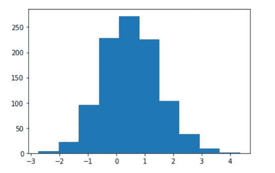
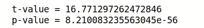
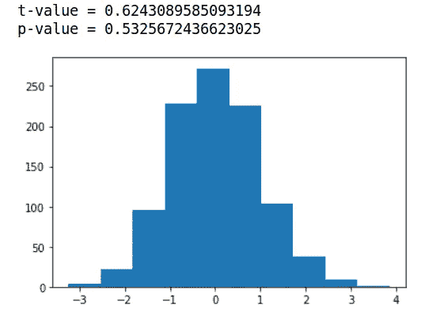
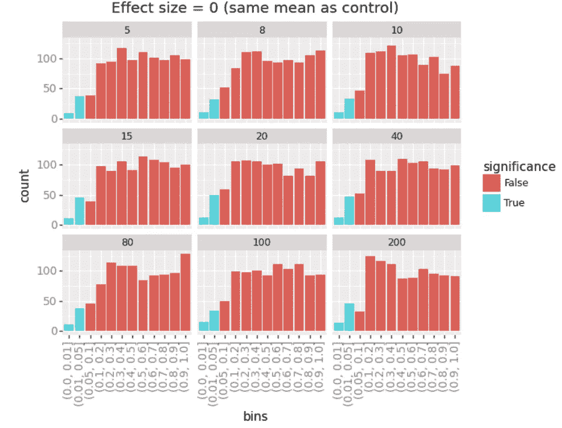
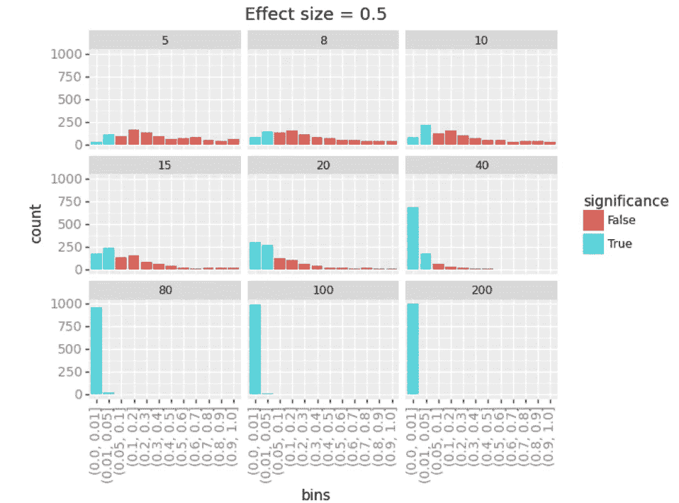
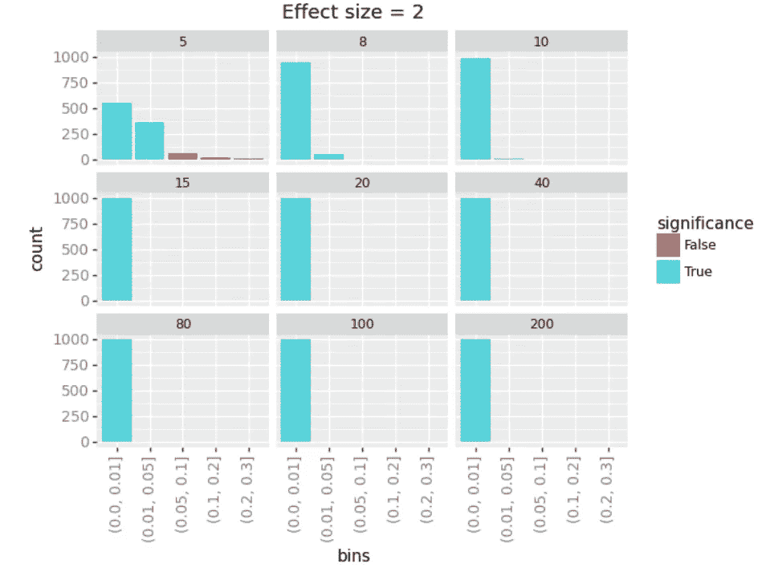

# 统计学-第一部分:贝叶斯如何补充 Frequentist。

> 原文：<https://towardsdatascience.com/statistics-how-bayesian-can-complement-frequentist-9ff171bb6396?source=collection_archive---------40----------------------->

多年来，学者们一直使用所谓的频率统计来评估实验操纵是否有效果。

Frequentist 统计基于假设检验的概念，假设检验是一种基于数学的方法，用于评估你的结果是否是偶然得到的。该值越低，**的重要性**就越大(用频率主义者的术语来说)。出于同样的原因，您可以使用相同的方法获得不重要的结果。这些“负面”结果中的大部分在研究中被忽视，尽管知道哪些操作**没有**影响[有巨大的附加值](https://www.ncbi.nlm.nih.gov/pmc/articles/PMC3917235/)。但那是另一篇文章；)

事情是这样的，在这种情况下，没有发现任何影响，频率主义者的统计数据是有限的，在他们的解释力，因为我将在这篇文章中争辩。

下面，我将探讨频繁主义者统计的一个局限性，并提出一种替代频繁主义者假设检验的方法:`Bayesian`统计。我不会对这两种方法进行直接比较。如果你感兴趣的话，那里有相当多的读物。我更愿意探索为什么频率主义者的方法存在一些缺点，以及这两种方法在某些情况下如何互补(而不是像有时争论的那样认为它们是相互排斥的)。

这是两个帖子中的第一个，在这里我将关注频率主义者的统计数据无法理清证据缺失和证据缺失之间的关系。

# 证据缺失与证据缺失

## 背景

在 frequentist 的世界中，统计通常输出一些统计度量(t，F，Z 值…取决于您的测试)，以及全能的 p 值。我在另一篇文章的[中讨论了仅使用 p 值的局限性，您可以阅读这篇文章来熟悉其计算背后的一些概念。简而言之，如果 p 值显著(即低于任意决定的阈值，称为 alpha 级别，通常设置为 0.05)，则确定您的操作最有可能产生影响。](https://juls-dotcom.github.io/meta_analysis.html)

然而，如果(这种情况经常发生)，你的 p 值> 0.05 呢？在频率主义者的世界里，这样的 p 值不允许你在缺乏证据和缺乏效果之间进行区分。

让大家稍微理解一下，因为这是关键的一点。换句话说，频率统计在量化影响的存在方面相当有效，但在量化影响不存在的证据方面相当差。文献见[此处](http://www.ejwagenmakers.com/2008/BayesFreqBook.pdf)。

下面的演示摘自荷兰神经科学研究所的一些工作，那是我从事神经科学研究的时候。最近发表了一篇关于这个主题的非常好的[论文](https://www.nature.com/articles/s41593-020-0660-4.epdf?sharing_token=OEe5lhDTKmPD-JVThUeOa9RgN0jAjWel9jnR3ZoTv0PHIohlcfgrTQy6CxWqCOTEfIBOYTdNkvPex4btLHhH7VX5FjtgHAMifLTBWpcGkJqaZ-_DSR9dfqG6s8cfxeqQb9PmbPysPgdRVMBi3DZ0MG1NugP_meKZVesy2x9Xv3A%3D)，我鼓励你去阅读。下面的代码是受纸质资源库的启发，用 [R](https://osf.io/md9kp/) 编写的。

## 模拟数据

假设我们生成一个均值=0.5，标准差=1 的随机分布。

```
np.random.seed(42)
mean = 0.5; sd=1; sample_size=1000
exp_distibution = np.random.normal(loc=mean, scale=sd, size=sample_size)
plt.hist(exp_distibution)
```



图 1 |描述从以 0.5 为中心的正态分布中随机抽取的直方图

这就是我们的实验分布，我们想知道这个分布是否与 0 有显著的不同。我们可以运行一个单样本 t 检验(这是可以的，因为分布看起来非常高斯，但你应该从理论上证明参数测试假设得到满足；让我们假设它们是)

```
t, p = stats.ttest_1samp(a=exp_distibution, popmean=0)
print(‘t-value = ‘ + str(t))
print(‘p-value = ‘ + str(p))
```



相当不错的 p 值，会让每一个博士生的脊柱都幸福得发抖；)注意，在这种样本量下，几乎任何事情都变得有意义，但让我们继续演示。

现在让我们尝试一个以 0 为中心的分布，它不应该与 0 有很大的不同

```
mean = 0; sd=1; sample_size=1000
exp_distibution = np.random.normal(loc=mean, scale=sd, size=sample_size)
plt.hist(exp_distibutiont, p = stats.ttest_1samp(a=exp_distibution, popmean=0)
print(‘t-value = ‘ + str(t))
print(‘p-value = ‘ + str(p))
```



这里，我们有一个预期的分布，它与 0 没有显著的不同。这就是事情变得有点棘手的地方:在某些情况下，frequentist 统计无法真正区分 p 值> 0.05 是否是缺乏证据，以及缺乏证据，尽管这是一个关键点，可以让你完全排除实验操纵产生影响。

让我们假设一种情况:

你想知道操纵是否有效果。这可能是你沟通中的一种新颖的营销方式，对生物活动的干扰，或者是你正在发送的邮件中的“有图片*对*无图片”测试。你当然有一个对照组来和你的实验组进行比较。

收集数据时，您可以看到不同的模式:

*   (一)两组不同。
*   ㈡这两个群体的行为相似。
*   (iii)您没有足够的观察数据来得出结论(样本量太小)

虽然选项(I)是不利于`null hypothesis H0`的证据(即，你有证据表明你的操纵产生了影响)，但使用 frequentist 统计数据无法解开情况(ii)(= H0 的证据，即不存在的证据)和(iii)(=无证据，即不存在的证据)。但是也许贝叶斯方法可以给这个故事增加一些东西...

# p 值如何受效应和样本量的影响

第一件事是说明频率统计有缺点的情况。

## 进场背景

我要做的是绘制频率主义者 p 值在改变**效应大小**(即，你的控制，这里的平均值=0，和你的实验分布之间的差异)和**样本大小**(观察或数据点的数量)时的表现。

让我们首先编写一个函数来计算这些 p 值:

```
def run_t_test(m,n,iterations):
    """
    Runs a t-test for different effect and sample sizes and stores the p-value
    """
    my_p = np.zeros(shape=[1,iterations])
    for i in range(0,iterations):
        x = np.random.normal(loc=m, scale=1, size=n)
        # Traditional one tailed t test
        t, p = stats.ttest_1samp(a=x, popmean=0)
        my_p[0,i] = p
    return my_p
```

然后，我们可以用不同的样本和效果大小来定义我们想要测试的空间的参数:

```
# Defines parameters to be tested
sample_sizes = [5,8,10,15,20,40,80,100,200]
effect_sizes = [0, 0.5, 1, 2]
nSimulations = 1000
```

我们终于可以运行函数并想象:

```
# Run the function to store all p-values in the array "my_pvalues"
my_pvalues = np.zeros((len(effect_sizes), len(sample_sizes),nSimulations))for mi in range(0,len(effect_sizes)):
    for i in range(0, len(sample_sizes)):
        my_pvalues[mi,i,] = run_t_test(m=effect_sizes[mi], 
                                n=sample_sizes[i], 
                                iterations=nSimulations
                               )
```

我将快速可视化数据，以确保 p 值似乎是正确的。输出将是:

```
p-values for sample size = 5
Effect sizes:
          0       0.5       1.0         2
0  0.243322  0.062245  0.343170  0.344045
1  0.155613  0.482785  0.875222  0.152519

p-values for sample size = 15
Effect sizes:
          0       0.5       1.0             2
0  0.004052  0.010241  0.000067  1.003960e-08
1  0.001690  0.000086  0.000064  2.712946e-07
```

我想在此提出两点主要看法:

1.  当样本量足够大时(下半部分)，p 值的行为与预期一致，并随着效应量的增加而降低(因为您有更强的统计能力来检测效应)。
2.  然而，我们也看到 p 值对于小样本量并不显著，即使效应量相当大(上图)。这是非常惊人的，因为效果大小是相同的，只有数据点的数量不同。

让我们想象一下。

## 形象化

对于每个样本大小(5、8、10、15、20、40、80、100、200)，我们将计算落入显著性水平仓中的 p 值的数量。

我们先来比较两个均值相等的分布，也就是我们有一个效应大小= 0。



图 2 |效应大小= 0 的每个“显著性”箱中 p 值的数量

从上图中我们可以看出，t 检验计算出的大多数 p 值对于均值为 0 的实验分布并不显著。这是有道理的，因为这两种分布在它们的意义上没有什么不同。

然而，我们可以看到，在某些情况下，我们确实获得了显著的 p 值，这可能发生在使用从总体中抽取的非常特殊的数据点时。这些通常是假阳性，这也是为什么**重复**实验和复制结果很重要的原因；)

让我们看看，如果我们使用一个平均值与对照组相差 0.5 的分布，会发生什么情况:



图 3 |效应大小的每个“显著性”箱的 p 值数量= 0.5

现在，我们清楚地看到，增加样本量显著提高了检测效果的能力，对于低样本量，仍然有许多不显著的 p 值。

如下图所示，正如预期的那样，您会看到对于高度不同的分布(效应大小= 2)，显著 p 值的数量会增加:



图 3 |效应大小的每个“显著性”箱的 p 值数量= 2

好了，这就是样本和效应大小如何影响 p 值的例证。

现在的问题是，当你有一个不显著的 p 值时，你并不总是确定你是否错过了这个效应(比如说因为你的样本量很小，由于有限的观察或预算)或者你的数据是否真的表明没有这个效应。事实上，大多数科学研究都有一个统计能力的问题，因为他们的观测数据有限(由于实验限制、预算、时间、出版时间压力等……)。

由于研究中的数据实际上是一个相当低的样本量，你可能仍然想从基于低样本量的非显著结果中得出有意义的结论。

在这里，贝叶斯统计可以帮助你对你的数据更进一步；)

请继续关注下面这篇文章，在这篇文章中，我探索了泰坦尼克号和波士顿的数据集，以展示贝叶斯统计在这种情况下是如何有用的！

你可以在下面的回购中找到这个笔记本:[https://github.com/juls-dotcom/bayes](https://github.com/juls-dotcom/bayes)