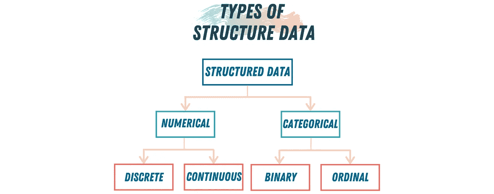
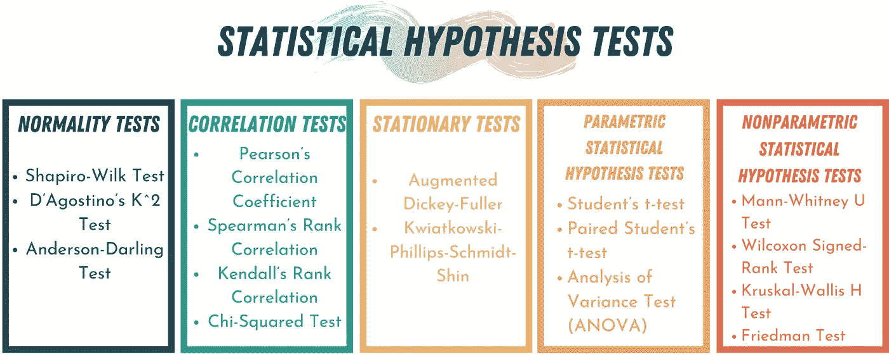
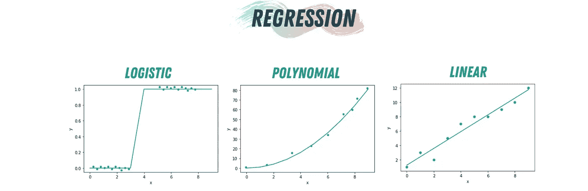
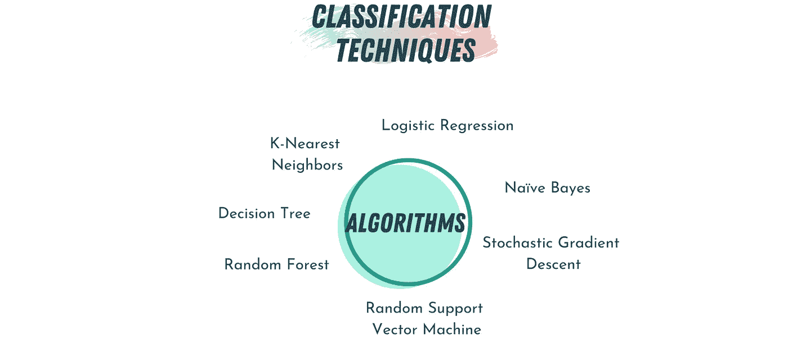

# 数据科学统计学

> 原文：<https://towardsdatascience.com/statistics-in-data-science-8ee52459e282?source=collection_archive---------44----------------------->

## 决策的艺术

## 分析、预测和分类

威廉·艾文在 [Unsplash](https://unsplash.com?utm_source=medium&utm_medium=referral) 上的照片

数学可能是最重要的主题之一，是几乎所有技术进步的核心。没有数学，数据科学领域就不会存在。从自然语言处理到高级人工智能，数据科学的所有子领域都建立在三个定义明确的数学领域之上。在每个数据科学领域的核心，你会发现概率论、线性代数和统计学的应用。我写过关于概率论和线性代数在数据科学中的应用的文章。

 [## 数据科学中的概率论

### 数据科学中最常用的 4 种概率分布

towardsdatascience.com](/probability-theory-in-data-science-bacb073edf1f) 

然而，在本文中，我们将讨论数据科学中的最后一个数学元素，统计学。统计学作为一门学科主要是在过去的一个世纪里发展起来的。相比之下，概率论——统计学的数学基础——是在 17 世纪到 19 世纪基于托马斯·贝叶斯、皮埃尔·西蒙·拉普拉斯和卡尔·高斯的工作而建立的。与概率论的纯理论性质不同，统计学是一门涉及数据分析和建模的应用科学。

 [## 5 线性代数在数据科学中的应用

### ML、CV 和 NLP 中的线性代数

towardsdatascience.com](/5-applications-of-linear-algebra-in-data-science-81dfc5eb9d4) 

统计学涉及数据科学的所有步骤，从清理、探索和分析数据的第一步，到提出回归模型来匹配数据，再到最终使用这些知识根据这些数据进行预测。统计学是原则和参数的集合，可帮助数据科学家获得有关其数据的信息，以便在面临不确定性时做出决策。使用统计学有助于我们揭示数据中的秘密，并使用这些秘密来创建更好、更准确的预测模型。

在本文中，我们将讨论在数据科学中使用统计学的四种方法。我们将讨论数据的分析和分类、显著性检验、回归和预测，最后，我们将讨论数据的分类。

让我们开门见山吧…

# 分析和分类数据

当我们开始一个新的数据科学项目时，我们从不同的来源获得数据。该数据可以来自先前与用户的交互；从关于天气的传感器，它可能是一个图像或视频流，或者它可能仅仅是通过消息或语音通道发送的一些文本。原始数据的问题在于，它是非结构化的，难以分析。计算机擅长发现模式和处理结构化数据；这就是为什么我们需要将原始数据转换为结构化数据，以便对其执行不同的处理。

作者图片(使用 [Canva](https://www.canva.com/) 制作)

结构化数据有两种基本类型:*数字型*和*分类型*。**数字**数据有两种形式:*连续*，如温度或持续时间或湿度；以及*离散*，如事件发生的计数。另一方面，我们有**分类**数据，它只接受一组固定的值，比如一周中的几天、特定内容中的国家名称等。分类数据也有两种类型，*二进制*数据，它只能取两个值中的一个，即 0/1、是/否或真/假。另一种类型的分类数据是*序数*数据，其中分类是有序的；这方面的一个例子是数字评级(1、2、3、4 或 5)。

## 探索性数据分析

探索性数据分析(EDA)是数据科学中使用的一种技术，用于为建模准备数据。它基本上是关于清理和了解你的数据；这样做，你要么从它那里得到你需要的答案，要么为将来的建模发展出解释结果的直觉。执行 EDA 以获得关于数据的不同种类的信息。

1.  数据采样。
2.  填充缺失值。
3.  在数据中寻找模式。

EDA 可以使用 Pandas 库在 Python 中完成；我们可以使用 Matplotlib 和 Bokeh 来可视化数据。

例如，这里我使用了来自 R 数据集的集合[的数据集`Titanic`。](https://vincentarelbundock.github.io/Rdatasets/)

# 显著性检定

作者图片(使用 [Canva](https://www.canva.com/) 制作)

显著性检验(也称为假设检验)广泛用于传统的统计分析中，旨在帮助我们了解一个事件的结果是否是随机的。为了进行测试，我们收集两个变量 A 和 B 的数据，因此 A 和 B 之间的任何观察到的差异必定是由于以下原因之一:

1.  B 的变化是随机的，与 a 无关。
2.  A 和 B 之间存在真正的依赖关系

对随机实验进行统计假设检验，以评估随机机会是否是观察到的两个变量之间差异的合理解释。统计假设是一种保护研究人员不被随机机会愚弄的方法。有两种假设:

*   ***零假设:*** 两个分类变量是独立的(它们的值之间没有关系，任何相关性都是由于偶然)。
*   ***备选假设:*** 这两个分类变量是相依的。

有许多不同类型的显著性检验；但是，在本文中，我将重点介绍三种最常用的方法:卡方检验、学生 t 检验和方差分析检验(ANOVA)。

## 卡方检验

卡方检验通过计算代表两个数据独立的概率的值“p”来检查两个分类变量是否相关或独立。该测试仅适用于**分类**数据(分类中的数据)，如性别{男性、女性}或颜色{红色、黄色、绿色、蓝色}，**不适用于数值**数据，如身高或体重。

## “学生”t 检验

t 检验告诉你变量之间的差异有多显著；换句话说，它让你知道这些差异是否是偶然的结果。为了使 t 检验准确，每个样本中的观察值应该是正态分布的，并且它们应该具有相同的方差。

## 方差分析检验(ANOVA)

ANOVA 测试是一种发现事件或实验结果是否重要的方法。换句话说，它们帮助我们弄清楚我们是否可以拒绝零假设或接受替代假设。我们正在测试样本，看它们之间是否有差异。ANOVA 测试有两种类型**单向**或**双向:**

*   单向有一个独立变量。比如大米的种类。
*   双向有两个自变量。比如大米的种类和热量。

# 回归和预测

作者图片(使用 [Canva](https://www.canva.com/) 制作)

在数据科学中使用统计学的主要原因是为了能够得出一个问题的答案:*变量 X 与 Y 相关吗？如果是的话，它们之间的关系是什么，我们可以用这个关系来预测 Y 的未来值吗？*

我们可以用回归来模拟两个变量相互作用的方式。回归描述了两个变量之间的关系，例如，X 是否随着 Y 的增加而增加？还是 Y 随着 X 的增大而减小？有几种类型的回归，线性回归，逻辑回归，多项式回归，逐步回归，岭回归，套索回归和弹性回归。然而，在大多数数据科学项目中，我们使用线性和逻辑回归。

## 线性回归

在线性回归中，因变量是连续的，其中自变量可以是连续的或离散的。线性回归使用不同点之间的最佳拟合直线在因变量(Y)和一个或多个自变量(X)之间建立关系。这条拟合线通常被称为“回归线”

## 逻辑回归

逻辑回归用于找出一个事件成功或失败的概率。当要预测的变量是二元的(0/ 1，真/假，是/否)时，经常使用逻辑回归。逻辑回归通常用于分类问题，通常需要大量样本才能准确发挥作用。

# 分类

作者提供的图片(使用 [Canva](https://www.canva.com/) 制作)

数据科学家经常面临需要自动决策的问题。例如，一封电子邮件是合法的还是垃圾邮件，一个广告是否可能被点击。这类问题称为分类问题。分类也许是预测的最重要的形式；有时，我们需要将数据分成二进制类别，或者更有序的类别。逻辑回归可用于分类问题，用于分类的其他算法:朴素贝叶斯、随机梯度下降、决策树、随机森林和支持向量机。作为分类算法的一个例子，让我们讨论一下朴素贝叶斯和 K-最近邻算法。

## 朴素贝叶斯

朴素贝叶斯分类器是一组基于贝叶斯定理的分类算法。这是一个算法家族，所有算法都有一个共同的原则。贝叶斯算法的基本假设是变量是独立的，并且对因变量有相同的影响。这种算法只需要少量的训练数据，与更复杂的方法相比速度非常快。然而，已知朴素贝叶斯估计并不那么准确。

## k-最近邻

k-最近邻算法并不试图构建一般的内部模型，而是仅存储训练数据的值，然后在分类过程中使用这些值。根据每个点的 k 个最近邻的简单多数投票来计算分类。该算法是实现最简单的算法之一，对于有噪声的训练数据是鲁棒的，并且如果训练数据是重要的，则该算法是有用的。

数据科学完全是关于数学，关于计算概率，求解一些方程以找到变量之间的关系，以及使用统计学来估计、分类和预测未来数据。好的一面是，你不需要手工做任何数学运算，像 Pandas、Scikit 和 Matplotlib 这样的库在隐藏数据科学背后的复杂数学方面做得很好。这就是为什么这里最重要的方面是理解事物如何工作的逻辑，然后从那里开始。

# 参考

[1]迪格尔，P. J. (2015)。统计学:21 世纪的数据科学。皇家统计学会杂志:A 辑(社会统计)， *178* (4)，793–813。

[2]布鲁斯，p .，布鲁斯，a .，&格德克，P. (2020)。*数据科学家实用统计:使用 R 和 Python 的 50 多个基本概念*。奥莱利媒体。