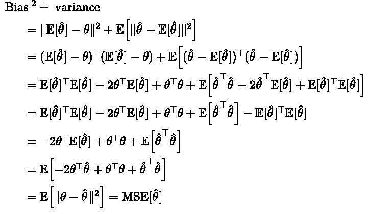

# ML 中的统计学:为什么样本方差除以 n 仍然是一个好的估计量

> 原文：<https://towardsdatascience.com/statistics-in-ml-estimating-population-variance-1f484184f247?source=collection_archive---------22----------------------->

## 理解为什么我们在样本方差中使用(n1 ),以及为什么使用 n 仍能给出一个很好的总体方差估计量。

来源:[皮沙贝](https://pixabay.com/)的[彼得 H](https://pixabay.com/users/tama66-1032521/)

本文讨论我们如何估计正态分布的总体方差，通常表示为***【σ***。通常，我们使用样本方差:

但是，**我们为什么要用 *(n - 1)* 而不是 *n*** 来除平方和，其中 ***n*** 代表样本大小，从而得到样本方差，这一点并不直观。在统计学中，这通常被称为 [**贝塞尔修正**](https://en.wikipedia.org/wiki/Bessel%27s_correction) 。另一个可行的估计量是用平方和除以样本量得到的，它是总体方差的**最大似然估计量** (MLE):

**哪个比较好？**

通过应用 [**偏差-方差分解**](https://www.wikiwand.com/en/Bias%E2%80%93variance_tradeoff) 和[**柯克兰定理**](https://www.wikiwand.com/en/Cochran%27s_theorem) ，本文试图解决这些问题。它的结论是:

*   我们在样本方差中使用*(n1)*，因为我们想要获得总体方差的无偏估计量。
*   将平方和除以 n 仍然给了我们一个很好的估计值，因为它具有更低的**均方误差** (MSE)。

我们还将回顾一个用 Python 实现的实验，从数值上验证我们的结论。敬请期待！

假设我们有一个样本 *x₁* 、 *x₂* 、…、 *xi、*其中所有 *xi* 都是**独立同分布** ( *iid* )根据 *N(μ，σ )* 。我们正在考虑总体方差 *σ* 的两种估计量:样本方差估计量和 MLE 估计量。

# **评估估计量:偏差、方差和均方误差**

我们将首先引入一些度量来评估这些估计量，即**偏差**、**方差**和 MSE。假设我们正在估计总体参数 ***θ*** 并且我们的估计量是数据的函数，那么我们可以定义:

直观地说，偏差衡量我们的估计偏离潜在参数的程度。因为我们的估计值会随着数据而变化，所以方差衡量的是它们偏离不同数据集平均值的期望值。MSE 是一个综合的度量，可以分解为**(偏差+方差)**如下。

在下面几节中，我们将应用柯克兰定理来推导我们两个估计量的偏差和方差，并进行比较。

# 采样离散

科克伦定理通常用于证明 [**方差分析**](https://www.wikiwand.com/en/Analysis_of_variance) (ANOVA)中使用的统计数据的概率分布。我们将跳过证明，简单地将其应用于我们的情况。

科克伦定理表明，从标准正态生成的一组 *iid* 随机变量的平方和具有 [**卡方分布**](https://www.wikiwand.com/en/Chi-squared_distribution) 和 *(n - 1)* 自由度。换句话说:

因此，

由此可见，样本方差是总体方差的理想无偏估计量。然后我们可以写出它的方差和 MSE:

# 极大似然估计量

以同样的方式，我们可以导出总体方差的 MLE 估计的偏差、方差和均方误差。

由此我们知道了为什么我们一般会用平方和除以 *(n - 1)* 来计算样本方差。MLE 估计量是总体方差的有偏估计量，它引入了向下的偏差(低估了参数)。偏差的大小与总体方差成正比，并且随着样本量的增加而减小。

我们发现极大似然估计具有较小的方差。差距的大小与人口方差成正比。此外，

我们可以看到，随着样本容量的增大，MLE 估计量对样本方差的优势减小。写出 MSE 并比较:

我们发现极大似然估计量也有一个较小的均方误差。正如预期的那样，缺口的大小与总体方差成正比，并且随着样本量的增加而减小。

# 数值实验

在本节中，我们将验证上面得出的结论。我们将从 *N(0，σ )* 中生成 100，000 个大小为 *n* 的样本。 ***X*** 形状为 *n × 100000* ，每个列向量代表一个形状为 *n × 1* 的样本。

我们将从 *n* = 10 和 *σ* = 1 开始。请注意参数`ddof`的使用，因为它指定了从估计量的样本量中减去什么。

正如所料，最大似然估计引入了向下偏差，而样本方差估计的向下偏差可以忽略不计。同时，极大似然估计具有较低的方差和均方误差。

我们将改变样本大小和总体方差的配置，看看样本方差估计量和最大似然估计量之间的偏差、方差和均方误差会发生什么变化:

正如所料，样本方差估计量和最大似然估计量之间的偏差、方差和均方误差随着总体方差的增加而增加，随着样本量的增加而急剧减少。检查我用来生成可视化效果的代码:

这篇文章是何坤宇写的。Kunyu 目前是芝加哥大学计算分析专业的硕士生。他发现理解统计建模和机器学习技术、将它们应用于真实世界的数据并帮助创建金融服务行业的端到端解决方案是一件有趣的事情。在 LinkedIn 上联系昆玉！🐷

 [## 昆玉何-即将上任的全球量化策略非周期分析师-美银美林…

### 芝加哥大学正在接受理学硕士计算分析项目培训的数据科学家。对…充满热情

www.linkedin.com](https://www.linkedin.com/in/kunyuhe/)