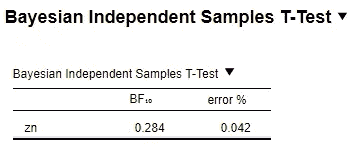

# 统计学第二部分:贝叶斯拯救

> 原文：<https://towardsdatascience.com/statistics-part-ii-bayesian-to-the-rescue-877cc18c8bfd?source=collection_archive---------51----------------------->

在这篇文章中，我将比较 frequentist 和贝叶斯统计的结果，并解释这两种方法如何互补，特别是对于 frequentist 方法产生的不清楚的结果。

作为概念的第一个证明，我将使用著名的 Titanic 数据集，每个第一个 Kaggle 用户在注册时都会接触到这个数据集。这些统计数据当然可以应用于任何其他数据集。我选择了 Titanic 数据集，因为它的变量范围很大，读者可能已经知道这些数据了。

对于那些不熟悉这个数据集的人来说，它提供了一系列变量，可以用来预测当时沉船事故中幸存的可能性。你会在网上找到各种方法来分析这个数据集，以及机器学习技术来预测存活率。

我从网上下载了它，你可以在这里找到我使用的确切数据集。

仅供参考，变量如下所示:

```
[print(i) for i in df.columns]PassengerId
Survived
Pclass
Name
Sex
Age
SibSp
Parch
Ticket
Fare
Cabin
Embarked
```

# 缺乏证据

如果你自己做分析，你会发现一些变量在预测存活率方面相当不错。出于论证的目的，也因为我认为它提供了一个很好的解释力，让我们看看可变年龄:

```
df.Age.plot(kind='hist')
```


图 1 | Titanic 数据集中年龄列的直方图。

因为我们想研究年龄对存活率的影响，所以我们相应地把它分开:

```
(df.groupby('Survived')
.apply(lambda d: pd.Series({
    "std": d.Age.std(),
    "sem": d.Age.std() /  d.Age.count(),
    "avg": d.Age.mean()
}))
.plot(kind='barh', 
       y = "avg", 
       legend = False, 
       title = "Mean Age per Surival Class +/- std", 
       xerr = "std"
      ));
```


图 2 |每个存活类别的平均年龄。误差条显示分布的标准偏差。

从一个简单的柱状图来看，在事故中幸存和未幸存的乘客的年龄似乎没有太大的差别。观察误差线，我们可能会认为这些分布没有显著的不同。

让我们用统计学来检验一下。

为了演示贝叶斯统计，我将使用开源软件 [JASP](https://jasp-stats.org/) ，它提供了一个用户友好的界面。有许多其他的软件包可以让你从代码中运行贝叶斯统计。由于读者可能不精通代码，我使用这个软件来展示如何运行基本的贝叶斯测试。

让我们首先加载 JASP 的泰坦尼克号数据集:


图 3 |泰坦尼克号数据集在 JASP 装载时的截图

上面你可以看到 JASP 自动以一种很好的可读方式重新组织列中的数据。

JASP 允许你用频率主义和贝叶斯方法进行基本的统计测试。虽然我通常使用 SciPy 运行我的统计数据，但是将这两种方法都嵌入到一个软件中还是不错的，这样您就可以很容易地比较输出。

让我们首先从经典的频率主义方法开始。

下面，你会看到一个 JASP 窗口的截图，当你想做一个独立的样本测试时，它会弹出来，如果我们想测试幸存的乘客是否与死于悲剧的人有明显不同的年龄，这就是我们应该做的。


图 4 | Frequentist 独立样本 t 检验。

如您所见，有许多选项可以更改，例如测试的类型(如果您想进行非参数测试，则为 Student、Welch、Mann-Whitney)，您是否有测试的假设(单边或双边测试)。此外，如果想要使用 JASP 浏览数据集，还可以获取更多描述性统计数据。

我将运行一个标准的学生测试，即参数测试。在此之前，我们应该检查分布是否满足参数测试的假设，但是为了演示的目的，让我们假设它们是满足的。


非常令人惊讶的是，测试显示了两种分布之间的显著差异(t(712) = 2.067，P = 0.039)，即，在零假设下，观察到的年龄差异是不可能的。p 值确实与典型的 0.05 阿尔法水平调情，表明根据 frequentist 统计，这种影响是显著的，但如果我可以补充的话，不是很有说服力。

在继续之前，我们应该看看 p 值之外的其他指标(效应大小，见[这里](https://juls-dotcom.github.io/meta_analysis_intro.html)，但因为这篇文章是关于比较频率主义者和贝叶斯方法，我就继续。

现在让我们看看贝叶斯独立样本 t 检验会显示什么。


图 5 | Frequentist 独立样本 t 检验。

贝叶斯检验输出所谓的贝叶斯因子(BF ),它是零假设 H0 对替代假设 H1 的相对预测性能。查看[此处](https://www.nature.com/articles/s41593-020-0660-4.epdf?sharing_token=OEe5lhDTKmPD-JVThUeOa9RgN0jAjWel9jnR3ZoTv0PHIohlcfgrTQy6CxWqCOTEfIBOYTdNkvPex4btLHhH7VX5FjtgHAMifLTBWpcGkJqaZ-_DSR9dfqG6s8cfxeqQb9PmbPysPgdRVMBi3DZ0MG1NugP_meKZVesy2x9Xv3A%3D)了解更多关于贝叶斯因子的信息。

虽然我不喜欢任意阈值的概念，但是这些想法对于得出关于数据的有意义的结论是有用的。

在频率主义者的世界里，典型的任意阈值是 0.05，低于这个阈值，效果据说是显著的。

在贝叶斯世界中，根据 Jeffreys 的初始分类，可以使用以下命名法:

*   BF < 1/3: evidence **反对**零假设
*   1/3 < BF < 3 : Anecdotical evidence
*   BF > 3:证据**为**零假设

在我们的例子中，我们选择 BF10，它表示 1 假设下的数据的似然性与零假设下的数据的似然性的比较(数学术语:p(数据| H1) / p(数据| H0))。

回到我们的测试。我们在主窗口中发现了一些有趣的选项，允许您进行单面或双面测试(“Alt。假设”，在 JASP 用“+”表示)，以及 BF 操作，允许您计算每次比较比率，BF10(高 1 对高 0)和 BF01(反向比较)。

我建议你也探索一下 nice plots 选项，它将允许你可视化你的先验和后验分布(这是一个单独的帖子……)。

让我们进行测试:


在我们的例子中，我们得到 BF = 0.685，这意味着我们的数据在 H1 统治下比在 H0 统治下多 0.685 倍。根据杰弗里斯的初步分类，这说明 H0 缺乏证据，也就是说，我们不能得出结论，年龄不影响泰坦尼克号事故中的生存可能性。我在这里坚持:由于 **BF 不低于 1/3** ，我们不能说他们已经获得了年龄对生存没有影响的证据。在这种情况下，可能需要更多的数据来观察 BF 如何随着更多的累积数据而发展。

我喜欢用下面的话来思考贝叶斯因素:“我应该在多大程度上改变我的信念，即年龄对泰坦尼克号灾难的生存可能性有影响？”。答案是贝叶斯因子。根据你之前的信念(也就是所谓的**之前的**，你可以根据你从数据中已经知道的东西进行调整)，BF 会有所不同，这取决于效果的强度。

在这里，我似乎不应该改变我的信仰。

正如你所看到的，虽然频率主义者的方法会得出年龄影响的结论，但贝叶斯方法会说在得出结论之前需要更多的数据。在这种情况下，最好的办法是收集更多的数据，以获得效果的**证据，或者证明效果**不存在的**证据。**

# 效果的证据

现在让我们使用另一个著名的数据集，波士顿住房数据集，来探索另一种情况。你可以在帖子开头给出的回购上找到这个数据集。

下面我画出了查尔斯河上*或*外*每个位置的房屋价格(你应该在最初的比赛中预测到)。*

```
(df_housing.groupby('chas')
.apply(lambda d: pd.Series({
    "std": d.medv.std(),
    "sem": d.medv.std() /  d.medv.count(),
    "avg": d.medv.mean()
}))
.plot(kind='barh', 
       y = "avg", 
       legend = False, 
       title = "Mean price per river location +/- std", 
       xerr = "std"
      ));
```


图 6 |每个河流位置的平均房价。误差条显示分布的标准偏差。

正如我们所看到的，真实值(靠近查尔斯河)的价格高于虚假值。
现在，让我们从统计学的角度来探讨这一观察结果。

我不会在这里显示 JASP 结果的截图，但只有结果。


frequentist 独立样本 t 检验显示两种分布之间的差异非常显著(t( *504* ) = -3.996， *p* < 0.001)，即在位于查理斯河上和远离查理斯河的住房之间观察到的房价差异非常显著。

让我们看看贝叶斯测试能得到什么。


贝叶斯方法证实了具有非常高的 BF 值的观察结果，表明该数据在 H1 假设下的可能性是在 H0 下的 270 倍。

现在，我们有最后一个案例要探索:贝叶斯统计将允许我们在没有影响的情况下得出结论。

# 缺席的证据

到目前为止，一切顺利。在前面的例子中，我们看到这两种方法都是有意义的，并且在效果较高时同时出现。现在让我们来看看另一个变量，我们可以更清楚地使用贝叶斯方法的力量。

与其看一个可能显示价格差异的变量，不如看另一个变量:“zn”变量，即 25，000 平方英尺以上地段的住宅用地比例

首先，让我们看看一个常客会怎么说:


然后，贝叶斯会说:



频率主义者会说没有影响，但同样，我们不知道是否真的没有影响，或者我们是否缺乏统计能力…

贝叶斯理论说我们有一个 BF10 = 0.284。该值低于 1/3，根据上述术语，这一次，我们的数据为 H0 提供了适度的证据，即位于或远离查理斯河的位置不会导致工业区的比例更高。换句话说，我们有证据表明不存在影响，我们可以从进一步的模型和解释中完全排除这个变量，以简化我们的分析。

这一结论与“缺乏证据”的情况相反，我们之前在泰坦尼克号数据中使用可变年龄发现了这种情况。在这种特殊的情况下，我们不应该从我们的模型和分析中去掉年龄，因为我们没有明确的证据表明它在我们观察到的效应中不起作用。

## 结合频率主义和贝叶斯方法

这种统计检验的最有力的方法可能是报告频率主义和贝叶斯方法。这是我们在[最近的出版物](https://linkinghub.elsevier.com/retrieve/pii/S0960982220300178)中所做的，以适应频率论者和贝叶斯评论者，并证明为什么一些变量从进一步的协变量分析中被去除，而其他的被保留

欢呼感谢阅读:)

六月（June 的缩写）

你可以在下面的回购处找到这个笔记本:[https://github.com/juls-dotcom/bayes](https://github.com/juls-dotcom/bayes)