# 重新审视统计学

> 原文：<https://towardsdatascience.com/statistics-revisited-5541f0bb9c4b?source=collection_archive---------20----------------------->

## [入门](https://towardsdatascience.com/tagged/getting-started)

在这里，我将尽力把统计概念分解成各种容易理解的方式，同时作为我学习过程中的总结笔记。

**人口诉样本**

很多时候，我们进行小样本的调查，仅仅是因为调查整个人口是不可行的。然后，这个样本允许我们对实际人口进行推断。统计学的研究很大程度上回答了这个问题:**我能有多大的信心相信样本结果说的是人口的真相？**

这种对总体进行归纳的方法叫做推断统计学。在此之前，让我们回顾一下我们在早期学校生活中会遇到的一些基本的描述性统计数据。

**描述性统计**

平均值、中值和众数是寻找数据集中平均值的常见方法。以下是更好地描述和可视化数据集的一些其他方法:

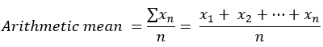

方程式[1]

算术平均值是通过将数据集中所有数字的总和除以数据集中的数字计数获得的。一个常见的例子是确定班上学生的平均身高。

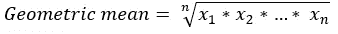

方程式[2]

虽然不如算术平均值直观，但在处理百分比时，可以很容易地联系到几何平均值。例如，确定一段时间内投资的平均回报。

数据集的**众数**是出现最频繁的值，而**中位数**是有序数字列表中的中间数字。与中位数的概念相似，四分位数将有序的数字列表分成四个相等的部分，所需的四分位数位于中断位置。

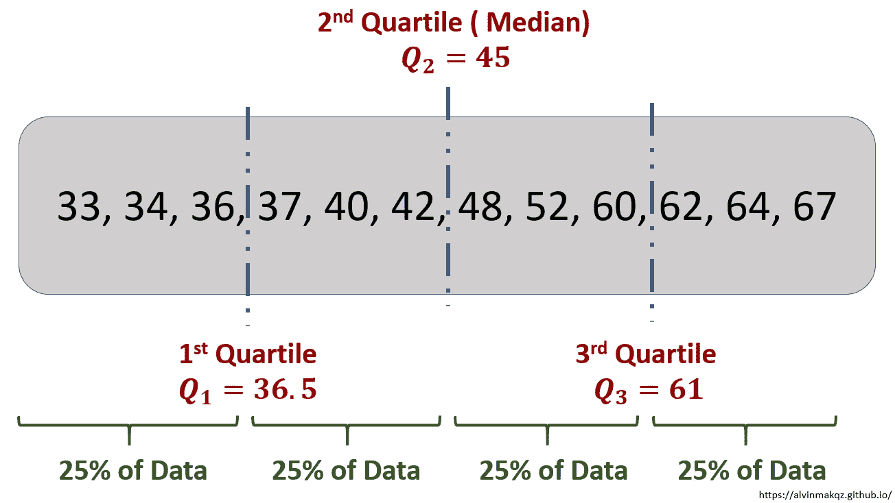

作者图片

为了更好地显示数据集中数字的分布，可以使用箱线图快速显示最大值、最小值和四分位数位置。箱线图的不同形状揭示了数据中的偏斜度。箱线图也有助于识别是否存在异常值。

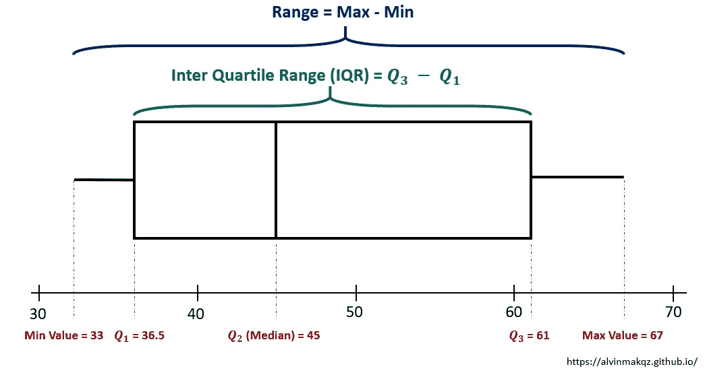

作者图片

数据集的范围提供了其可变性的非常基本的概述，即各个点围绕平均值分布的程度。衡量可变性的更好方法是计算其方差和标准差。

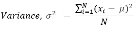

方程式[3]

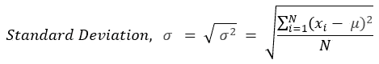

方程式[4]

虽然这些方程可能看起来吓人，但方差只是取每个数据点和平均值之间的差的平均值。差值被平方以消除正值和负值的影响。由于方差现在具有大得多的量级(由于平方函数)，标准差取方差的平方根，使得它变得与数据集“相关”。

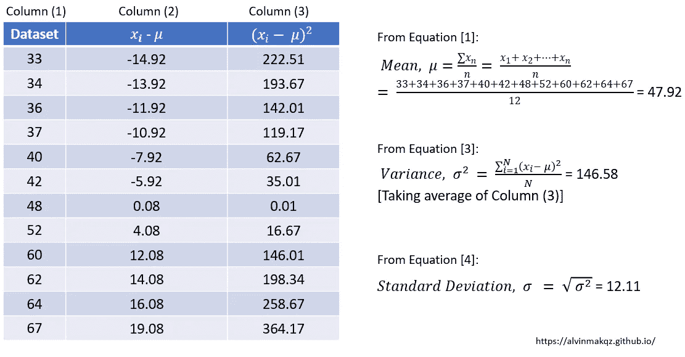

作者图片

从上面的例子可以看出，计算出的方差和标准差分别是 146.58 和 12.11。将这两个值与原始数据集值进行比较，与方差值 146.58 相比，平均值 12.11 的分布可被认为更“相关”。

**推理统计**

既然我们已经在一定程度上概括了描述性统计，让我们重温一下之前被问到的问题:**我能在多大程度上相信样本结果真实地反映了总体情况？**

假设我们想确定一个新生婴儿的平均体重。通过收集 8 个婴儿的体重样本，发现样本均值为 3.2kg。另一个由 20 个婴儿组成的样本显示样本均值为 3.4kg。直观地说，我们应该更相信哪个均值？

方程式[5]

这个例子说明了估计误差的概念——在确定总体参数时，我们的“最佳猜测”应该是什么。从方程[5]可以看出，当样本量 N 增大时，标准差减小，其中 s 为样本的标准差。这在一定程度上表明了样本均值可能存在多大的变化。

既然知道样本之间和样本内部也存在差异，那么点估计(即取特定值的总体参数)似乎不是一个可行的选择。取而代之的是引入了一个**置信区间**，它是一个数字范围，人口参数被认为落在这个范围内。

形状像钟形曲线的正态分布通常用于确定置信区间。这是因为**中心极限定理(CLT)带来的独特观察。**CLT 指出，如果总体有一个有限的均值和标准差，当用替换从总体中取出足够大的随机样本时，样本均值的分布将近似呈正态分布。

值得注意的是，我们不一定知道人口数据遵循什么分布。类似地，每个样本将遵循一个未知的随机分布。然而，当抽取足够多的样本时，由于中心极限定理，它们的平均值将遵循正态分布。下图说明了这一点。

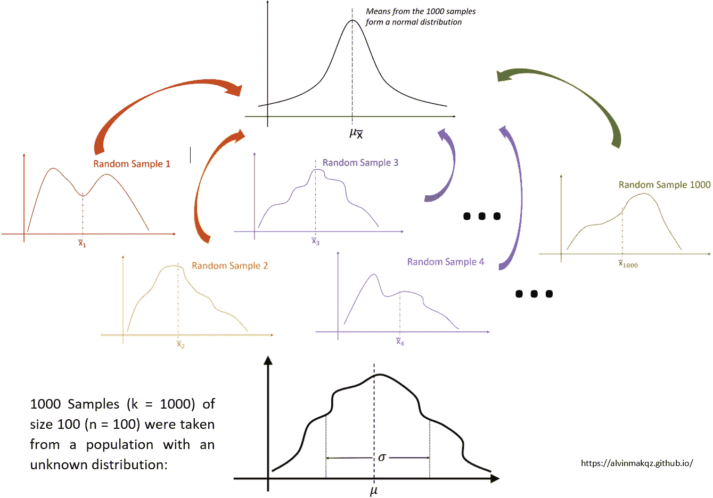

作者图片

从创建的正态分布图中，我们可以直观地看到估计的总体均值在哪里。标准差是通过将每个样本平均值视为一个数据点来计算的。然而，如果只有一个样本，并且假设分布为正态分布，则可以根据等式[5]将标准偏差估计为平均值的标准误差。

为了构建置信区间，我们需要首先将正态分布转换为 z 分布，或者称为标准化正态分布。这样，分布最终将取平均值 0 和标准差 1。

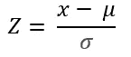

方程式[6]

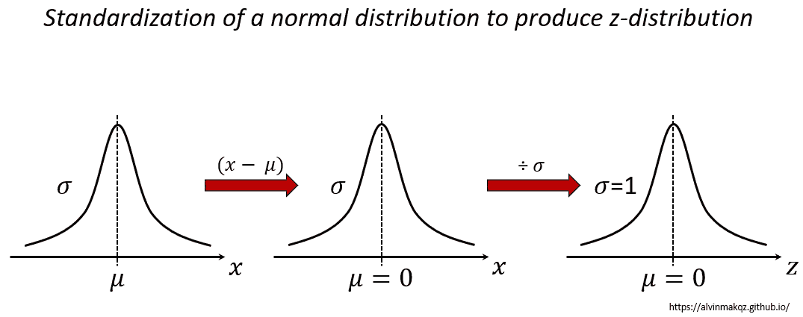

作者图片

在正态分布中，平均值、中值和众数相等，曲线关于平均值对称。曲线下的总面积为 1，表示 100%的概率。z 分数是沿 z 轴的值，对应于平均值的标准偏差数。在不同的 z 分数下，z 表确定由这些分数限定的总面积。面积还表示位于此区间内的观测值的百分比，有时称为 p 值。因此，我们可以用表示为置信区间的概率置信度来估计统计量。

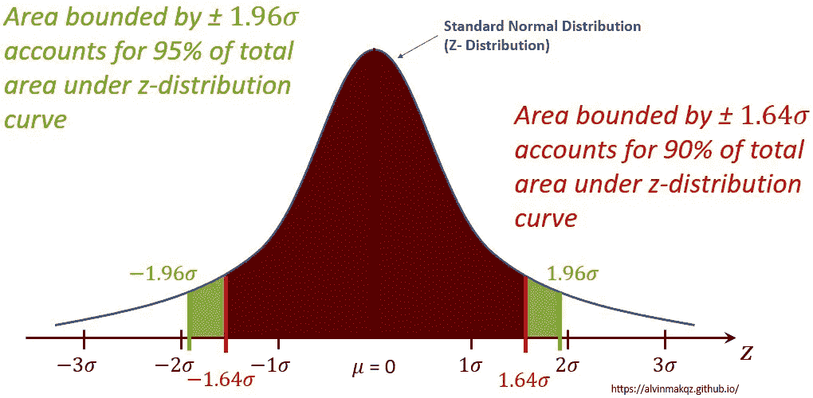

作者图片

如果样本量 n 很小(< 30), and/or the population standard deviation is unknown, we use a t-distribution instead. Also having a bell shaped curve, the t-distribution has a lower peak and fatter tails compared to a z-distribution, resulting in a more conservative confidence interval given the same significance level. We can think of this as a way of penalizing the estimate since less reliable information is provided.

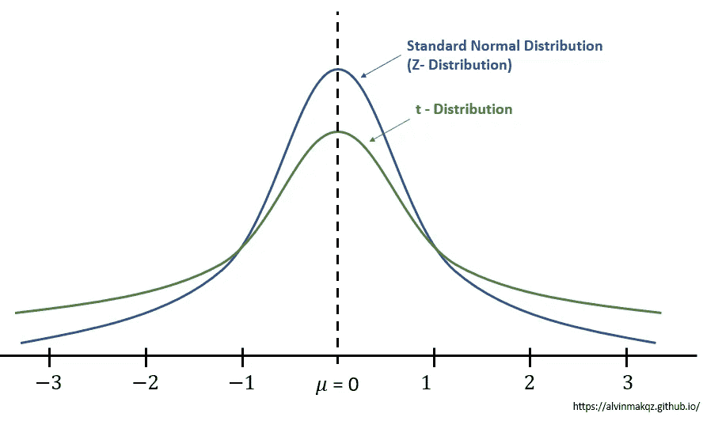

Image by author

Instead of referring to the z-table, the t-table is used instead. One point to note when using the t-table is that the degrees of freedom (D.O.F) is used instead, where **D.O.F = n -1)。**D . o . f 是指最终计算中可自由变动的数值数量。在这种情况下，D.O.F = n -1，因为在已知样本均值和样本标准差的情况下，n 中的最后一项必须是固定值。

置信区间和显著性水平的概念在统计学和机器学习技术中被广泛使用。虽然它确实以相对较高的置信度提供了总体参数的一系列估计值，但当平均值实际上位于规定的置信区间之外时，就有可能出现误差。更多内容将在我下一篇关于**假设检验的文章中介绍。**敬请期待！