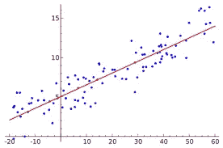
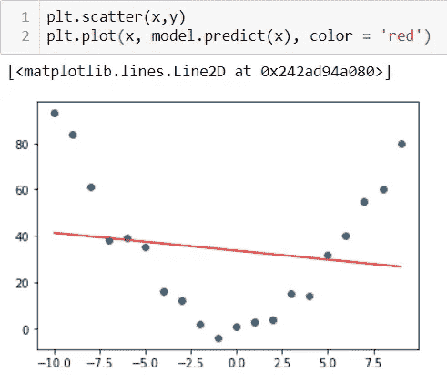
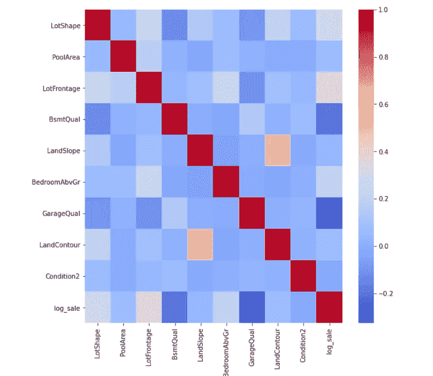
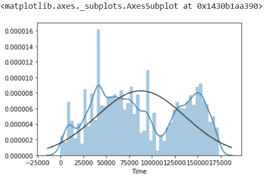

# 使用统计学改进线性回归

> 原文：<https://towardsdatascience.com/statistics-supporting-linear-models-bfc24fb9781f?source=collection_archive---------6----------------------->

## 关于线性回归的数学基础以及如何使用它来提高拟合优度的详细帖子。

当试图解决复杂问题时，简单而复杂的方法往往被低估。这个故事旨在展示线性回归仍然非常重要，以及我们如何提高这些算法的性能，成为更好的机器学习和数据科学工程师。

由 [Unsplash](https://unsplash.com?utm_source=medium&utm_medium=referral) 上的 [Pietro Jeng](https://unsplash.com/@pietrozj?utm_source=medium&utm_medium=referral) 拍摄

作为机器学习领域的新生，你首先要学习的是简单的一元线性回归。然而，在过去的十年左右，基于树的算法和神经网络在商业规模上盖过了线性回归的重要性。这篇博文的目的是强调为什么线性回归和其他线性算法仍然非常重要，以及如何提高这些基本模型的性能，以便与 XGBoost 和 Random Forests 等大型复杂算法竞争。

线性回归-最佳拟合线(图片由作者提供)

# 如何提高线性模型的性能:

许多自学成才的数据科学家首先通过学习如何实现各种机器学习算法来开始编写代码，而没有真正理解这些算法背后的数学。通过理解这些算法背后的数学，我们可以了解如何提高它们的性能。

线性回归背后的数学对模型将接收的数据做了一些基本假设:

*   没有异质
*   无多重共线性
*   自相关
*   正态分布
*   线性

让我们更深入地研究其中的一些假设，并找到改进我们模型的方法。

# 线性度:

线性模型试图通过给定的数据点拟合一条直线。它看起来类似于下面给出的图表。

然而，这种模型无法拟合不是线性绘制的数据点。考虑一个关系 y = x + c +-(噪声)。这个函数的图形是抛物线。拟合一条穿过该图的线不会得到很好的拟合。

(图片由作者提供)

我们需要通过应用指数、对数或其他变换来变换独立变量，以获得尽可能接近直线的函数。

这意味着，通过平方每一项，将自变量从 x 变为 x，我将能够拟合一条穿过数据点的直线，同时保持良好的 RMSE。

因此，在建立最终模型之前，我们需要弄清楚我们的自变量是与每个因变量直接相关，还是与这些变量的变换直接相关。

# 无异方差(恒定方差)

考虑这样一种情况，你受雇于一份月薪 3000 美元的工作，而你的生活费用总计 2950 美元。你每个月只剩下 50 美元可以在闲暇时花。你可以选择花掉这笔钱或者存起来。无论如何，这不会立即带来显著的变化。您的银行余额变化很小(在 0 到 50 美元的范围内)。10 年后，你现在是一家跨国公司的首席执行官，月薪超过 10 万美元。你的生活费用总计 25，000 美元。现在你可以选择花掉剩下的 75，000 美元或者只花掉其中的一部分。月底你银行余额的变化可能在 0 到 75000 美元之间。与 10 年前相比，这里的范围要大得多。随着时间的推移，你能存的最少和最多的钱之间的差额也在增加。

线性回归假设数据点之间的方差不作为因变量的函数而增加或减少。

图表应该看起来更像这样，以符合良好的线性模型。

在这种情况下，线性模型的标准误差将不可靠。

如何检测:

*   戈德费尔特-量子试验

此函数返回 F 统计量和 p 值。

*   布鲁施-帕甘试验

该函数返回拉格朗日乘数统计量、p 值、f 值和 f p 值。

# 无多重共线性

考虑一个问题陈述，其中要求您根据地块的长度、土地面积以及与学校和公共基础设施的距离来预测房地产的成本。这里很明显，两个独立变量(图的长度和面积)直接相关。随着长度的增加，面积也增加。这种相关性会影响线性回归的性能。

如何识别这一点:

*   使用皮尔逊相关。

皮尔逊相关热图[图片由作者提供]

如何解决这个问题:

*   删除两个变量中的一个
*   创建一个函数，使用相关特征创建一个新的自变量，并删除相关特征。

# 分布正态性

这是人们在建立线性模型之前通常会忘记的最重要的因素之一。数据集中的连续变量需要服从高斯分布，这一点很重要。

**高斯分布**它是一种关于均值对称的概率分布，表明接近均值的数据比远离均值的数据出现的频率更高。在图表形式中，正态分布将显示为钟形曲线。

偏离高斯分布的度量称为偏斜。可以使用 scipy 模块在 python 中计算分布的偏斜度。

Seaborn distplot 图[图片由作者提供]

在上图中，黑线是指我们希望达到的高斯分布，蓝线代表给定数据在变换前的核密度估计(KDE)。

修正数据的偏斜度可以极大地提高线性模型的准确性。

可应用于固定偏斜度的变换:

*   对数转换:如果数据是右偏的，即分布在右端有一个长尾，这种方法效果最好。

*   指数变换:用幂“c”提升分布，其中“c”是任意常数(通常在 0 到 5 之间)。

*   Box-Cox 变换:这种变换在至少 80%的情况下修正了偏斜度。这无疑是修复偏斜的最有力的工具。这里λ是用于将非正态分布拟合为正态分布的值。如果您想要执行逆 box-cox 运算来获取初始数据，您将需要该值

*   倒数变换:用它的倒数/逆来替换这些值。

**自相关:**

自相关的教科书定义是:

> 自相关是指数据中不同观察值的相同变量之间的相关程度。

让我们借助一个例子来理解这一点。自相关的概念经常在时间序列数据的上下文中讨论，其中观察发生在不同的时间点，因此我们将以一个虚构的公司(XYZ 公司)的股票价格为例。在过去的三天里，这家公司的股票价格一直稳定在 50 美元左右。从这个数据中，我们可以推断第 4 天的股价将很有可能在同样的 50 美元左右。但是，这不能从现在开始 2 个月左右说。这种类型的数据被称为自相关数据，在这种数据中，彼此距离较近的数据点比距离较远的数据点相关性更强。

对线性回归的影响:

*   这将影响直线的*拟合优度*，因为自相关会影响标准误差。然而，这些系数是无偏的。
*   在存在自相关的情况下，诸如 p 值、t 值和标准误差的统计测量将是不可靠的。

如何检测自相关的存在:

*   Durbin-Watson 检验:这是通过比较连续的误差项来检查它们是否彼此正相关/负相关。1.5–2.5 之间的值会告诉我们，自相关在该预测模型中不是问题。

使用 python 计算 Durbin-Watson 评分

杜宾-沃森检验中的 0-1.5 表示显著正相关，而 2.5+表示显著负相关。

然而，当连续但等间距的数据点之间存在自相关时，该测试无法检测到自相关。(例如:每周五的股票价格为 52.50 美元+-0.5 美元)。

*   Breusch-Godfrey 测试:这比之前的测试稍微复杂一些。简单地说，这个测试要求你建立一个模型，计算每个数据点的误差项，并尝试预测时间 t 时的误差项，作为所有前面的误差项的函数。

该测试也可以使用 statsmodels 模块来执行。点击[链接](https://www.statsmodels.org/0.9.0/generated/statsmodels.stats.diagnostic.acorr_breusch_godfrey.html)查看他们的官方测试文档。

# 结论

我希望这个故事对你有所启发。祝您在数据科学之旅中好运