# 统计:用数据可视化讲述故事

> 原文：<https://towardsdatascience.com/statistics-telling-stories-with-data-visualization-904ceddf2afb?source=collection_archive---------37----------------------->

## 图片说千言万语。数据的可视化为人类思维创造基于洞察力的行动做好了准备。

在 [Unsplash](https://unsplash.com?utm_source=medium&utm_medium=referral) 上由 [Adeolu Eletu](https://unsplash.com/@adeolueletu?utm_source=medium&utm_medium=referral) 拍摄的照片

在我早先的[帖子](https://medium.com/@pribanerjee01/basic-statistics-data-and-its-representation-f15a9110ffc0?sk=c24d75fe67bedf28be9748b85062e41d)中，我已经写了关于有效使用表格从原始数据中获取洞察力的文章。无论表格在捕捉数据的细微差别方面多么有效，有时太多的数字会使它看起来很麻烦。在这种情况下，你如何从数据中分辨出一个故事？在本文中，我将尝试提出一些有效的技术来图形化地表示数据。

在我开始之前，一个有效的问题是，当提到“图片”或“视觉”时，你会想到什么？我猜是某种艺术形式。你会想到挂在你房间墙上的肖像或者更著名的艺术作品，比如蒙娜丽莎等。挖掘数据也是一样，这是一件艺术品，完全取决于你如何最好地利用图像向你的观众传达一个驱动点。这完全取决于你想要解决的最终目标。

因此，任何一篇博客文章都很难给你一个准确的方向，告诉你在每种情况下应该画什么样的图表。相反，这篇文章将:

1.  **解释可视化的需求**
2.  **描述有效可视化所需的步骤**
3.  **演示数据可视化操作**
4.  **简单概述如何使用最常用的工具之一——MS PowerPoint 来创建这些可视化效果**

将使用它的读者需要使用他/她自己的直觉，并随着经验的增长来让这些人讲述故事。

# 为什么我们需要可视化？

世界正面临海量数据。你可能会多次听到类似“[数据是新的石油](https://en.wikipedia.org/wiki/Clive_Humby)”或“[是核能](https://ideas.ted.com/opinion-data-isnt-the-new-oil-its-the-new-nuclear-power/)”这样的话。但是，全世界每秒钟产生的数万亿个数据点对您来说意味着什么？很可能只是一串数字。是的，在某个时间点上，你可以用表格来总结，但是超过这个时间点，大脑就处理不了了。有没有更简单的理解方式？为什么我们不利用足够的图像或者本质上的数据可视化呢？数据可视化可以以有效的方式排列数据，使人类更容易理解数据的组成，突出任何模式或异常值，将一组数据与另一组数据进行比较，并确定它们之间的任何关系(如果有的话)。

做得好的视觉化可以讲述一个故事。2020 年，任何人脑海中浮现的数据都是新冠肺炎。如果在任何时间点，你想知道感染在任何国家(比如印度)的进展情况，最简单的方法就是查看每日确诊病例图表:

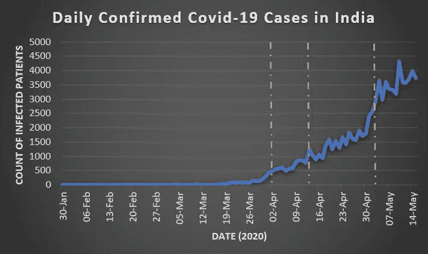

图 1:印度每日新冠肺炎确诊病例

看图表，想一想在这个简单的表示中你能看到什么？印度从 2020 年 1 月底的 0 例增加到 5 月中旬的每天约 3500 例感染。从 3 月底到 4 月初，病例开始略有增加。虽然 4 月份稳步增长，但 5 月份的大幅增长令人担忧。所以，看看仅仅画一个线形图是如何让你想到至少 3 个观察值的！想想成千上万的数据点，也就是成千上万人的新冠肺炎测试结果，这些数据点已经被这条简单的曲线概括出来了！

如果你想添加更多的信息会怎样？不如我们想知道随着时间的推移，复苏的进展如何？看着图表，思考你能推断出的见解。此外，请注意图表和纵轴标题是如何改变的，以讲述故事的关键。添加了图例，以解释哪条曲线显示确诊病例与恢复。

图 2:印度每日确诊和恢复的新冠肺炎病例

让我们再举一个例子。你有没有想过，在 LinkedIn 上，当你有成千上万的联系人和关注者时，有没有一种方法可以了解他们在职业和社交方面是如何与你联系在一起的？LinkedIn 有一张地图可以让你看到它们。看看下面的视频，由 DJ Patil 解说，讲述了在 2014 年之前，他们如何通过酷炫的可视化让您能够更好地了解您的网络连接:

视频:昔日的 LinkedIn 网络地图

虽然上述功能已于 2014 年停止使用，但它曾是 LinkedIn 最酷的功能之一。然而，一些最近的开源工具，如 Python，可以创建一些类似的视觉效果，如果不是完全相同的话。

我们谈到了数据可视化的细微之处。但是有没有什么**缺点**？看看新冠肺炎的图表。它是否显示每天确诊和/或康复病例的确切数量？它无法向你展示政府、科学家和一线医护人员等特定群体工作可能需要的准确数量或精确度，这可以通过[表格表示法](https://medium.com/@pribanerjee01/basic-statistics-data-and-its-representation-f15a9110ffc0?sk=c24d75fe67bedf28be9748b85062e41d)获得。然而，它们提供了一个近似的理解，这对于一个更大的群体来说是有好处的，他们正在跟踪感染增长并祈祷“曲线变平”。同样，一个好的视觉化的故事需要很长时间来创作。

# 如何开始？

在一个满是观众的房间里，当你想分享一条信息时，你有时可能想在白板上画图。那你脑子里在想什么？或许，传达你的信息的最好方式是什么？最容易传达信息的绘画形式是什么？所以，你可以想象你需要遵循几个步骤:

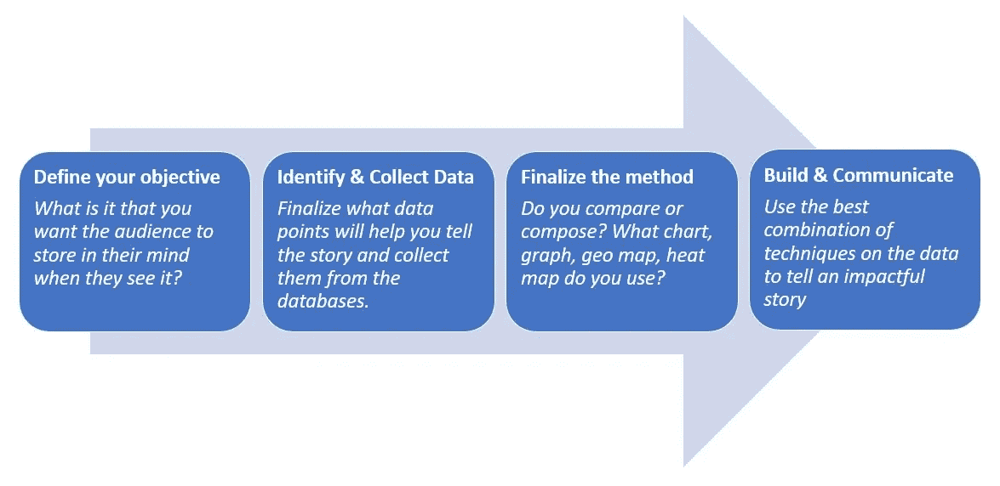

图 3:实现有效可视化的步骤

# 数据可视化在行动

为了观察各种类型的视觉化活动，我们需要理解它们在不同情况下的必要性。以下是它可以对您的数据做的三件重要的事情:

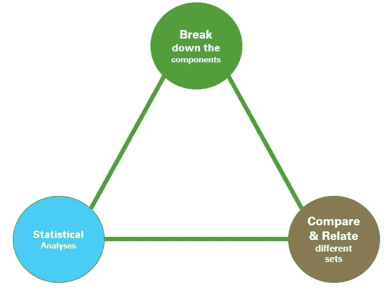

图 4:可视化有什么帮助？

让我们先从第一件事开始，**分解组件。**这些时候，你有数据，你希望了解它是由什么组成的。例如，如果您希望了解工厂中工人的构成，以下是几种可视化方法:

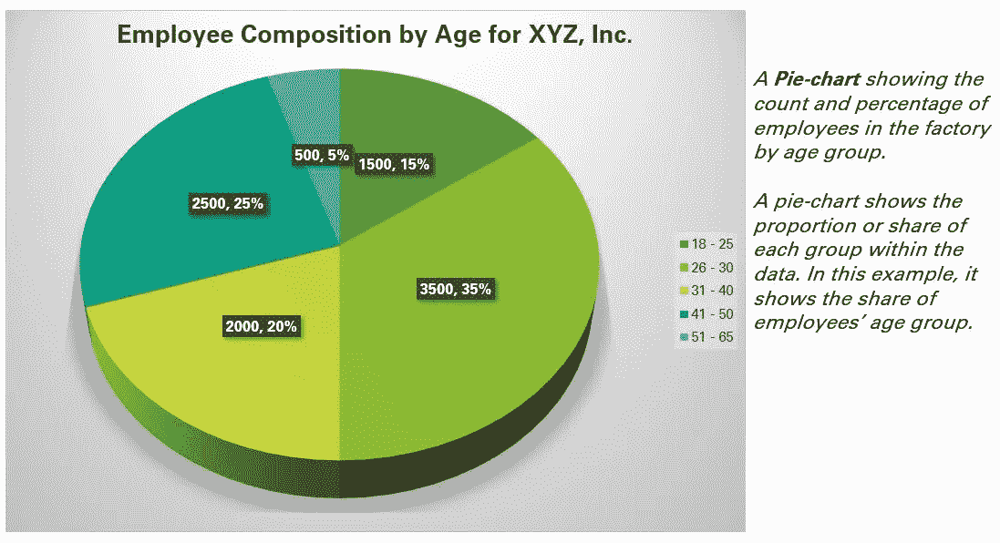

图 5: **饼状图**显示万名员工中不同年龄员工的**比例**

接下来， **100%堆积柱形图(如下图 6)** 可以显示一个组中的子组。在这个例子中，我们可以很容易地找到年龄组内的性别构成。注意我们如何通过更好地使用颜色来更好地推断。

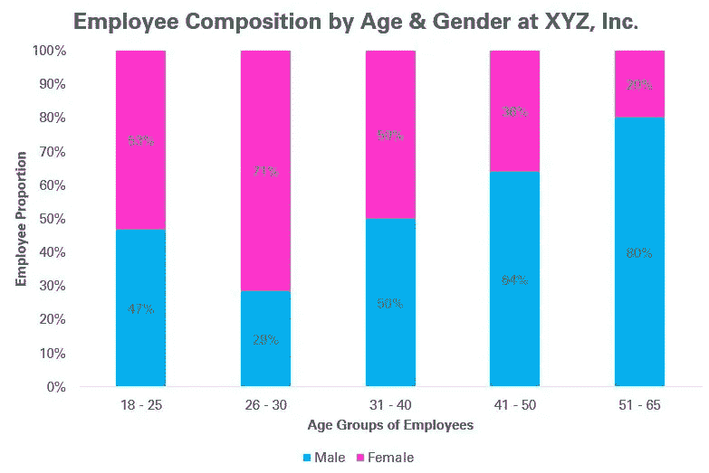

图 6: 100%堆积柱形图，显示各年龄组中男性与女性的百分比

此外，请注意这些图表如何帮助**在比例的基础上比较**(我们的第二个关注领域，根据图 4)。如果需要基于绝对差异的比较，类似图 7 的**堆积柱形图(非 100%)** 会有所帮助。

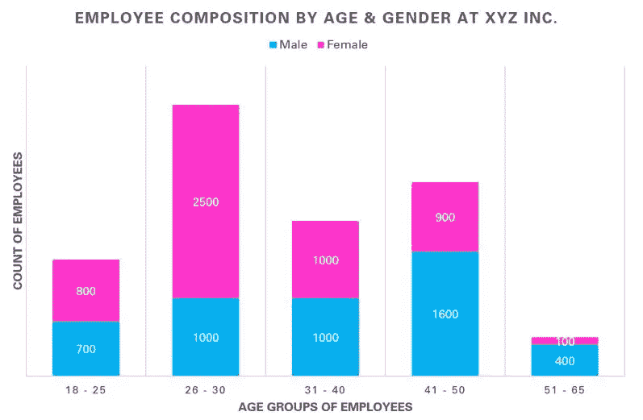

图 7:堆积柱形图，显示各年龄组中男性与女性的数量

**条形图**是柱形图的扩展，在柱形图中，条形水平移动，而不是垂直移动。另外，看一下**树形图**进行**构图**和**对比**:

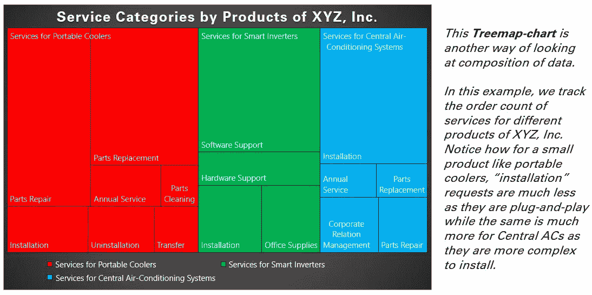

图 8:显示通过积累以及与其他组比较的构成的树形图

用于定量数据的其他非常重要的绘图技术有**面积图**和**瀑布图**。

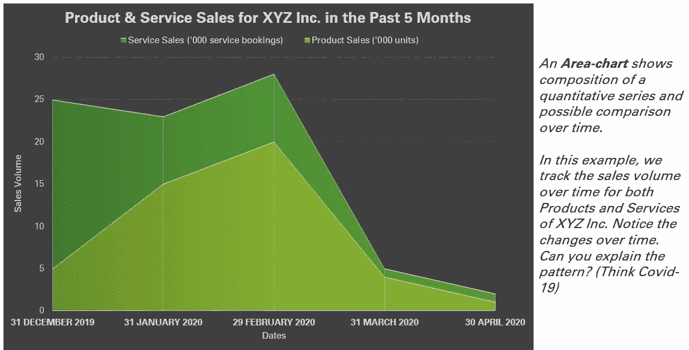

图 9:面积图

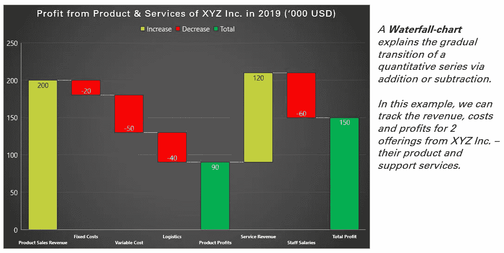

图 10:瀑布图

我们已经看到了一些图表，展示了如何将数据分解为粒度成分，以及一些比较这些成分数据的方法。还有一些其他方法可以比较不同时间和不同静态点的数据成分。看看上面图 1 和图 2 中的新冠肺炎感染和恢复计数图表。这些是**折线图**，这些图*比较感染和恢复的数量如何随时间变化，或者比较两个时间点*。

也可以使用简单的**条**或**柱形图**来显示一段时间内以及某个时间点的**比较**。例如，在 XYZ 公司的员工中，您可能想知道他们在哪个州上学:

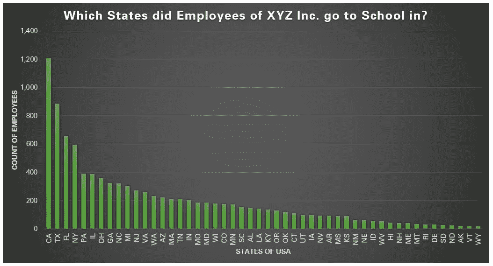

图 11:条形图

请注意，如果您想要绘制多个信息，但这些信息遵循相同的单位刻度，您可以在水平轴上为每个类别或时间点创建多个条形图。

让我们转到可以通过可视化展示的**统计分析**。第一种类型始终是显示数据分布的**直方图**。例如，如果您希望了解 XYZ 公司工人的身高分布，直方图将给出相同的解释:

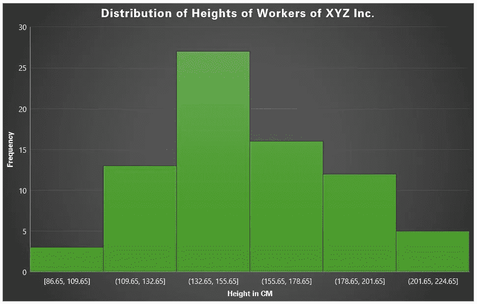

图 12:工人身高分布直方图

请注意，这看起来很像柱形图，但本质上，与柱形图有很大的不同。首先，直方图显示分布，而柱形图比较类别或时间段，目的是不同的。接下来，直方图可以处理连续形式的数据，其范围被分组到多个区间中。

破译数据的分布给你一个特定变量的**可能值，比如身高和**它们出现的频率**。*如果您要为工人订购防护装备，您可以使用直方图大致了解订购数量，而不是测量 10，000 名工人中每个人的准确身高，这非常耗时。***

虽然像身高这样的变量通常遵循 ***正态分布*** (类似钟形曲线的形状)，但现实生活中有许多其他变量并不如此。举例来说，让我们考虑一下，如果工人在工作中受伤，他们可以提出工伤保险索赔。

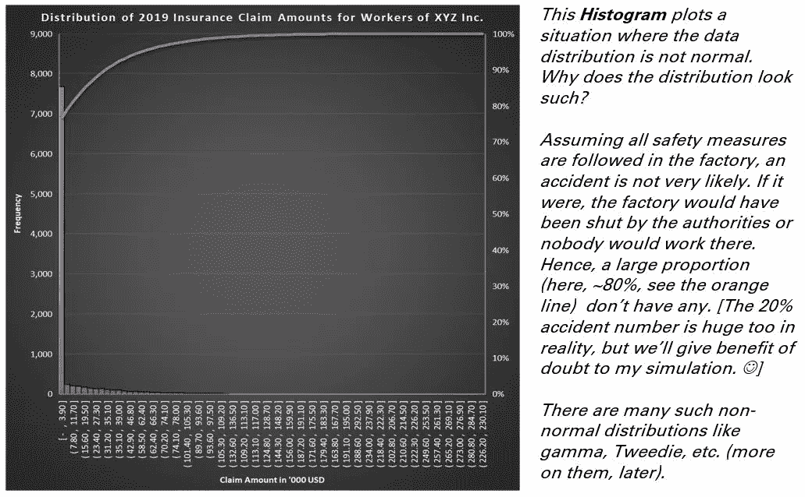

图 13:显示工人保险索赔分布的直方图

现在我们已经看到了分布图，可视化在统计分析中的另一个重要用途是**理解关系**，这将我们带到**散点图**。

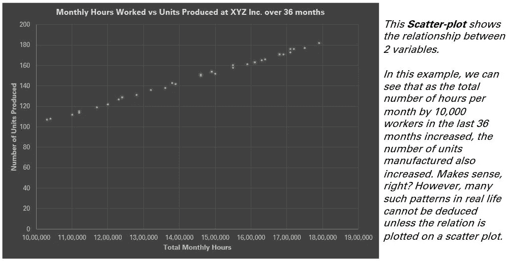

图 14:散点图

另一个用于数据统计分析的非常有用的图表是**箱线图**(或有时称为“**箱线图**”)。它可以使用多种度量来描述数据，如**最小值、第一个四分位数、中值、第三个四分位数和最大值**。例如，如果您想了解 XYZ 公司的 3 种产品的数据，在您收到对某一产品的第一次投诉之前过了多少个月呢？假设您收集了 5000 台便携式冷却器、智能逆变器和中央空调系统的数据。你如何代表？

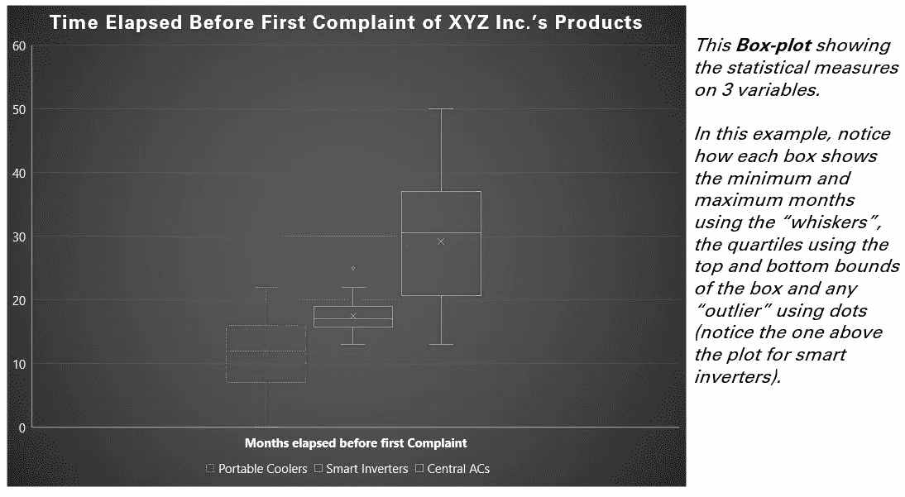

图 15:箱线图

虽然上面解释的技术有助于在许多情况下可视化数据，但是还有许多其他创新的方式来可视化数据，如人口统计图(参见下面的示例)、热图等。拥有多个仪表盘构建器和开源工具，如 Tableau、Qlikview、R-Shiny、Python 等。可以创建许多具有这种可视化效果的很酷的仪表板。回顾这些工具超出了本文的范围，但是我们将看看一个常用的工具，Microsoft PowerPoint，它可以构建这些图表的大部分。

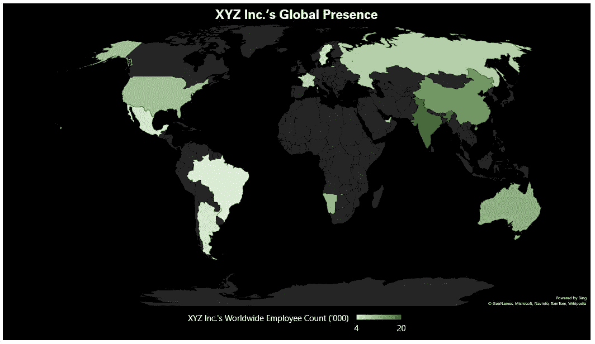

图 16:使用微软 PowerPoint 的世界地图

# 使用常用工具创建可视化

上面显示的所有图表都是用微软的 PowerPoint 制作的，如果你使用的是微软 Office 系统，PowerPoint 是一个非常常用的工具。因此，你实际上不需要购买花哨的工具来使用可视化创建有效的故事。然而，这对于中等规模的数据集来说是正确的。如果您的数据很大，那么可能需要寻找能够处理大小的替代方法。下面是在 PowerPoint 中创建可视化效果的一步一步的简单方法:

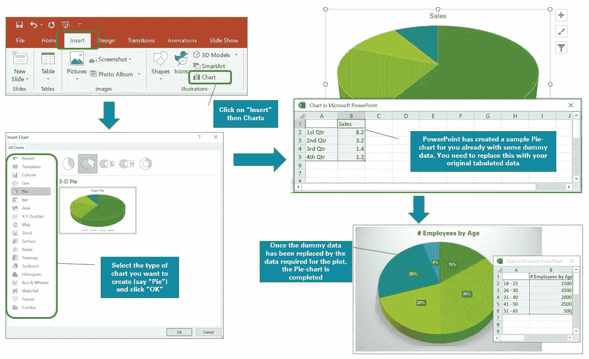

图 17:使用 Microsoft PowerPoint 开发可视化

# 结论

在本文中，我们看到了使用图片从数据开发多个故事的多种技术。当你有大量的数据流，并且你不打算钻研复杂的数学时，数据的可视化可以训练你的思维来推断重要的结论。虽然现在有多种工具来开发可视化，但要从中等大小的数据开始，除了 Microsoft Excel 和 PowerPoint 等常用工具之外，不需要任何东西。随着当今世界数据量的不断增长，构建一个能够轻松查看数据并理解可见模式的策略以更好地制定分析方法是势在必行的。所以，选择今天你最容易得到的数据集，看看你能创造出什么样的视觉效果！