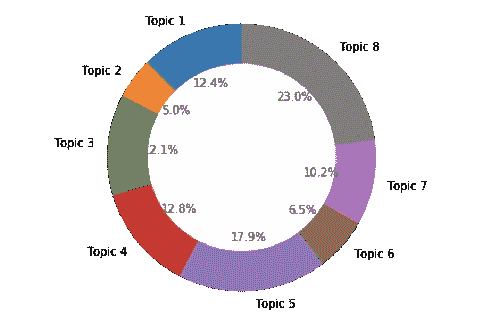

# 留守家园——新冠肺炎的故事

> 原文：<https://towardsdatascience.com/stayathome-a-story-of-covid-19-6aeeba2b6c?source=collection_archive---------75----------------------->

## 居家养老运动的趋势与前景分析

来源[https://unsplash.com/@anastasiiachepinska](https://unsplash.com/@anastasiiachepinska)

冠状病毒病(新冠肺炎)是由一种新发现的冠状病毒引起的传染病[来源](https://www.who.int/health-topics/coronavirus#tab=tab_1)。2019 年 12 月下旬，中国武汉市报告了首例新型冠状病毒病例[ [来源](https://www.businessinsider.sg/coronavirus-pandemic-timeline-history-major-events-2020-3?r=US&IR=T) ]，此后该病毒在全球范围内传播。因此，世卫组织宣布它将在 2020 年 3 月 11 日前成为全球疫情。截至 2020 年 5 月 23 日，在 188 个国家和地区报告了超过 520 万例病例，超过 338，000 人死亡，约 205 万人已经康复。自从疫情公告以来，许多国家已经决定完全或部分封锁他们的国家，许多人在家里学习、工作和祈祷，这导致了在家活动。想了解更多关于冠状病毒的信息，请看[cdc.gov](https://www.cdc.gov/coronavirus/2019-nCoV?source=post_page-----f4d3d9cd99ca----------------------)。

# 家庭旅馆

2020 年，StayAtHome 已经成为世界各地的一项运动，作为各国政府为缓解新冠肺炎疫情而限制人口流动的行动。这场运动命令社会呆在家里，除了必要的任务。一个几乎相似的术语是一级防范禁闭，但一些权威人士认为一级防范禁闭有可能被误解，人们会认为它包括挨家挨户的检查。

*本文的目的是了解人们对居家养老活动的趋势和看法*

# 数据源

本文使用的数据都是包含 **#stayathome** 或短语**“呆在家里”**的推文。新冠肺炎首例病例于 2019 年底报告，并于 2020 年初开始引起世界关注。因此，数据收集的时间范围在 2020 年 1 月 1 日**到 2020 年 5 月 20 日**和**之间**。收集的推文仅限于英语推文。收集的推文总数为 3571374 条。在收集的数据集上应用了一系列数据清理步骤，如删除重复、删除转发和提及。数据清洗后的推文总数为**3570271**。

# 趋势

**图 1**2020 年 1 月 1 日至 2020 年 5 月 10 日与 StayAthHome 活动相关的推文总数趋势

自 2020 年 3 月 9 日以来，与 StayAtHome 运动相关的推文数量开始增加，并于 2020 年 3 月 23 日达到峰值。高峰出现在许多国家在接近该日期时做出重要决定的时候。随着冠状病毒病例达到 1600 例，澳大利亚于周一(2020 年 3 月 23 日)开始一级防范。英国首相鲍里斯·约翰逊告诉英国公众:“你必须呆在家里。”2020 年 3 月 23 日星期一。美国的一些州也宣布在 2020 年 3 月 22 日至 24 日进行封锁，如[康涅狄格州](https://en.wikipedia.org/wiki/COVID-19_pandemic_in_Connecticut)、[马萨诸塞州](https://en.wikipedia.org/wiki/COVID-19_pandemic_in_Massachusetts)、[密歇根州](https://en.wikipedia.org/wiki/COVID-19_pandemic_in_Michigan)、[纽约州](https://en.wikipedia.org/wiki/COVID-19_pandemic_in_New_York_(state))、[威斯康星州](https://en.wikipedia.org/wiki/COVID-19_pandemic_in_Wisconsin)、[堪萨斯市](https://en.wikipedia.org/wiki/Kansas_City,_Kansas)、[堪萨斯州](https://en.wikipedia.org/wiki/COVID-19_pandemic_in_Kansas)和[俄勒冈州](https://en.wikipedia.org/wiki/COVID-19_pandemic_in_Oregon)。此外，还有其他国家在接近该日期时做出了同样的决定，如希腊、利比亚和德国[ [消息来源](https://en.wikipedia.org/wiki/National_responses_to_the_COVID-19_pandemic) ]。

在 2020 年 3 月 23 日之后，趋势是下降的，最低数字发生在 2020 年 5 月 10 日，这是数据收集时间范围的最后一天。随着澳大利亚等几个国家放松封锁，这一数字预计将进一步下降。

# 相关标签

图 2 显示了与#StayAtHome 本身旁边的 StayAtHome 活动相关的前 25 个标签。确认#StayAtHome 与#covid19 和#冠状病毒高度相关。许多人试图通过使用#stayhomesavelives、# socialdistancing 和#staysafe 来提醒社会。标签中的另一个发现是关于地点的，例如#NHS 代表英国，#indiafightscorona 和# jantacurfew 来自印度。此外，在疫情爆发期间，人们还在推特上谈论复活节、音乐/艺术表演和在家工作。

**图 2**stay home 活动的相关标签

# 主题建模

上一节通过标签讨论了推文的背景。通过文本本身来理解推文会很有趣。一种方法是进行主题建模。

主题建模是一种用于发现出现在文档集合中的抽象“主题”的统计模型。有许多不同的算法可用于执行主题建模，如 [LDA](http://www.jmlr.org/papers/volume3/blei03a/blei03a.pdf) 、 [DMM](https://link.springer.com/content/pdf/10.1023/A:1007692713085.pdf) 、 [NMF](http://papers.nips.cc/paper/1861-algorithms-for-non-negative-matrix-factorization.pdf) 、[双项](https://dl.acm.org/doi/abs/10.1145/2488388.2488514)等。LDA 将用于此写作。如果你对 LDA 的技术方面感兴趣，我建议你阅读[论文](http://www.jmlr.org/papers/volume3/blei03a/blei03a.pdf)，或者下次我可能会写另一篇关于它的文章。

如前所述，趋势自 2020 年 3 月 9 日开始增加，因此，在执行主题建模时，将仅使用自 2020 年 3 月 9 日以来的 3，451，390 条推文。在执行 LDA 时，其中一个步骤是定义主题的数量。从 2 到 20 个主题的可能数量的列表被应用于该算法，并且最佳模型是具有 8 个主题的 LDA。以下是每个话题的热门词汇。

***话题一:*** *时间、工作、制作、小孩、日子、学校、妈妈、孩子、家、父母、好、吃、人、夜、爱、年、事、神、食物、思念* ***话题二:*** *订单、关闭、测试、工人、人、面具、必备、ppl、罚款、到期、警察、增加、健康、办公室、医院、穿、组、开、打、走* **trump，reopen，start，wanna
***话题 4:*** *天，时间，今天，观看，制作，玩，享受，好，爱，自由，伟大，阅读，学习，在线，展示，明天，星期，快乐，开始，直播* ***话题 5:*** *人，病毒，传播，政府，停止，死亡，covid，电晕，制作，封锁，国家，告诉，唐，冠状病毒 更新、支持、总、三月、花费、关注、服务、每日、数字、积极* ***话题 7:*** *停留、安全、家庭、健康、家庭、拯救、周末、拯救 _ 生活、爱情、消息、covid、洗手、希望、避免、每个人、保护、关怀、生活、时间、美好* ***话题 8:*** *人、工作、唐、做、家、天***

## **解读**

此解读纯属作者角度。

主题 1 包含**孩子、日子、学校、妈妈、孩子、父母**可能与学校关闭和需要在家照顾他们的父母有关。

主题 2 包含**测试、人员、口罩、必需品、医院、佩戴**可能代表新冠肺炎测试，高度鼓励人们佩戴口罩以帮助防止疾病传播

主题 3 包含**州、州长、扩展、开放、抗议、发布、特朗普**可以代表美国的封锁扩展，并向美国总统发布关于打开封锁的抗议

主题 4 包含**日、时间、观看、玩、享受、在线、表演**可以表示与游戏和表演相关的常见家庭活动。

主题 5 包含**人、病毒、传播、政府、停止、死亡、covid、电晕、制造、战斗、疫情、倾听、规则、公共**可能代表来自用户的声音以对抗疫情

主题 6 包含**病例、covid、视频、分享、死亡、帖子、安全、团队、更新、支持、总计、三月、花费、服务、每日、数量、阳性**可以代表阳性或死亡病例数量的更新，尤其是在 2020 年 3 月期间。

主题 7 包含**、安全、家庭、健康、家庭、储蓄、周末、储蓄 _ 生活、爱、消息、covid、洗手、避免、保护、护理、生活、时间、好**可以与在家中保持安全和健康以及通过洗手避免新冠肺炎相关。

主题 8 包含**人物、工作、家庭、薪酬、周**可能与在家工作有关

## 话题比例

尽管 LDA 假设一个文档包含不止一个主题，但是如果每条 tweet 都用其主导主题来标记，那将会很有趣。通过这样做，可以计算出每个主题的 tweets 数量。

**图 3** 基于主导话题的推文比例

这表明，与在家工作相关的话题(话题 8)和来自用户的反对疫情的声音(话题 5)占总推文的 40%以上。这与许多人由于这场危机被迫在家工作的事实相一致，人们倾向于在社交媒体上讨论新冠肺炎的传播，并希望这场疫情能够尽快结束。

# 评论

如果你有兴趣进一步分析这个数据集，我在这里发布了数据集[。](https://www.kaggle.com/robertvici/stay-at-home-tweets-covid19)

资源: [Github](https://github.com/robertvici/StayAtHomeMedium)

如果您有任何反馈或进一步的讨论，请通过 [LinkedIn](https://www.linkedin.com/in/robert1995/) 联系我。