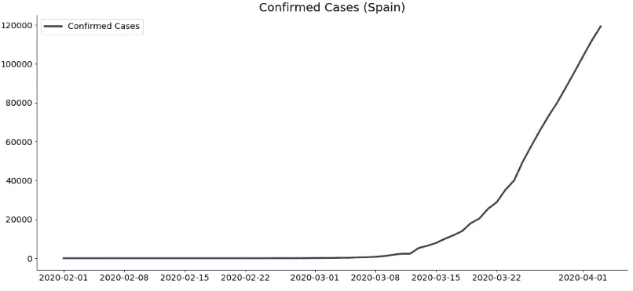
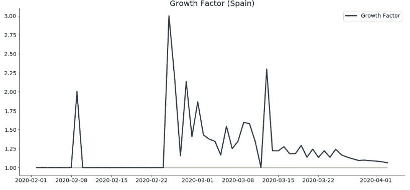
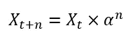
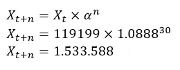
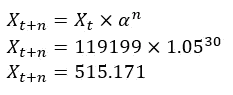
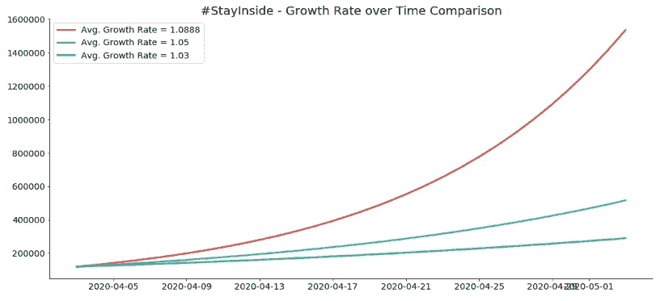

# #StayAtHome —他们是对的吗？

> 原文：<https://towardsdatascience.com/stayathome-are-they-right-99f764a0b1de?source=collection_archive---------52----------------------->

## 我们在哪里，我们将会在哪里？西班牙数据案例研究。

每天新闻和媒体都告诉我们，建议呆在家里——但是我们有办法从数学上证明或否定这种说法吗？我们将处理西班牙的数据，但这些原则可以适用于任何国家。

在这篇文章中，我们将用基本的数学来证明或反驳这种说法——但是如果你不喜欢数学，也有**图表**。

[疾控中心](https://unsplash.com/@cdc?utm_source=medium&utm_medium=referral)在 [Unsplash](https://unsplash.com?utm_source=medium&utm_medium=referral) 上拍摄的照片

呆在家里的整个想法是避免不必要的社会接触，并与外界保持距离。通过这样做，我们大大降低了疾病的增长率。

但是这有多重要呢？

事实证明，很多。

在继续之前，请记住我不是任何类型的医学专家，下面写的一切都是基于纯(简单)数学。此外，使用的数据集可以从[这里](https://github.com/CSSEGISandData/COVID-19/blob/master/csse_covid_19_data/csse_covid_19_time_series/time_series_covid19_confirmed_global.csv)下载。

# 案例:西班牙

我不住在西班牙，也没有亲近的人住在那里，但事实证明，西班牙现在是欧洲“最热”的地方。

在写这篇文章的时候，我们已经有了截止到 2020 年 4 月 3 日的累积数据。到目前为止，西班牙有 119.199 例确诊病例。让我们快速想象一下病毒随时间的移动:

从这里开始，谁知道多久曲线会开始看起来像你的平均逻辑曲线。

但是，在得出结论之前，我们需要更多信息，我们还对某个时间段的平均增长率感兴趣，比如说过去 7 天。这可以通过简单地将今天的确诊病例数除以昨天的数字来获得，结果应该接近于 1。

在指数增长阶段，如果我们比较 4 月 2 日和 4 月 3 日，这个数字将一直大于 1，大约为 1.06——这意味着 4 月 3 日西班牙的确诊病例比前一天多了大约 6%。

一旦西班牙接近**拐点**，我们可以预计增长率将持续在 1 左右，并从那里开始走下坡路。

如果你感兴趣，以下是西班牙的增长因素:

我们可以清楚地看到这个因素在减少，但是谁知道接下来会发生什么。

现在让我们做一点数学计算。

**计算出的生长因子是过去 7 天生长因子的平均值**,我们将用它来证明呆在家里、保持个人卫生和避免社交聚会是多么重要。生长因子的平均值大致为 **1.0888** 。

对你来说，这听起来可能没什么——但这就是为什么你错了。如果西班牙在接下来的 30 天内有大致相同的 8.88%的日增长率，则确诊病例的预期数量可以计算如下:

其中:

Xt:今天确诊病例数

n:未来的天数

α:平均增长率

一旦我们输入数字，就会得到一个惊人的结果:

这意味着，如果不采取额外措施让人们留在室内，增长率保持大致不变，我们可以预计，30 天内，仅在西班牙，就有 153 万人受到感染！请记住，只有当一切都保持不变时，这才是**，这很可能不会发生。**

然而，如果我们遵循政府制定的规则(或实施新的、更严格的规则)，设法将平均增长率降低到比如说 1.05，情况就会大大改善:

嗯，这个数字无论如何都不小，但是 **515K** 听起来比 1.53M 好多了。

# 带回家的点

总之，如果你对数学不感兴趣，我有别的东西给你。我已经准备了一张(可能)很好看的图表，显示了西班牙在 3 种不同增长率下的确诊病例数:

*   1.0888 —过去 7 天的平均值
*   1.05 —之前讨论过的一个
*   1.03 —更优的比率

这是图表:

现在，不可否认的是，更多的人会被感染，不幸的是，更多的人会死亡——但是通过实施更严格的规则，我们可以确保增长不会遵循红色曲线，而是在蓝色和绿色曲线之间的某个位置。

感谢阅读，保重，待在家里。

***编者按:*** [*走向数据科学*](http://towardsdatascience.com/) *是一份以数据科学和机器学习研究为主的中型刊物。我们不是健康专家或流行病学家，本文的观点不应被解释为专业建议。想了解更多关于疫情冠状病毒的信息，可以点击* [*这里*](https://www.who.int/emergencies/diseases/novel-coronavirus-2019/situation-reports) *。*

喜欢这篇文章吗？成为 [*中等会员*](https://medium.com/@radecicdario/membership) *继续无限制学习。如果你使用下面的链接，我会收到你的一部分会员费，不需要你额外付费。*

 [## 通过我的推荐链接加入 Medium-Dario rade ci

### 作为一个媒体会员，你的会员费的一部分会给你阅读的作家，你可以完全接触到每一个故事…

medium.com](https://medium.com/@radecicdario/membership)