# 蒸汽推荐系统

> 原文：<https://towardsdatascience.com/steam-recommendation-systems-4358917288eb?source=collection_archive---------22----------------------->

## 这篇文章是关于 Steam 网站上的推荐系统的。

> 梁、谢一凡在浏览
> 
> 的销售网站时。我们沉迷于那些商家的种类和品种。由于网站的设计，我们可以很容易地点击和购买。有时候，这种购买看起来很烦很晕，人们被困在商家里，找不到他们的 gorals，很多平台有成千上万的用户和游戏。因此，大多数网站都致力于让每个用户都喜欢和适合商家，让每个用户都有良好的游戏体验。
> 
> 本文将游戏售卖平台“Steam”的推荐系统设计成五个部分，分别是基于人气、基于质量、基于内容、协同过滤、规模上的推荐。我们将介绍我们的项目从获取数据，建立模型，以及我们使用的算法和我们最终得到的结果。

下面是 GitHub 上这个项目的源代码链接:

[https://github . com/AlbertNightwind/Steam-recommendation-system](https://github.com/AlbertNightwind/Steam-recommendation-system)

**关于蒸汽的介绍**

什么是 Steam
Steam 是一个在线、跨平台的游戏分发系统，拥有约 7500 万活跃用户，总计约 1.72 亿个账户，托管超过 3000 款游戏，这使其成为本文介绍的这类作品的理想平台。该数据集包含超过 3000 个游戏和应用程序的记录。

Steam 是由 Valve 提供的视频游戏数字发行服务。它于 2003 年 9 月作为一个独立的软件客户端推出，作为 Valve 为其游戏提供自动更新的一种方式，并扩展到包括第三方发行商的游戏。Steam 还扩展到了一个在线网络和移动数字店面。

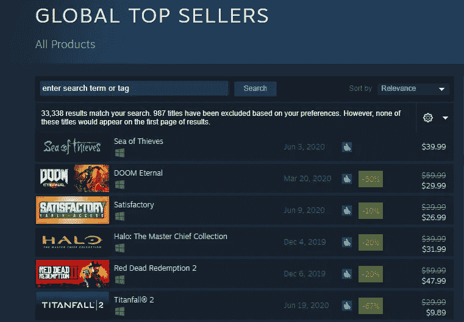

[https://store.steampowered.com/search/?filter = globaltopsellers&OS = win](https://store.steampowered.com/search/?filter=globaltopsellers&os=win)

*数据集*
我们使用了 NumPy、pandas、requests、sys 的一个包，通过 Steam Spy 的 API 获取我们需要的数据，并使用 JSON 进行存储。
*目的*
根据游戏的受欢迎程度、游戏描述的相似程度、游戏的质量、玩家对游戏的偏好，向游戏玩家推荐相应的游戏，使 steam 获得更高程度的客户满意度

**建立推荐系统的步骤**
*第一部分:基于人气的推荐*
对于 Steam 网站的新用户来说，他/她所知道的都不算什么，也许让那些新用户了解这个网站最高效的方法就是给他们一些其他以前用户拥有的最受欢迎的游戏。而且这些热门游戏没有时间限制。自从他们出现在这个网站上，他们一直是受欢迎的游戏。

1.在做推荐之前，我们首先需要提取 app_id、游戏名称、拥有者、价格，所以我们需要做的第一步是通过请求访问 steam API，提取两周前 100 名游戏的相关数据，通过 JSON 将数据保存为 CSV 格式，以备后用。接下来，我们将使用 pandas 将数据转换为数据帧格式。

2.我们根据拥有者的数量对游戏进行降序排列(在这一部分，我们认为默认拥有者最多的游戏在这里最受欢迎)

以下是 Steam 网站上热门项目的所有者排名，其中一些实际上不是游戏而是软件:

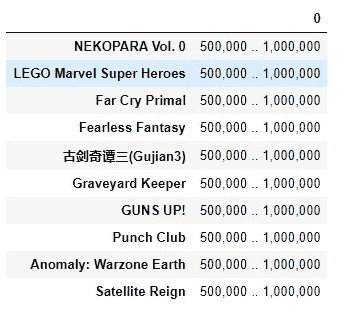

按所有者数量列出的顶级项目

*Part2:基于质量的推荐*
由于 Steam 是一个非常全面的网站，所以很直接的我们就可以得到其拥有者最热门的游戏，这对于冷启动用户来说是一个很好的开始。但是这种方法是否能让一些普通用户满意呢？也许答案不是“是”。那些受欢迎的游戏总是有更多的用户，更多的正面或负面评论。从商业角度来看，游戏所有者被事实所说服。他们更关心游戏的质量，而不是销量。然而，一些游戏有更多的所有者，也许是因为媒体的宣传，著名的游戏工作室以及 Steam 网站本身。总的来说，因为玩家对于游戏的配合，网络游戏总是比非网络游戏拥有更多的用户。从普通用户的角度来看，他们中的许多人更关心这个游戏是否得到大多数留下评论的用户的积极评价。因此，所有评论的积极评论率(我们这里对“基于质量”的定义)可以很好地评估这款游戏在用户中是否具有良好的质量。

用户评论最多的 10 款游戏

1.我们首先还提取 app_id、游戏名称、所有者价格、正面评论和负面评论。然后我们把它们存储在 JSON 里，分别列出了每款游戏的所有评论，因为 app_id 是不可变的。这样就可以观察每款游戏的正面评价和负面评价的数量。

2.接下来，我们将每款游戏的评论集合起来，在原始数据框中增加了两列，分别是正面评论数和负面评论数，但正面评论数和负面评论数是独立的，也就是说，如果 A 的正面评论数相对低于游戏 B，但游戏 A 的总评论数远低于游戏 B，在这种情况下，显然游戏 A 的正面率更高。为了让分析更准确，更直观，我们增加了一栏好评率，也就是用好评数除以总评论数，这样我们就很容易在商品评论中看到一个好评的比例。

在这一步的最后，我们根据游戏的好评度对它们进行了排序。排序后，游戏对应的 ID 保持不变。

结果是:

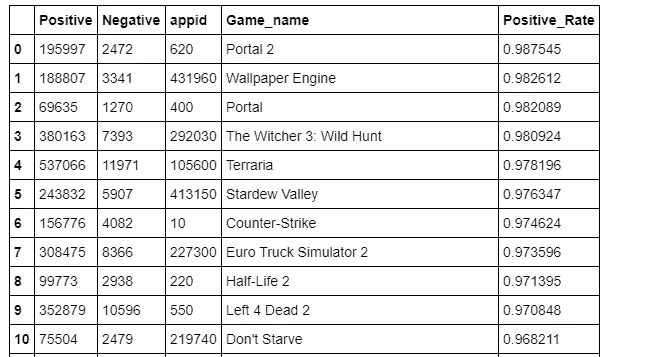

按正比率排序的游戏

*第三部分:基于内容的推荐*

对于第 3 部分，我们认为该项目将集中于游戏的描述，因为游戏的描述不是直接从 Steam API 访问的，我们必须访问 Stem 网站来浏览这些描述。

因此，我们通过唯一的游戏 id 来访问每个游戏的描述，因为每个游戏都有一个通用的网站标准格式，我们首先复制通用的 HTTP 格式，然后我们将这些通用的 HTTP 格式与每个游戏的唯一 id 连接起来，然后将它们与每个游戏的数据帧存储在一起。然后我们通过 HTTP 请求访问它们，并首先将它们存储到一个新的 DataFrame 列中。
在这一部分中，我们想用对每一款游戏的描述来分析两款游戏之间的相似性，并根据相似性向玩家推荐合适的游戏。(如果玩家 A 喜欢玩游戏 A，并且游戏 A 和游戏 B 有很高的相似度，我们假设玩家 A 会喜欢游戏 B)

1.我们首先组装链接，我们可以得到游戏的描述。

这一步的结果是:

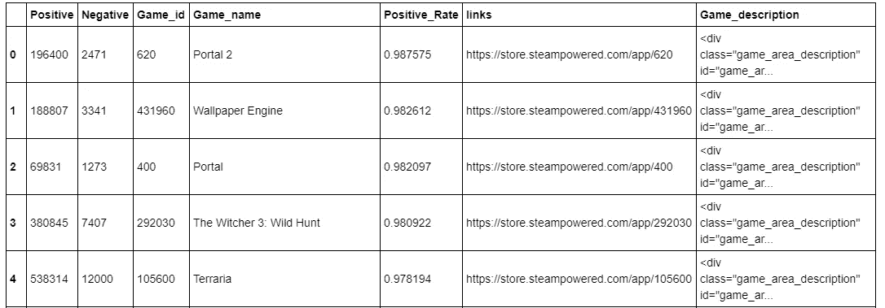

游戏及其 HTTP 描述

2.接下来，我们使用漂亮的汤包来解析这些游戏的描述，我们首先移动我们不需要的项目，如停用词和一些会妨碍我们的符号。

然而，从 HTTP 请求中得到的每个结果都是 HTTP 文本，其中包括许多 HTTP 标签和格式。为了看到纯粹的游戏描述，我们绝对需要删除它们。因此，我们在这里使用 python 的正则表达式。通过正则表达式对数据进行清洗后，得到了数据描述列。每个游戏的信息，后面是游戏描述。我们得到的一个清晰的描述是:

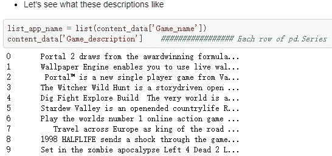

下一步，我们将使用这些游戏描述来提出我们的建议。诚然，这里的游戏描述是代表“内容”的。

由于基于内容的模型与这些内容文本相联系，它与自然语言处理领域有一些内在的联系，我们将在这里重点介绍一个基本的自然语言处理模型 TF-IDF，它专注于内容文本中每个单词的权重。每个单词的权重将不仅通过其在该内容文本上的频率来加权，而且通过所有文本集的频率来加权，并且 TF-IDF 的算法是:

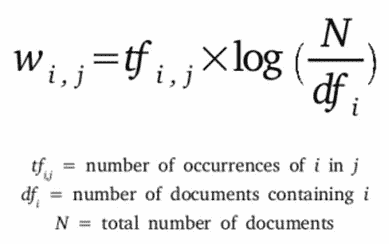

[https://www . search engine journal . com/TF-IDF-can-it-really-help-your-SEO/331075/](https://www.searchenginejournal.com/tf-idf-can-it-really-help-your-seo/331075/)

以下是每个游戏描述示例中每个单词的 TF-IDF 值:

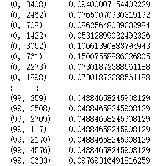

TF-IDF 值格式

在我们得到每个单词的 TF-IDF 值后，这里使用线性核来计算这个游戏的描述 TF-IDF 权重和其他游戏的描述 TF-IDF 权重。由于 python 中的 Tf-IDF 矢量器会产生一些“文本中的单词权重”矢量，下图显示了这些矢量的一个示例，这里我们有一个包含两个文本的文本:“这是非常奇怪的非正式形式，这非常好”，如图所示，第一个数字是文本编号，第二个数字是这个示例文本集中单词的编号。然后就是这个词在这篇课文里的 TF-IDF。这里将使用值线性核来乘以这些向量。线性核的基本原理是:如果有两个维数相同的矩阵，这些矩阵中相同位置的一些大值会使它们的乘法结果在线性核计算的最终矩阵中仍然很大。

然后我们会把线性核计算出来的这些结果做一个序列，如果结果高，我们会把它们作为这个游戏最相关的推荐。这里我们列出了 10 大推荐。

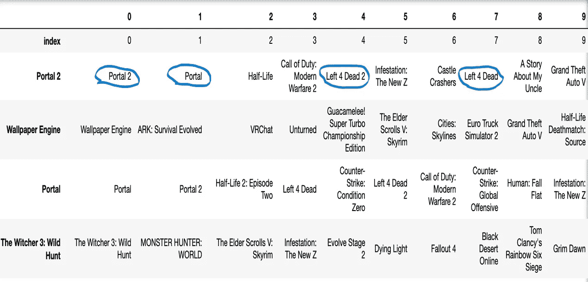

基于内容的 10 大推荐

推荐结果在主观和客观上都比较激进，比如对于游戏《传送门 2》，最相似的游戏是自己，然后是《传送门 1》，反之亦然。同样，对于游戏《传送门 2》的其中一个推荐《Left 4 Dead 2》，我们也可以看到另一个推荐是《Left 4 Dead》。这是一个有趣的现象，因为对于一个游戏的所有推荐，这些推荐在人类认知中仍然彼此具有内在的关系。

*第四部分:协同过滤推荐*

*数据获取*
我们通过随机搜索用户的 steam 名称(也就是说我们假设了一些任意的名称，比如“43”等)来获得这些链接。)并将他们的 steam ids 与网站格式放在一起。然后我们得到所有这 10 个链接，包括用户的个人资料。[https://steamidfinder.com/](https://steamidfinder.com/)该网站将通过粘贴 Steam_ID 或一个随机的用户名让我们访问用户的个人资料，我们需要这样做，因为有时我们无法在 Steam 网站上通过用户名访问用户。

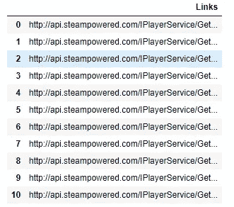

用户的个人 steam 信息链接

然后我们使用 requests.get()通过这 10 个链接获取播放时间信息。

*数据修改*

然而，steam 网站和 steam API 上都没有关于这些用户持续评分的记录。实际上，在 Steam 平台上，用户只给出“推荐”或“不推荐”，也就是二元评价，正面和负面，即使在用户网站上，仍然没有一星到五星等连续评分的机制。为了获得关于用户-游戏交互的连续评分，我们必须假设一种用户游戏评分交互机制。因为用户对游戏的关注度可以通过游戏的播放次数来反映。我们可以假设播放时间是关于用户兴趣的相当有说服力的信息。

因此，这里我们假设游戏时间中位数是兴趣的一个非常重要的部分。为了比较平均游戏时间，我们将比较每个用户在该游戏上的平均游戏时间和所有用户在该游戏上的平均游戏时间，然后我们将使用算法将这两个平均游戏时间的比较分成从 1 到 5 的范围，这将帮助我们填写连续评分数据框。

至于用户玩一个游戏的平均时间，我将它们与这个游戏的用户总玩时间进行比较。考虑到大多数用户会给游戏一个正面评价，如果他们玩这些游戏的时间不是很长，他们仍然喜欢这个游戏，除非这个游戏相当糟糕，这里我们选择“永远前 100”，所以他们都是非常受欢迎的游戏，他们大多数都有相当高的正面率，超过 90%。因此，我给出了一个积极的评级标准。在本节中，我假设如果一个用户的游戏时间大于这个游戏所有用户的游戏时间中位数(游戏时间中位数)。我假设这个用户对这个游戏的评分是 5；如果用户的游戏时间小于中值游戏时间但大于中值游戏时间的 0.8 倍，则评级被假定为 4；如果用户的游戏时间小于中值游戏时间的 0.8 倍，但大于中值游戏时间的 0.5 倍，则评级被假定为 3；如果用户的游戏时间小于中值游戏时间的 0.5 倍但大于中值游戏时间的 0.1 倍，则评级被假定为 2；如果用户的播放时间小于 0.1 乘以中值播放时间，则评级被假定为 1。

由于该用户的档案列表中没有“不玩时间”游戏，我认为该用户没有表达他/她对该游戏的偏好，该游戏的评分为 0。

现在，我们有了从 1 到 5 的连续评级，并将它们与其他信息一起存储为数据帧格式，数据帧如下所示:

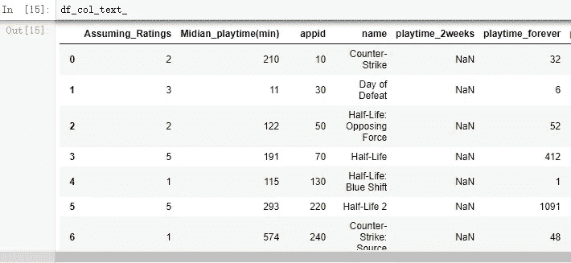

这是我们使用余弦相似度时，第 7 项的推荐结果。

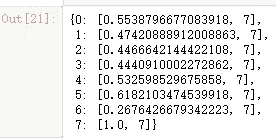

*第五部分:大规模推荐及结果评估*

在这一部分中，我们仍然使用我们在第 4 部分中修改的数据。

在这一部分，我们将重点介绍大数据平台上的推荐，这次我们选择 Spark ALS 作为在大数据平台上运行的算法。Spark ALS 可以将每个输入会话放入一个特殊的数据结构 Spark RDD。在我们的项目中，我们使用一种输入数据格式，它由 User_id、game_id 和用户对这个游戏的评价组成。这三个特征将被视为 CSV 数据列，然后它们将被 spark 会话读取。在这一部分中，每个用户的播放时间数据，不能通过 Steam API 获得，因此，我们必须访问每个用户的个人资料，但是，对于那些没有设置他们的资料或使他们的资料私人化的人，我们不能从他们那里获得播放时间信息。因此，我们必须一个接一个地访问那些公共配置文件，并获得我们所需要的信息。因此，在这一部分中，数据集可能比先前建议的数据集小得多

*火花 ALS*

ALS 是一种矩阵分解算法，它将一个高维的用户-项目交互矩阵分解成两个低维矩阵，在这个用户矩阵中，行代表用户，列是潜在因素。在项目矩阵中，行是潜在因素，列代表项目。在论文[5]中，因式分解矩阵模型学习将评级矩阵因式分解成用户和项目表示，这允许模型为用户预测更好的个性化项目评级。

通过矩阵分解，不太知名的项目可以像流行项目一样具有丰富的潜在表示，这提高了推荐系统推荐不太知名项目的能力。我们使用基于隐式评级的交替最小二乘法(ALS)来构建推荐模型。

*结果*
对于 spark 推荐的结果，我们通过 user_id 和推荐次数设计了一个个性化的推荐，然后 part 会给出 Spark ALS 计算的关于该用户在这 10 款游戏上的模拟评分。如前所述，我们必须按照用户 ID 逐一查看 steam 网站上的每个公共用户资料，然后获取数据，因此数据集的容量不是很大。随着越来越多的用户的原始评分数据被输入到 Spark 工作流程中，该用户对 Spark 制作的热门项目的模拟评分将会更高，这些模拟评分按降序分组。

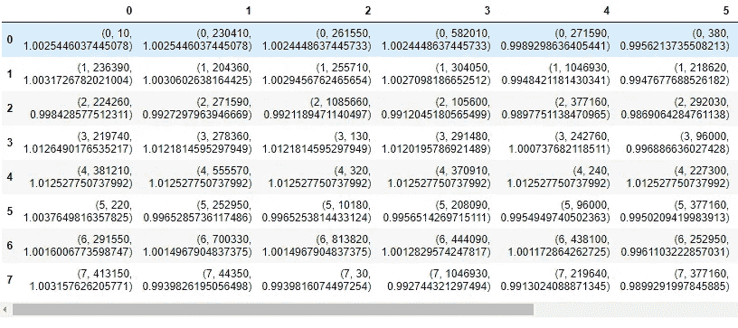

Spark ALS 制作的推荐结果数据框架

*评估*

在包含游戏评级的游戏推荐之后，我们使用 RMSE 作为我们推荐的结果评估。随着数据集的扩大，RMSE 评价将得到改善。这意味着我们的推荐会有更高的用户评分。

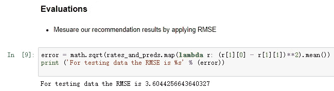

**结论**
在这个项目中，我们只使用了一些基本的技术来模拟一个推荐系统。一个成熟的推荐系统不仅由单一的技术组成，还包括商业策略。
由于实际情况混合了许多复杂的因素，我们构建了一个模型，使多种技术能够叠加。如果要完成一个更加完善的推荐系统，我们需要更多的探索和研究。

**未来工作**

在未来，我们将深入研究协同过滤及其在几个评估中的表现。一些复杂的算法，如 PCA 和 SVD 可以很好地补充我们的推荐系统。我们将考虑二元评级和连续评级的建议。然后，我们仍然希望对游戏描述数据使用更多的 NLP 文本分类。

感谢您的阅读！欢迎任何反馈。万事如意！

**参考**

[1][https://galyonk . in/some-things-you-should-know-on-steam-5 eaffcf 33218？gi=6052b30aa193](https://galyonk.in/some-things-you-should-know-about-steam-5eaffcf33218?gi=6052b30aa193)

[2][https://towards data science . com/large-scale-jobs-recommendation-engine-using-implicit-data-in-py spark-CCF 8d F5 d 910 e](/large-scale-jobs-recommendation-engine-using-implicit-data-in-pyspark-ccf8df5d910e)

[3][https://spark . Apache . org/docs/2 . 2 . 0/ml lib-collaborative-filtering . html](https://spark.apache.org/docs/2.2.0/mllib-collaborative-filtering.html)

[4][https://spark . Apache . org/docs/2 . 2 . 0/ml-collaborative-filtering . html # cold-start-strategy](https://spark.apache.org/docs/2.2.0/ml-collaborative-filtering.html#cold-start-strategy)

[5][https://towards data science . com/prototyping-a-recommender-system-step-by-step-part-2-alternating-least-square-als-matrix-4a 76 c 58714 a 1](/prototyping-a-recommender-system-step-by-step-part-2-alternating-least-square-als-matrix-4a76c58714a1)

[6][https://towards data science . com/python-data-预处理-使用-熊猫-data frame-spark-data frame-and-考拉-dataframe-e44c42258a8f](/python-data-preprocessing-using-pandas-dataframe-spark-dataframe-and-koalas-dataframe-e44c42258a8f)