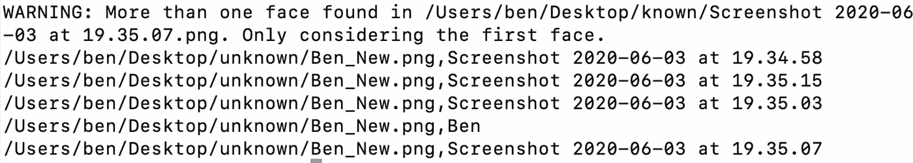

# 调查性新闻的偷拍:一把双刃剑

> 原文：<https://towardsdatascience.com/steeling-faces-for-investigative-journalism-a-double-edged-sword-8d7d3719ad5?source=collection_archive---------53----------------------->

## 人脸识别技术的开源研究与验证介绍(上)

一个伪造的 VK 资料偷走了我的脸，可以通过 FindClone 发现

偶然发现了自己的脸。我注册了 FindClone.ru，这是一项俄罗斯服务，允许任何有电话号码的人搜索 VK 社交媒体账户的个人照片(俄罗斯的脸书)。你提供一张照片，他们会告诉你照片是谁。

FindClone 在新闻调查中非常有用。我用它来工作。[王高·托勒](https://www.bellingcat.com/resources/how-tos/2019/02/19/using-the-new-russian-facial-recognition-site-searchface-ru/)在他给 Bellingcat 的曝光中提到过它(看它的行动。Bellingcat 俄国问题负责人克里斯托·格罗泽夫用它揭露了一名 [GRU](https://en.wikipedia.org/wiki/GRU_(G.U.)) 黑客的身份。

我想知道 FindClone 在我自己的脸上有什么可以提供的。我上传了一张旧的个人资料图片，看，有一个匹配。有人偷走了我的脸，把它变成了他们的。

有趣的是，我的出生日期与模仿者使用的日期相差不远(但年份完全错误，真实的我更年轻，眨眼)。还有，模仿者说他是单身，我不是。叶夫根尼甚至有了一个追随者，一个名字为**埃琳娜·阿贡科娃**的账户，她因违反 VK 的条款和条件而被屏蔽(我想知道那个账户是否也是假的)。

这位叶夫根尼 T10 使用的我的图像是在伦敦南岸的英国 BFI 拍摄的。就是左上方那个，穿白领衬衫的我(周围有浅绿色圈)。我用一个英国电话号码注册了 FindClone，添加了我的照片，直到出现了一些建议。有一个真正的阳性匹配和一些奉承的假阳性。例如，我与[波拉特](https://en.wikipedia.org/wiki/Borat)(第 7 排，来自电影海报图片)和[瑞安 _ 雷诺兹](https://en.wikipedia.org/wiki/Ryan_Reynolds)(第 5 排，来自古龙水包装盒)的脸匹配。

我用一个电话号码注册了 FindClone，添加了我的图片。有一个真正的阳性匹配和一些奉承的假阳性。我被配上了[波拉特](https://en.wikipedia.org/wiki/Borat)(第 7 排)和[瑞安 _ 雷诺兹](https://en.wikipedia.org/wiki/Ryan_Reynolds)(第 5 排)的脸

有人偷了我的照片，我并不沮丧，但我认为这仍然是不可思议和不道德的。更令人恼火的是，FindClone 的面部识别算法将我与波拉特和瑞安·雷诺兹匹配起来(他们两个我都不喜欢)。

作为一名对虚假信息和假新闻感兴趣的调查记者，我对 FindClone 和面部识别的潜在价值很感兴趣。

> 警察用面部识别软件监视我们。作为道德调查记者和公民，我们现在可以密切关注他们(当然，只能在合法的范围内)。

在线冒充有多普遍，尤其是在虚假的社交媒体账户中？很常见。典型的服务挣扎。像 [Tinder](https://www.telegraph.co.uk/women/womens-life/11588667/Facebook-identity-theft-My-profile-was-stolen-to-get-dates-on-Tinder.html) 这样的在线约会服务做得最多。虚假的个人在平台之外撒谎。脸书收紧了使用真实身份的要求。

脸书重新注册时的注意事项([2018 年出台的新名字政策](https://www.cbc.ca/news/technology/facebook-real-names-1.3367403)，不允许使用假名字)。更多信息[点击这里](https://www.howtogeek.com/347128/can-you-use-a-fake-name-on-facebook/)

作为一名调查记者，建立一个欺骗账户是在收集到足够的信息之前保持不被发现的一种方式(这也相当常见)。当研究一个有争议的故事时，保持低调会有所帮助，直到你的包里有足够的证据给你的编辑。

当你这么做的时候，帮你自己一个忙，在选择一个假的个人资料/名字/图片(或者根本没有图片)的时候要有创造性。作为调查记者，我们仍然必须尊重他人的隐私。

## 股票图像配置文件

用股票图片伪造社交媒体个人资料非常普遍。让我们想象一下，我们被迫用假身份报名参加 VK。错误的做法是使用免费股票图片平台的股票图片，如 Dreamstime(我希望你能得到更广泛的点击，这里。不要做)。这是假账户中的一个流行选项。

FindClone 可以对我们的调查有所帮助。让我们搜索“猛男垃圾背景男性时尚”。我知道，很具体。但是请原谅我。我们在屏幕上看到这个人，一个面部特征鲜明的金发男模特。

在免费股票图片平台 [Dreamstime](https://www.dreamstime.com/photos-images/macho-man-grunge-background-male-fashion.html) 上搜索。一个照片模型出现了(我这样做是因为我知道 VK 有很多假冒这个人的假账户)。在你寻找和描写谁的时候要合乎道德。

让我们前往 FindClone 并上传模特的图片。

你看到我看到的了吗？这家伙不仅是一个受欢迎的股票图像模型。大量可能是虚假的账户利用他的脸来冒充(虚假)身份。如果你正在调查虚假信息和虚假社交媒体账户——你发现了一系列最近建立的 Twitter 账户，你想检查一下——比较股票照片可能会给你第一手线索。

这是因为模仿者和恶作剧者也可能只是懒惰的人类(除非他们不是人类或懒惰)。

一名伊朗秘密特工的假资料(来源:SECUREWORKS)

一个简单的面部检查可能有所帮助的著名例子是 Mia Ash 的案例。这是一个假的女性资料，结果是一个伊朗黑客。伪装得很差，但很好(我知道这一点，因为我调查了当时的情况，并采访了 SecureWorks 的专家)。

参与此案的专家表示，“[黑客组织不辞辛苦地建立一个如此长时间运行的、有血有肉的角色](https://www.wired.com/story/iran-hackers-social-engineering-mia-ash/)”是很罕见的。但是，如果与其他公开来源的数据相比，这些图像可能很容易引起争议。

通过搜索我收到的男性股票模型的 VK 帐户结果，我们找到了一张，似乎是我们男人的真实私人照片。它显示他和两个熟人或朋友在一起。我们可以分析背景来检查图像是在哪里拍摄的。我忍住了，因为我尊重这个家伙的隐私，他没做错什么。

俄罗斯社交媒体平台 VK 上的一名男性股票模特(左)和朋友们在一起

简而言之，FindClone 非常强大，可以支持对可疑帐户的验证。这对于虚假社交媒体账户分析非常有用。我最近遇到了一个案例，一个声称对我的工作感兴趣的客户找到了我。他或她只在 Linkedin 上与调查记者交朋友，没有任何记录(无论是在新闻方面，还是在任何其他方面)，并且几乎与另一个同名、相同教育背景、来自相同地区的账户完全匹配。给账号背后的人指出来之后(我们聊了一会儿)，这个账号就在平台上神秘消失了。巧合吗？有可能。但是机会是如此的渺茫。值得谨慎。

一个名为 Robinson Zhang 的人伪造了 Linkedin 个人资料帐户，他说他在 R&C 资本公司工作，“一家总部设在香港的国际咨询公司”(纽约时报报道)

有证据表明，Linkedin 成为间谍机构招募特工的首选工具。《纽约时报》的一项调查发现，有证据表明中国特工利用该平台联系外国公民，其中也包括前政府官员。但是要小心，误报的可能性总是存在的(Linkedin 上有一大堆其他罗宾逊·詹[的个人资料](https://www.linkedin.com/search/results/people/?firstName=Robinson&lastName=Zhang&origin=SEO_PSERP))。

## 为开源调查创建自己的面部识别系统有多容易？

这太简单了，简单得令人害怕。让我们更进一步，从我通过 FindClone 找到的图像(在我身上)建立一个面部识别数据库。让我们假设你遇到了一张新面孔，并想检查它是否与你的人的图像数据库中的条目相匹配(这是我第一次上传到 FindClone 的我自己的图像)。

我很快从 FindClone 结果中截取了 23 张图片。第 24 个是我知道是我的那个(被叶夫根尼·普利什金偷走)。

我们快速安装 [**一个叫做 face_recognition**](https://github.com/ageitgey/face_recognition/blob/master/examples/facerec_from_webcam_faster.py) 的 python 库。这是目前最简单和最容易的孩子玩即插即用的面部识别软件。

我们运行以下命令，将 FindClone 搜索结果中的图像(FindClone 中的“known_images”文件夹)与“new”图像(My_Image 文件夹中的 my image)进行比较。

> $ face_recognition。/known_images 文件夹/。/My_Image 文件夹/

当我运行这个命令时，我得到了五个选项。一张是假冒的 VK 社交媒体账户从我这里偷走的脸。其他的都很接近。换句话说，我们将可能的 me 的命中列表减少到了一堆可以看到的帐户。

如果您使用成百上千个可能匹配的图像进行调查，并且想要减少嫌疑人的列表，这可能会很有用。

我得到了 Ben_New(上传的图像)和 Ben(数据库中的图像)之间的正确匹配

## 仅供参考(可以说是一个愚蠢的标题，引用了 1982 年詹姆斯·邦德的电影)

在我的 *Medium* 账户上，我出现了一张照片，照片中我的半张脸被一条鲜红色的条纹遮住，这是我在公共场合戴口罩的承诺。

如果我们对来自我的*媒体*账户的图片和其他五张图片(来自谷歌图片的随机媒体)进行测试，这个系统足以产生匹配。

这个算法足够复杂，可以定位我扔给它的五幅图像中的两幅。

甚至连眼镜都不重要

事实上，眼镜和口罩并不是匹配人脸的大障碍，我不必解释这对于#OSINT 调查来说是多么不可思议的强大(同样，对于执法领域来说也是如此)。

想象一下，对于一个戴着口罩或留着大胡子的人，你只能从糟糕的视频片段中获取一个图像。你仍然可以将它与你的嫌疑人资料库中的一组图像进行匹配。

## “胡子、青春、帽子”测试

让我们看看胡子是否重要。我也有一张我年轻得多的照片。头饰像帽子一样重要吗？

面部识别匹配各种干扰因素

我戴着帽子的**图片**很容易与我从网上得到的另一堆图片匹配。

冬帽形象搭配我戴鹿角的和留胡子的。

胡须的形象与戴着冬帽的形象相匹配

我十岁时的形象无人能比。这稍微限制了#OSINT 调查的使用。但是总有变通的办法，比如让人变老(一个在线工具叫做 C [hangemyface](https://changemyface.com/) ，例如，如果你正在寻找一个年长的人，但是你手头只有一张他们年轻时的照片)。

我的自画像与那堆照片中的错误图像匹配，但它仍然是匹配的

**其他发现:**我找不到穿蓝色西装的自画像的直接匹配(要么是验证我糟糕的绘画技巧，要么是人工智能的问题？，我不确定)。但它确实为自拍和戴眼镜的黑白照片找到了匹配。

这要么是难以置信的好，要么是难以置信的坏。python 库声称，它在 Wild benchmark(这是一个用于人脸验证的公共基准，也称为配对)中的标记人脸上具有 99.38%的模型准确率。

我注意到，一般来说，系统很难匹配有胡子的人。同样，如果你在网上搜索一些去除胡须或添加胡须的方法(我可以想象，化妆也有类似的例子。您可以在某些地方将其添加到图像中)。

此外，如果您的图像得到多个匹配，可以增加或减少容差值，以使面部比较更严格/不严格。你甚至可以计算“面部距离”,以防你采用数据驱动的方法。还有[吨的其他例子](https://github.com/ageitgey/face_recognition/tree/master/examples)。我建议您仔细阅读它们，以防在您的 OSINT 调查中偶然发现一个特定的用例(再次强调，当您这样做时，请站在道德的角度)。

例如，您可以运行一个视频，当 python 库在您的存储库中找到一个熟悉的面孔时，它会提醒您。如果你有一个很长的视频，比如人群中的示威者或警察，这可以节省你大量的工作(一个漂亮的[视频讲解器提供了这个教程，展示了如何用 python 库操作相机](https://www.youtube.com/watch?v=PdkPI92KSIs))。

## 布法罗警察部队案件

6 月 4/5 日，新闻媒体报道称，一名和平的老年抗议者被布法罗警察推搡，摔倒在地，开始流血。这是一起不必要的、无法形容的警察暴行。在撰写本报告时，受害者仍处于危急状态。

两名警官被停职，两名警官现在被指控犯有重罪袭击。两名警官被认出，一名被记者认出，因为他制服上的姓名标签在录像中清晰可见(亚伦·托加尔斯基)。但还有第三个官员，他也是整个视频的关键人物(视频是由当地电台 WBFO 拍摄的)。

第三名军官的姓名牌仍然未知:更新:姓名牌应该是“J. LOSI”

当他跑向另外两个警察时，他是进入现场的一个人，似乎在帮助推那个抗议者。

他也是那个将试图跪下来帮助/检查流血抗议者状况的警察拉回的人。在他的头盔上，这位警官写了“PL1”。

该视频迅速火了起来。这位官员的形象非常模糊。让我们看看 python 系统是否可以将 Robert McCabe(一号警官)和 Aaron Torgalski(二号警官)的面部——由伊利县地方检察官办公室提供——与第三名警官进行匹配。

面部识别算法正确地指出了第三名警官(仍未确认身份)和另外两名警官之间的区别(纽约时报发布的[照片)](https://www.nytimes.com/2020/06/06/nyregion/Buffalo-police-charged.html)

正确:前两个被指控的警官和第三个不匹配

我们还可以在手头的视频上测试面部识别算法，测试另一张模糊的图像。事件发生后，有一张照片是从不同的角度拍摄的，我推测是记者/摄影师拍摄的。

很明显是同一个人(J. Losi)。但是想象一下对比图像来自一张模糊的 Instagram 或脸书照片(仅供参考，我检查了整个水牛城警察局的 Instagram 和脸书账户，这些家伙不在那里。在他们的网站上，也没有这个人的照片。如果你有线索，请联系我。

我们将一位摄影师拍摄的图片(左图)与视频截图(右图)进行比较

该算法能够进行正确的连接。

我们看到面部识别算法在一群同事中找到了合适的警察

我们现在看到了面部识别软件有多么强大，我们可以自由和无限制地使用它。我们测试了它在不同方面的表现以及存在的问题。现在是时候做你自己的新闻调查了。

## 更新:

这个故事的快速更新。第三个军官，名字标签不可读的那个，叫约翰·洛西。名牌上写着 j .洛西。这位警官也出现在另一张照片中，他正和其他警官一起跪下。让我们快速检查一下算法是否能从视频中识别出他。

我们找到匹配的了。尽管有头盔，该算法可以将 Losi 从视频锁定到其他图像。

**澄清**:我想强调的是，这一分析并不是要指责第三名警官(尽管，很明显，他拉起了他的同事——他打算检查受害者——警官罗伯特·麦凯布，让他继续前进)。从视频中无法直接看出 Losi 是否有意推搡受害者。他本可以首先阻止罗伯特·麦凯布推被害人。我不是来评判这个的。所有这些工作表明，确认身份和面孔之间的联系并使这一过程自动化是可能的。

## 结论:一把双刃剑

很明显，这类软件需要进行一些道德斗争。将这样一个强大的工具放在罪犯或任何怀有恶意的国家黑客和机构手中(或计划继续限制记者)是很危险的。

但是，对于开源调查，我们需要务实，我们已经看到了该系统在哪些方面以及如何表现出色。

**令人担忧的一面:**可怕的是，任何人都可以根据自己的意愿构建面部识别系统。从公共网站(如社交媒体平台)收集数据从来都不是一件难事。但是专业人士可以扩大规模。这是个问题。

社交媒体公司试图让任何人都更难从社交媒体账户上窃取图像和个人信息。

脸书现在明确地在他们的 robots 文件(该文件告诉搜索引擎爬虫可以或不可以从脸书请求哪些页面或文件)的开头警告你。上面写着“除非你有明确的书面许可，否则爬脸书是禁止的。”

Instagram 以图像为主，与我们在帖子中谈到的面部图像识别设置相关。其他#OSINT 专家(特别是[杰克·克雷普斯](https://twitter.com/jakecreps))提到了 [Instalooter](https://github.com/althonos/InstaLooter) ，一个抓取 Instagram 图片的工具。我不确定它是否还在运行，但是如果你在办案的话，它可能会有所帮助。

专家指出，除了 2018 年脸书的数据封锁，Instagram 还受到了数据访问限制，使其不那么[可靠](https://developers.facebook.com/docs/instagram-api)(再次强调，如果你这样做，保护人们的隐私，保持理智)。

GDPR 也值得考虑。专家强调，如果你试图从社交媒体平台上抓取个人数据，被起诉的几率会增加。你，一个守法的侦探，不应该对此掉以轻心。在欧盟，个人必须给你许可(明确同意)。否则，在 GDPR 治下搜集欧盟居民的个人数据是非法的。

但我们不要自欺欺人。如果专业机构或精通技术的黑客想在社交媒体上保存图片，总有办法做到(我们记者应该密切关注这种操作)。

FindClone 的更多信息:FindClone 是一个相当温和的在线面部识别应用程序版本。它取代了一个专业(也更令人担忧)的选项，一个叫做 SearchFace 的服务。过去，SearchFace 为有问题的角色提供了一个平台，告知出演色情电影的女性的家人，分享她们的秘密。这是不道德的，充其量是不道德的。肇事者这样做是为了引起“道德上的愤怒”，声称性行业的女性是腐败和欺骗性的。“有人可以利用这样一项服务来轻易攻击无辜的人，这令人深感担忧。

作为用户服务的 SearchFace 去年被关闭，但此后其背后的组织似乎又活跃起来。它现在正在积极推广其追捕新冠肺炎锁定破坏者的能力，这是另一个潜在的问题/不道德/不道德的努力。

广告声称，NtechLab 解决方案的算法在识别违反隔离的人方面表现出了很大的有效性，同时跟踪潜在传染性和及时通知各自当局之间的社会互动。

我不同意他们的观点，即面部识别应该商业化，以追捕那些违反封锁规则的人。这是一个调查记者可能想要更深入研究的话题。

感谢你阅读这篇文章。如果你有问题/想法/意见，请通过我的质子邮件账户联系:[techjournalism11@protonmail.com](mailto:techjournalism11@protonmail.com)