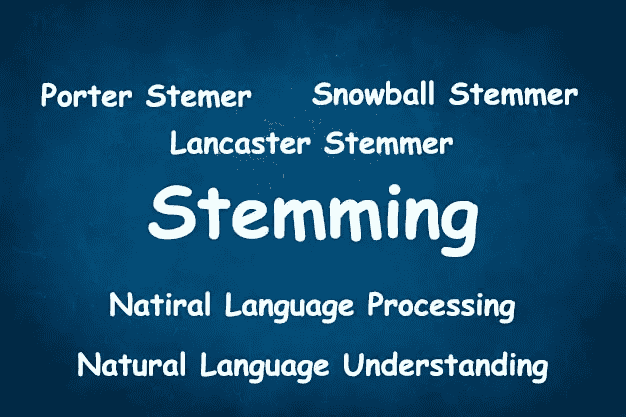
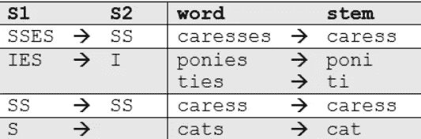

# 词干化与词汇化

> 原文：<https://towardsdatascience.com/stemming-vs-lemmatization-2daddabcb221?source=collection_archive---------2----------------------->

## 将单词截断到其词根或基本单位



**词干化和词汇化**是自然语言处理领域中的文本规范化技术，用于为进一步处理准备文本、单词和文档。在这篇博客中，您可以通过一种非常实用的方法来研究词干化和词汇化，包括词干化和词汇化的背景、应用，以及使用 Python nltk 包(Python 提供的自然语言包)对单词、句子和文档进行词干化和词汇化的方法

在自然语言处理中，你可能希望你的程序承认单词“kick”和“kicked”只是同一个动词的不同时态。这可以是将不同种类的单词简化为核心词根的概念。

# 堵塞物

词干化是产生词根/基本词的形态变体的过程。词干程序通常被称为词干算法或词干分析器。

通常，当搜索文本中的某个关键词时，如果搜索返回该词的变体，会有所帮助。例如，搜索“船”也可能返回“船”和“划船”。在这里，“boat”将是[boat，boater，boating，boats]的词干。

词干法是对相关单词进行编目的一种有些粗糙的方法；它基本上是从字母的末端开始，直到到达词干。这在大多数情况下工作得相当好，但不幸的是，英语有许多需要更复杂过程的例外。事实上，spaCy 没有包含词干分析器，而是选择完全依赖于词汇化。



## 波特·斯特梅尔

最常见也是最有效的词干提取工具之一是马丁·波特在 1980 年开发的波特算法。该算法采用了五个阶段的单词缩减，每个阶段都有自己的一组映射规则。在第一阶段，定义简单的后缀映射规则，例如:

```
*# Import the toolkit and the full Porter Stemmer library*
import nltk

from nltk.stem.porter import *p_stemmer = PorterStemmer()words = ['run','runner','running','ran','runs','easily','fairly']for word in words:
    print(word+' --> '+p_stemmer.stem(word))
```

## 输出

```
run --> run
runner --> runner
running --> run
ran --> ran
runs --> run
easily --> easili
fairly --> fairli
```

> 注意词干分析器如何将“runner”识别为名词，而不是动词形式或分词。此外，副词“容易地”和“相当地”源于不寻常的词根“easili”和“fairli”

# 雪球斯特梅尔

这有点用词不当，因为 Snowball 是由 Martin Porter 开发的词干语言的名字。这里使用的算法更准确地称为“英国斯特梅尔”或“斯特梅尔”。它在逻辑和速度上都比最初的 Porter stemmer 稍有改进。由于 nltk 使用名称 SnowballStemmer，我们将在这里使用它。

```
from nltk.stem.snowball import SnowballStemmer

*# The Snowball Stemmer requires that you pass a language parameter*
s_stemmer = SnowballStemmer(language='english')words = ['run','runner','running','ran','runs','easily','fairly'for word in words:
    print(word+' --> '+s_stemmer.stem(word))
```

# 输出

```
run --> run
runner --> runner
running --> run
ran --> ran
runs --> run
easily --> easili
fairly --> fair
```

在这种情况下，词干分析器的表现与波特斯特梅尔相同，只是它用“fair”更恰当地处理了“fairly”的词干

词干有它的缺点。如果给定了标记 saw，词干化可能总是返回 saw，而词汇化可能返回 see 或 saw，这取决于标记是用作动词还是名词

# 词汇化

与词干化相反，词汇化不仅仅是减少单词，而是考虑一种语言的全部词汇，对单词进行词法分析。“was”的引理是“be”，“mice”的引理是“mouse”。

词汇化通常被认为比简单的词干提取更能提供信息，这就是 Spacy 选择只使用词汇化而不使用词干提取的原因

词汇化查看周围的文本来确定给定单词的词性，它不对短语进行分类。

```
*# Perform standard imports:*
import spacy
nlp = spacy.load('en_core_web_sm')def show_lemmas(text):
    for token in text:
        print(f'{token.text:{12}} {token.pos_:{6}} {token.lemma:<{22}} {token.lemma_}')
```

这里我们使用一个 f 字符串通过设置最小字段宽度和添加 lemma 哈希值的左对齐来格式化打印的文本。

```
doc = nlp(u"I saw eighteen mice today!")

show_lemmas(doc) 
```

# 输出

```
I            PRON   561228191312463089     -PRON-
saw          VERB   11925638236994514241   see
eighteen     NUM    9609336664675087640    eighteen
mice         NOUN   1384165645700560590    mouse
today        NOUN   11042482332948150395   today
!            PUNCT  17494803046312582752   !
```

请注意,“saw”的引理是“see”,“mice”是“mouse”的复数形式，然而“18”是它自己的数字，而不是“8”的扩展形式。

**结论**

> 关于引理化需要注意的一点是，用一种新语言创建一个引理化器比用词干算法更难，因为在引理化器中我们需要更多关于语言结构的知识。
> 
> 词干化和词元化都产生词尾变化单词的基本分类，因此唯一的区别是词干可能不是一个实际的单词，而词元是一个实际的语言单词。
> 词干提取遵循一种算法，对单词进行分步处理，这样速度会更快。然而，在词汇化中，你也使用语料库来提供词汇，这使得它比词干化慢。此外，你可能必须定义一个词类来得到适当的引理。
> 
> 以上几点表明，如果速度是集中的，那么应该使用词干，因为词条分类器扫描语料库会耗费时间和处理。这取决于您正在处理的问题，它决定了应该使用词干分析器还是词法分析器。

*感谢何塞·波尔蒂利亚在整个*期间给予的帮助

**注意 GitHub repo 中给出了所有解释的代码，并提供了更多示例，以增强您的知识并更好地掌握这个主题。此外，关于停用词和词汇的额外概念也包括在内。点击下面的链接:-**

[](https://github.com/aditya-beri/Stemming-vs-Lemmatization.git) [## jn aditya-beri/词干化 vs .词汇化

### 通过在 GitHub 上创建一个帐户，为 aditya-beri/Stemming-vs-lemma 化开发做出贡献。

github.com](https://github.com/aditya-beri/Stemming-vs-Lemmatization.git) 

## 这只是对什么是词干化和词汇化以及它们如何工作的一个小小的窥探。如有任何疑问和澄清，请随时回复本博客。