# 使用 Azure 在云上部署 ML 模型的分步方法

> 原文：<https://towardsdatascience.com/step-by-step-approach-of-deploying-ml-model-on-cloud-with-azure-b7139cde7683?source=collection_archive---------36----------------------->

## 详细解释了如何使用 Flask app 将 GitHub repo 链接到 Azure 来部署 ML 模型


照片由 Waldemar Brandt 在 Unsplash 上拍摄

耶！！我建立了我的第一个 ML 模型，接下来我要做什么？？我如何以及在哪里部署它？🙄

任何绝对的初学者在构建他们的第一个机器学习模型后都可能会遇到上述问题，本文将揭开如何在云上部署模型并实时检查结果的神秘面纱。

在这里，我将向您介绍一种在 Azure 上部署模型的可行方法，一旦您获得了 web 应用程序的 URL，您就可以与任何人共享它，它将全天候运行在服务器上😎

如今有了各种各样的工具，有许多不同的方法来部署一个模型。下面是我们将在本文中使用的工具。

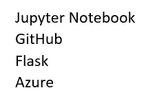

下面是我们将要执行的步骤。

👉**第一步:创建一个 ML 模型**

这里我们关注的是部署的步骤，而不是训练模型的步骤。因此，我采用了一个样本数据，并在 Jupyter Notebook 中建立了一个线性回归模型。目的是当收入和家庭规模为独立变量时，预测每月的食品杂货支出。

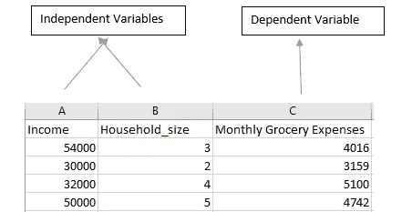

完成线性回归模型后，将其另存为。pkl 文件以如下二进制模式写入。对于完整的数据集(Expenses_Prediction.csv)和代码(LR_Model.py)，点击[此处](https://github.com/SushmithaPulagam/Deploying-ML-on-Cloud)。

```
pickle.dump(lr_model, open(‘E:\\lr_model.pkl’,’wb’))
```

👉**第二步:创建 HTML 表单**

为了预测费用，我们需要从表单中提供的新输入值中收集数据，然后使用我们的线性回归模型来预测输出，并在表单中显示结果。因此，我们正在创建一个简单的 HTML 表单，它将在浏览器中显示如下。

你可以在这里找到代号为 index.html 的代号


👉**第三步:创建烧瓶应用**

Flask 是一个用于在 Python 中构建 web 应用的框架。为了托管 HTML 表单，我们需要创建 Flask web 应用程序。要安装 Flask，请使用命令！ *pip 安装烧瓶*

下面是理解 flask app 代码的快照，该代码名为 app.py。你可以在这里[获得代码](https://github.com/SushmithaPulagam/Deploying-ML-on-Cloud)

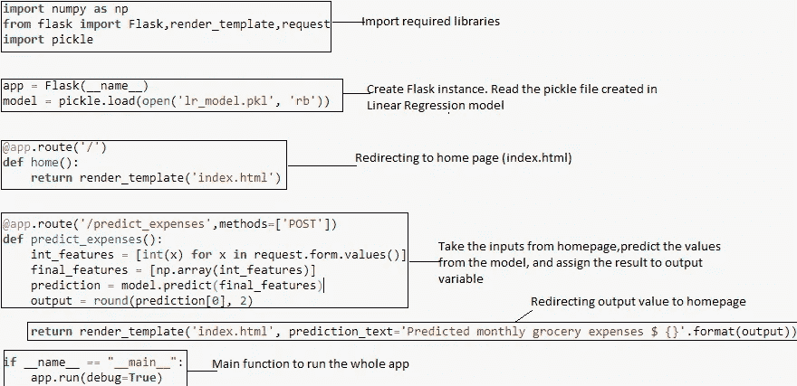

将所有文件放在同一个文件夹中，您就可以在本地系统中测试这个 web 应用程序了。打开 Anaconda 提示符，进入 files 文件夹，输入 ***python app.py***

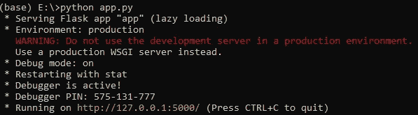

复制网址( *http://127.0.0.1:5000/* )并粘贴到你的网络浏览器中，点击回车。一旦提供了输入值，就可以预测费用。

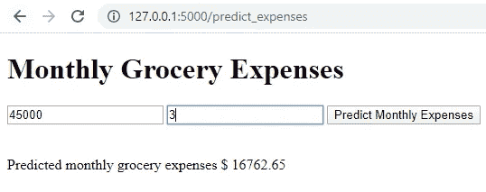

如果您能够做到这一点，现在是时候在云上部署 web 应用程序了。

👉**步骤 4:创建配置文件。**

我们需要创建以下两个配置文件来继续部署。

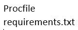

***Procfile****:*在 Procfile 中提到下面单行代码，这个文件不应该有任何扩展名。这是将要首先执行的文件。它使用 Gunicorn，这是一个用于 WSGI 应用程序的纯 Python HTTP 服务器，它充当 web 应用程序和 web 服务器之间的纽带。确保保存的文件没有扩展名。


***requirements . txt:***在此提及你所有的库及其依赖关系。txt 文件及其版本如下。

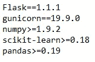

👉**第五步:在 GitHub Repo 中提交文件。**

在 [GitHub](https://github.com/) 中创建一个帐户，并将所有文件上传到一个存储库中。如果您以前没有创建过存储库，请查看这里的内容

请确保将您的 index.html 放在模板文件夹中。你可以从我的 GitHub [ [这里](https://github.com/SushmithaPulagam/Deploying-ML-on-Cloud) ]查看文件

👉**第六步:将 GitHub Repo 链接到 Azure 并部署。**

使用链接[ [此处](https://azure.microsoft.com/en-in/free/) ]在 Azure 中创建您的免费帐户。

按照以下步骤将 GitHub repo 链接到 Azure

登录后，点击“*应用服务*

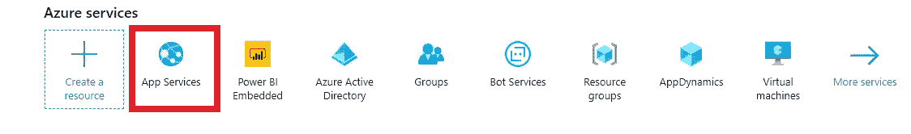

点击*添加*。如下填写 Web 应用程序中的详细信息。创建一个新的“*资源组*”。在实例详细信息中输入“*名称*”。点击*审核+创建*

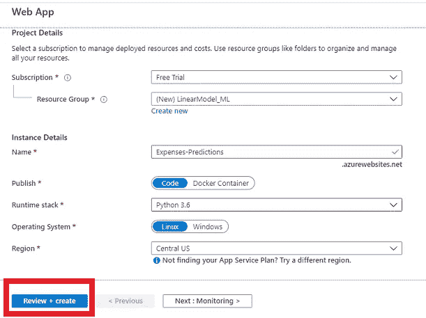

点击*创建*后，你会看到下面的消息。点击“*转到资源*”。

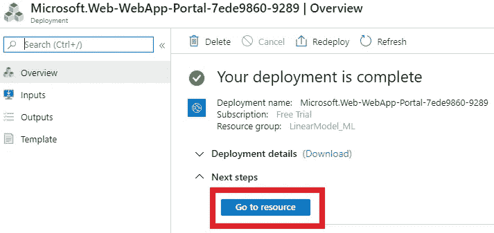

点击左侧窗格中的*部署中心*。

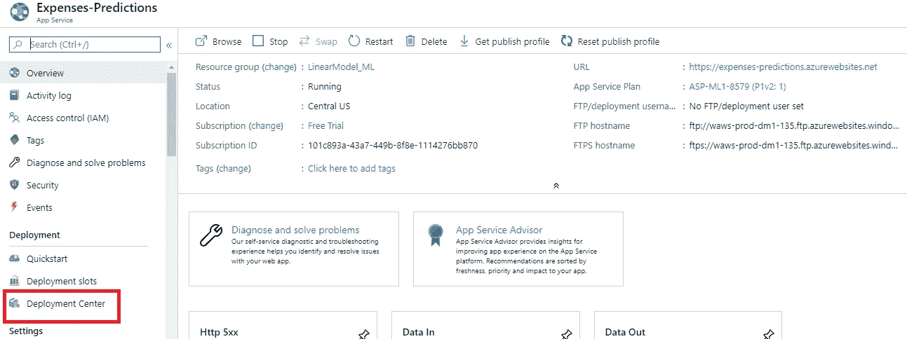

点击 *GitHub* 。第一次连接 GitHub，Azure 会要求授权。连接后，点击继续。

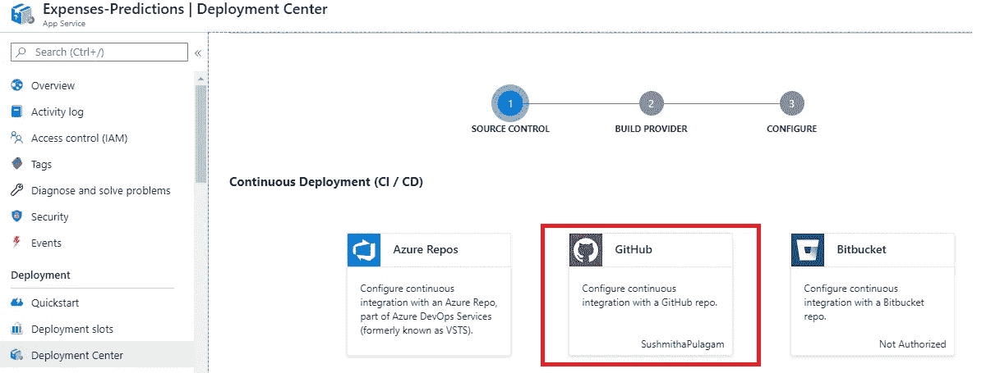

点击“*应用服务构建服务*”并继续。

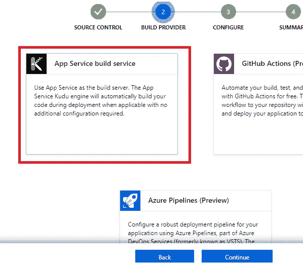

在代码部分，“*组织*”会在连接 GitHub 后自动更新。选择所需的*储存库*并继续。

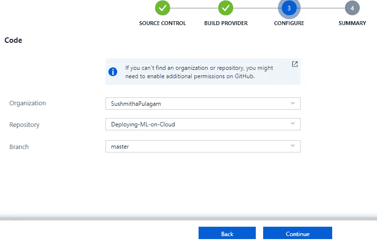

单击完成。

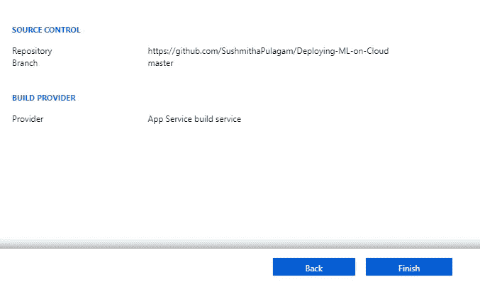

这将需要几分钟的时间来完成，同时您会看到状态为正在运行

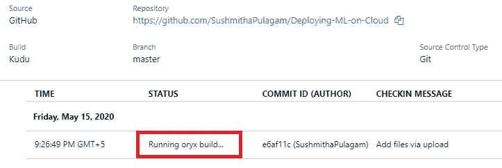

完成后，您将看到状态为“成功”。点击左侧窗格中的*概述*。

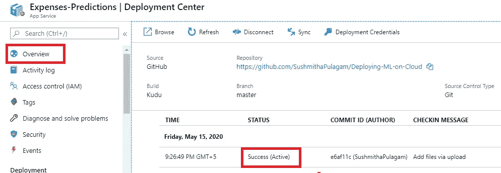

从右上角复制“ *URL* ”并粘贴到您的网络浏览器中。

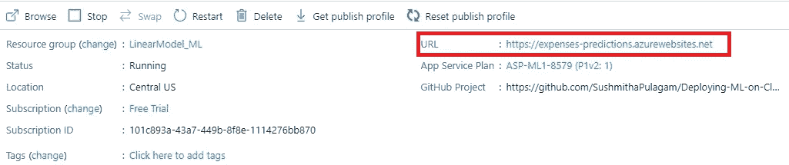

你可以看到这个网址是用 Azure 域创建的。提供输入值并单击预测按钮。你可以看到预计的费用。

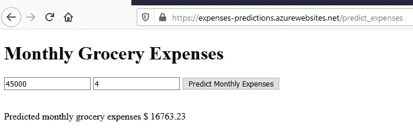

*又来了，耶！！你的机器学习模型现在运行在云上。*👍

**总结**

本文的目的是让您轻松理解部署，谁正试图迈出在云中部署模型的第一步。稍后，您可以探索各种方法，比如为自动部署创建管道，以及在云上训练模型，等等。作为数据科学专业人员，应该了解运行模型的端到端方法。

你可以从我的 GitHub [档案](https://github.com/SushmithaPulagam/Deploying-ML-on-Cloud)中获得完整的代码和文件

感谢阅读，快乐学习！🙂