# 逐步 AWS EC2 设置教程

> 原文：<https://towardsdatascience.com/step-by-step-aws-ec2-set-up-tutorial-eae94213fd15?source=collection_archive---------33----------------------->

本文非常简单地介绍了设置 AWS EC2 实例的过程。我们会经历

1.  实例初始化。
2.  安装必要的软件和机器学习包。
3.  将文件从本地文件传输到远程实例

对 AWS EC2 的快速解释将有助于我们了解我们在做什么。亚马逊弹性计算云(EC2)是亚马逊云计算平台亚马逊网络服务(AWS)的一部分。AWS 允许人们租用虚拟计算机来运行他们自己的程序和应用程序。AWS“实例”是一个虚拟机，由用户启动，并配置有任何所需的软件。用户可以根据需要创建、启动和终止他们的服务器实例，按秒为活动服务付费，并指定他们的代码部署和数据存储的地理位置，因此有了术语“弹性”


通过 [Pixabay](https://pixabay.com/vectors/cloud-computing-cloud-device-data-1989339/) 将图像放大 200 度

# 1.设置 EC2 实例

首先，打开位于 https://console.aws.amazon.com/ec2/[的亚马逊 EC2 控制台，点击“运行实例”。您应该会看到下面的页面出现。单击启动实例。](https://console.aws.amazon.com/ec2/)

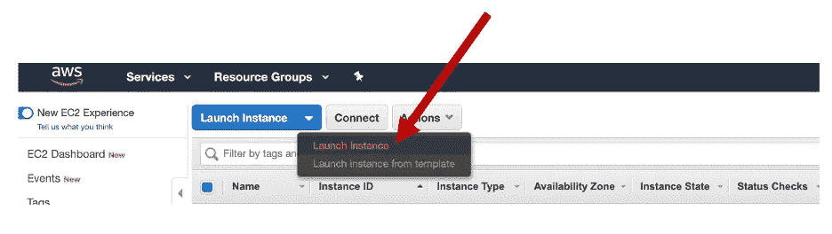

我笔记本电脑的截图

选择您想要使用的虚拟机类型。Amazon 机器映像是预先配置的虚拟机，充当您的实例的模板。

如果你是 Mac 用户，选择一个 64 位的 Linux AMI 是个好主意。

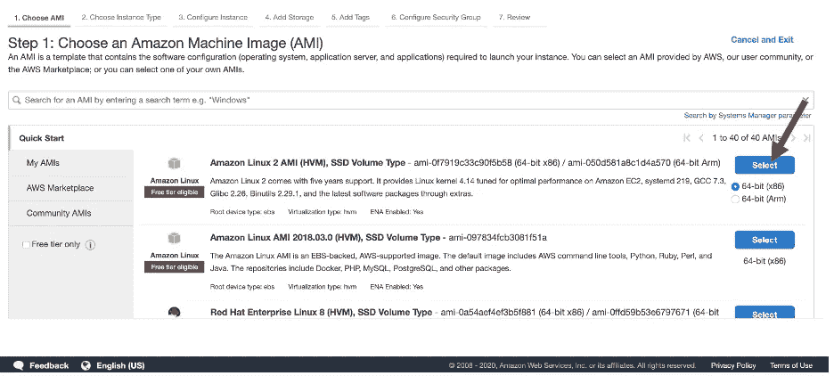

我笔记本电脑的截图

如果你知道你将在你的虚拟机上运行深度学习模型，那么就有专门针对这个目的的 ami。当然，可以设置基本的 Amazon Linux AMI 来运行这些相同的模型。

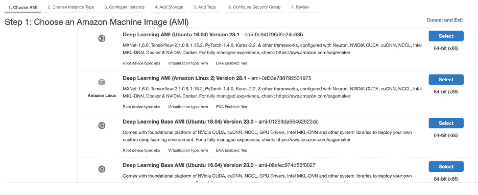

我笔记本电脑的截图

您还可以更改您的地理位置，以更改要部署的实例的位置。不同地理位置的价格会略有不同，我用的是 us-east-1。

接下来，选择实例类型来设置实例的存储和大小。T2.micro 默认设置为类型，符合亚马逊免费层的条件。我发现我总是在 t2.micro 实例上耗尽内存，所以要考虑需要多少内存。

接下来，单击 Review and Launch，让 AWS 向导为您设置默认配置。

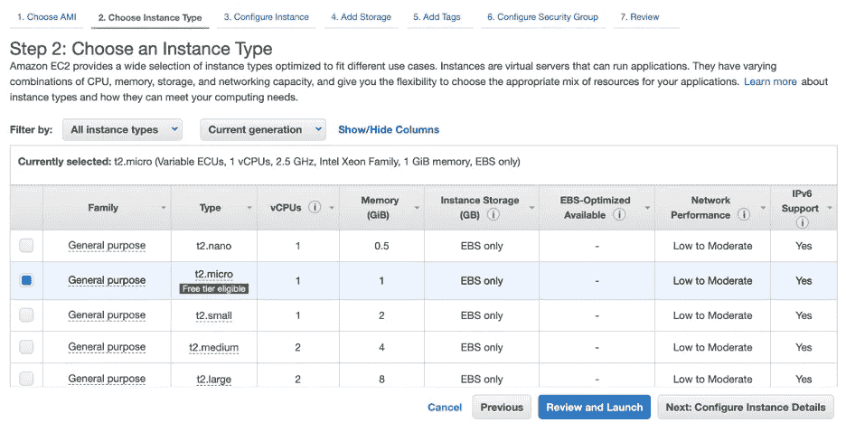

我笔记本电脑的截图

接下来，检查您的实例，并根据需要修改安全组。点击启动！

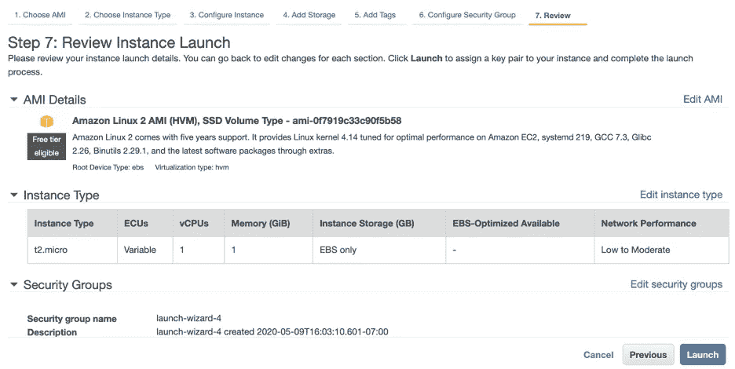

我笔记本电脑的截图

您必须指定一个密钥对。如果您已经有了一个 AWS 密钥对，您可以选择使用那个密钥对。如果没有，您将选择创建新的密钥对。输入密钥对的任意名称。然后，单击下载密钥对。这将是您能够下载该密钥对的唯一时间。将它移动到某个安全的位置，或者某个你不会删除它的地方。您需要这个密钥对来允许您进入您的实例。就当是密码吧。现在，启动您的实例！

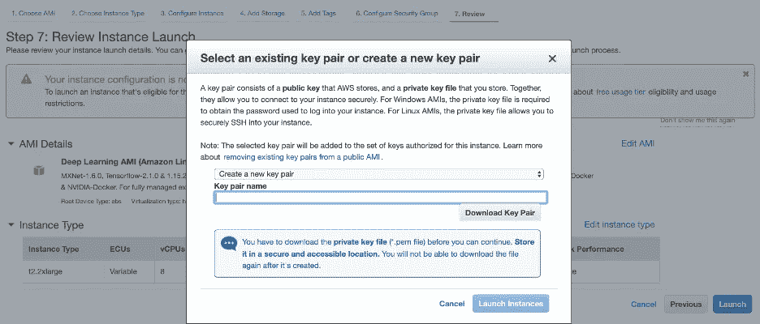

我笔记本电脑的截图

既然您的实例已经启动，接下来我们必须通过 SSH 连接到实例。在 EC2 实例仪表板上，单击实例名称旁边的按钮，然后单击 Actions。Actions 下应该会出现一个下拉菜单，然后单击 Connect。

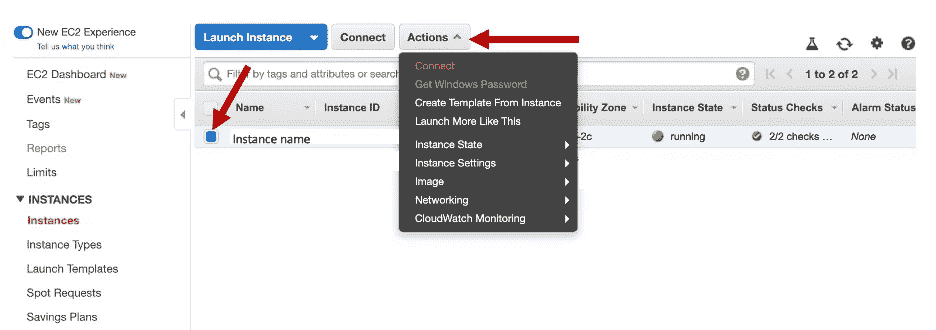

我笔记本电脑的截图

您将看到此窗口，用于连接到您的实例。

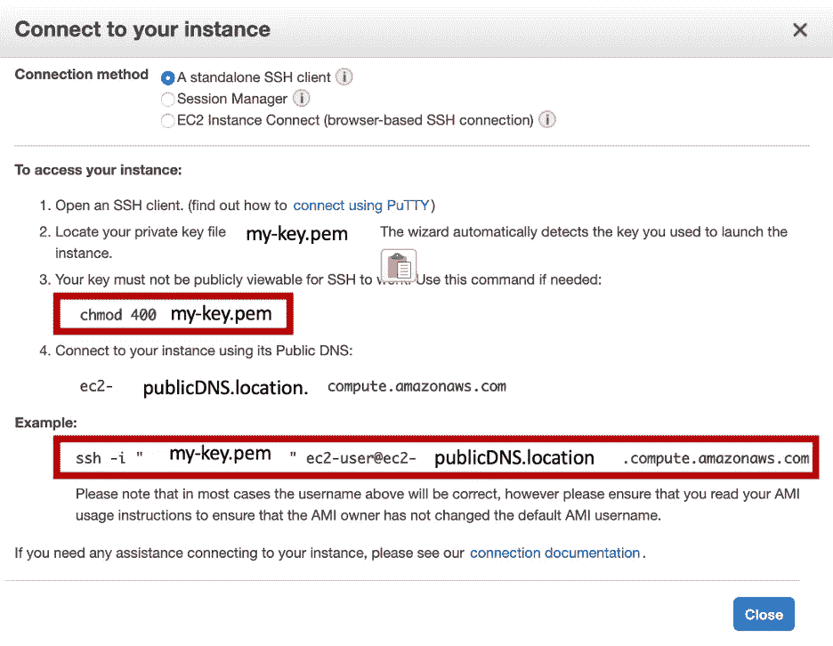

我笔记本电脑的截图

打开“终端”并转到储存您的密钥对的文件夹。运行 chmod 命令来更改您的密钥对的权限。然后，运行 ssh 命令进入您的实例。每次重新启动计算机以进入实例时，都需要重新运行 chmod 命令来修改密钥对的权限。

# 2.软件安装

现在，简单的部分！接下来就是安装需要的软件和机器学习包，比如 Python3，Conda，Pytorch 等。从这里开始，我假设我们从基本的 Amazon Linux AMI 开始，因为深度学习 AMI 往往已经安装了这些包。

Yum 是 Amazon Linux AMI 上的默认安装程序。

```
$ sudo yum update 
$ sudo yum install emacs
```

要安装 pip，请使用:

```
$ curl https://bootstrap.pypa.io/get-pip.py -o get-pip.py
$ python3 get-pip.py
```

安装 Anaconda。

```
$ cd /tmpcurl -O [https://repo.anaconda.com/archive/Anaconda3-5.3.1-Linux-x86_64.sh](https://repo.anaconda.com/archive/Anaconda3-5.3.1-Linux-x86_64.sh) $ sha256sum Anaconda3-5.3.1-Linux-x86_64.sh $ d4c4256a8f46173b675dd6a62d12f566ed3487f932ba
b6bb7058f06c124bcc27 Anaconda3-5.3.1-Linux-x86_64.sh $ bash Anaconda3-5.3.1-Linux-x86_64.sh $ source ~/.bashrc (or open up a new terminal)
```

让我们得到 Numpy 和 Scipy。

```
conda update -n base -c defaults condaconda install numpy scipy
```

还有 Pytorch。

```
conda install pytorch torchvision -c pytorch
```

最后，Git！

```
sudo yum install git-all
```

现在，我们准备运行代码。

# 3.传输文件

要在本地目录和远程实例之间传输文件，可以运行

```
$ scp -i /path/my-key.pem /path/to/file [ec2-user@publicDNS.compute-1.amazonaws.com:~/path/to/location](mailto:ec2-user@publicDNS.compute-1.amazonaws.com:~/path/to/location)
```

然而，对于在特定的本地位置传输许多文件，我更喜欢使用 FileZilla。从 https://filezilla-project.org/下载 FileZilla。

在文件下，点击站点管理器。

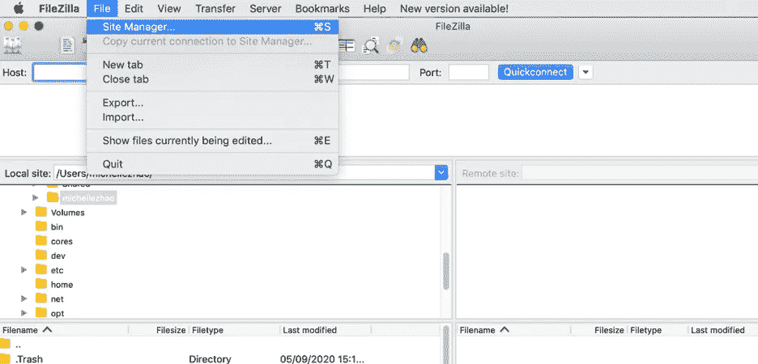

我笔记本电脑的截图

在站点管理器窗口中，单击新建站点。将协议设置为 SFTP。将主机设置为您的公共 DNS。这个公共 DNS 可以通过进入 EC2 实例管理控制台，点击您的实例，并在描述框中复制公共 DNS (IPv4)下的条目。将端口设置为 22。用户将是 ec2 用户。最后，导航到本地计算机上保存的密钥对文件。单击连接。

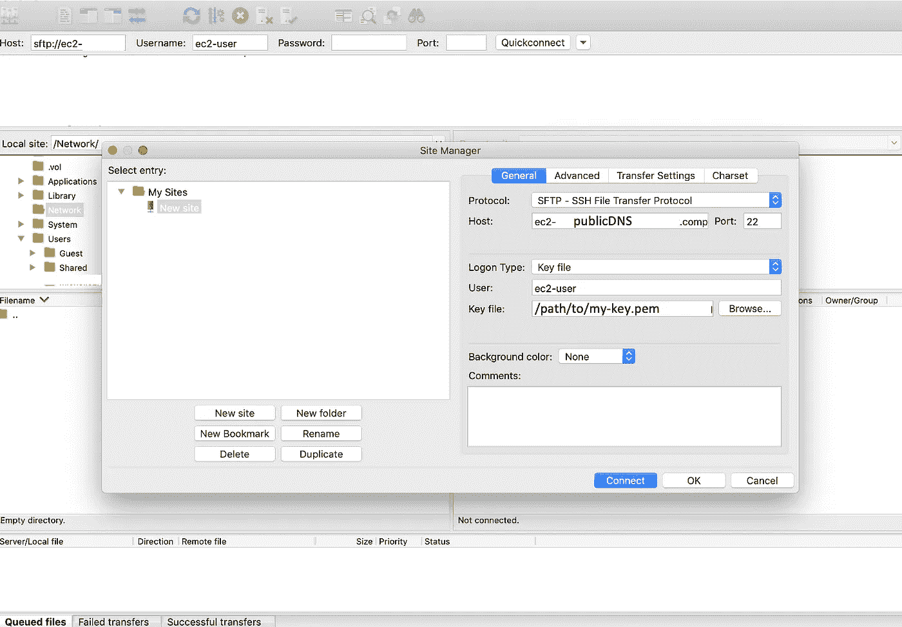

我笔记本电脑的截图

现在，您可以将文件从本地文件拖到远程 EC2 实例。

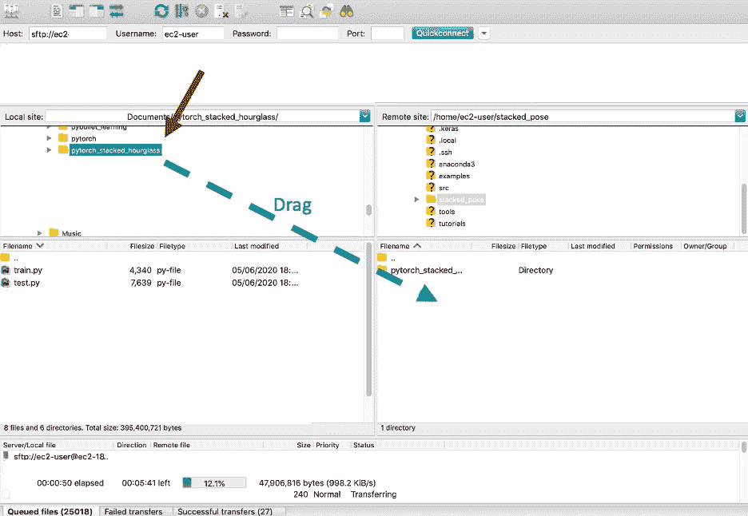

我笔记本电脑的截图

输出文件同样可以通过 FileZilla 或 scp 传输回您的本地机器。

现在，您可以 SSH 到您的实例中，虚拟地运行您的所有代码！

## 资源:

[1]https://docs.aws.amazon.com/transfer/latest/userguide