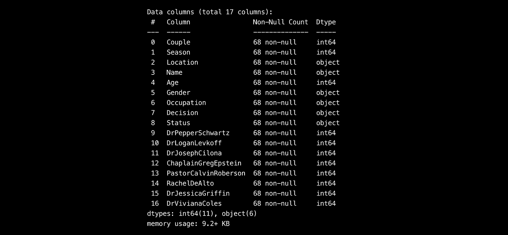
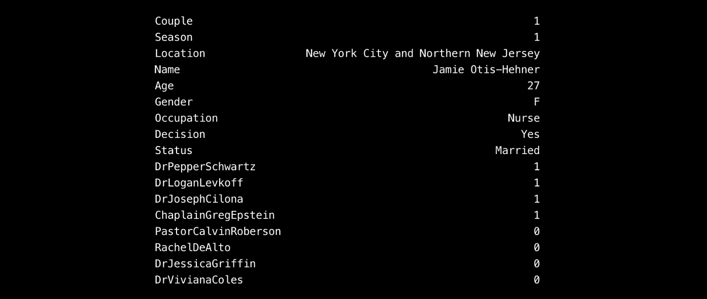
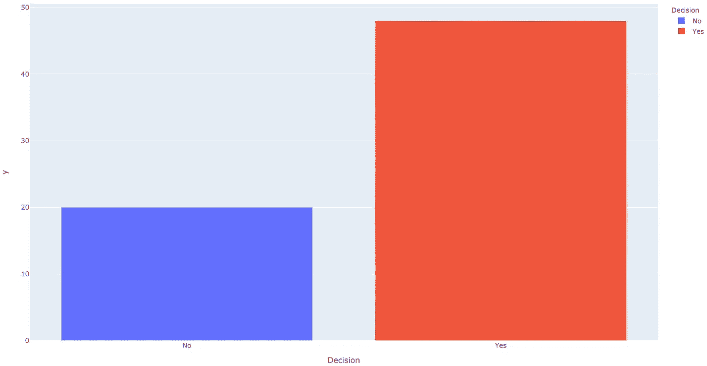
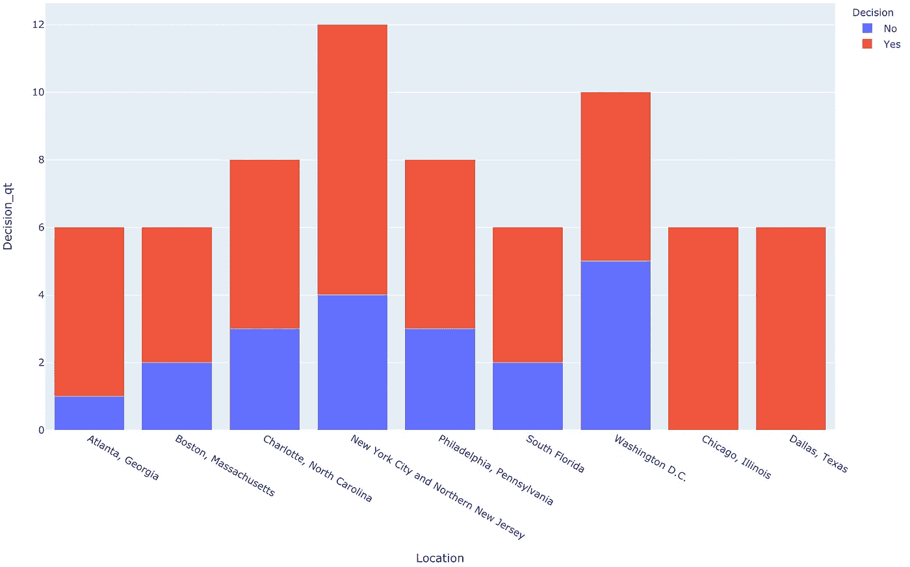
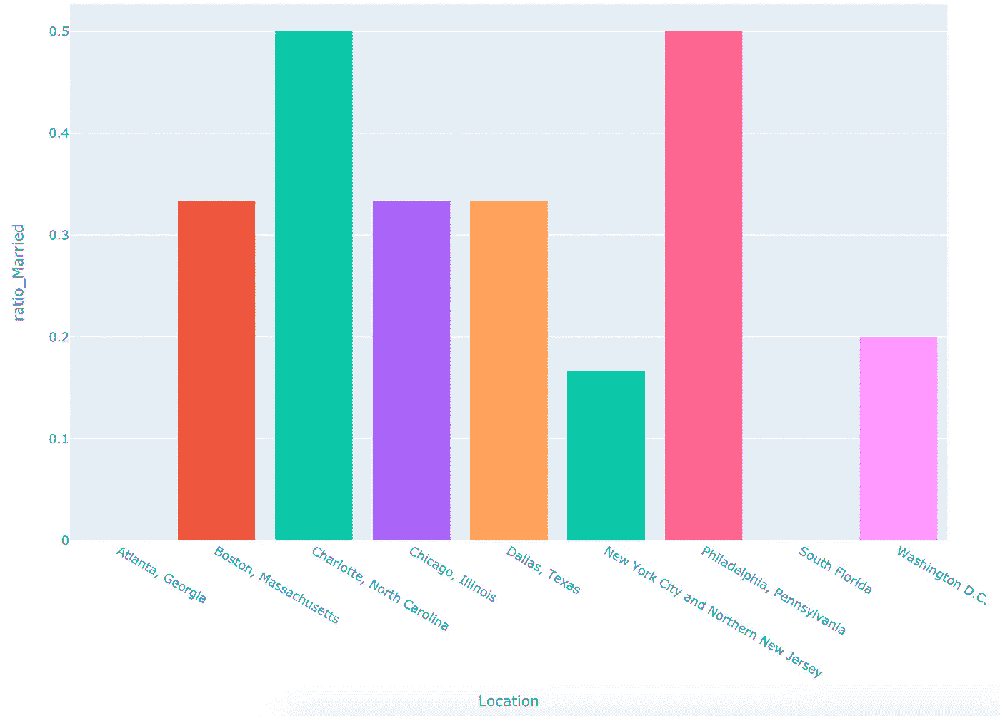
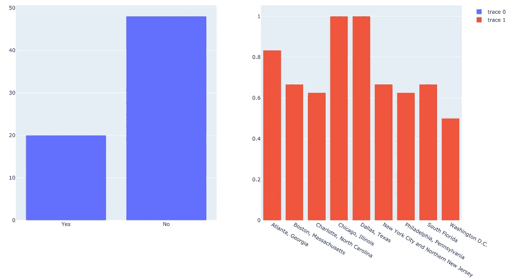

# 使用 Plotly Express 的逐步条形图

> 原文：<https://towardsdatascience.com/step-by-step-bar-charts-using-plotly-express-bb13a1264a8b?source=collection_archive---------25----------------------->

## 回答“我在看什么？”


由[布兰登·莫温克尔](https://unsplash.com/@bmowinkel?utm_source=unsplash&utm_medium=referral&utm_content=creditCopyText)在 [Unsplash](https://unsplash.com/s/photos/columns?utm_source=unsplash&utm_medium=referral&utm_content=creditCopyText) 上拍摄的照片

作为一名有抱负的数据科学家，我喜欢摆弄数据集，解开隐藏在行和列背后的故事。我做的第一件事就是用条形图来显示数据。这让我熟悉了信息，并制定了未来分析的游戏计划。

如果您还不是会员，请在此获得您的中级会员资格！

# 数据集

我决定找一个简单的数据集，让我可以专注于绘图而不是清理。我发现“一见钟情结婚”数据集符合我的需求，因为它有一个健康的组合**数字**和**分类数据**。这个电视节目已经成为一种隔离的罪恶快感。在这个系列中，两个人被随机配对，他们可以在一个梦想的地方度假三周后决定结婚与否。数据集可以在[这里](https://www.kaggle.com/mrisdal/married-at-first-sight)找到。

# 导入库

第一步是导入我将使用的所有库。是一个用于在 Python 中创建静态、动画和交互式可视化的库。 **Plotly Express** 是 Plotly v.4 的一个新的高级 Python 可视化库，允许使用简单的语法绘制复杂的图表。

一旦库被导入，我就使用 ***read_csv()*** 函数加载我的文件，并将其转换成熊猫数据帧。

```
import pandas as pd
import plotly.express as px
from plotly.subplots import make_subplotsdf = pd.read_csv("Data/mafs.csv")
```

# 让我们来看看数据框

当我有了我的熊猫数据框架后，我会做两件事。首先，我查看标题名和存储在每一列中的变量类型。

```
print(df.info())
```



图由作者提供

这告诉我，在我的数据集中有 17 列，一些存储' ***对象*** '类型，我喜欢把它们看作字符串，还有' ***int64*** '类型，它们是简单的 64 位整数存储。

其次，我查看数据帧的第一行。

```
print(df.iloc[0])
```

通过将 index [0]改为任意整数，我也可以找到任意行的信息。



图由作者提供

这告诉我，在这个电视节目中，参赛者杰米·奥蒂斯-赫纳在比赛时 27 岁，职业是护士。**更重要的是，这位选手在电视节目中决定结婚，至今仍是已婚。幸运的女孩！**

# *“是对否”*简单条形图

我的第一反应是绘制出同意结婚的人和愿意保持单身的人的数量。该信息可在“决策”栏中找到，该栏中的值为“是”或“否”。

```
df1 = df.groupby(["Decision"]).count().reset_index()

fig = px.bar(df1**,** y=df.groupby(["Decision"]).size()**,** x="Decision"**,** color='Decision')
fig.show()
```

通过使用 ***groupby()*** 函数，我能够对数据集中的行进行洗牌，以便按照决策结果对它们进行组织。剩下要做的唯一一件事就是选择 x 轴和 y 轴来产生所需的信息。



图由作者提供

从图表中可以清楚地看到，70%的参赛者在三周后决定结婚，这是一个惊人的高成功率。也许这就是这部剧已经播了 10 季的原因吧！

# “每个地点的婚姻”堆积条形图

我想做的第二件事是看看地理位置是否会影响成功夫妇的数量。为此，我在 x 轴上标出了位置，在 y 轴上标出了“是”和“否”的数量。

```
df2 = df.groupby(['Location'**,**'Decision']).size().reset_index(name='Decision_qt')
df2_yes = df2[df2['Decision']=='Yes']
df2_yes.set_index('Location'**,** inplace=True)

fig = px.bar(df2**,** x="Location"**,** y="Decision_qt"**,** color='Decision'**,** barmode='stack')
fig.show()
```

同样，使用 ***groupby()*** 函数，我首先根据位置对我的行进行分组，然后进行决策，本质上是在一个组内创建一个组。我还创建了一个名为 **Decision_qt** 的附加列，它保存每个位置的“是”和“否”答案的数量。



图由作者提供

除了芝加哥和达拉斯(所有参赛者都决定在那里结婚！)我们可以看到，地点对情侣的成功率影响不大。在这一点上，我要补充的是，我们只在每个地点调查大约 6 到 12 个人，更大的样本量会产生更可靠的信息…

# 已婚与离异比率条形图

现在，接下来我想调查的是在节目中结婚后离婚的人数。为了绘制这个比率，我需要遵循三个简单的步骤。

## 准备第一个数据集

我创建了一个 dataframe ' **df_married'** ，它根据位置和状态对行进行分组。我还创建了一个额外的列‘Maried _ Qt ’,每行包含已婚人口的总数。最后，我修改这个数据集，只保留已婚参与者的行。

```
df_married = df.groupby(['Location'**,**'Status']).size().reset_index(name='Married_qt')
df_married = df_married[df_married['Status']=='Married']
```

## 准备第二个数据集

现在我想统计每个地点的参与者总数。这也是通过使用 ***groupby()*** 函数并使用 **size()** 函数对每个组中的行求和来实现的。

```
df3 = df.groupby(['Location']).size().reset_index(name='Participants_qt')
```

## 执行除法和绘图

为了执行分割，我们首先必须将两个数据帧的索引设置为位置(比率是在同一城市结婚和离婚的夫妇之间取得的)。除法的结果保存在名为“ **ratio_Married** ”的列中

```
# Division
df_married.set_index('Location'**,** inplace=True)
df3.set_index('Location'**,** inplace=True)df3['ratio_Married'] = (df_married['Married_qt'] / df3['Participants_qt'])# Plotting
df_married.reset_index(inplace = True)
df3.reset_index(inplace = True)
fig = px.bar(df3**,** x='Location'**,** y='ratio_Married'**,** color='Location'**,** barmode='stack')
# fig.show()
```

绘图时，从数据帧 **df3** 中分别在 x 轴和 y 轴选择数据帧对应的位置和比率列。



这个剧情没有前两个乐观。超过 50%同意结婚的夫妇后来离婚了。在亚特兰大和南佛罗里达，没有一个参赛者仍然和他/她的对手结婚…

# 分步子情节特征

这花了我一点时间才弄明白，这就是为什么我超级兴奋地分享！当试图比较和对比图或条形图时，创建支线剧情会非常有用。当东西放在一起时，潜在的关系可以很容易地显现出来。

为了制作一个有多个支线剧情的图形，第一步是指定支线剧情的数量和它们的位置。在我的例子中，我选择让我的数据在同一行不同列(并排)。类型*“xy”*表示坐标系(例如也可以是极坐标)。

```
subfig = make_subplots(rows=**1,** cols=**2,** specs=[[{"type": "xy"}**,** {"type": "xy"}]])
```

现在我们创建两个子图，指定它们的轴和值。

## 第一个副情节

这和文章开头的**是对否**条形图一样。需要注意的是，plotly express 只支持 series。这意味着我需要使用 ***pd 将我想要绘制的信息从熊猫数据帧转换成一个系列。系列()*** 功能 ***。***

```
df4 = df.groupby(["Decision"]).size().reset_index(name='Total_YesNo')
y1=pd.Series(df4['Total_YesNo'])

subfig.add_bar(row=**1,** col=**1,** y=y1**,** x=["Yes"**,** "No"])
```

## 第二副情节

在第二张图中，我绘制了每个位置的**是对**否的**比率。x 轴和 y 轴值被转换成序列，并传递到子图上进行绘制。**

```
df5 = df.groupby(['Location']).size().reset_index(name='Participants_qt')
x2=pd.Series(df5['Location'])
y2=pd.Series(df3['ratio_YesNo'])

subfig.add_bar( row=**1,** col=**2,** x=x2**,** y=y2)
subfig.show()
```

## 结果！



# Github 知识库

所有代码都可以在 Github [上的 **Married.py** 文件中找到](https://github.com/alejandra-gutierrez/Grad_Placements.git)！

# 非常感谢你的阅读！

如果你喜欢我的作品，如果你能在这里跟随我，我将不胜感激。

如果您对如何改进有任何问题、建议或想法，请在下面留下评论或通过 LinkedIn [这里](https://www.linkedin.com/in/alejandra-g-283595b8)取得联系。