# 一步一步:建立一个有气流的数据管道

> 原文：<https://towardsdatascience.com/step-by-step-build-a-data-pipeline-with-airflow-4f96854f7466?source=collection_archive---------2----------------------->

## 构建气流数据管道，以监控错误并自动发送警报电子邮件。故事提供了详细的步骤，并配有截图。

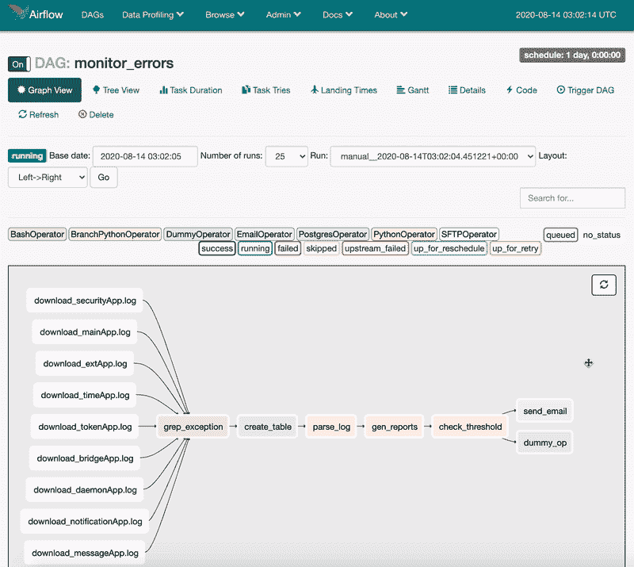

构建气流数据管道

每次我们部署新软件时，我们会每天检查两次日志文件，看看在接下来的一两周内是否有问题或异常。一位同事问我，有没有办法监控错误，如果某个错误出现 3 次以上，就自动发送警报。我现在正在跟踪气流过程，这是一个用气流构建数据管道来监控异常的完美用例。

# 什么是气流？

> Airflow 是一个开源的工作流管理平台，它于 2014 年 10 月在 Airbnb 开始，后来被开源，在 2016 年 3 月成为 Apache 孵化器项目。气流设计遵循“配置即代码”的原则。[1]
> 
> 在 Airflow 中，DAG(或有向非循环图)是您想要运行的所有任务的集合，以反映它们的关系和依赖性的方式组织。[2]

Airflow 使用 Python 语言创建其工作流/DAG 文件，对于开发者来说非常方便和强大。

# 分析

我们的日志文件保存在服务器上，有几个日志文件。我们可以通过 **sftp** 命令获取它们。将所有日志文件下载到一个本地文件夹后，我们可以使用 **grep** 命令提取所有包含异常或错误的行。以下是错误日志的示例:

*/usr/local/air flow/data/2020 07 23/log in app . log:140851:[[]]23 Jul 2020/13:23:19196 错误 session id:u 0 ukvlfdnmsmicbuozo 86 LQ 8 ocu =[log in app]Dao。AbstractSoapDao-getNotificationStatus-服务异常:Java . net . sockettimeoutexception:读取超时*

接下来，我们需要逐行解析错误消息并提取字段。和上面的例子一样，我们想知道文件名、行号、日期、时间、会话 id、应用程序名、模块名和错误消息。我们将把所有这些信息提取到一个数据库表中，稍后，我们可以使用 SQL 查询来汇总这些信息。如果任何类型的错误发生超过 3 次，它将触发发送电子邮件到指定的邮箱。

整个过程非常简单，如下所示:

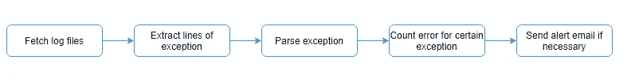

监控错误日志的工作流

## 气流操作员

气流提供了很多有用的运算符。操作符是一个单一的任务，它提供了一种实现特定功能的简单方法。例如， *BashOperator* 可以执行 Bash 脚本、命令或命令集。 *SFTPOperator* 可以通过 SSH 会话访问服务器。此外，气流允许任务之间的并行，因为一个操作符对应一个任务，这意味着所有操作符可以并行运行。Airflow 还提供了一种非常简单的方法来定义任务之间的依赖性和并发性，我们将在后面讨论它。

# 履行

通常，气流在 docker 容器中流动。阿帕奇在 [Docker Hub](https://hub.docker.com/) 发布[气流图像](https://hub.docker.com/r/apache/airflow)。一张更受欢迎的气流图由 [Puckel](https://hub.docker.com/r/puckel/docker-airflow) 发布，配置良好，随时可用。我们可以从 [Puckel 的 Github 库](https://github.com/puckel/docker-airflow)中检索 docker 文件和所有配置文件。

安装 Docker 客户端并提取 Puckel 的存储库后，运行以下命令行启动 Airflow 服务器:

```
docker-compose -f ./docker-compose-LocalExecutor.yml up -d
```

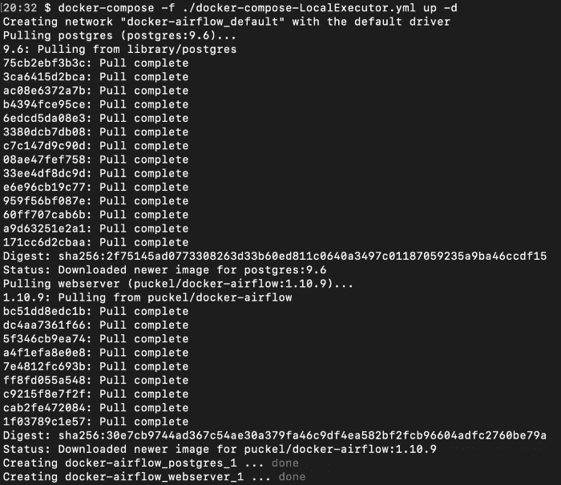

第一次运行气流

第一次运行脚本时，它会从 [Docker Hub](https://hub.docker.com/) 下载 Puckel 的 Airflow 镜像和 Postgres 镜像，然后启动两个 Docker 容器。

气流有一个很好的 UI，可以从 [http://localhost:8080](http://localhost:8080) 访问。

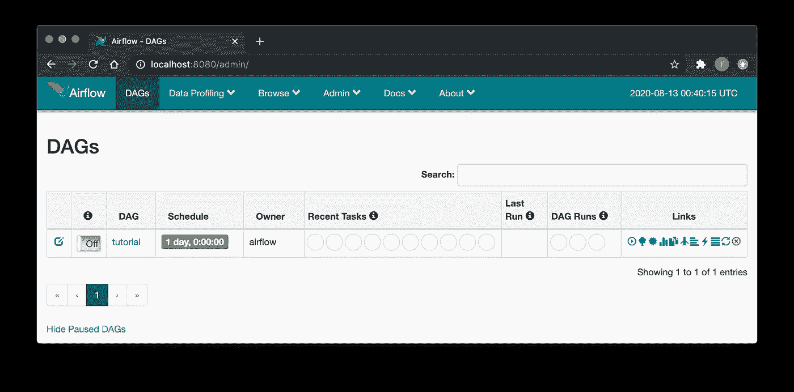

气流 UI 门户

从 Airflow UI 门户，它可以触发 DAG 并显示当前运行的任务的状态。

让我们开始创建 DAG 文件。创建新的 DAG 非常容易。首先，我们定义一些默认参数，然后用 DAG 名称 **monitor_errors** 实例化一个 DAG 类，DAG 名称将显示在 Airflow UI 中。

实例化新的 DAG

工作流的第一步是从服务器下载所有日志文件。Airflow 支持运行任务的并发性。我们为一个日志文件创建一个下载任务，所有的任务可以并行运行，我们将所有的任务添加到一个列表中。 *SFTPOperator* 需要一个 SSH 连接 id，我们将在运行工作流之前在 Airflow 门户中配置它。

创建下载任务

之后，我们可以刷新 Airflow UI 来加载我们的 DAG 文件。现在我们可以看到我们的新 DAG - **monitor_errors** -出现在列表中:

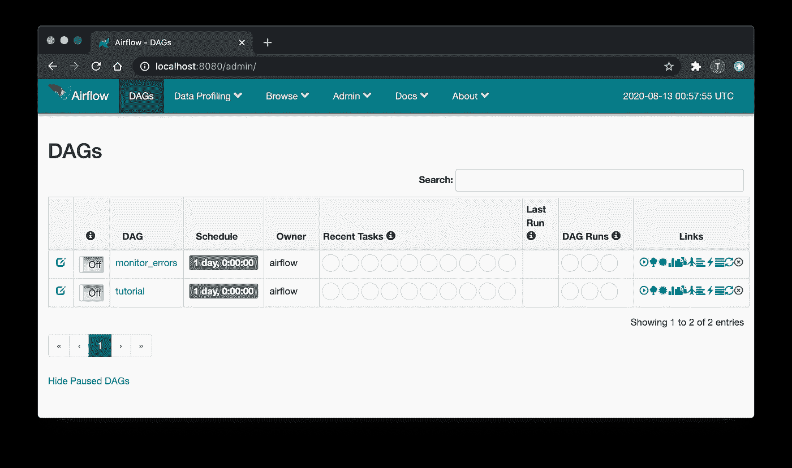

气流中显示的新 DAG

单击 DAG 名称，它将显示图形视图，我们可以在这里看到所有的下载任务:

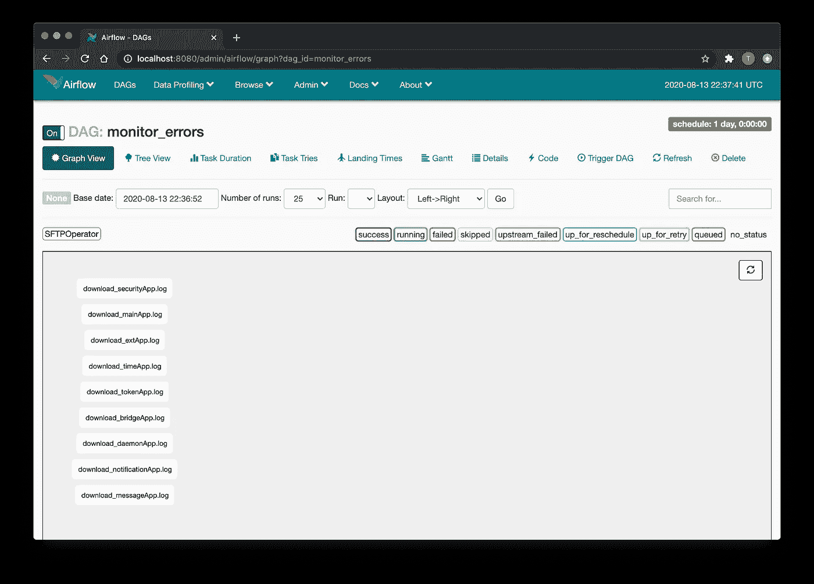

图表视图中的所有下载任务

在我们触发 DAG 批处理之前，我们需要配置 SSH 连接，以便 *SFTPOperator* 可以使用这个连接。点击**管理**菜单，然后选择**连接**来创建一个新的 SSH 连接。

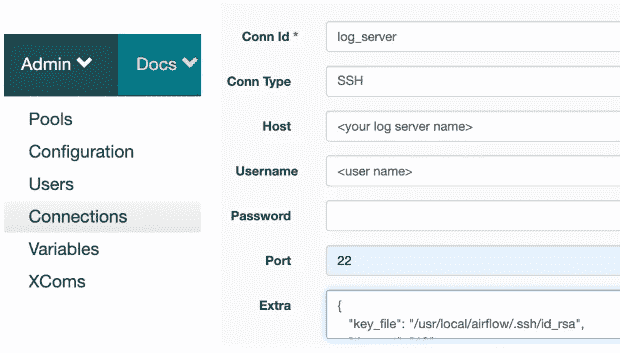

创建 SSH 连接

要在不输入密码的情况下访问 SSH 服务器，需要使用公钥登录。假设公钥已经放入服务器，私钥位于 */usr/local/airflow/。ssh/id_rsa* 。将**密码**字段留空，并将以下 JSON 数据放入**额外**字段。

```
{
  "key_file": "/usr/local/airflow/.ssh/id_rsa",
  "timeout": "10",
  "compress": "false",
  "no_host_key_check": "false",
  "allow_host_key_change": "false"
}
```

好了，让我们启用 DAG 并触发它，一些任务变成绿色，这意味着它们处于运行状态，其他任务保持灰色，因为它们在队列中。

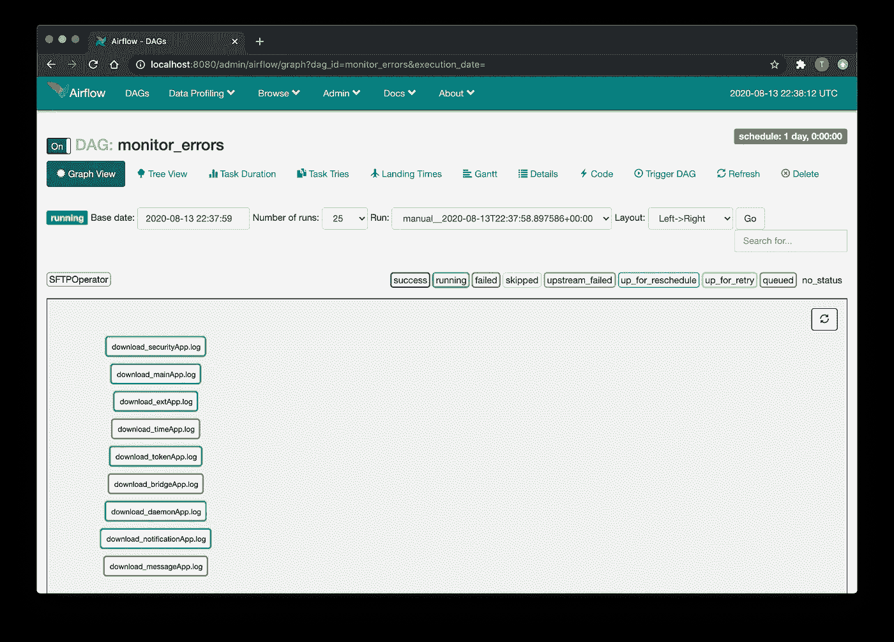

任务正在运行

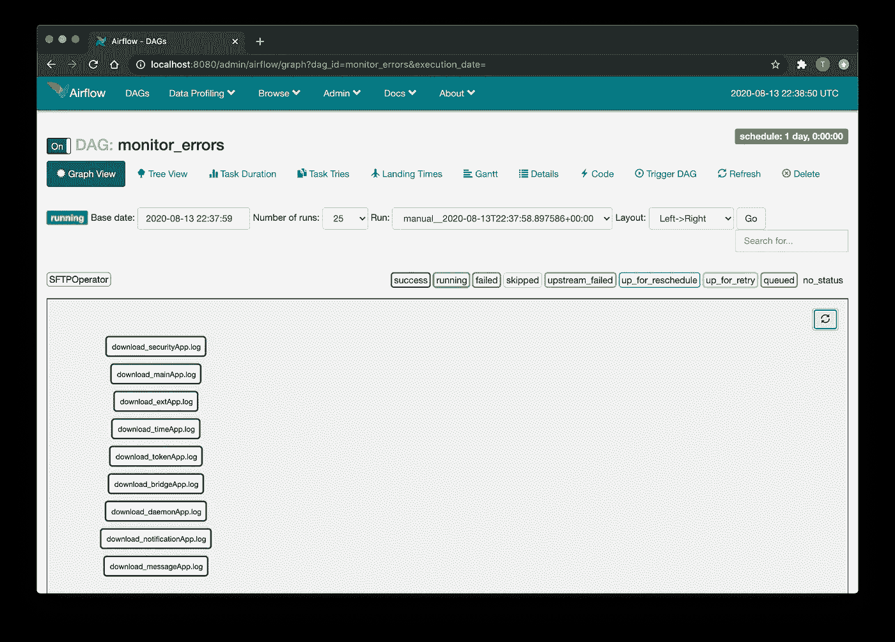

所有任务完成

当所有任务完成后，它们以深绿色显示。让我们检查下载到 **data/** 文件夹中的文件。它将创建带有当前日期的文件夹。

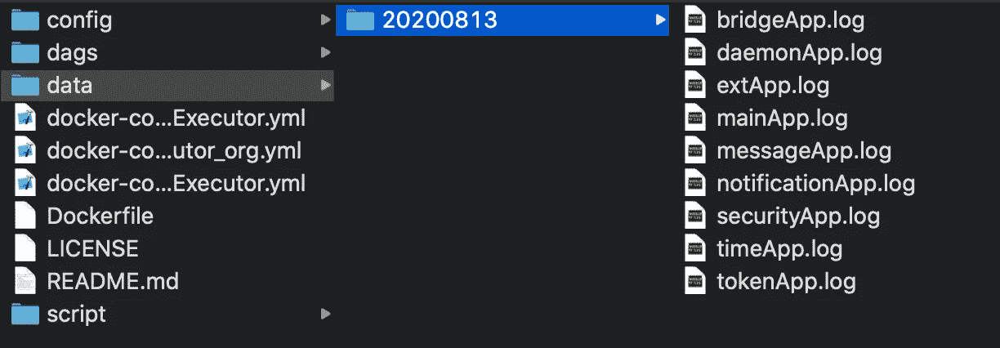

所有日志都下载到该文件夹中

看起来不错。

接下来，我们将提取日志文件中包含“**异常**的所有行，然后将这些行写入同一文件夹中的文件(errors.txt)中。 **grep** 命令可以在一个文件夹的所有文件中搜索某些文本，也可以在搜索结果中包含文件名和行号。

Airflow 检查 bash 命令返回值作为任务的运行结果。如果没有发现异常，grep 命令将返回 **-1** 。Airflow 将非零返回值视为失败任务，然而事实并非如此。没有错误意味着我们都很好。我们检查 grep 生成的 errors.txt 文件。如果文件存在，无论它是否为空，我们都将此任务视为成功。

创建 grep_exception 任务

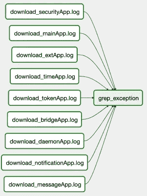

grep 异常

刷新 DAG 并再次触发它，图形视图将如上所述进行更新。让我们检查文件夹中的输出文件 errors.txt。

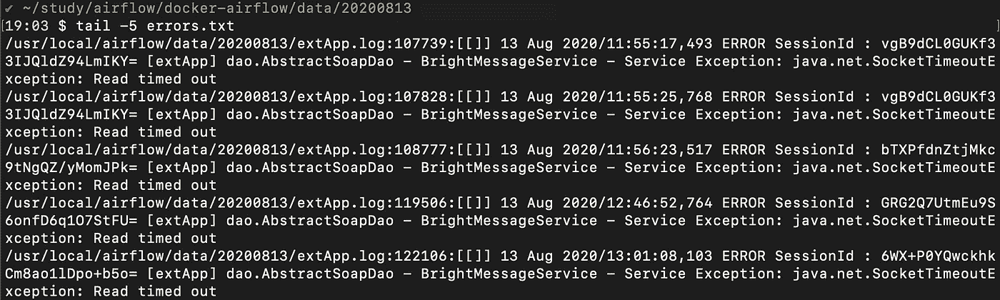

在 errors.txt 中列出最后 5 个异常

接下来，我们将逐行解析日志，提取我们感兴趣的字段。我们使用一个 *PythonOperator* 通过一个正则表达式来完成这项工作。

使用正则表达式解析异常日志

提取的字段将保存到数据库中，供以后查询使用。Airflow 支持任何类型的数据库后端，它在数据库中存储元数据信息，在这个例子中，我们将使用 Postgres DB 作为后端。

我们定义了一个 *PostgresOperator* 来在数据库中创建一个新表，如果这个表已经存在，它将删除这个表。在真实的场景中，我们可能会将数据追加到数据库中，但是我们应该小心，如果由于某种原因需要重新运行某些任务，可能会将重复的数据添加到数据库中。

在 Postgres 数据库中创建一个表

要使用 Postgres 数据库，我们需要在 Airflow 门户中配置连接。我们可以修改现有的 postgres_default 连接，这样在使用 *PostgresOperator* 或*postgreshawk*时就不需要指定连接 id。

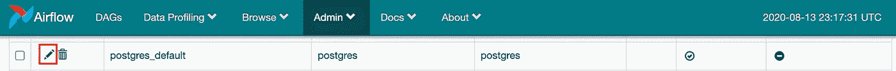

修改 postgres_default 连接

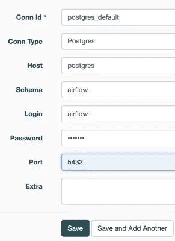

配置 postgres_default 连接

太好了，让我们再次触发 DAG。

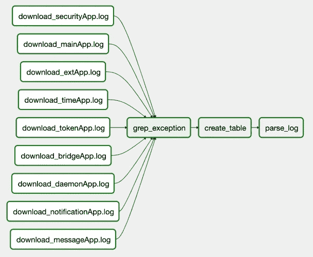

解析错误日志

任务成功运行，所有日志数据都被解析并存储在数据库中。Airflow 提供了一种查询数据库的便捷方式。在“**数据分析**菜单下选择“**临时查询**，然后输入 SQL 查询语句。

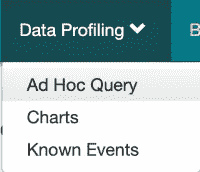

即席查询

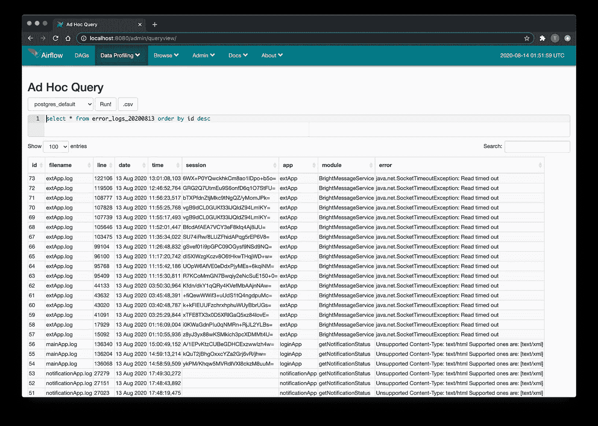

Postgres 数据库中的错误日志

接下来，我们可以查询表并统计每种类型的错误，我们使用另一个 *PythonOperator* 来查询数据库并生成两个报告文件。一个包含数据库中的所有错误记录，另一个是统计表，以降序显示所有类型的错误。

定义任务以生成报告

好的，再次触发 DAG。

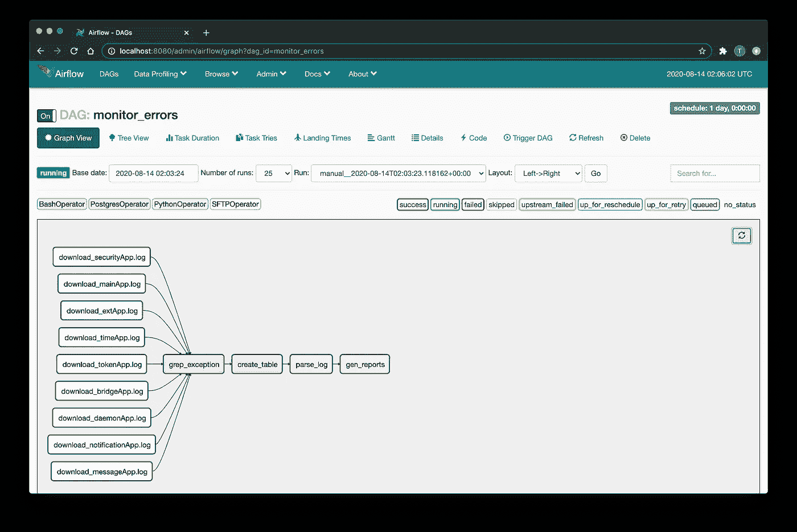

生成报告

文件夹中会生成两个报告文件。

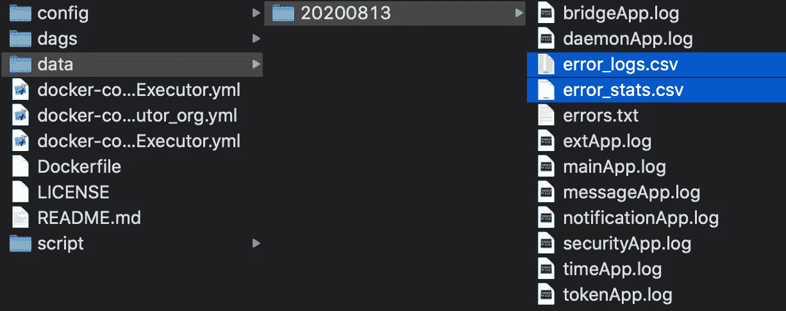

两份报告

在 error_logs.csv 中，它包含数据库中的所有异常记录。

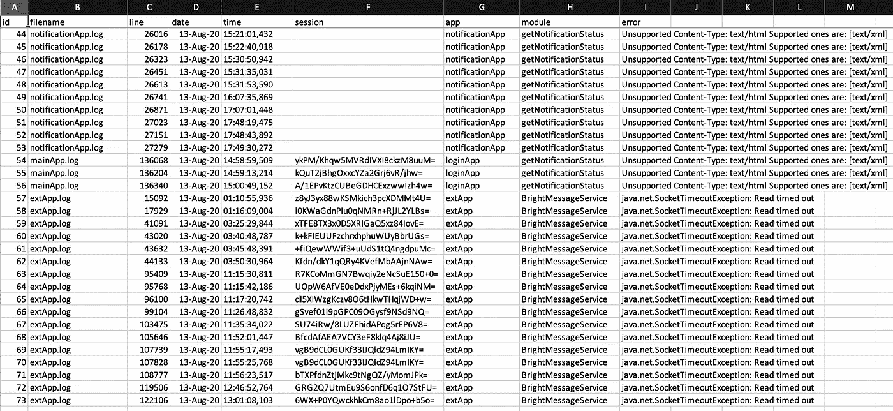

报告所有例外情况

在 error_stats.csv 中，它列出了出现的不同类型的错误。

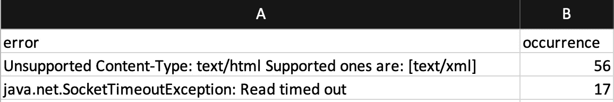

报告不同类型的异常

在最后一步，我们使用一个分支操作符来检查错误列表中的最高出现次数，如果它超过阈值，说 3 次，它将触发发送电子邮件，否则，静静地结束。我们可以在气流变量中定义阈值，然后从代码中读取该值。这样我们就可以在不修改代码的情况下更改阈值。

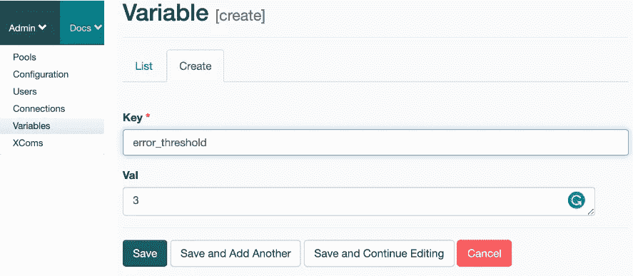

在气流中产生一个变量

定义任务以检查错误号

*branch pythonooperator*返回下一个任务的名称，要么发送电子邮件，要么什么都不做。我们使用 *EmailOperator* 发送电子邮件，它提供了一个方便的 API 来指定收件人、主题、正文字段，并且易于添加附件。我们用 *DummyOperator* 定义一个空任务。

电子邮件任务和虚拟任务

要使用电子邮件操作符，我们需要在 YAML 文件中添加一些配置参数。这里我们定义 Gmail 帐户的配置。您可以在这里输入您的密码，或者使用[应用程序密码](https://support.google.com/mail/answer/185833?hl=en)作为您的电子邮件客户端，这样可以提供更好的安全性。

```
- AIRFLOW__SMTP__SMTP_HOST=smtp.gmail.com
- AIRFLOW__SMTP__SMTP_PORT=587
- AIRFLOW__SMTP__SMTP_USER=<your-email-id>@gmail.com
- AIRFLOW__SMTP__SMTP_PASSWORD=<your-app-password>
- AIRFLOW__SMTP__SMTP_MAIL_FROM=<your-email-id>@gmail.com
```

到目前为止，我们创建了工作流中的所有任务，我们需要定义这些任务之间的依赖关系。气流提供了一种非常直观的方式来描述依赖性。

```
dl_tasks >> grep_exception >> create_table >> parse_log >> gen_reports >> check_threshold >> [send_email, dummy_op]
```

现在，我们完成了所有的编码部分，让我们再次触发工作流来看看整个过程。

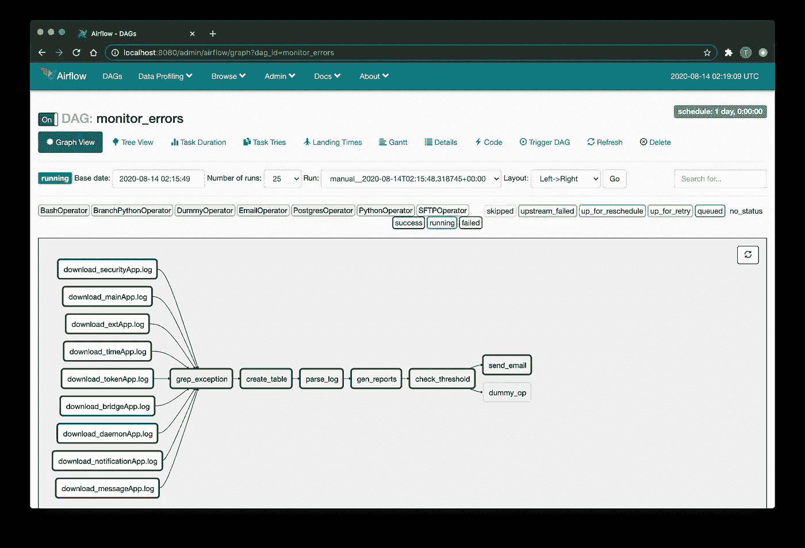

当任何类型的错误数量超过阈值时发送电子邮件

在我们的例子中，有两种类型的错误，它们都超过了阈值，它将在最后触发发送电子邮件。邮件附有两份报告。

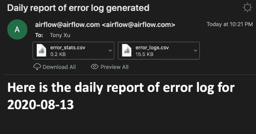

电子邮件提醒

我们将阈值变量更改为 60，并再次运行工作流。

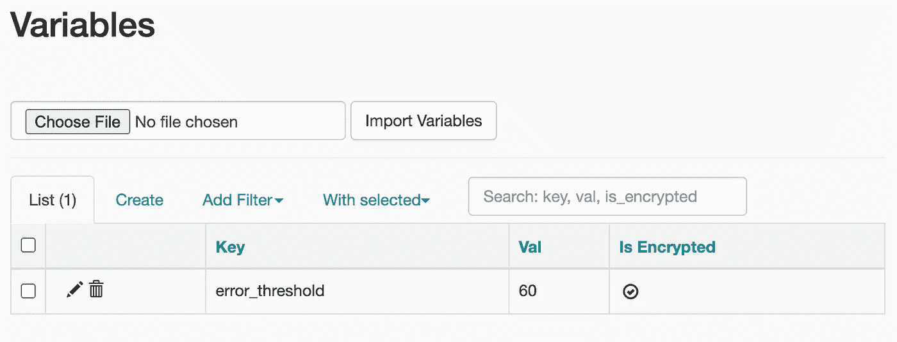

将阈值更改为 60

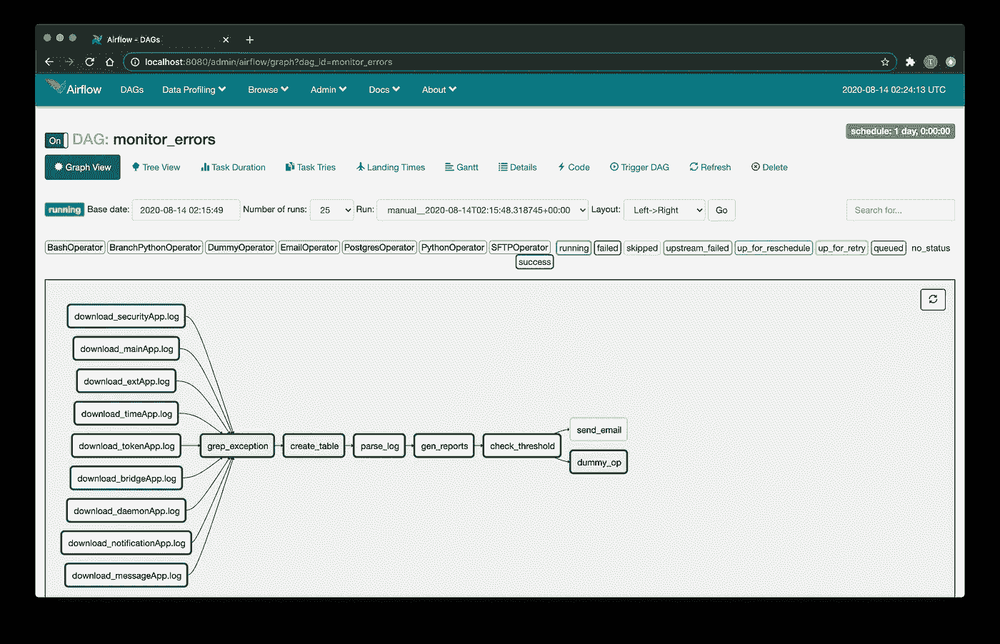

工作流结束，不发送电子邮件

如您所见，它不会触发发送电子邮件，因为错误数小于 60。工作流无声地结束。

让我们回到 DAG 视图。

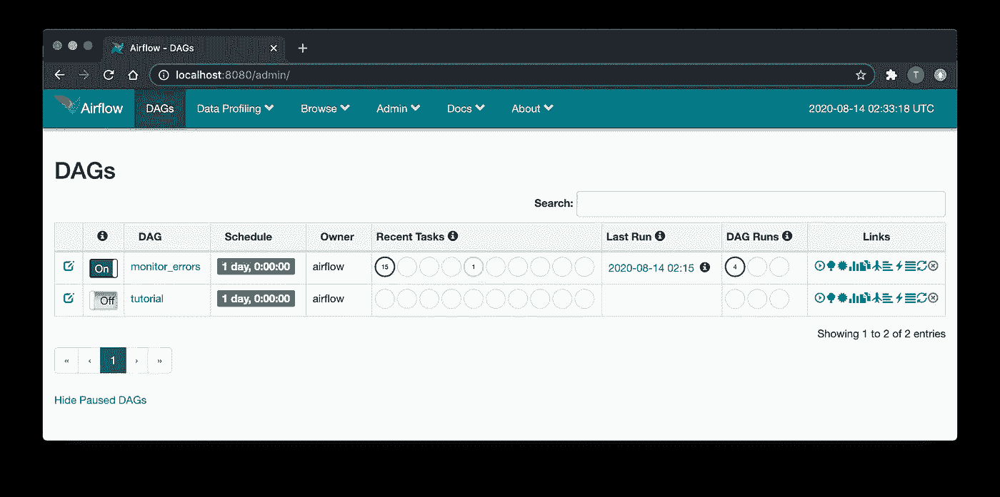

DAG 视图

它列出了所有活动或非活动 DAG 以及每个 DAG 的状态，在我们的示例中，您可以看到，我们的 monitor_errors DAG 成功运行了 4 次，在最后一次运行中，15 个任务成功，1 个任务被跳过，这是最后一个 dummy_op 任务，这是预期的结果。

现在，我们的 DAG 计划每天运行，我们可以根据需要更改计划时间，例如每 6 小时或每天的特定时间。

Airflow 是一个强大的 ETL 工具，它被广泛应用于许多一级公司，如 Airbnb，Google，Ubisoft，Walmart 等。它也受到主要云平台的支持，如 AWS、GCP 和 Azure。它在数据工程和数据处理中发挥着越来越重要的作用。

# 密码

[https://github.com/kyokin78/airflow](https://github.com/kyokin78/airflow)

# 参考

[1]https://en.wikipedia.org/wiki/Apache_Airflow

[2]https://airflow.apache.org/docs/stable/concepts.html

[3][https://github.com/puckel/docker-airflow](https://github.com/puckel/docker-airflow)