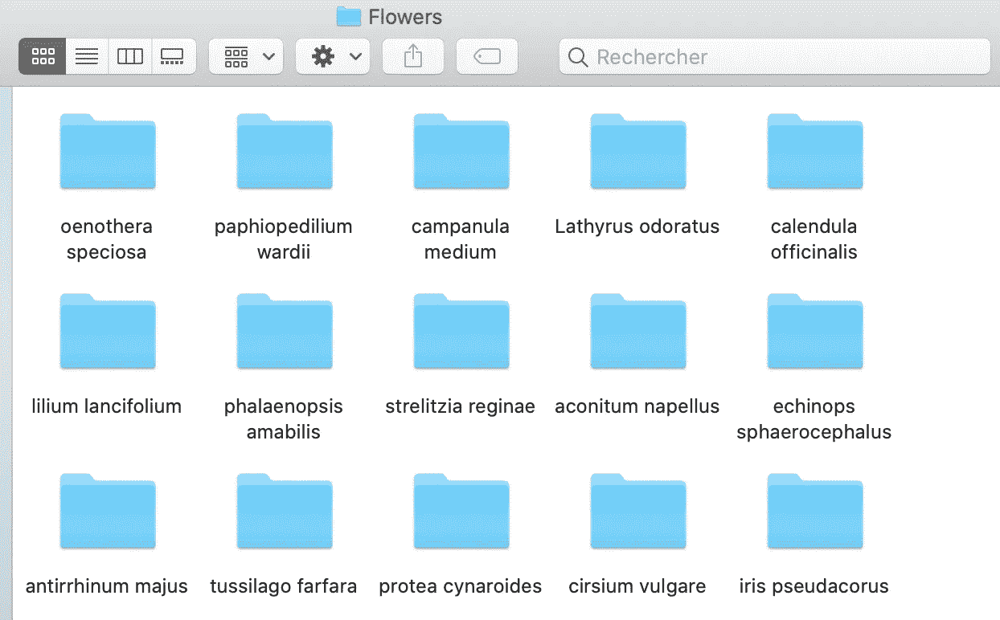
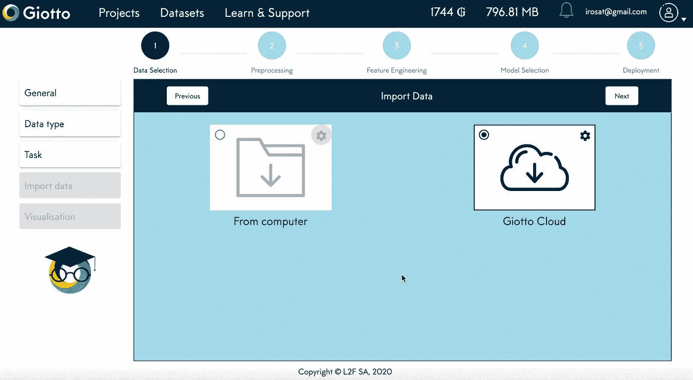
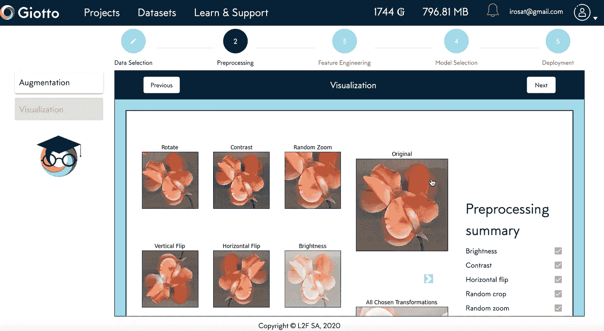
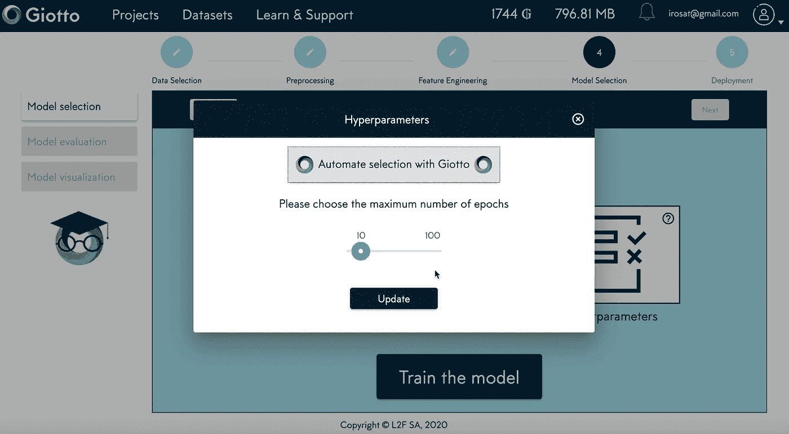
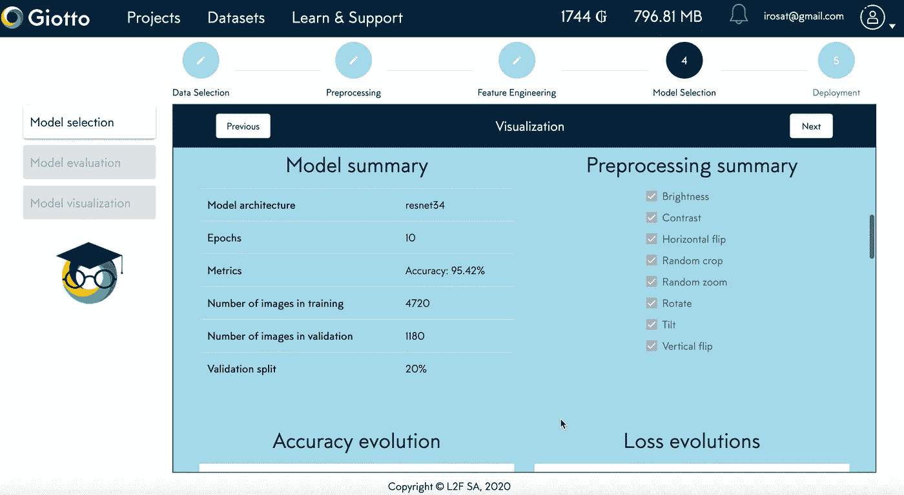

# 无需编码的逐步花卉分类

> 原文：<https://towardsdatascience.com/step-by-step-flower-classification-without-coding-c652a7f73251?source=collection_archive---------57----------------------->

## *如何不用写一行代码就部署一个人工智能模型*

> 弗朗切斯科·帕尔马和艾萨克·罗萨写的

> 今天，你可以在高速公路上开着自己的无人驾驶汽车看报纸，在没有收银员的情况下购买食品杂货。但是，如果你去看医生、律师或农民，还没有智能机器能显著地帮助他们的核心活动。在没有做出判断的情况下，这似乎有点怪异。

**难以获得新技术和缺乏专家是远未解决的问题**。然而，对于传统的专业类别、学术研究人员和主题专家来说，有**大量的数据分析用例**。

照片由 [Hitesh Choudhary](https://unsplash.com/@hiteshchoudhary?utm_source=medium&utm_medium=referral) 在 [Unsplash](https://unsplash.com?utm_source=medium&utm_medium=referral) 上拍摄

好消息是，今天用于开发人工智能应用的部分最先进技术已经**公开。开源库和深度学习框架的兴起使这种技术的传播成为可能。通过**迁移学习**我们可以用比以往更少的图像或文本数据来训练执行深度学习模型。这意味着医生可以在他们的 X 射线图像上使用自动驾驶汽车中使用的相同模型。如果你有兴趣，你可以看看 [Fast.ai](https://github.com/fastai) 和[抱脸](https://github.com/huggingface)是如何工作的。**

> 然而，对这些框架的访问仍然局限于具有编码技能的人。因此，技术的成熟度和潜在用户的可访问性之间的不平衡产生了对无代码人工智能越来越大的影响。

当然，根据定义，无代码使它不那么复杂。由于它没有编写人工智能应用程序复杂，所以它没有同样的影响力和能力。

> 无论是现在还是将来，无代码平台都不可能完美地取代一个组织良好的数据专家团队。

**无代码 AI 的主要限制是它的严格性**。无代码程序不是根据客户需求定制的，可能不支持特定问题所需的工作量。另一个限制是难以运用商业知识来提高绩效或施加约束。

除了它的局限性之外，在过去的几年中，对无代码解决方案的关注无疑一直在上升。您可以在此处找到对现有供应商[的详细回顾。](https://www.forbes.com/sites/janakirammsv/2020/02/20/gartners-2020-magic-quadrant-for-data-science-and-machine-learning-platforms-has-many-surprises/#50a63bae3f55)

在本文中，我们将在一个花卉分类项目中试用[乔托](http://www.giotto.ai)。 **Giotto 是一个基于云的无代码平台，允许用户非常容易地开发、部署和共享基于他们自己的数据问题构建的人工智能应用**。它分为五个步骤(从数据选择到部署),用户可以选择一些参数或自动完成整个过程。到目前为止，它支持**图像分类问题**，但是其他数据类型和任务据说很快就会出现。

# 数据和问题

正确标记文件夹对使用 Giotto 很重要

> 无代码人工智能并不意味着神奇的人工智能:提供良好的数据仍然是一个优先事项，否则模型性能很容易下降。

在这个例子中，我们使用花的图像对 102 种植物进行了分类。分类的目标是能够通过在程序中上传植物的花的图片来正确地评估植物的种类。

数据集由 5400 幅花的图像组成，每类大约 50 幅图像，总共 102 个类。给定一幅图像，问题是正确分类它的类别，即花的种类。数据组织在子文件夹中，每个子文件夹包含单独/不同类别的图像。为了能够使用 Giotto，尊重这样的文件夹结构是至关重要的*(上图)*。数据可在[这里](https://www.kaggle.com/lenine/flower-102diffspecies-dataset)获得。

# 数据选择

第一步:数据选择，导入数据。(视频:1:40)

登录并创建项目后，系统会提示我们选择数据类型和任务。对于我们的应用程序，我们选择了图像和图像分类。

导入数据后，我们可以在可视化步骤中快速浏览一下。

# 预处理

第二步:预处理。所有数据扩充方法的可视化。(视频:2 分 25 秒)

深度学习模型工作得很好，但众所周知它们是数据饥渴的。即使我们在解决迁移学习的问题上迈出了一大步，一个模型通常会在有大量特定任务图像的情况下表现得更好。数据科学中使用的一个技巧是对原始图像进行修改，以人为增加数据集的大小。**使用 Giotto，可用的修改包括裁剪、缩放、亮度、旋转等。**

> 没有试图成为一个明显的队长，一个更光明的雏菊仍然是雏菊。只要我们试图区分雏菊和其他花，用原始雏菊和更亮的雏菊喂养模型应该会增加模型可以学习的雏菊样本的数量。因此，在大多数情况下，这也会提高其性能。

**此外，在某些情况下，通过从数据中去除系统噪声，数据扩充也可能有益于模型**。想象一下，如果你用一个数据集训练机器，其中所有的雏菊面朝右，所有的向日葵面朝左。一旦机器学会了，如果你给它一个面朝右的向日葵的图像，它可能会告诉你这是一朵雏菊。旋转(翻转)工具避免了这种情况，使机器的花面向两侧。

即使为您的数据选择所有的转换非常诱人，但这并不总是最好的主意。例如，如果你正在对颜色很重要的东西进行分类，处理亮度可能会导致性能下降。

**在我们的案例中，我们选择了所有可用的数据扩充，因为它们都不会对模型的执行产生不利影响。**

在下一个可视化步骤中，你可以看看修改后的图像样本*(上图)*。如果一个转换看起来不好，你可以随时回来删除它。

# 型号选择

第四步:型号选择。选择正确的设置对我们的模型正常运行至关重要(视频:2:50)

在模型选择中，主要有两个选择:**模型类型和超参数。**目前，Giotto 分别支持不同的 resNet 大小和一个历元数范围。

**resNet 的大小基本上就是网络的层数。**例如，resNet 34 将代表 34 层神经元。一般来说，“越深越好”适用于模型选择，前提是您为模型提供足够的数据。然而，较大的网络也可能导致较大的运行时间和成本。

**历元数是整个数据集通过神经网络的次数**。或者换句话说，网络“看到”数据的次数。乔托有一个很酷的提前停止规则:如果从一个时期到下一个时期，表现没有改善，训练就停止了。

最后，您可以选择最适合您的问题需求的度量标准。在可能的选择中，我们有准确性、AUC、F1 分数等等。

> 至于所有的步骤，如果你不知道选择什么参数，你可以直接自动选择并得到结果。

在我们的例子中，我们选择了具有 10 个时期的 resNet34。

# 结果

第四步:结果。通过检查性能报告，我们评估设置的充分性。(视频:3:02)

一旦模型完成运行，您就可以可视化它的性能。花些时间仔细检查这里的所有细节是很重要的。

首先是对任务的总结，主要描述了所使用的数据。然后是模型总结，它概括了之前选择的模型参数。最后，我们得到了训练的实际性能，如准确性、最难分类的图像和混淆矩阵。也可以下载 PDF 格式的摘要。

**在我们的例子中，机器用我们的设置训练只花了 7 分钟。结果是令人满意的，在 1180 幅图像的验证集上测量的准确率为 95%。**

# 部署

第五步:部署。在我们的例子中，我们选择运行一个 web 应用程序，而不是 docker。(视频:4:13)

现在模型已经训练好了，您有两个选择。您可以将它作为 Docker 映像下载并离线使用，也可以将其部署在一个用户友好的 web 应用程序中，以便与其他用户轻松共享。一旦部署(web 应用程序或 Docker)，该模型可用于对看不见的图像进行分类。

**在我们的案例中，我们将模型部署在一个 web 应用程序上，您可以在这里访问******(密码:Loveflowers8)。****

# **结论**

**我们已经证明，在几分钟内完成令人满意的图像分类任务，而无需编写一行代码是可能的。结果是一个可以在新图片上使用并与其他用户分享的网络应用程序。**

**无代码 AI 很可能永远不会取代数据科学家。然而，对于缺乏人工智能最新技术的人来说，它仍然是一个可靠和用户友好的替代选择。**

***参考文献:***

** [## 当今使用的人工智能的 10 个有力例子

### 机器还没有接管。至少现在还没有。然而，它们正在渗入我们的生活，影响着我们如何…

www.forbes.com](https://www.forbes.com/sites/robertadams/2017/01/10/10-powerful-examples-of-artificial-intelligence-in-use-today/#19b198fb420d)  [## 无代码/低代码人工智能:新的商业模式和数据科学家的未来

### 无代码 AI 和低代码平台:正在使用什么商业模式，数据科学家的未来是什么？

towardsdatascience.com](/no-code-low-code-ai-new-business-models-and-future-of-data-scientists-a536beb8d9e3)  [## 乔托

### 停止编码。启动人工智能

giotto.ai](https://giotto.ai/)**