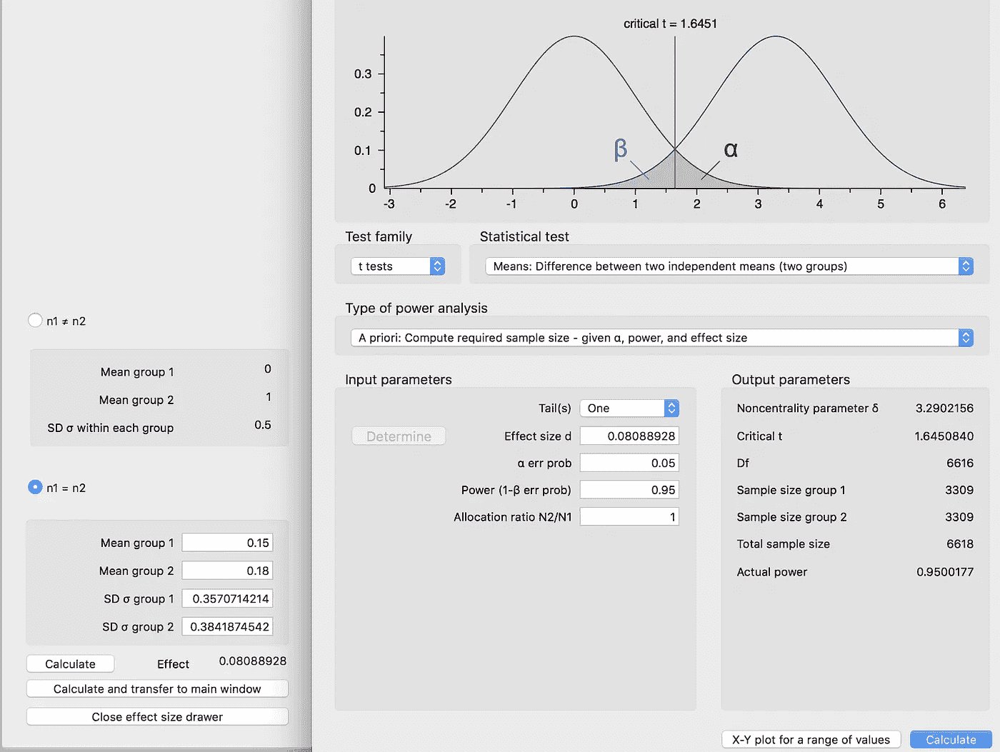

# 规划 A/B 测试的逐步过程

> 原文：<https://towardsdatascience.com/step-by-step-for-planning-an-a-b-test-ef3c93143c0b?source=collection_archive---------28----------------------->

## 起草 A/B 测试的初学者终极指南

## 介绍

继我之前的 [**帖子**](https://medium.com/@chonghankhai/the-importance-of-experiments-15b088d52312) 关于通过实验发展科学文化的重要性之后，我将解释如何恰当地计划一个实验。我希望这篇博文可以作为那些不确定该做什么的人的起点。

为了避免这篇文章太长，我将只涉及计划过程，我将在以后的博客文章中涉及实验的其他方面。规划过程包括:

1.  设定假设
2.  获取度量的基线数字
3.  最小可检测效应
4.  功效分析(确定完成实验所需的样本量)
5.  估计实验的持续时间
6.  与利益相关者讨论

我将只讨论使用频率主义方法的最简单和最常见的实验形式(即 A/B 测试，也称为双变量测试),这对大多数人或组织来说已经足够了。

## 第一步:从假设开始

就像我们在学校被认为的那样，一个实验从一个假设开始。你可能有多个假设想要测试，但总是有一个主要的。这里我举两个例子:

1.  你在一家电子商务公司工作，你认为在结账时显示折扣金额可以提高结账率。
2.  您不再需要提供电话号码和地址来注册会员。你认为这会提高转化率。

我个人认为将这些陈述转换成更多的统计形式是很有用的，因为这些陈述更清晰，并且减少了在衡量具体指标时出错的机会。例如，在第一种情况下，我会写:

> ***【检出率(单尾)***
> *【h₀:】对照组和治疗组的检出率没有差异。* 治疗组的 H₁:检出率比对照组的检出率高**。**
> 
> ***我们希望拒绝零假设，并得出结论:治疗组的检出率在统计学上显著高于对照组。(斜体格式)***

**在大多数情况下，会有一些您想要测量的次要指标，您也可以用相同的格式来写它们。虽然总是想要衡量改善是很常见的，但是你也应该总是**考虑你的治疗可能带来的不利影响**。例如，在第二种情况下，我还会考虑将付费会员转化为次要指标，我可能会假设新的注册过程对一些人来说可能显得不安全，并阻止他们成为付费会员。然后，我会将我的二级指标写成:**

> *****【付费会员转化率(双尾)***
> 【h₀:】对照组和治疗组的付费会员转化率没有差异。 *H₁:对照组和治疗组的付费会员转换率存在差异。***
> 
> ***我们希望不会拒绝零假设，并得出治疗组和对照组的*付费会员转换率*之间不存在统计学显著差异的结论。***

**因此，实验不应该被认为是一种测量治疗是否带来改善的方法，它也可以用来测量治疗是否造成伤害。**

## **步骤 2:获得当前度量的基线**

**这是很重要的，因为它将是我们所需样本量计算的一部分。其次，它帮助我们了解当前的数字。**

## **第三步:对你来说什么是有意义的效果尺寸？**

**给定足够的样本量，我们通常能够找到两组之间有统计学意义的差异，即使只有非常微小的差异。这是因为我们估计的置信区间随着样本量的增加而减小。下图显示了在不同样本量下，一个均值为 0.1 的分布和另一个均值为 0.15 的分布。这很直观，因为随着样本量的增加，我们对均值的估计更有信心，这也是分布变窄的原因。这也意味着，如果您想要有把握地检测两个群体之间的微小差异，对样本量的要求会增加。**

****

**说明分布如何随着样本量的增加而变窄。**

**因此，决定什么样的改变被认为是有意义的，足以让你采取行动，这是非常重要的。例如，如果您发现通过在结账页面显示折扣金额，结账率在统计上显著提高了 0.05%(从 15.3%到 15.35%)。你真的应该实施改变吗？这也就是通常所说的最小可检测效应(MDE ),我将在以后的文章中详细介绍。**

**决定一个有意义的效果大小并致力于此，可以防止你在实验后偏离最初的计划。如果 1%的变化是一个足够好的信号，可以向所有人推广这种疗法，那么要确保只有当效果超过 1%时你才会这么做。**

**尽管理论上人们不应该这样做，但是由于样本大小的要求会随着 MDE 的变化而变化，我发现在考虑 MDE 时，考虑我的实验中可以得到的估计样本大小是很有用的。如果我不希望在我的实验中有太多的样本，我就不能把我的 MDE 设置得太小。**

## **步骤 4:执行功率分析**

**这可能是其他文章中讨论最少的部分。设置目标显著性值、目标统计功效和分配比率(通常为 1)，并计算在特定分配比率下，在目标显著性值和统计功效下检测所需 MDE 所需的样本量。**

> ***目标显著性值，𝛂:当零假设正确时，我们拒绝零假设的概率为𝛂 %,常见值为 0.01、0.05 和 0.1，取决于犯此类错误的成本，成本越高，您的𝛂应该越低。
> 
> 目标统计功效，1-𝜷:当 MDE 有实际的显著变化时，我们有%的 1-𝜷机会未能剔除空值，常见值为 0.8，0.85，0.9 和 0.95，0.99。这取决于当有实际变化时错过这种变化的代价有多大，代价越高，你的𝜷应该越低，因此目标统计功效越高。***
> 
> ***分配比率:治疗组与对照组的比率，在给定固定样本量的情况下，通常设定为 1 表示最高统计功效。***

**设置好这些实验参数后，我会拿出这个表，里面包含了一个实验计划的精华。**

```
+----------------------------+---------------+
| Metric                     | Checkout Rate |
| Estimated Baseline Value   | 0.15          |
| Target Value (Effect Size) | 0.18 (0.081)  |
| Target Significance Value  | 0.05          |
| Target Statistical Power   | 0.95          |
| Allocation Ratio (N2 / N1) | 1             |
| Number of groups           | 2             |
| Total Sample Size Required | 6618          |
+----------------------------+---------------+
```

**以下是计算所需样本量的 3 种方法:**

*   ****Python****

```
import math
from statsmodels.stats.power import TTestIndPoweralpha = 0.05
p = 0.15
p2 = 0.18
var_base = p * (1 - p)
var_target = p2 * (1 - p2)
cohen_d = (abs(p2 - p) / math.sqrt((var_base + var_target) / 2))analysis = TTestIndPower()
analysis.solve_power(effect_size=cohen_d, power=0.95, nobs1=None, ratio=1.0, alpha=alpha, alternative='larger')# Output 3308.6546478905598
```

*   ****R****

```
library(pwr)alpha = 0.05
p = 0.15
p2 = 0.18
var_base = p * (1 - p)
var_target = p2 * (1 - p2)
cohen_d = (abs(p2 - p) / sqrt((var_base + var_target) / 2))
pwr.t.test(d = cohen_d, sig.level = alpha, power = 0.95, type = "two.sample", alternative = 'greater')# Output
Two-sample t test power calculation 

              n = 3308.654
              d = 0.08088928
      sig.level = 0.05
          power = 0.95
    alternative = greater

NOTE: n is number in *each* group
```

*   **[**G*Power 软件**](https://www.psychologie.hhu.de/arbeitsgruppen/allgemeine-psychologie-und-arbeitspsychologie/gpower.html)**

****

**G*Power 软件截图**

**在决定所需的样本量时，我经常给误差留有余地，因为在实验过程中有很多事情可能出错。当这些错误发生时，您可能需要移除一些实验样品，以防止它们影响您的结果。例如，可能有另一个营销活动引入了有利于对照组的偏见。**

**如果您在实验过程中意识到这些事件，这是很好的，然后您可以从您的实验样本中排除这些事件，这样您的实验仍然会运行，直到它达到目标样本大小。但我经常发现，直到实验结束后，才意识到所有这些运动的部分是不可能的。然后你会意识到，在排除这些无用的样本后，你没有足够的样本量来结束这个实验。多给多少空间将取决于你对正确执行实验的信心。**

## **步骤 5:估计实验的持续时间**

**给定所需的样本量，估计在给定流量或容量的情况下，需要多长时间才能达到目标样本量。根据经验，通常会有一些季节性影响，如一周中的某一天或一天中的某个小时。例如，根据这些季节性因素，你的实验对象对治疗的反应可能不同。因此，如果你认为你可以在几天内达到你的样本量，我会建议在大多数情况下扩展到一周甚至两周，以获得更稳健的结果。**

**如果需要几个月才能达到目标样本量，那么您可能需要增加 MDE 来减少所需的样本量。这样做的好处是你可以节省时间，但坏处是你的治疗必须有足够大的影响，让你自信地拒绝你的无效假设。**

## **第六步:与利益相关者讨论**

**与你的工程师讨论如何进行实验。常见问题包括:**

1.  **要记录哪些额外事件？**
2.  **如何给用户分配治疗？**
3.  **如何将这些事件传输到您的数据仓库中进行实验监控？**
4.  **实验过程中会出现什么问题，你有什么后备计划？**

## **结论**

**在这篇博文中，我描述了如何设计一个简单的双变量实验的一步一步的过程。我希望这篇博文能帮助你开始在你的团队中计划一些实验。但是，我没有涉及更多的方面，我希望将来能涉及这些方面，例如:**

1.  **实验过程中需要监控的常见事项**
2.  **实验中常见的陷阱**
3.  **超过 2 个实验变量**
4.  **全因子实验设计**
5.  **实验的常用统计检验**

**最后但同样重要的是，适当地计划你的实验以减少在实验过程中出错的机会，或者更糟的是，以错误的结果结束实验，这是极其重要的。开始时计划好这些可能很费时间，但是你练习得越多，最终会越快。**