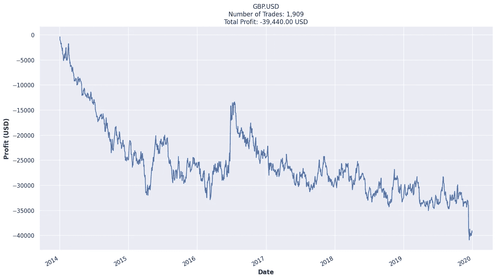

# 如何挽救亏损的交易策略？(第一部分)

> 原文：<https://towardsdatascience.com/step-by-step-forex-trading-strategy-optimisation-part-1-b1516753b42e?source=collection_archive---------22----------------------->

## 一步一步的教程来拯救一个看似有希望的交易策略


戴维·冯迪马尔在 [Unsplash](https://unsplash.com?utm_source=medium&utm_medium=referral) 上拍摄的照片

***来自《走向数据科学》编辑的提示:*** *虽然我们允许独立作者根据我们的* [*规则和指导方针*](/questions-96667b06af5) *发表文章，但我们并不认可每个作者的贡献。你不应该在没有寻求专业建议的情况下依赖一个作者的作品。详见我们的* [*读者术语*](/readers-terms-b5d780a700a4) *。*

这些天网上外汇交易大师的数量之多，让我无法在 YouTube 上推荐。获得兰博基尼金像奖有那么容易吗？在这篇博客中，我将讲述我是如何优化一个很好的老式均线交叉策略的，这个策略在我的案例中肯定是行不通的，并试图使它成为一个有利可图的策略。在开始优化我们的策略之前，我们将从创建我们的交易系统开始，获取我们需要的数据，定义我们的进场逻辑，评估表现。事不宜迟，让我们一头扎进去；当然，在我注意到之前，我的蓝宝已经在去我车库的路上了(除了我甚至没有车库)


来源: [9GAG](https://9gag.com/gag/aExGAnx)

免责声明:我目前没有用这个策略交易，这个博客也不是一个财务建议。请自担风险使用。

# 系统交易

交易系统，一个听起来非常花哨和复杂的词，实际上只不过是一套精确的规则，可以自动定义进场和出场逻辑，所有这些都不需要任何人为的努力。由于规则集的精确本质，系统测试可以用历史数据集进行可靠的测试，*也称为回溯测试*。通过观察统计上有代表性的和重复的过去的行为，我们就能够估计系统交易策略盈利的信心水平。

交易系统通常由几个部分组成:

1.  **数据连接:**数据为王。没有数据，我们就无法制定和评估战略。我们最多只能猜测。根据你的交易策略，你也许可以使用每日数据，这些数据可以从 https://www.investing.com/的[网站免费获得。如果你正在做日内交易，就像我打算在这个系列的博客中做的那样，你肯定需要更精细的数据。为此，您需要从 OANDA、Interactive Brokers 等经纪人那里获取数据。](https://www.investing.com/)
2.  **特征工程:**众所周知，金融时间序列是异方差的(基础数据方差变化的统计说法)。因此，价格时间序列本身无法提供稳健的进入和退出逻辑。特征工程是为以后定义进入和退出逻辑而生成附加特征的过程。这些特征的例子可以是移动平均线、指数移动平均线等。
3.  **进入信号&条件:**信号和条件非常相似，但概念不同。以 MACD 交叉为例，每当线交叉，这将是一个进入信号。然而，只有在所有条件都满足的情况下才会开仓，也就是说，价格需要高于 200 周期移动平均线才能确认趋势。
4.  **出舱信号&条件:**如果出舱为我们登陆月球创造了机会，出舱则确保我们的飞船足够稳定，能够持续整个旅程。好吧，也许这不是一个好的比喻，但好的退出逻辑可以救我们的小命。当趋势失去动力时，它锁定利润；在任何亏损的交易让我们损失惨重之前，它减少了我们的损失。说到退出逻辑，一般有四个不同的概念:(1)止损，(2)跟踪止损，(3)止盈，(4)进场时间。

# 数据采集


理论上，交易系统可以在任何市场或具有内在货币价值的流动商品上发展。在这篇博文中，我们将使用 GBP。美元作为我们的基础资产。我们从 OANDA v20 API 获取了从 2014 年 1 月到 2020 年 9 月大约 6 年的 30 分钟分笔成交点数据。这个过程实际上很简单:(1)在 OANDA 创建一个练习帐户，(2)在这里生成一个访问令牌(当然要安全地存储它)，以及(3)按照 Vladimir 这里的指示操作。或者，您也可以从 backtrader 获取数据，我将在另一篇博客文章中介绍这一点。


我们从 OANDA 下载的数据集的收盘价

# 初始交易策略

既然我们已经对数据进行了分类，是时候制定我们的策略了。这次我们要用均线交叉。但是为了增加趣味，我们将使用三角移动平均线(TMA ),而不是简单的移动平均线(SMA)。众所周知，SMA 非常容易受到异常值的影响。另一方面，TMA 是更平滑的趋势线。虽然平滑的移动平均线会增加价格运动和信号之间的滞后，但它也最小化了假突破的风险，因为趋势会在进场信号到来之前得到更好的确认。那么，我们如何计算这个 TMA 呢？一个 n 周期 TMA 其实只是过去 n 个 n 周期 SMA 的平均值。听起来像是绕口令，但让我加入一些数学公式来描绘这幅图:


n 周期简单移动平均线


n 周期三角形移动平均线

换句话说，TMA 和 SMA 之间有几个关键区别:

1.  TMA 是平均值的平均值；而 SMA 是平均值；
2.  TMA 对价格变化的反应比 SMA 慢；
3.  TMA 有时可以让你在一个趋势中停留更长时间，产生更大的利润；另一方面也是如此。

让我们为我们的 30 分钟数据集创建两个 TMA 序列，周期分别为 3 和 30。现在，我们可以随机选择周期，并逐步优化它们，直到我们达到最优。

```
df['fast_tma'] = df['Close'].rolling(3).mean().rolling(3).mean()
df['slow_tma'] = df['Close'].rolling(30).mean().rolling(30).mean()
```


英镑的收盘价。2014 年 1 月 5 日至 2014 年 1 月 10 日的美元，含 3 期 TMA 和 30 期 TMA

我们从简单的交易逻辑开始，慢慢增加复杂性，这通常是个好主意。通过这种方式，我们可以在调整交易策略之前更好地理解交易策略的行为和潜力。首先，让我们只定义进场信号，并在相反的信号产生时退出:

*   多头进场:当(1)快速 TMA 已经穿过慢速 TMA 上方，并且(2)当前价格位于交叉杆的高点时，1 手的未平仓头寸
*   短线进场:当(1)快速 TMA 已经穿过慢速 TMA 下方，并且(2)当前价格处于交叉杆的低点时，开仓 1 手


第一个信号的假突破；价格跌破交叉杆低点后的短线进场

不在交叉点处进场的直觉是测试趋势，让回撤更接近较慢的 TMA 系列，潜在地筛选假突破，只和长期趋势交易。如上图所示，2014 年 1 月 3 日上午有一个多头设置，但由于达到了多头进场价格，该设置从未被触发。假突破后很快出现下跌趋势，当价格跌破交叉杆的低价时，就会触发空头设置。

# 评估和滑动

有了初步的策略，让我们来看看性能。我们将使用 2014 年 1 月 1 日至 2019 年 12 月 31 日的数据进行评估(即样本内数据)，并在我们完成战略优化后，将 2020 年的精彩数据用于未来分析(样本外数据)。重要的是，我们从我们的回溯测试中保留一个前进集，以避免过度拟合，并增强我们最终策略的健壮性。相反，如果我们拥有样本数据集中的所有数据，我们就可以针对整个数据集中的每个趋势变化优化我们的时间策略。虽然这可以提供惊人的评估结果，但这绝不是现实的，因为精确的模式不会重复。这种在未来未知数据中策略表现的显著恶化被称为过度拟合。


我们对样本内和样本外数据集的划分

如果我们将初始交易策略应用于样本内数据集，假设我们交易 1 手英镑。每输入一个美元(即 100，000 单位的货币)，我们将得到以下数字:


6 年内利润超过 17，000 美元。我们已经在去月球的路上了吗？


振作起来，我们要在水下潜水 900 天。我们能屏住呼吸那么久吗？


甜蜜黑暗主题中我们战略的关键人物

乍一看，这种交易策略似乎已经相当可行了。然而，如果我们更多地关注水下图表，它显示了我们距离峰值股本的百分比有多低，我们可以注意到该策略有一个相对较长的复苏周期，最长的一个周期跨越 2.5 年。想象一下，处于负面情绪中，两年多都没有恢复，这听起来肯定不像是最有趣的过山车。如果我们接着研究表格中的一些交易数据，似乎会对我们的诊断有更多的见解:

1.  **利润百分比&平均值。成功交易中的棒线**:盈利百分比计算为所有盈利交易的百分比，而平均值。成功交易中的棒线是根据我们的成功头寸在市场中的 30 分钟棒线的平均数计算的。由于平均获利棒线几乎是相反棒线的 4 倍，我们可以说这个策略在长期趋势中运作良好。这也解释了为什么长期趋势之间的周期波动更大，因此对于我们的趋势跟踪策略来说，这也解释了为什么成功率相对较低。话虽如此，如果我们的风险管理做得好，低胜率仍然是合理的。
2.  **利润系数**:计算为毛利润对毛亏损的绝对值。所以，越高越好；与此同时，利润系数低于 1 是一个大禁忌。正如我们在表中看到的，当进入多头头寸时，我们的策略相当糟糕。公平地说，可怜的英镑正在贬值，所以趋势对我们不利。但是，这仍然暗示了我们可以将外部进入信号收紧一点，以避免误报。
3.  **比率平均值。赢:平均。损耗**:以 Avg 的绝对值计算。在平均值上赢得交易。成功交易，可以作为我们回报风险比的代表。能够以超过 2 的比率盈利并不太坏，因为这意味着我们可以承受每赢一笔交易就输两笔交易。鉴于我们甚至没有优化任何止损或获利策略，这个数字预计会增加。

现在我们有了初步的诊断，是时候加入一些现实的东西了，也就是佣金和滑点。这些基本上分别是，经纪的零花钱和网络延迟的补偿。如果我们总共支付 3 点的费用(0.5 的佣金和 2.5 的滑点)，那么之前 50 美元的利润交易将变成仅仅 20 美元的利润，但是，嘿，20 美元就是 20 美元！玩笑归玩笑，让我们来看看我们更真实的权益曲线、水下图表和其他汇总统计数据。



残酷的现实打在我们的脸上。


哎唷…用这种策略，我们永远不会在真正的市场中获利…


老实说，这些数字看起来很可怕。但是，不要对自己(自己)太苛刻，如果市场这么好打，巴菲特就不会是这样的传奇。另外，我们只选择了两个任意的输入参数，没有止损，也没有获利。

# 步骤 1:优化输入参数

为了挽救我们糟糕的策略，我们必须首先为 TMAs 找到一组更可行的参数。在下图中，我们使用快速 TMA 周期和慢速 TMA 周期的不同组合重新运行了回溯测试。如果我们的快速 TMA 周期为 1，慢速 TMA 周期超过 50，看起来这个策略实际上是有利可图的。


不同 TMA 参数组合的性能

确定了最佳参数的大致区域后，让我们进行更精细的网格搜索。从下图可以看出，当快速 TMA 的周期为 1，慢速 TMA 的周期为 62 时，该策略表现最佳。但是请注意，样本内数据的最佳性能并不意味着样本外数据的最佳性能。当谈到优化策略时，最好有一个更稳定的策略，而不是一个对样本数据来说可能过拟合的策略。经验丰富交易系统开发人员默里·鲁杰罗曾经说过:

> 如果你不喜欢相邻的数字，你就有问题了，因为很可能你会得到相邻的一组参数的结果。

因此，我们不选择慢 TMA 周期为 62，而是选择 65，其中相邻参数具有相似的利润。


跳过高峰，走向稳定的高原

参数排序后，即使考虑了 3 个点的滑点和费用，我们的策略仍然盈利，如下图所示:


现在，我们又在谈论绿色了


哦，不太好，超过 3 年的下降


从红色到绿色，这是一个非常大的进步。看看这些数字，我们可以看到，通过增加慢速 TMA 的周期数，赢仓的平均棒线数增加了 50%以上，这与拥有更慢的慢速 TMA 来捕捉更长趋势的直觉相符。我们还可以看到，我们的风险回报比从 2.11 增加到了 3.88。另一个亮点是我们的最大提取比例将从 40%降至约 14%。然而，我们的策略仍远未达到可交易的水平，其最长提款期为 1167 天。

# 第二步:优化进入时间

由于外汇市场昼夜不停地运转，在一天的不同时间有不同的参与者，从 APAC 到欧洲，然后到美洲，再回到 APAC。这就带来了一个问题，什么时候进入英镑是最好的？美元市场。众所周知，这一对的大部分货量来自欧洲和美洲。如果我们能为进场信号找到一个最佳的时间滤波器，我们也许能驾驭这些大交易量驱动的趋势。让我们看看，如果我们对进场信号应用 4 小时窗口滤波器，我们的策略表现如何。(例如，09:30 意味着仅允许从 09:30 到 13:30 的进入信号)


再说一遍，让我们跳过高峰，走向稳定的高原

同样，尽管从 05:00 GMT 到 09:00 GMT 的进入信号为我们提供了样本内数据的最佳性能，但我们宁愿选择更稳定的选择。在这种情况下，我们的选择将是 13:00–17:00，相邻参数显示类似的利润。


PNL 变得更加稳定


我们仍然需要在超过 2.5 年的时间里削减开支


通过将条目限制在 13:00 GMT 到 17:00 GMT，我们已经将最大提款百分比降低到大约 10%，提款期减少到大约 980 天。仔细观察这些数字，我们可以看到进场限制正在帮助我们做多，平均净利润从每手-8 美元增加到每手+22 美元，同时损害了短期表现。这可能意味着我们需要开发另一种策略来优化短期性能。

# 结论(迄今为止)

在这篇博客中，我们已经讲述了如何开发一个简单的 TMA 交叉交易策略，这个策略在理论上看起来是有利可图的，直到我们把 3 点的佣金和滑点计算在内。通过优化 TMA 参数和进场时间窗口，我们挽救了这个看起来很糟糕的策略，并使其再次盈利。以下是一些高水平的结果:


通过优化我们看似无望的战略，我们成功做到了:

1.  提高我们战略的利润系数，
2.  提高我们的回报风险比，
3.  提高策略进入长期趋势的能力
4.  降低最大提取百分比，以及
5.  缩短最大提款期

也就是说，这一战略还远未准备好部署。我们仍有超过 2.5 年的缩减期，6 年的总利润为 18.57%，因此我们仍有很大的改进空间。在本系列的后续部分中，我们将继续在以下几个方面改进这一策略:

1.  带止损和跟踪止损逻辑的风险管理
2.  基于获利逻辑的风险管理
3.  蒙特卡罗法分析
4.  向前分析
5.  更多

[](https://medium.com/datadriveninvestor/how-to-save-a-losing-trading-strategy-part-2-8d4f713068eb) [## 如何挽救亏损的交易策略(第二部分)

### 通过风险管理改进交易策略的逐步指南

medium.com](https://medium.com/datadriveninvestor/how-to-save-a-losing-trading-strategy-part-2-8d4f713068eb) 

# 放弃

本报告中表达的想法和观点仅代表我个人，不一定代表我公司的观点。本报告旨在提供教育，不应被理解为个人投资建议，也不应被理解为购买、出售或持有任何证券或采取任何投资策略的建议。

*参考文献*

柯林斯(2004 年)。[](https://amzn.to/35EDncj)*。瓦森多夫联合公司。*

*Tomasini，e .，& Jaekle，U. (2019 年)。交易系统第二版:系统开发和投资组合优化的新方法。)。哈里曼之家。*

# *在你走之前…*

*感谢你加入我的第一个媒体博客。让我知道你在评论中的想法，以及这篇文章如何改进。如果你能通过 embed affiliate 链接获得书籍以支持该系列，我们将非常感激。暂时，保持坚强，继续相信我们的蓝宝就在眼前；我们将在博客的下一部分继续这个旅程。*

*再见！*