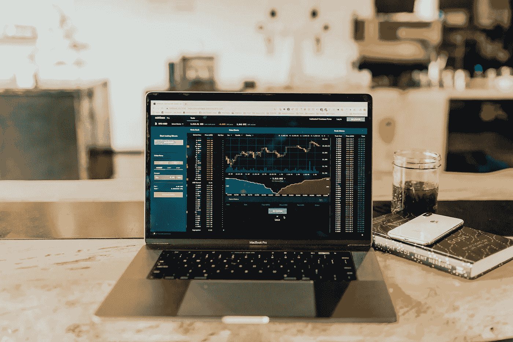
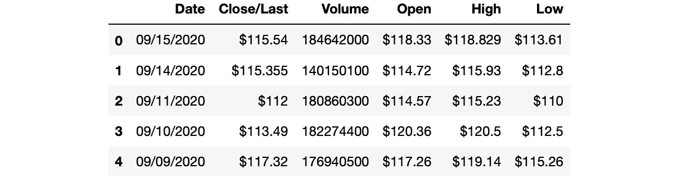
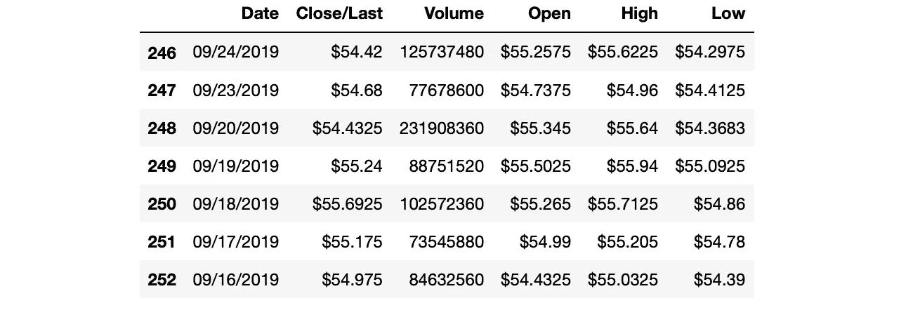
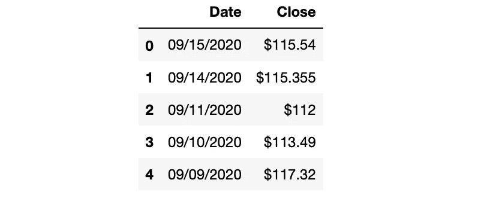
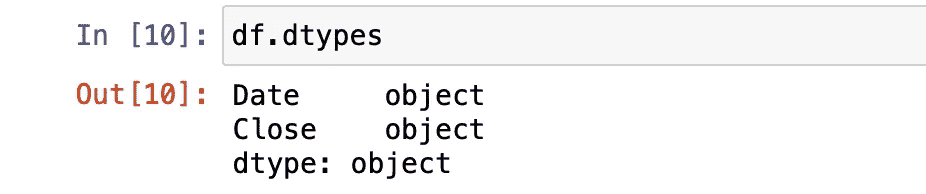
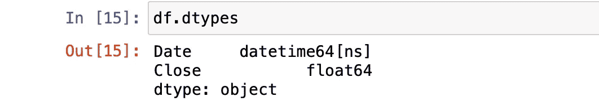
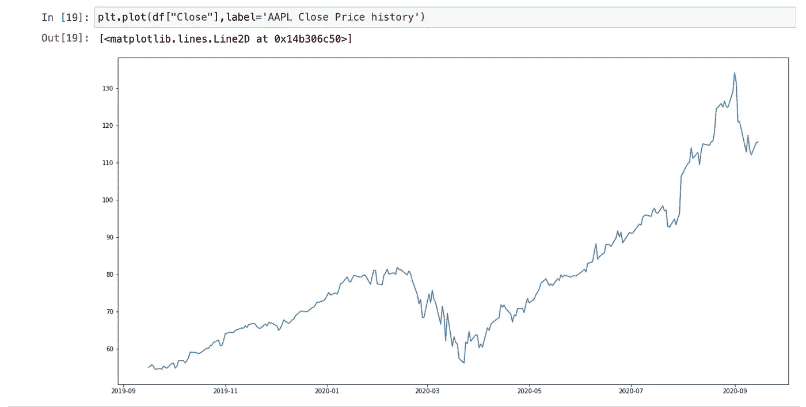
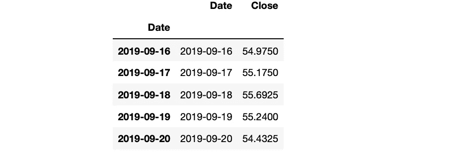
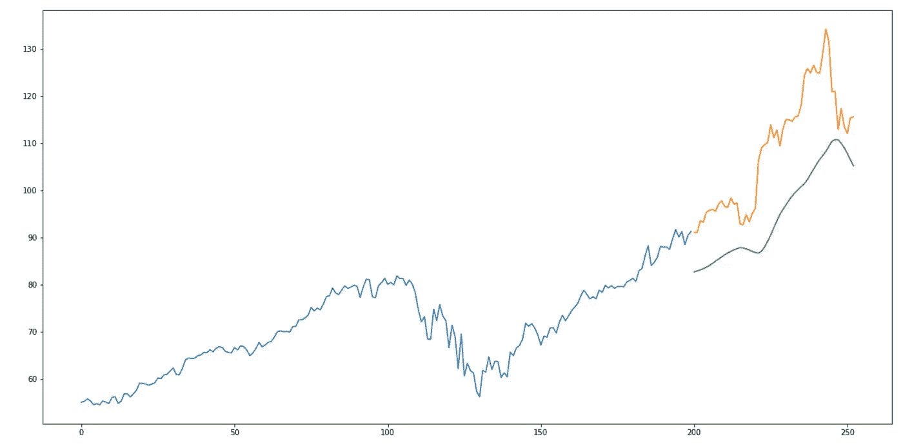

# 分步指南-用 Python 构建预测模型

> 原文：<https://towardsdatascience.com/step-by-step-guide-building-a-prediction-model-in-python-ac441e8b9e8b?source=collection_archive---------1----------------------->

## 使用长短期记忆预测模型的动手练习



在 [Unsplash](https://unsplash.com/s/photos/stock?utm_source=unsplash&utm_medium=referral&utm_content=creditCopyText) 上由 [Austin Distel](https://unsplash.com/@austindistel?utm_source=unsplash&utm_medium=referral&utm_content=creditCopyText) 拍摄的照片

> **来自《走向数据科学》编辑的提示:**虽然我们允许独立作者根据我们的[规则和指导方针](/questions-96667b06af5)发表文章，但我们并不认可每个作者的贡献。你不应该在没有寻求专业建议的情况下依赖一个作者的作品。详见我们的[读者术语](/readers-terms-b5d780a700a4)。

在这篇文章中，我将向你展示如何构建一个可以预测特定股票价格的程序。这是一个在金融领域使用机器学习的伟大工程。如果我们想要一台机器为我们做预测，我们肯定应该用一些数据好好训练它。首先，对于刚接触 python 的人，我将向您介绍一下。然后，我们将开始研究我们的预测模型。正如副标题中提到的，我们将使用苹果股票数据。如果你想知道是否可以免费获得这些数据，答案是肯定的。股票数据可以在纳斯达克官方网站上找到。纳斯达克(全美证券交易商自动报价协会)是一个电子股票交易所，拥有 3300 多家上市公司。

苹果股票数据可以从[这里](https://www.nasdaq.com/market-activity/stocks/aapl/historical)下载。在这个网站上，你还可以找到不同公司的股票数据，并使用不同的数据集练习你的技能。我迫不及待地想看到我们的预测准确性结果，让我们开始吧！

## 目录:

*   ***Python***
*   ***图书馆***
*   ***了解苹果股票数据***
*   ***数据操作***
*   ***数据可视化***
*   ***LSTM 预测模型***

# 计算机编程语言

Python 是一种通用编程语言，在分析数据方面越来越受欢迎。Python 还能让您快速工作，更有效地集成系统。世界各地的公司都在利用 Python 从他们的数据中收集知识。Python 官方页面如果你想[了解更多](https://www.python.org/about/)。

[](/python-for-finance-the-complete-beginners-guide-764276d74cef) [## 面向金融的 Python 完全初学者指南

### 使用亚马逊股票数据的简单实践

towardsdatascience.com](/python-for-finance-the-complete-beginners-guide-764276d74cef) 

# 图书馆

首先，我们必须安装一些库，这样我们的程序才能工作。下面是我们将要安装的库的列表:pandas、numpy、keras 和 tensorflow。必须安装 Tensorflow，keras 才能工作。

> Keras 是为人类设计的 API，不是为机器设计的。Keras 遵循减少认知负荷的最佳实践:它提供一致而简单的 API，最大限度地减少常见用例所需的用户操作数量，并提供清晰可操作的错误消息。它还有大量的文档和开发人员指南。
> 
> 参考: [https://keras.io](https://keras.io)

我们可以使用 Pip 库管理器安装这些库:

```
pip install pandas numpy keras tensorflow
```

安装完成后，让我们将它们导入到代码编辑器中。Python 中已经包含了 Matplotlib，这就是为什么我们不用安装就可以导入它。

```
import pandas as pd
import numpy as npimport matplotlib.pyplot as plt
%matplotlib inline
from matplotlib.pylab import rcParams
rcParams['figure.figsize']=20,10from keras.models import Sequential
from keras.layers import LSTM,Dropout,Densefrom sklearn.preprocessing import MinMaxScaler
```

# 了解苹果股票数据

其次，我们将开始将数据加载到一个数据帧中，在我们开始操作它之前查看它是一个好的做法。这有助于我们理解我们有正确的数据，并获得一些关于它的见解。

如前所述，在本练习中，我们将使用 Apple 的历史数据。我认为苹果会是一个很好的搭配。和我一起完成这个项目后，你会学到一些技巧，让你有能力使用不同的数据集来练习。

我们将使用的数据框架包含过去一年(2019 年 9 月 16 日-2020 年 9 月 15 日)苹果股票的收盘价。

## 读出数据

```
import pandas as pddf = pd.read_csv('aapl_stock_1yr.csv')
```

## 头部方法

为了对数据有所了解，我们要做的第一件事是使用 head 方法。当您在 dataframe 上调用 head 方法时，它会显示 dataframe 的前五行。运行这个方法后，我们还可以看到我们的数据是按日期索引排序的。

```
df.head()
```



作者图片

## 尾部法

另一个有用的方法我们称之为尾部方法。它显示数据帧的最后五行。假设您想查看最后七行，您可以在括号之间输入整数 7。

```
df.tail(7)
```



作者图片

现在我们对数据有了一个概念。让我们进入下一步，即数据操作，并为预测做好准备。

# 数据操作

## 子集化

正如您在前面的截图中看到的，我们的数据框架有 6 列。我们需要全部吗？当然不是。对于我们的预测项目，我们只需要“日期”和“结束/最后”列。那么让我们去掉其他的柱子吧。

```
df = df[['Date', 'Close']]df.head()
```



作者图片

## 数据类型

现在，让我们检查列的数据类型。因为收盘价值中有一个“$”符号，所以它可能不是 float 数据类型。当训练数据时，字符串数据类型不能用于我们的模型，所以我们必须将其转换为浮点或整数类型。



作者图片

在我们将它转换为 float 之前，让我们去掉“$”符号。否则，转换方法会给我们一个错误。

```
df = df.replace({'\$':''}, regex = True)
```

太好了！现在，我们可以将“收盘价”数据类型转换为 float。我们还将把“日期”数据转换成日期时间类型。

```
df = df.astype({"Close": float})df["Date"] = pd.to_datetime(df.Date, format="%m/%d/%Y")df.dtypes
```



作者图片

## 索引栏

这将是一小步。我们将数据帧的索引值定义为日期列。这将有助于数据可视化步骤。

```
df.index = df['Date']
```

# 数据可视化

我将与你分享一个简单的折线图，只是为了让你对过去一年的股价变化有一个概念。我们还将在最后使用可视化方法来比较我们的预测和现实。

```
plt.plot(df["Close"],label='Close Price history')
```



作者图片

# LSTM 预测模型

在这一步中，我们将完成大部分编程工作。首先，我们需要对数据做一些基本的调整。当我们的数据准备好了，我们将使用它来训练我们的模型。作为神经网络模型，我们将使用 LSTM(长短期记忆)模型。当基于时间序列数据集进行预测时，LSTM 模型非常有效。

## 数据准备

```
df = df.sort_index(ascending=True,axis=0)data = pd.DataFrame(index=range(0,len(df)),columns=['Date','Close'])for i in range(0,len(data)):
    data["Date"][i]=df['Date'][i]
    data["Close"][i]=df["Close"][i]data.head()
```



作者图片

## 最小-最大缩放器

```
scaler=MinMaxScaler(feature_range=(0,1))data.index=data.Date
data.drop(“Date”,axis=1,inplace=True)final_data = data.values
train_data=final_data[0:200,:]
valid_data=final_data[200:,:]scaler=MinMaxScaler(feature_range=(0,1))scaled_data=scaler.fit_transform(final_data)
x_train_data,y_train_data=[],[]
for i in range(60,len(train_data)):
    x_train_data.append(scaled_data[i-60:i,0])
    y_train_data.append(scaled_data[i,0])
```

## LSTM 模型

在这一步，我们定义了长短期记忆模型。

```
lstm_model=Sequential()
lstm_model.add(LSTM(units=50,return_sequences=True,input_shape=(np.shape(x_train_data)[1],1)))
lstm_model.add(LSTM(units=50))
lstm_model.add(Dense(1))model_data=data[len(data)-len(valid_data)-60:].values
model_data=model_data.reshape(-1,1)
model_data=scaler.transform(model_data)
```

## 训练和测试数据

该步骤包括列车数据和测试数据的准备。

```
lstm_model.compile(loss=’mean_squared_error’,optimizer=’adam’)
lstm_model.fit(x_train_data,y_train_data,epochs=1,batch_size=1,verbose=2)X_test=[]
for i in range(60,model_data.shape[0]):
    X_test.append(model_data[i-60:i,0])
X_test=np.array(X_test)
X_test=np.reshape(X_test,(X_test.shape[0],X_test.shape[1],1))
```

## 预测函数

在这一步中，我们使用在上一步中定义的测试数据来运行模型。

```
predicted_stock_price=lstm_model.predict(X_test)
predicted_stock_price=scaler.inverse_transform(predicted_stock_price)
```

## 预测结果

差不多了，让我们检查一下模型的准确性。我们有大约 250 行，所以我用 80%作为训练数据，20%作为测试数据。

```
train_data=data[:200]
valid_data=data[200:]
valid_data['Predictions']=predicted_stock_price
plt.plot(train_data["Close"])
plt.plot(valid_data[['Close',"Predictions"]])
```



准确性可视化(红色:实际，绿色:预测)[图片由作者提供]

[](https://lifexplorer.medium.com/subscribe) [## 每当贝希克居文出版时收到电子邮件。

### 每当贝希克居文出版时收到电子邮件。通过注册，您将创建一个中型帐户，如果您还没有…

lifexplorer.medium.com](https://lifexplorer.medium.com/subscribe) 

恭喜你。！您已经创建了一个 Python 程序来预测一家公司的股票收盘价。现在，你对如何在金融中使用机器学习有了一些想法，你应该在不同的股票上尝试一下。希望你喜欢读我的文章。从事像这样的动手编程项目是提高编码技能的最好方式。

我很高兴你今天学到了新东西。如果您在执行代码时有任何问题，请随时[联系我](https://sonsuzdesign.blog/)。😊

> 我是贝希克·居文，我喜欢分享关于编程、教育和生活的故事。[订阅](https://lifexplorer.medium.com/membership)我的内容，保持灵感。泰，