# AWS 弹性容器服务的逐步指南(附图片)

> 原文：<https://towardsdatascience.com/step-by-step-guide-of-aws-elastic-container-service-with-images-c258078130ce?source=collection_archive---------12----------------------->

## 部署您的容器并配置为访问 AWS 资源

在这篇文章中，我将展示使用 AWS ECS 部署 docker 容器的过程，并配置它来访问其他 AWS 资源。现在，让我们直接进入核心。

*先决条件:对 docker，AWS 的基本了解，你需要有一个具有管理员权限的 AWS 帐户。*

# 建造一个容器

如果您已经准备好要部署的容器，那么您可以跳过这一部分。如果没有，我写了一个最简单的 python 项目[这里是](https://github.com/MJeremy2017/ecs-example)，其中有 docker 容器最基本的结构:

```
ecs-example:
    |_ model
    |    |_ run.py
    |    |_ sample.txt
    |
    |_ docker-entrypoint.sh
    |_ Dockerfile
    |_ requirements.txt
```

主文件`run.py`驻留在`model`文件夹中，它所做的只是将`sample.txt`上传到`s3` (S3 是 AWS 存储数据的简单存储系统)

`docker-entrypoint.sh`定义了在容器开始时运行的命令

```
**#!/usr/bin/env bash** export PYTHONPATH=.

python3 model/run.py
```

所以当容器启动时，它会调用上面写的`run.py`并将指定的文件加载到 s3。

现在看看我们的`Dockerfile`

```
FROM python:3.7-slim

ENV *APP_DIR* /ecs-example

RUN mkdir -p ${*APP_DIR*}

WORKDIR ${*APP_DIR*}

ADD ./requirements.txt ${*APP_DIR*}
RUN pip install -r requirements.txt

COPY ./model ${*APP_DIR*}/model
COPY ./docker-entrypoint.sh ${*APP_DIR*}/docker-entrypoint.sh

ENTRYPOINT ${*APP_DIR*}/docker-entrypoint.sh
```

它做以下事情，

1.  设置工作目录
2.  安装所需的软件包
3.  将本地文件复制到 docker 容器中
4.  在容器的起点设置起点

现在我们的演示项目已经设置好了，让我们构建并标记我们的容器，并将它推送到您自己的 docker hub。

在项目根目录中，执行以下操作

```
docker build -t ecs-example .
(Optional) docker run ecs-example
```

标记并推送至私有回购

```
docker tag ecs-example {YOUR_REPO_ACCOUNT}/ecs-example:v1
docker push {YOUR_REPO_ACCOUNT}/ecs-example:v1
```

现在转到您的私有 docker 注册表，您应该会在您的回购中看到它，如下所示:

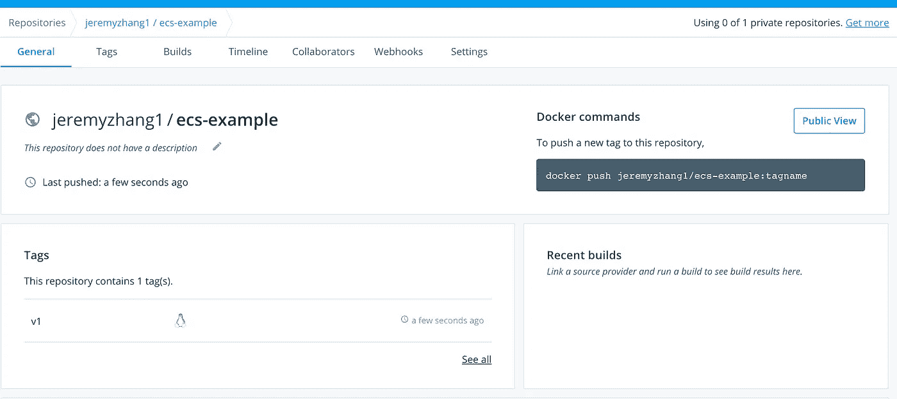

现在我们已经将项目装箱并发布了，让我们开始部署吧。

# 在 ECS 上部署

ECS 代表弹性集装箱服务。顾名思义，这是一项专门用于管理 docker 容器的服务，但其优势在于简化了容器部署的过程，并避免了来自用户的繁重工作。简而言之，这可能是在云上部署容器的最简单的方式，并且具有适当的标准。(有关更多信息，您可以在此处阅读文档

## ECS 概述

首先，去你的 AWS 控制台，搜索弹性容器服务或者仅仅是 ECS。

你开始的最快方法可能是点击首页的`Get Started`按钮，并遵循指导，但在这篇文章中，我们将手动构建每个组件，我相信这将使你对每个部分有更深的理解，而且对于我们的容器来说，访问 S3，它需要额外的配置，这是“开始”不允许的。

首先，我们来了解一下 ECS 中的组件，

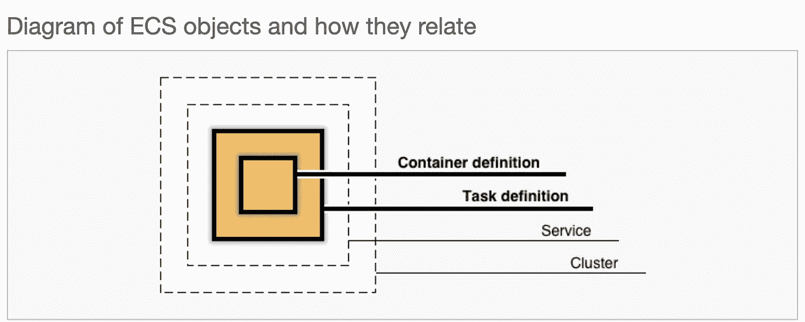

1.  **容器定义**:定义你的容器镜像、环境变量、存储挂载等等。
2.  **任务定义**:包装你的容器，是你部署的蓝图，为你的容器指定角色，如何拉取图像等等。
3.  **服务**:管理要部署多少容器实例，它应该驻留在哪个网络中等等。
4.  **集群**:包含 VPC、子网等。

## 创建一个集群

首先，让我们创建一个集群。选择边栏上的集群并选择`Create Cluster`，

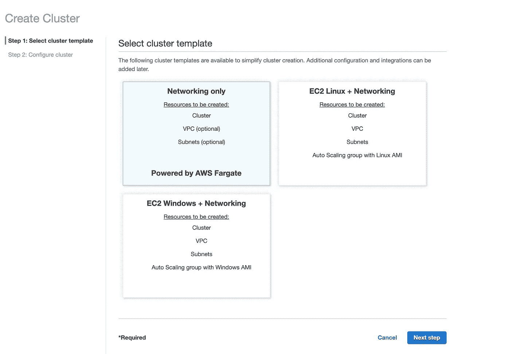

选择`Networking only`，并选择下一步。`Networking only`是为 Fargate taks 建造的。与 EC2 任务相反，

*Fargate 启动类型允许您运行您的容器化应用程序，而无需供应和管理后端基础架构。当您使用与 Fargate 兼容的任务定义运行任务时，Fargate 会为您启动容器。*

基本上，使用这种类型，AWS 可以为您处理大部分基础设施，因此您最不用担心。

下一步，输入您的**集群名称**(这里我使用 ecs-example-cluster)，选择**创建新的 VPC** (如果您没有的话)，然后**启用容器洞察**(这将提供 CloudWatch 监控和帮助调试)。

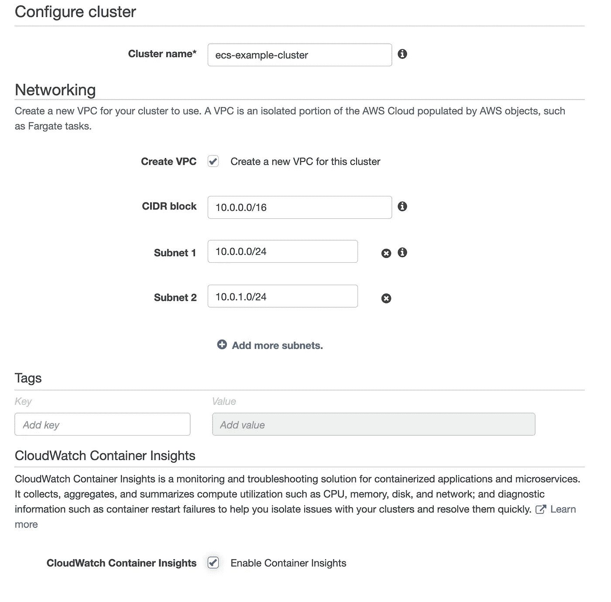

并点击**创建**。您的集群应该马上就准备好了。

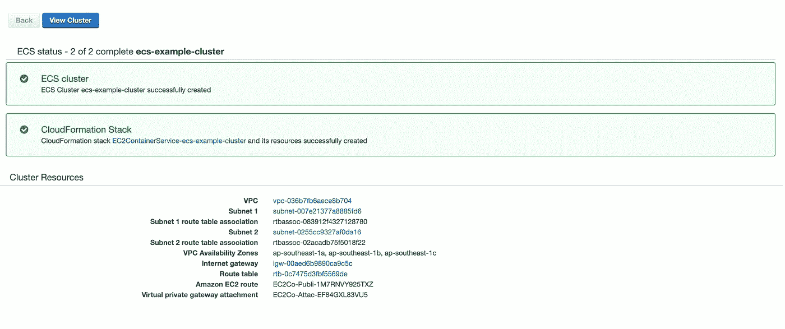

为您的集群设置了一组资源。现在让我们转到任务定义。

## 创建任务定义

现在让我们开始创建您的容器蓝图。在工具条上，选择**任务定义**并选择**创建新的任务定义**。

选择 **Fargate** (如果您希望 AWS 为您处理 infra)，它将引导您:


## **创建任务角色**

为您的任务定义命名。并为您的容器选择一个任务角色，但是等等，什么是任务角色？如输入中所解释的，

***任务角色*** *:可选的 IAM 角色，任务可以使用它向授权的 AWS 服务发出 API 请求。在 IAM 控制台中创建一个 Amazon 弹性容器服务任务角色*

记得我们的容器需要上传一个文件到 S3 吗？因此，要允许您的容器访问 s3，它需要一个角色来授权它这样做。(更多信息，请点击此处获取官方文档[)](https://docs.aws.amazon.com/AmazonECS/latest/userguide/task-iam-roles.html)

现在在一个新标签页中打开 AWS 控制台。

选择服务 **IAM** →选择**角色** → **创建角色**

对于**选择可信实体类型**部分，选择 **AWS 服务**。

对于**选择将使用这个角色**的服务，选择**弹性容器服务**。

对于**选择您的用例**，选择**弹性容器服务任务**并选择**下一步:权限**。

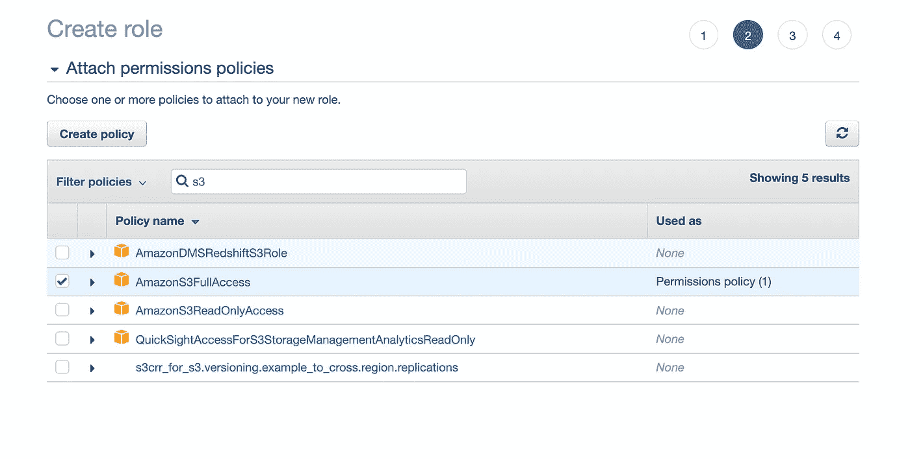

对于我们访问 s3 的服务，选择 **Amazons3FullAccess** (这不是授予 S3 对服务的完全访问权的最佳实践，您可能需要通过创建新的**策略**来将服务限制到某个桶)。

对于**添加标签(可选)**，输入您想要与 IAM 角色关联的任何元数据标签，然后选择**下一步:查看**。

对于**角色名称**，输入您的角色名称。对于本例，键入`ECSs3AccessTaskRole`来命名角色，然后选择**创建角色**来完成。

现在回到任务定义

将您刚刚创建的角色选择到任务角色中。

对于**任务执行 IAM 角色**，该角色有助于从 docker 寄存器中提取图像，因此如果您还没有该角色，我们首先需要创建它。角色创建过程与上面类似，您可以在这里按照步骤[操作](https://docs.aws.amazon.com/AmazonECS/latest/developerguide/task_execution_IAM_role.html#create-task-execution-role)。(这里创建的角色名称是`ecsTaskExecutionRole`！)

而对于**任务大小**，我们都选择最小，当然我们的任务简单，不需要太多资源。

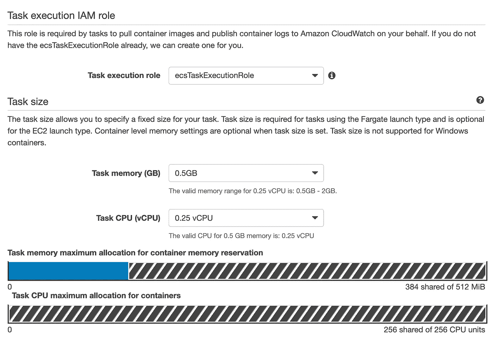

任务执行角色不同于我们刚刚创建的任务角色，如创建过程中所述:

***任务执行角色*** *:这个角色是任务需要的，代表你拉容器镜像，发布容器日志到 Amazon CloudWatch。*

***任务角色*** *:可选的 IAM 角色，任务可以使用它向授权的 AWS 服务发出 API 请求。在 IAM 控制台中创建一个 Amazon 弹性容器服务任务角色*

从堆栈溢出[到这里](https://stackoverflow.com/questions/48999472/difference-between-aws-elastic-container-services-ecs-executionrole-and-taskr)的一个很好的区别解释。

## 添加容器

现在最重要的是，让我们来看看容器的定义。输入以下内容:

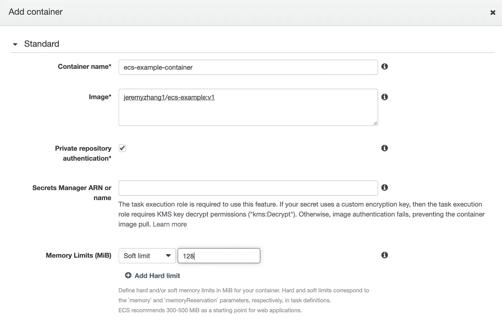

对于**图像*** ，输入您的私人图像注册表 url。勾选**私有存储库认证**，因为我们的映像驻留在 docker hub 上的私有回购中。为了让我们的服务访问我们的私人注册表，我们需要告诉代理我们的帐户和密码。AWS 上管理秘密的方式是使用**秘密管理器**。

## 创建秘密

再次转到 AWS 控制台→选择机密管理器→存储新机密→其他类型的机密

输入纯文本:

```
{
  "username": {YOUR_DOCKER_ACCOUNT},
  "password": {YOUR_DOCKER_PWD}
}
```

选择下一步，给你的秘密一个名字，其他的就用默认的。

创建后，你应该有这样的东西:

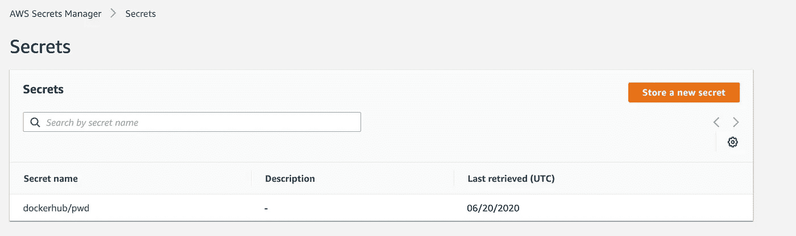

点击您的秘密，您可以检索您的秘密 ARN，并输入这个 ARN 到上面的容器定义！

虽然我们已经在容器中输入了我们的秘密，但是请记住，fargate 代理使用任务执行角色从您的私有注册表中提取图像，您可以这样理解这个过程:

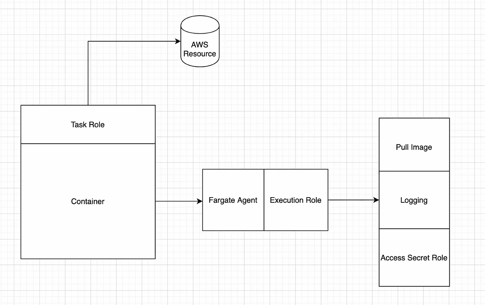

因此，下一步是将这个秘密添加到我们上面创建的执行角色中。

## 向任务执行角色添加机密

现在再次转到 IAM 下的执行角色，添加**内联策略**:

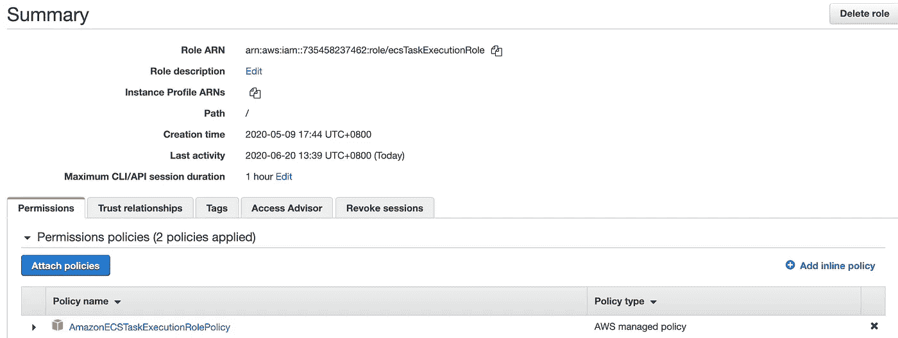

选择 Json 格式并输入、

```
{
    "Version": "2012-10-17",
    "Statement": [
        {
            "Effect": "Allow",
            "Action": [
                "secretsmanager:GetSecretValue"
            ],
            "Resource": [
               {YOUR_SECRET_ARN}
            ]
        }
    ]
}
```

我知道很累，但我们就要完成了！现在我们的任务定义完成了！回到我们的任务定义，保留其他为默认，并点击**创建**。

## 创建服务并部署任务定义

我们已经完成了最难的部分，现在我们需要的是创建最后一个组件——服务并部署我们的任务！

在侧面板上，单击集群

选择 ECS-示例-集群


在服务选项卡下，选择创建，并输入以下内容:

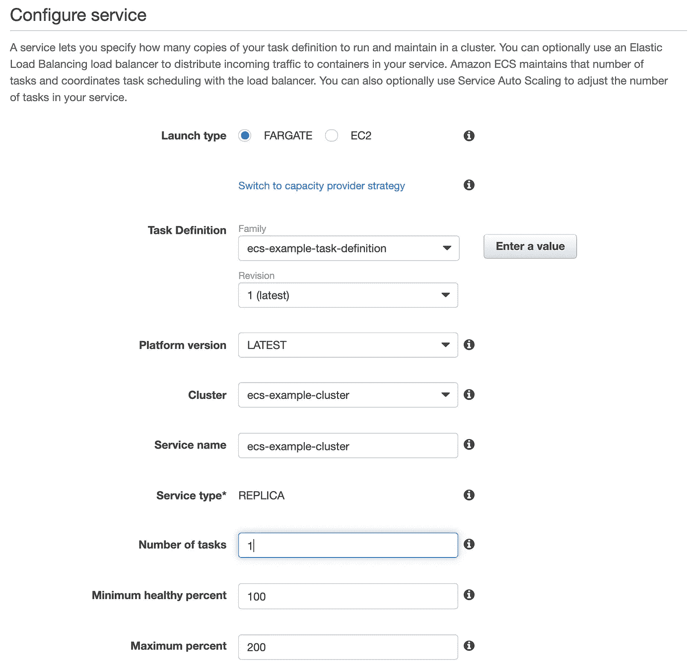

选择下一步，对于 VPC，只需选择我们在**创建集群会话中创建的 VPC 和子网，**其他保持默认，最后创建服务。

现在转到“service”选项卡，您应该会看到作业正在运行…

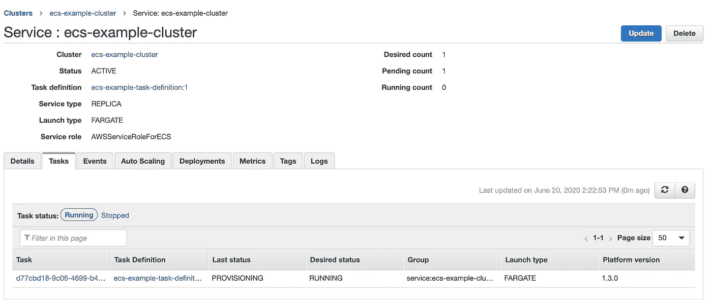

为了验证我们的工作，请转到 s3，您应该看到(前提条件是，您应该在此之前创建了您的存储桶):

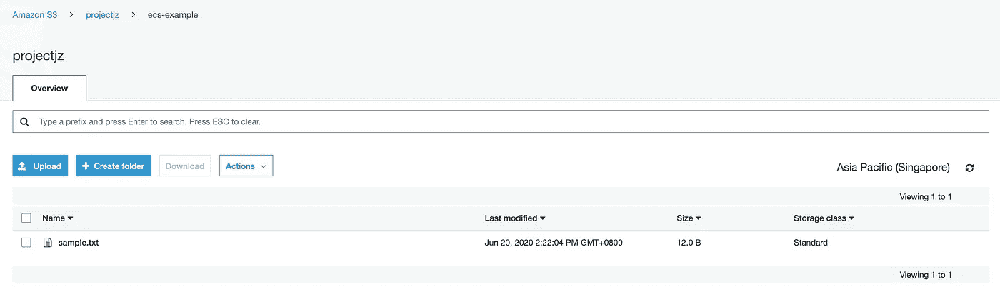

搞定了。我们的容器成功部署，文件上传到 S3！

## 删除集群

要删除我们的集群，首先删除我们的服务，然后删除集群，这需要几分钟才能生效。